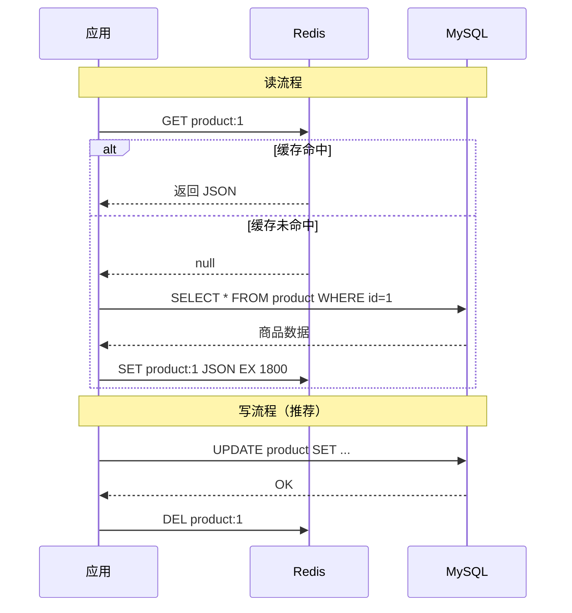
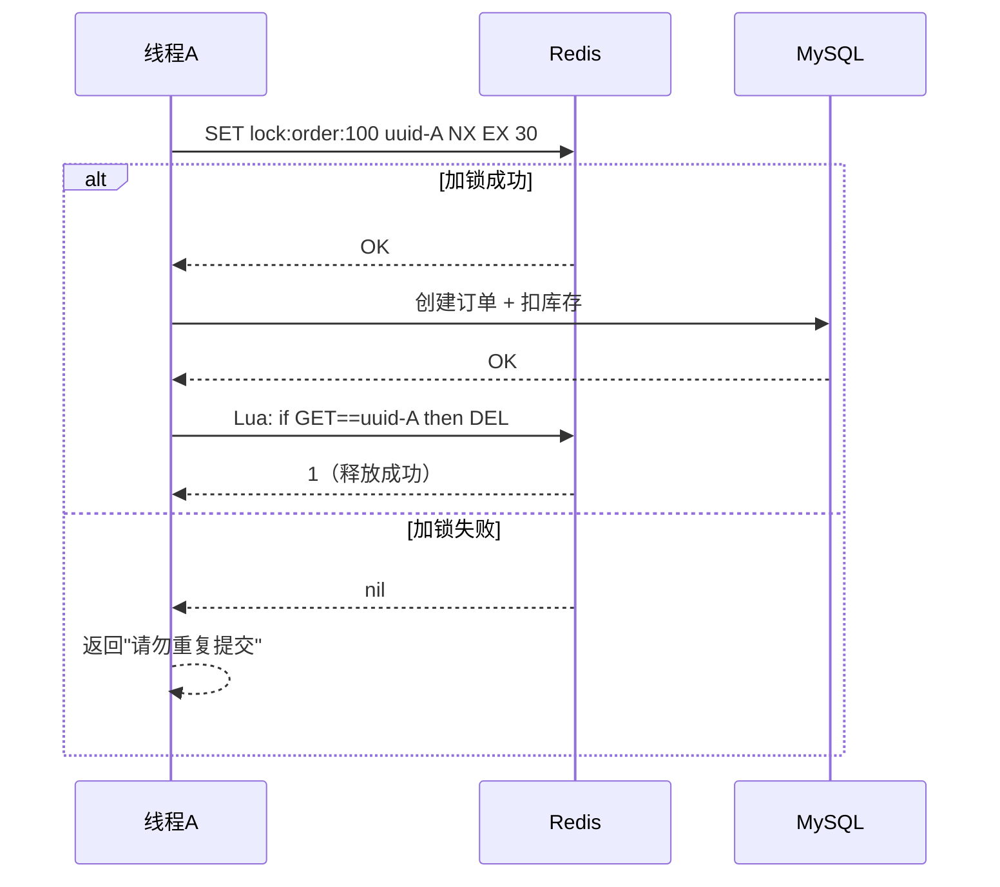

# Redis 核心原理与缓存实战

<!-- 修改说明: 新增本章与上一章的关系 -->

## 本章与上一章的关系

06 章你把 MySQL 表设计、索引、事务都搞明白了——数据能可靠存储、查询也能优化。但有个现实问题：商品详情页每秒被访问 1 万次，每次都查 MySQL，数据库很快扛不住。

Redis 就是来解决这个的：**把热点数据放内存里，读速度从毫秒级降到微秒级**。这一章你会学五种数据结构、Cache Aside 缓存模式、穿透/击穿/雪崩对策，以及用 SETNX 做分布式锁。06 章是"数据怎么存"，07 章是"热点数据怎么扛并发"。

---

## 1. Redis 在后端项目里是干什么的

Redis 最常见的作用不是“代替数据库”，而是：

- 做缓存
- 做计数器
- 做验证码
- 做排行榜
- 做分布式锁基础能力
- 做限流

它最大的特点是快，因为主要基于内存。

## 2. 为什么 Redis 很重要

因为只会写数据库接口的后端，通常还不够强。

如果你想让系统：

- 响应更快
- 扛住更多请求
- 减少数据库压力

就会很自然地接触 Redis。

<!-- 修改说明: 补充 Redis 为什么快的深入解释 -->

### 为什么 Redis 这么快？

**结论**：Redis 把数据放内存、单线程避免锁竞争、IO 多路复用让单线程也能处理大量并发连接——三者叠加，单机 QPS 可达十万级。

**底层原理**：

1. **纯内存操作**：MySQL 查数据要走磁盘 IO（即使有 Buffer Pool 缓存，miss 时仍要读盘），Redis 数据全在内存，一次 `GET` 只需微秒级。
2. **单线程模型**：Redis 6.0 前核心命令处理是单线程，避免了多线程的上下文切换和锁竞争。有人觉得单线程慢，实际上 CPU 不是 Redis 瓶颈，内存和网络才是——单线程 + IO 多路复用（epoll）让一条线程监听成千上万个连接，哪个有数据就处理哪个。
3. **高效数据结构**：String 用 SDS、ZSet 用跳表，都是为速度优化的专用结构，不是通用 HashMap 能比的。

**真实案例（模拟）**：

某电商大促，商品详情接口直接查 MySQL，QPS 到 3000 时数据库 CPU 飙到 90%，接口 RT 从 50ms 涨到 800ms。接入 Redis 缓存后，95% 请求命中缓存（RT < 5ms），MySQL QPS 降到 200，数据库 CPU 回到 30%，页面不再卡顿。

---

## 2.1 手把手：Docker 启动 Redis + redis-cli 练习

### Docker 启动 Redis

```powershell
docker run -d --name study-redis -p 6379:6379 redis:7
```

```bash
# 预期输出：
# c1d2e3f4a5b6...

docker ps
# 预期输出：
# CONTAINER ID   IMAGE     STATUS         PORTS                    NAMES
# c1d2e3f4a5b6   redis:7   Up 10 seconds  0.0.0.0:6379->6379/tcp   study-redis
```

### redis-cli 基础操作（带预期输出）

```bash
docker exec -it study-redis redis-cli
```

**String 操作**：

```bash
127.0.0.1:6379> SET name zhangsan
# 预期输出：OK

127.0.0.1:6379> GET name
# 预期输出："zhangsan"

127.0.0.1:6379> INCR page_view
# 预期输出：(integer) 1

127.0.0.1:6379> EXPIRE name 60
# 预期输出：(integer) 1

127.0.0.1:6379> TTL name
# 预期输出：(integer) 58  （剩余秒数，会递减）
```

**ZSet 排行榜**：

```bash
127.0.0.1:6379> ZADD rank 100 user1
# 预期输出：(integer) 1

127.0.0.1:6379> ZADD rank 90 user2
# 预期输出：(integer) 1

127.0.0.1:6379> ZADD rank 95 user3
# 预期输出：(integer) 1

127.0.0.1:6379> ZREVRANGE rank 0 9 WITHSCORES
# 预期输出：
# 1) "user1"
# 2) "100"
# 3) "user3"
# 4) "95"
# 5) "user2"
# 6) "90"
```

**SETNX 分布式锁**：

```bash
127.0.0.1:6379> SET lock:order:1 uuid-abc NX EX 30
# 预期输出：OK

127.0.0.1:6379> SET lock:order:1 uuid-xyz NX EX 30
# 预期输出：(nil)  ← 锁已被占用，加锁失败

127.0.0.1:6379> DEL lock:order:1
# 预期输出：(integer) 1  ← 释放锁
```

### Spring Boot 接入 Redis（完整步骤）

在 05 章 demo 项目基础上：

**pom.xml 追加**：

```xml
<dependency>
    <groupId>org.springframework.boot</groupId>
    <artifactId>spring-boot-starter-data-redis</artifactId>
</dependency>
```

**application.yml 追加**：

```yaml
spring:
  data:
    redis:
      host: localhost
      port: 6379
```

**ProductCacheService.java**（完整可运行）：

```java
package com.example.demo.service;

import com.example.demo.entity.Product;
import com.example.demo.mapper.ProductMapper;
import com.fasterxml.jackson.core.JsonProcessingException;
import com.fasterxml.jackson.databind.ObjectMapper;
import org.springframework.data.redis.core.StringRedisTemplate;
import org.springframework.stereotype.Service;

import java.time.Duration;

@Service
public class ProductCacheService {

    private static final String KEY_PREFIX = "product:";
    private final StringRedisTemplate redis;
    private final ProductMapper productMapper;
    private final ObjectMapper objectMapper = new ObjectMapper();

    public ProductCacheService(StringRedisTemplate redis, ProductMapper productMapper) {
        this.redis = redis;
        this.productMapper = productMapper;
    }

    public Product getById(Long id) {
        String key = KEY_PREFIX + id;
        String cache = redis.opsForValue().get(key);
        if (cache != null) {
            try {
                return objectMapper.readValue(cache, Product.class);
            } catch (JsonProcessingException e) {
                redis.delete(key);
            }
        }
        Product db = productMapper.selectById(id);
        if (db != null) {
            try {
                redis.opsForValue().set(key, objectMapper.writeValueAsString(db),
                        Duration.ofMinutes(30));
            } catch (JsonProcessingException ignored) {}
        }
        return db;
    }

    public void evict(Long id) {
        redis.delete(KEY_PREFIX + id);
    }
}
```

启动项目后，第一次查商品走 MySQL 并写入缓存，第二次查直接走 Redis。

---

## 3. Redis 五种最核心数据结构

## 3.1 String

最基础，也最常用。

常见场景：

- 缓存一个 JSON 字符串
- 存验证码
- 做计数器

命令：

```bash
set name zhangsan
get name
incr page_view
expire name 60
```

## 3.2 Hash

适合存对象。

```bash
hset user:1 name zhangsan age 18
hget user:1 name
hgetall user:1
```

常见场景：

- 用户信息缓存
- 商品信息缓存

## 3.3 List

有序、可重复。

```bash
lpush queue task1
rpush queue task2
lpop queue
```

常见场景：

- 简单队列
- 最新消息列表

## 3.4 Set

无序、不可重复。

```bash
sadd tags java mysql redis
smembers tags
sismember tags java
```

常见场景：

- 去重
- 标签集合
- 共同好友

## 3.5 ZSet

有序集合，每个元素有分数。

```bash
zadd rank 100 user1
zadd rank 90 user2
zrevrange rank 0 9 withscores
```

常见场景：

- 排行榜
- 热搜榜
- 延时任务基础结构

## 4. Spring Boot 连接 Redis

代码里常见这样使用：

```java
import org.springframework.data.redis.core.StringRedisTemplate;
import org.springframework.stereotype.Service;

@Service
public class RedisDemoService {

    private final StringRedisTemplate stringRedisTemplate;

    public RedisDemoService(StringRedisTemplate stringRedisTemplate) {
        this.stringRedisTemplate = stringRedisTemplate;
    }

    public void saveCode(String phone, String code) {
        stringRedisTemplate.opsForValue().set("code:" + phone, code);
    }
}
```

## 5. 缓存的基本思路

最常见模式是 Cache Aside。

<!-- 修改说明: 新增 Cache Aside 读写流程 Mermaid 图 -->

### Cache Aside 读写流程



### 读取流程

1. 先查 Redis
2. Redis 没命中再查 MySQL
3. 把 MySQL 结果写回 Redis

### 为什么这么做

- 热点数据读得更快
- 数据库压力会下降

## 6. 商品详情缓存示例

```java
public UserVO getUser(Long id) {
    String key = "user:" + id;
    String cache = stringRedisTemplate.opsForValue().get(key);
    if (cache != null) {
        return JSON.parseObject(cache, UserVO.class);
    }

    User user = userMapper.selectById(id);
    if (user == null) {
        return null;
    }

    UserVO vo = convert(user);
    stringRedisTemplate.opsForValue().set(
            key,
            JSON.toJSONString(vo),
            Duration.ofMinutes(30)
    );
    return vo;
}
```

### 这段逻辑你要理解什么

- 先缓存后数据库不是常见读流程
- 常见读流程是先缓存，后数据库

## 7. 为什么缓存必须设置过期时间

如果永久不过期：

- 容易脏数据
- 容易占满内存

所以一般要设置合理过期时间。

<!-- 修改说明: 补充为什么缓存要设过期时间 -->

### 为什么缓存必须设置过期时间？

**结论**：不设 TTL 的缓存是定时炸弹——内存会被撑爆，脏数据会永久存在，出问题时没法自动恢复。

**底层原理**：

Redis 内存有限（通常几 GB 到几十 GB），而业务数据是无限的。没有过期时间的 key 只增不减，最终触发内存淘汰策略（可能随机删掉重要 key）或直接 OOM。另外，数据库更新后如果缓存没过期，用户会一直看到旧数据——TTL 是"最差情况下多久自动纠正"的保底机制。

**真实案例（模拟）**：

某系统把用户信息缓存到 Redis 但忘了设 TTL，运行 3 个月后 Redis 内存从 2GB 涨到 14GB，触发 `allkeys-lru` 淘汰，把热点商品缓存随机删掉，数据库瞬间被打满，全站响应超时 20 分钟。修复：所有缓存 key 统一设 TTL（30 分钟 + 随机 0~300 秒防雪崩）。

---

## 8. 缓存和数据库一致性

这是 Redis 面试里的大重点。

### 常见更新思路

1. 更新数据库
2. 删除缓存

为什么不是先删缓存再更新数据库：

- 中间可能有并发请求把旧值重新写回缓存

### 你现在先掌握的结论

大多数业务里，追求的是：

- 尽量保证一致
- 最终一致

不是绝对强一致。

<!-- 修改说明: 补充为什么更新 DB 后删缓存而不是更新缓存 -->

### 为什么更新数据库后要删缓存，而不是更新缓存？

**结论**：删缓存比更新缓存更安全——并发场景下"更新缓存"容易把旧值写回去，"删缓存"最多让下次读多查一次库。

**底层原理**：

考虑这个并发时序（更新缓存方案）：

1. 线程 A 更新 DB，商品名改为"新版"
2. 线程 B 读缓存 miss，从 DB 读到旧值"旧版"
3. 线程 A 更新缓存为"新版"
4. 线程 B 把读到的旧值"旧版"写回缓存 ← **脏数据产生**

如果改成"先更新 DB，再删缓存"：

1. 线程 A 更新 DB 为"新版"，删缓存
2. 线程 B 读缓存 miss，从 DB 读到"新版"，写回缓存 ← 正确

极端情况下删缓存后、下次读之前，可能有另一个线程把旧值写回——但窗口比"更新缓存"方案小得多，且可以通过延迟双删进一步优化。所以业界默认推荐 **Cache Aside 写路径：先更 DB → 再删缓存**。

**真实案例（模拟）**：

某商品改价后，运营用"更新缓存"方案同步价格，大促期间并发极高，部分用户仍看到旧价下单，造成亏损。改为"删缓存"后，最坏情况是少数用户第一次刷新看到旧价（缓存 miss 重建前），但不会出现旧价长期驻留缓存的问题。

---

### 9.1 缓存穿透

查一个数据库和缓存里都不存在的数据。

后果：

- 请求直接打到数据库

常见解决方案：

- 缓存空值
- 布隆过滤器

### 9.2 缓存击穿

某个热点 key 突然失效，大量请求打到数据库。

常见解决方案：

- 互斥锁
- 逻辑过期
- 热点数据提前续期

### 9.3 缓存雪崩

大量 key 同一时间过期。

常见解决方案：

- 过期时间加随机值
- 限流降级
- 多级缓存

## 10. Redis 持久化

Redis 虽然主要在内存里，但也支持持久化。

### 10.1 RDB

定时快照。

特点：

- 文件较小
- 恢复较快
- 可能丢失最近一段时间数据

### 10.2 AOF

把写命令追加记录下来。

特点：

- 数据更安全
- 文件更大

## 11. 分布式锁基础方案

Redis 常见基础实现：

```bash
set lock:order:1 unique_value nx ex 30
```

<!-- 修改说明: 新增 SETNX 加锁解锁流程 Mermaid 图 -->

### SETNX 加锁解锁流程



含义：

- `nx`：不存在时才设置
- `ex 30`：30 秒后过期

### 需要注意的问题

- 锁过期
- 误删别人锁
- 业务执行太久

### 基础正确释放思路

- value 用唯一值
- 释放锁前先判断是不是自己加的
- 更严谨时用 Lua 脚本保证原子性

## 12. 限流

Redis 很适合做基础限流。

### 计数器限流思路

```bash
incr rate_limit:user:1
expire rate_limit:user:1 60
```

表示：

- 在 60 秒内计数
- 超过某个次数就拒绝

## 13. 主从、哨兵、集群

你现在先掌握基础认知：

### 主从复制

主节点写，从节点复制数据，常用于读扩展和高可用基础。

### 哨兵

用于监控 Redis 节点，并在主节点故障时做自动切换。

### 集群

用于更大规模的数据分片和横向扩展。

## 14. 项目里最值得落地的 Redis 功能

建议你在项目里至少做这几个：

1. 商品详情缓存
2. 手机验证码缓存
3. 阅读量或点赞数计数
4. 排行榜
5. 防重复提交或基础锁

## 15. 常见误区

### 15.1 什么都缓存

缓存也有成本，不是所有数据都值得缓存。

### 15.2 不设置过期时间

容易导致脏数据和内存问题。

### 15.3 缓存更新逻辑混乱

要统一更新策略。

### 15.4 只会背概念，不会落地

真正加分的是：

- 你能把 Redis 用到项目里
- 你能讲出为什么这么设计

## 16. 这一章的练习建议

建议你自己实现：

1. 商品详情缓存接口
2. 验证码存储和校验
3. 点赞数计数器
4. 一个排行榜
5. 模拟缓存击穿并解释处理思路

## 17. 学完标准

如果你能做到下面这些，这一章就比较扎实：

- 知道五种核心数据结构怎么用
- 会写基础缓存逻辑
- 知道缓存一致性的常见思路
- 知道穿透、击穿、雪崩的含义和解决方向
- 知道分布式锁的基础实现方式

## 18. Key 设计规范

Redis 在项目里不要随便命名 key。

建议风格统一，比如：

- `user:1`
- `product:1001`
- `sms:code:13800000000`

好处：

- 更容易维护
- 更容易排查问题
- 更不容易冲突

## 19. 大 key 和热 key

### 大 key

单个 key 存的数据太大。

风险：

- 操作慢
- 网络传输慢
- 影响 Redis 性能

### 热 key

访问特别频繁的 key。

风险：

- 可能让单点压力过大

## 20. 序列化基础认知

Java 项目里把对象放进 Redis 时，经常涉及序列化。

常见思路：

- 存 JSON
- 用框架默认序列化方式

你现阶段更推荐先理解：

- 存 JSON 可读性更好
- 调试更方便

## 21. Lua 脚本

Redis 支持 Lua 脚本。

它的价值是：

- 把多个命令打包成一个原子操作

典型场景：

- 分布式锁释放
- 秒杀扣库存基础逻辑

## 22. Pipeline

Pipeline 可以减少多次网络往返开销。

适合场景：

- 批量执行很多 Redis 命令

你现在知道它是“批量发命令提效率”的思路就够了。

## 23. Bitmap、HyperLogLog、Geo、Stream 基础认知

虽然初学时不必深挖，但这些名字你最好见过。

### Bitmap

适合：

- 签到
- 在线状态统计

### HyperLogLog

适合：

- UV 近似统计

### Geo

适合：

- 附近的人
- 附近门店

### Stream

适合：

- 更像消息流的处理场景

## 24. Redis 和本地缓存

很多系统不只有 Redis 一层缓存，还可能有本地缓存。

你先知道这个概念即可：

- 本地缓存更快
- Redis 更适合共享缓存

## 25. Redis 常见问题排查方向

如果 Redis 表现异常，可以先想：

1. 内存是否快满了
2. 是否存在大 key
3. 是否存在热 key
4. 是否有过多慢命令

## 26. Redis 这一章的进一步知识点

后面你还可以继续学习：

- 主从复制细节
- 哨兵选主
- Cluster 分片
- Redisson
- 布隆过滤器
- 秒杀系统设计

## 27. 常见过期淘汰策略

Redis 中经常会提到两类东西：

- 过期键删除
- 内存淘汰策略

你至少要知道：

- key 到时间了不代表一定瞬间删除
- Redis 会通过一定机制处理过期 key

## 28. 内存淘汰策略基础认知

当 Redis 内存不够时，可能根据策略淘汰数据。

你现在先认识这些常见名字即可：

- `noeviction`
- `allkeys-lru`
- `volatile-lru`

最常见的面试理解方式：

- Redis 内存不是无限的
- 缓存设计必须考虑淘汰

## 29. StringRedisTemplate 和 RedisTemplate

Spring Boot 中你后面常会看到这两个类。

### StringRedisTemplate

更适合字符串场景。

### RedisTemplate

更通用，可以操作更丰富对象。

初学阶段通常从 `StringRedisTemplate` 更容易理解。

## 30. Redis 存对象的常见方式

常见有两种思路：

### 存 JSON 字符串

优点：

- 好理解
- 好排查

### 存 Hash

优点：

- 可以按字段读写

你做项目时可以根据场景选：

- 简单直接：JSON
- 需要部分字段更新：Hash

## 31. 布隆过滤器基础认知

在缓存穿透场景里经常会被提到。

它的价值是：

- 快速判断某个值“大概率不存在”

特点：

- 有误判率
- 但没有漏判不存在的情况

你现在先知道它是缓存穿透的高级优化手段即可。

## 32. 逻辑过期基础认知

这是处理热点 key 的常见思路之一。

简单理解：

- 业务上记录一个逻辑过期时间
- 即使物理上没删，也根据逻辑时间判断是否该重建缓存

它的价值：

- 降低热点 key 失效瞬间的冲击

## 33. Lua 释放分布式锁的基础示意

你至少要能看懂这种逻辑：

```lua
if redis.call("get", KEYS[1]) == ARGV[1] then
    return redis.call("del", KEYS[1])
else
    return 0
end
```

它想解决的问题是：

- 防止误删别人的锁

## 34. 秒杀场景里 Redis 的作用

秒杀系统是 Redis 高频场景题。

Redis 常见作用：

- 预扣库存
- 限流
- 防重复下单
- 缓冲流量

你现在不一定要会完整系统设计，但至少要知道 Redis 为什么适合这类场景。

## 35. Redis 和数据库双写为什么复杂

复杂的原因不是“会不会写代码”，而是：

- 并发顺序会导致脏数据
- 更新失败和重试会让状态更复杂

所以缓存一致性从来不是一句“更新数据库再删缓存”就结束了，它背后是并发问题。

## 36. Redis 慢查询和性能风险基础认知

一些风险操作要有意识：

- 大量 key 扫描
- 大 key 操作
- 非必要全量命令

你要养成一种意识：

- Redis 虽然快，但也不是随便用都不会出问题

## 37. Redis 使用中的工程习惯

建议你逐步形成这些习惯：

- key 命名统一
- TTL 策略清晰
- 重要缓存有降级方案
- 缓存 miss 时有兜底逻辑
- 不要把 Redis 当万能数据库

## 38. 这一章的高频知识点总清单

建议整理这些点：

- 五种核心数据结构
- 使用场景
- Cache Aside
- 过期时间
- 缓存一致性
- 穿透、击穿、雪崩
- RDB、AOF
- 内存淘汰
- 大 key、热 key
- 分布式锁
- 布隆过滤器
- Lua
- 限流
- 排行榜

---

## 39. Redis 命令速查（后端常用）

```bash
SET product:1 "json..." EX 1800
GET product:1
SETNX lock:order:1001 uuid EX 30

HSET user:1 name "Tom"
ZADD rank:score 95 "playerA"
ZREVRANGE rank:score 0 9 WITHSCORES
```

---

## 40. Java 整合 Redis（Spring Data Redis）

```java
@Service
@RequiredArgsConstructor
public class ProductCacheService {
    private final StringRedisTemplate redis;
    private static final String KEY = "product:";

    public Product getById(Long id) {
        String cache = redis.opsForValue().get(KEY + id);
        if (cache != null) return JSON.parseObject(cache, Product.class);
        Product db = productMapper.selectById(id);
        if (db != null) {
            redis.opsForValue().set(KEY + id, JSON.toJSONString(db), 30, TimeUnit.MINUTES);
        }
        return db;
    }

    public void evict(Long id) { redis.delete(KEY + id); }
}
```

更新：**先更 DB → 再删缓存**。

---

## 41. 分布式锁要点

`SET key value NX EX 30` + Lua 脚本释放，防止误删他人锁。业务时间须小于 TTL。

---

## 42. 三大缓存问题对策

| 问题 | 方案 |
|------|------|
| 穿透 | 布隆过滤器 / 缓存空值短 TTL |
| 击穿 | 互斥锁重建 / 逻辑过期 |
| 雪崩 | TTL 随机、集群、降级 |

---

## 43. 学完标准

- 五大数据结构及场景；Java 读写缓存
- Cache Aside；穿透/击穿/雪崩对策
- 分布式锁基本思路

---

## 44. 分级练习

**基础**：redis-cli 练 ZSet 排行榜  
**进阶**：商品详情缓存 + 更新删缓存  
**挑战**：SETNX 锁包裹下单 30 秒

<!-- 修改说明: 新增分级练习参考答案 -->

### 参考答案

#### 基础：ZSet 排行榜

2.1 节的 redis-cli 命令就是答案。完整练习：

```bash
docker exec -it study-redis redis-cli
ZADD game:rank 1500 player1
ZADD game:rank 2300 player2
ZADD game:rank 1800 player3
ZREVRANGE game:rank 0 2 WITHSCORES
# 预期：player2(2300) > player3(1800) > player1(1500)
```

#### 进阶：商品详情缓存 + 更新删缓存

2.1 节的 `ProductCacheService` 就是读缓存的标准实现。更新时：

```java
@Transactional(rollbackFor = Exception.class)
public void updateProduct(Product product) {
    productMapper.updateById(product);
    productCacheService.evict(product.getId());  // 先更 DB，再删缓存
}
```

验证：更新商品价格 → 调 GET 接口 → 应返回新价格（缓存 miss 后重建）。

#### 挑战：SETNX 锁包裹下单

```java
@Service
public class OrderLockService {

    private final StringRedisTemplate redis;

    public OrderLockService(StringRedisTemplate redis) {
        this.redis = redis;
    }

    public boolean tryLock(String orderNo, String uuid) {
        Boolean ok = redis.opsForValue()
                .setIfAbsent("lock:order:" + orderNo, uuid, Duration.ofSeconds(30));
        return Boolean.TRUE.equals(ok);
    }

    public void unlock(String orderNo, String uuid) {
        String key = "lock:order:" + orderNo;
        String script = """
            if redis.call('get', KEYS[1]) == ARGV[1] then
                return redis.call('del', KEYS[1])
            else
                return 0
            end
            """;
        redis.execute(new DefaultRedisScript<>(script, Long.class),
                List.of(key), uuid);
    }
}
```

在 `createOrder` 开头：

```java
String uuid = UUID.randomUUID().toString();
if (!orderLockService.tryLock(orderNo, uuid)) {
    throw new RuntimeException("请勿重复提交");
}
try {
    // 创建订单逻辑...
} finally {
    orderLockService.unlock(orderNo, uuid);
}
```

---

<!-- 修改说明: 新增常见报错与排查 -->

## 44.1 常见报错与排查

| 报错信息（关键词） | 可能原因 | 解决方案 |
|-------------------|---------|---------|
| `Connection refused: localhost:6379` | Redis 没启动 | `docker start study-redis` 或重新 run |
| `NOAUTH Authentication required` | Redis 设了密码但客户端没配 | `application.yml` 加 `password:`；或 docker 不加 `--requirepass` |
| `OOM command not allowed when used memory > maxmemory` | Redis 内存满了 | 设 TTL；清理无用 key；调大 `maxmemory` |
| `WRONGTYPE Operation against a key` | 对 String key 用了 Hash 命令 | 检查 key 类型：`TYPE key`；删错 key 重建 |
| 缓存一直返回旧数据 | 更新后没删缓存 | 确认写路径有 `evict()`；检查是否有多处写缓存逻辑不一致 |
| `Lock wait` / 重复下单 | SETNX 未生效或锁过期太短 | 确认 `setIfAbsent` 返回值判断；业务时间 < TTL |

---

## 45. 缓存一致性方案对比

### 方案一：Cache Aside（最常用）

```
读：先读缓存 → 命中返回 → 未命中查 DB → 写缓存 → 返回
写：先更新 DB → 再删除缓存（不是更新缓存！）
```

**为什么删缓存而不是更新？** 更新缓存需要额外查一次 DB、多一次写 Redis；且并发写可能覆盖出旧值。

### 方案二：Read/Write Through

缓存层代理 DB，业务代码只和缓存交互。缓存负责同步到 DB。

### 方案三：Write Behind（异步回写）

写缓存后异步批量刷到 DB。吞吐高但有丢数据风险。

### 延迟双删（Cache Aside 加强版）

```java
// 写操作：避免极端并发下的短暂不一致
productMapper.updateById(product);  // 1. 先更新 DB
redis.delete(key);                   // 2. 立即删缓存
Thread.sleep(200);                   // 3. 延迟一会
redis.delete(key);                   // 4. 再删一次（兜底）
```

---

## 46. 布隆过滤器（Bloom Filter）

解决"缓存穿透"的最强方案：大量请求查询不存在的 key，每次都穿到 DB。

```java
// Guava 实现
import com.google.common.hash.BloomFilter;
import com.google.common.hash.Funnels;

BloomFilter<Long> filter = BloomFilter.create(
    Funnels.longFunnel(),
    1_000_000,  // 预期元素数量
    0.01        // 误判率（1%）
);

// 初始化：把所有商品 ID 加入布隆过滤器
productIds.forEach(filter::put);

// 查询时先过布隆过滤器
if (!filter.mightContain(productId)) {
    return null;  // 肯定不存在，直接返回，不打 DB
}
```

**注意**：布隆过滤器说"不是"就一定不是；说"可能是"还需要查 DB 确认。

---

## 47. Redis 分布式锁深入（Redisson）

### 47.1 为什么不用 `SETNX + DEL`

```java
// ❌ 裸 SETNX 有两大问题：
// 1. 锁没设过期 → 万一 unlock 没执行，死锁
// 2. DEL 可能误删别人的锁 → A 超时，锁被 B 拿到，A 完成任务后把 B 的锁删了
```

### 47.2 Redisson 一行搞定

```java
// 引入依赖
// <dependency>
//   <groupId>org.redisson</groupId>
//   <artifactId>redisson-spring-boot-starter</artifactId>
// </dependency>

@Autowired
private RedissonClient redissonClient;

public void doBusiness(String orderNo) {
    RLock lock = redissonClient.getLock("lock:order:" + orderNo);
    try {
        // 尝试加锁，最多等 10 秒，锁 30 秒后自动释放
        if (lock.tryLock(10, 30, TimeUnit.SECONDS)) {
            // 执行业务
        }
    } catch (InterruptedException e) {
        Thread.currentThread().interrupt();
    } finally {
        if (lock.isHeldByCurrentThread()) {
            lock.unlock();
        }
    }
}
```

Redisson 内部用 Lua 脚本保证原子性，通过 Watch Dog 自动续期（默认每 10 秒续一次），防止业务还没跑完锁就过期。

---

## 48. Redis 持久化：RDB vs AOF

| | RDB | AOF |
|----|-----|-----|
| 原理 | 定时全量快照（二进制） | 记录每条写命令（文本） |
| 文件大小 | 小 | 大 |
| 恢复速度 | 快 | 慢（需要重放命令） |
| 数据安全 | 可能丢最后一次快照后的数据 | 更安全（每秒 fsync） |
| 生产建议 | 配合 AOF 使用 | `appendfsync everysec` |

---

## 49. Redis Cluster 基础

单机 Redis 有内存上限和单点故障问题，集群方案：

```yaml
# Redis Cluster：自动分片（16384 个 slot 分布在不同节点）
# 最低 3 主 3 从
# 节点间用 gossip 协议通信
# 客户端：MOVED / ASK 重定向
```

你现阶段先知道：
- **主从**：读写分离，但故障需手动切换
- **哨兵（Sentinel）**：自动故障转移，但仍是单主写
- **Cluster**：多主多从，数据分片，适合大数据量

---

## 50. 学完标准（扩充版）

- [ ] 会用五种数据结构（String/Hash/List/Set/ZSet）解决业务场景
- [ ] 理解 Cache Aside 模式，能写出完整的读写缓存 + 更新删缓存逻辑
- [ ] 知道缓存穿透/击穿/雪崩的成因和对策
- [ ] 会用 Redisson 实现生产级分布式锁（Watch Dog 自动续期）
- [ ] 知道布隆过滤器解决穿透的原理
- [ ] 了解 RDB/AOF 的区别和 `appendfsync` 配置
- [ ] 知道 Redis Cluster 和哨兵的基本区别
- [ ] 能说出 Lua 脚本保证原子性的价值

---

<!-- 修改说明: 新增下一章预告 -->

## 下一章预告

到这一步，你的系统已经是：Spring Boot 接口 + MySQL 持久化 + Redis 缓存——能扛一定并发了。但还有一类场景：下单成功后要发邮件、记日志、同步搜索索引，这些"附属操作"不应该阻塞用户等响应。

下一章（08 RabbitMQ 与消息队列实战）引入 **异步解耦**：

- 生产者发消息、消费者异步处理，接口 RT 从 2 秒降到 200 毫秒
- 学会 Docker 起 RabbitMQ、Spring AMQP 发送消费
- 理解消息丢失、重复消费、顺序消息怎么应对

Redis 解决"读快"，MQ 解决"写后异步"——合在一起，你的后端架构就完整了。

---

*下一章：08 RabbitMQ 与消息队列实战*
