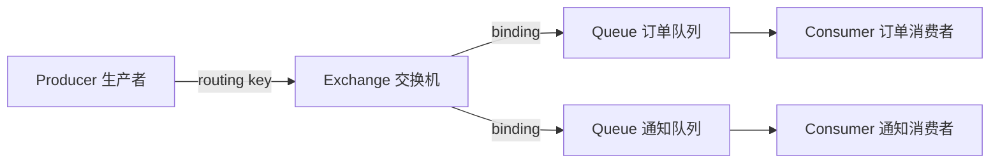

# RabbitMQ 与消息队列实战

<!-- 修改说明: 新增本章与上一章的关系 -->

## 本章与上一章的关系

07 章你用 Redis 解决了「读快」——商品详情走缓存，数据库压力下来了。但还有一类场景：用户下单成功后要发短信、记日志、同步搜索索引，这些**附属操作**不应该让用户等着。

这一章引入 **RabbitMQ 消息队列**：主流程写库 + 发消息，消费者异步处理。07 章解决热点读，08 章解决写后异步和解耦。学完后你的 demo 项目就具备「Spring Boot + MySQL + Redis + MQ」的完整骨架。

---

## 1. 为什么需要消息队列

很多业务逻辑不一定要在主流程里同步做完。

比如下单之后可能还要：

- 发短信
- 发邮件
- 记录日志
- 通知其他系统

如果这些都同步做，主流程会变慢。

这时候消息队列就能发挥作用。

## 2. 消息队列的核心价值

### 2.1 异步

把一些没必要同步完成的事情放到后面处理。

### 2.2 解耦

下单服务不需要直接依赖所有后续服务。

### 2.3 削峰

高峰期先把任务放进队列，慢慢消费。

## 3. RabbitMQ 的基本概念

你先掌握这几个核心角色：

- Producer：生产者
- Consumer：消费者
- Queue：队列
- Exchange：交换机
- RoutingKey：路由键

## 4. 一条消息大致怎么流动

<!-- 修改说明: 新增 RabbitMQ 消息流转 Mermaid 图 -->



1. 生产者发送消息到交换机
2. 交换机根据规则把消息路由到队列
3. 消费者监听队列并消费消息

---

<!-- 修改说明: 新增手把手接入 demo 项目 -->

## 4.1 手把手：demo 项目接入 RabbitMQ

### 第一步：Docker 启动 RabbitMQ

```powershell
docker run -d --name study-rabbitmq -p 5672:5672 -p 15672:15672 -e RABBITMQ_DEFAULT_USER=guest -e RABBITMQ_DEFAULT_PASS=guest rabbitmq:3-management
```

```bash
docker ps
# 预期输出：
# CONTAINER ID   IMAGE                   STATUS    PORTS
# xxxx           rabbitmq:3-management   Up ...    0.0.0.0:5672->5672/tcp, 0.0.0.0:15672->15672/tcp
```

**管理台验证**：浏览器打开 `http://localhost:15672`，账号 `guest` / `guest`

```text
# 预期：进入 Overview 页面，显示 RabbitMQ 版本和节点信息
# 左侧菜单：Connections / Channels / Exchanges / Queues
```

### 第二步：pom.xml 追加依赖

```xml
<dependency>
    <groupId>org.springframework.boot</groupId>
    <artifactId>spring-boot-starter-amqp</artifactId>
</dependency>
```

### 第三步：application.yml 配置

```yaml
spring:
  rabbitmq:
    host: localhost
    port: 5672
    username: guest
    password: guest
    listener:
      simple:
        acknowledge-mode: manual
        prefetch: 1
    publisher-confirm-type: correlated
```

### 第四步：声明 Exchange、Queue、Binding

`config/RabbitMQConfig.java`：

```java
package com.example.demo.config;

import org.springframework.amqp.core.Binding;
import org.springframework.amqp.core.BindingBuilder;
import org.springframework.amqp.core.DirectExchange;
import org.springframework.amqp.core.Queue;
import org.springframework.context.annotation.Bean;
import org.springframework.context.annotation.Configuration;

@Configuration
public class RabbitMQConfig {

    public static final String ORDER_EXCHANGE = "order.exchange";
    public static final String ORDER_QUEUE = "order.created.queue";
    public static final String ORDER_ROUTING_KEY = "order.created";

    @Bean
    public DirectExchange orderExchange() {
        return new DirectExchange(ORDER_EXCHANGE, true, false);
    }

    @Bean
    public Queue orderQueue() {
        return new Queue(ORDER_QUEUE, true);
    }

    @Bean
    public Binding orderBinding() {
        return BindingBuilder.bind(orderQueue())
                .to(orderExchange())
                .with(ORDER_ROUTING_KEY);
    }
}
```

### 第五步：消息体 DTO

```java
package com.example.demo.dto;

import java.io.Serializable;

public class OrderMessage implements Serializable {
    private Long orderId;
    private Long userId;
    private String orderNo;

    public OrderMessage() {}

    public OrderMessage(Long orderId, Long userId, String orderNo) {
        this.orderId = orderId;
        this.userId = userId;
        this.orderNo = orderNo;
    }

    public Long getOrderId() { return orderId; }
    public void setOrderId(Long orderId) { this.orderId = orderId; }
    public Long getUserId() { return userId; }
    public void setUserId(Long userId) { this.userId = userId; }
    public String getOrderNo() { return orderNo; }
    public void setOrderNo(String orderNo) { this.orderNo = orderNo; }
}
```

### 第六步：生产者

```java
package com.example.demo.service;

import com.example.demo.config.RabbitMQConfig;
import com.example.demo.dto.OrderMessage;
import org.springframework.amqp.rabbit.core.RabbitTemplate;
import org.springframework.stereotype.Service;

@Service
public class OrderMessageProducer {

    private final RabbitTemplate rabbitTemplate;

    public OrderMessageProducer(RabbitTemplate rabbitTemplate) {
        this.rabbitTemplate = rabbitTemplate;
    }

    public void sendOrderCreated(OrderMessage message) {
        rabbitTemplate.convertAndSend(
                RabbitMQConfig.ORDER_EXCHANGE,
                RabbitMQConfig.ORDER_ROUTING_KEY,
                message
        );
    }
}
```

### 第七步：消费者（手动 ACK + 幂等）

```java
package com.example.demo.consumer;

import com.example.demo.dto.OrderMessage;
import com.rabbitmq.client.Channel;
import org.springframework.amqp.rabbit.annotation.RabbitListener;
import org.springframework.amqp.support.AmqpHeaders;
import org.springframework.data.redis.core.StringRedisTemplate;
import org.springframework.messaging.handler.annotation.Header;
import org.springframework.stereotype.Component;

import java.io.IOException;
import java.time.Duration;

@Component
public class OrderMessageConsumer {

    private final StringRedisTemplate redis;

    public OrderMessageConsumer(StringRedisTemplate redis) {
        this.redis = redis;
    }

    @RabbitListener(queues = "order.created.queue")
    public void handle(OrderMessage msg, Channel channel,
                       @Header(AmqpHeaders.DELIVERY_TAG) long tag) throws IOException {
        String dedupeKey = "mq:consumed:" + msg.getOrderNo();
        try {
            Boolean first = redis.opsForValue()
                    .setIfAbsent(dedupeKey, "1", Duration.ofDays(1));
            if (Boolean.FALSE.equals(first)) {
                System.out.println("重复消息，跳过：" + msg.getOrderNo());
                channel.basicAck(tag, false);
                return;
            }
            // 模拟异步通知：发短信、写日志等
            System.out.println("异步处理订单：" + msg.getOrderId() + "，用户：" + msg.getUserId());
            channel.basicAck(tag, false);
        } catch (Exception e) {
            channel.basicNack(tag, false, true);
        }
    }
}
```

### 第八步：下单后发送消息

在 `OrderService.createOrder` 事务提交成功后：

```java
orderMessageProducer.sendOrderCreated(
        new OrderMessage(order.getId(), order.getUserId(), order.getOrderNo())
);
```

### 第九步：运行验证

1. 启动 demo 项目（确保 Redis、RabbitMQ 已运行）
2. 调用下单接口
3. 控制台预期输出：

```text
异步处理订单：1，用户：1001
```

4. 打开 RabbitMQ 管理台 → **Queues** → `order.created.queue`

```text
# 预期：Ready 为 0（消息已被消费），Message rates 有 publish/consume 曲线
```

---

## 5. 为什么不直接让生产者发给消费者

因为交换机和队列的存在让系统更灵活：

- 可以一对一
- 可以一对多
- 可以按规则分发

## 6. 常见交换机类型

### 6.1 Direct

按精确 routing key 路由。

### 6.2 Topic

按通配规则路由，更灵活。

### 6.3 Fanout

广播到所有绑定队列。

## 7. Spring Boot 中的基础使用思路

### 7.1 发送消息

```java
import org.springframework.amqp.rabbit.core.RabbitTemplate;
import org.springframework.stereotype.Service;

@Service
public class OrderMessageService {

    private final RabbitTemplate rabbitTemplate;

    public OrderMessageService(RabbitTemplate rabbitTemplate) {
        this.rabbitTemplate = rabbitTemplate;
    }

    public void sendOrderMessage(Long orderId) {
        rabbitTemplate.convertAndSend("order.exchange", "order.create", orderId);
    }
}
```

### 7.2 接收消息

```java
import org.springframework.amqp.rabbit.annotation.RabbitListener;
import org.springframework.stereotype.Component;

@Component
public class OrderConsumer {

    @RabbitListener(queues = "order.queue")
    public void handle(Long orderId) {
        System.out.println("收到订单消息：" + orderId);
    }
}
```

## 8. 真实项目里怎么用 RabbitMQ

比较常见的场景：

- 用户下单后异步发通知
- 注册后异步发欢迎邮件
- 订单创建后异步扣减积分
- 任务异步执行

## 9. 消息确认

为什么要确认：

- 防止消息丢了却没人知道

你要有这个基础认知：

- 生产者发送后最好有确认机制
- 消费者消费后也要确认处理成功

## 10. 消息重复消费

这在真实系统里很常见。

为什么可能重复：

- 网络抖动
- 消费确认异常
- 服务重试

解决思路：

- 幂等设计
- 唯一业务 ID 去重

比如订单消息消费时，可以先判断这个订单是否已经处理过。

## 11. 消息丢失

常见问题方向有三个：

- 生产者发丢了
- 队列存储丢了
- 消费者处理时丢了

你现阶段先知道：

- 需要可靠投递思路
- 需要消费确认
- 重要消息要考虑持久化

## 12. 消息积压

当生产速度远大于消费速度时，就可能积压。

常见原因：

- 消费者处理太慢
- 队列峰值太高
- 消费者实例不够

常见应对方向：

- 提升消费者并发
- 优化消费逻辑
- 拆分队列

## 13. 和 Redis 队列有什么区别

这类问题面试经常会问。

你可以这样理解：

- Redis 也能做简单消息结构
- RabbitMQ 更像专业消息队列
- 在可靠性、路由能力、确认机制上更适合业务消息

## 14. 什么时候适合用 RabbitMQ

适合：

- 业务异步通知
- 中小型系统消息流程
- 需要相对完善消息机制的场景

## 15. 这一章的项目建议

你最好在项目里落地一个真实场景，比如：

### 下单异步通知

流程：

1. 用户下单
2. 订单写库成功
3. 发送消息
4. 消费者收到消息后发短信或写通知表

这样你在面试里就能讲：

- 为什么要异步
- 为什么用 MQ
- 如何避免重复消费

## 16. 这一章的练习建议

建议你自己完成：

1. 一个最基础的发送和消费 demo
2. 一个下单异步消息 demo
3. 一个幂等消费示例

## 17. 学完标准

如果你能做到下面这些，就说明这一章过关了：

- 知道为什么需要消息队列
- 知道 RabbitMQ 的核心角色
- 能写基础的发送和消费代码
- 知道消息重复消费和消息丢失的基本应对方向

## 18. 死信队列基础认知

死信队列通常用于处理：

- 消费失败无法正常处理的消息
- 过期消息
- 被拒绝的消息

它的价值是：

- 防止问题消息直接丢失
- 方便后续人工或程序补偿

## 19. 重试机制

消费者失败后，有时需要重试。

但要注意：

- 不能无限重试
- 否则可能把系统拖垮

所以你要逐步建立这个认知：

- 重试要有次数控制
- 失败要能落日志或进死信队列

## 20. 消息顺序问题

有些业务对顺序敏感，比如：

- 同一个订单的状态变更

这时就要考虑：

- 同一个业务对象的消息尽量按顺序处理

## 21. 消费幂等为什么重要

因为消息系统里“至少一次投递”很常见。

所以业务系统应该默认接受这样一个事实：

- 同一条消息可能收到多次

常见解决方向：

- 唯一业务 ID
- 状态判断
- 去重表

## 22. RabbitMQ 和 Kafka 的简单比较

你现在可以先这样理解：

- RabbitMQ 更偏业务消息
- Kafka 更偏高吞吐日志/流式场景

RabbitMQ 更适合你当前阶段上手和做项目。

## 23. 这一章的进一步知识点

后面你还可以继续学习：

- 延迟队列
- 死信交换机
- 消息堆积治理
- 消费者并发控制
- 顺序消息

## 24. 队列、交换机、绑定关系再细一点

很多初学者容易把 RabbitMQ 理解成：

- 生产者直接把消息放进队列

但更准确地说，常见流程是：

1. 生产者发给交换机
2. 交换机根据绑定关系路由到队列
3. 消费者从队列消费

其中：

- 交换机负责路由
- 队列负责存放消息

## 25. Topic 路由示例

假设有路由键：

- `order.create`
- `order.pay`
- `user.register`

如果某个队列绑定：

- `order.*`

那么它可以接收到：

- `order.create`
- `order.pay`

这就是 Topic 的灵活性所在。

## 26. 消息持久化基础认知

如果希望 RabbitMQ 重启后消息尽量还在，就要有持久化思路。

你现在先知道三个层面：

- 队列是否持久化
- 交换机是否持久化
- 消息是否持久化

## 27. 手动 ACK 基础认知

为什么很多项目会关注 ACK：

- 因为消费成功和消费失败要有明确反馈

你现在可以先这样理解：

- 自动确认更简单
- 手动确认更可控

对于重要业务消息，手动确认往往更稳妥。

## 28. Prefetch 基础认知

消费者一次不要无限拿消息。

Prefetch 的作用可以粗略理解为：

- 控制消费者一次最多预取多少消息

这有助于避免：

- 单个消费者积压过多未处理消息

## 29. 延迟队列基础认知

延迟队列很适合这些场景：

- 订单超时取消
- 一段时间后执行通知

你现在先知道它是“不是立刻消费，而是延后处理”的消息方案即可。

## 30. 为什么 MQ 不能代替数据库

消息队列的核心职责是：

- 传递消息
- 削峰异步

它不是用来长期稳定保存业务主数据的。

所以要分清：

- 业务主数据：数据库
- 异步事件流转：MQ

## 31. 消费失败后的常见处理思路

通常可以有这些方向：

1. 记录日志
2. 有限次数重试
3. 进入死信队列
4. 人工补偿

这也是为什么真实 MQ 方案比“发个消息”复杂得多。

## 32. 业务中哪些功能适合 MQ

适合：

- 短信通知
- 邮件通知
- 日志异步写入
- 积分发放
- 下单后的非核心流程

不太适合：

- 极强一致且必须立刻完成的主流程核心写库

## 33. MQ 这一章的高频知识点总清单

建议整理这些点：

- 为什么用 MQ
- 异步、解耦、削峰
- Producer、Consumer
- Exchange、Queue、RoutingKey
- Direct、Topic、Fanout
- ACK
- 消息持久化
- 重复消费
- 消息丢失
- 消息积压
- 死信队列
- 延迟队列

---

## 34. Docker 启动 RabbitMQ

```bash
docker run -d --name study-rabbitmq -p 5672:5672 -p 15672:15672 \
  -e RABBITMQ_DEFAULT_USER=guest -e RABBITMQ_DEFAULT_PASS=guest \
  rabbitmq:3-management
```

```bash
# 预期输出：一行容器 ID
# a1b2c3d4e5f6...

curl -s -o /dev/null -w "%{http_code}" -u guest:guest http://localhost:15672/api/overview
# 预期输出：200
```

管理台：`http://localhost:15672`（guest / guest）

**管理台创建队列（可选手动练习）**：

1. 登录 → **Queues and Streams** → **Add a new queue**
2. Name 填 `test.queue` → **Add queue**
3. 预期：队列列表出现 `test.queue`，Messages 为 0

---

## 35. Spring Boot 生产者 / 消费者

```java
// 发送
rabbitTemplate.convertAndSend("order.exchange", "order.created", orderId);

// 消费
@RabbitListener(queues = "order.created")
public void onMessage(String orderId, Channel ch, @Header(AmqpHeaders.DELIVERY_TAG) long tag)
    throws IOException {
    try {
        // 业务处理
        ch.basicAck(tag, false);
    } catch (Exception e) {
        ch.basicNack(tag, false, true);
    }
}
```

`acknowledge-mode: manual` 开启手动 ACK。

---

## 36. 可靠性：生产 confirm、队列 durable、消费幂等后 ACK

幂等：`SETNX mq:consumed:{msgId}` 已存在则跳过。

---

## 37. 学完标准

- 说清解耦/异步/削峰；Exchange-Queue 模型
- Spring AMQP 发收消息；ACK 与重复消费对策

---

## 38. 分级练习

**基础**：管理台看队列  
**进阶**：下单后发 MQ  
**挑战**：死信队列配置

<!-- 修改说明: 新增分级练习参考答案 -->

### 参考答案

#### 基础：管理台看队列

1. 启动 RabbitMQ（§4.1 或 §34）
2. 运行 demo 项目，触发一次下单
3. 管理台 → **Queues** → 找到 `order.created.queue`
4. 检查：**Ready = 0**、**Total** 递增说明有消息流过

#### 进阶：下单后发 MQ

4.1 节完整代码即标准答案。验证清单：

- [ ] 下单接口返回成功
- [ ] 消费者控制台打印「异步处理订单」
- [ ] 管理台 Queue 无积压

#### 挑战：死信队列（思路 + 配置）

**场景**：消费失败 3 次后进入死信队列，人工排查。

`RabbitMQConfig` 中把原 `orderQueue` 改为带死信参数（需 `import java.util.HashMap; import java.util.Map;`）：

```java
@Bean
public Queue orderQueue() {
    Map<String, Object> args = new HashMap<>();
    args.put("x-dead-letter-exchange", ORDER_DLX);
    args.put("x-dead-letter-routing-key", "order.dead");
    return new Queue(ORDER_QUEUE, true, false, false, args);
}
```

消费者 `basicNack(tag, false, false)` 且不 requeue 时，消息进入 DLQ。管理台查看 `order.dead.queue` 即可。

---

<!-- 修改说明: 新增常见报错与排查 -->

## 38.1 常见报错与排查

| 报错信息（关键词） | 可能原因 | 解决方案 |
|-------------------|---------|---------|
| `Connection refused: localhost:5672` | RabbitMQ 未启动 | `docker start study-rabbitmq` |
| `ACCESS_REFUSED` | 用户名密码错 | 检查 `application.yml` 与 Docker 环境变量一致 |
| `NOT_FOUND - no exchange 'xxx'` | Exchange 未声明或名称不一致 | 确认 `RabbitMQConfig` 和业务代码中的名称相同 |
| 消息发送成功但无人消费 | 消费者未启动或队列名不匹配 | 检查 `@RabbitListener(queues=...)` 与 Binding |
| Queue 消息一直堆积 | 消费太慢或消费者挂了 | 看消费者日志；增加消费者实例；优化消费逻辑 |
| `PRECONDITION_FAILED` | 队列参数与已有队列冲突 | 删旧队列重建，或换队列名 |

---

## 39. 消息可靠性保证（生产者到消费者的完整链路）

### 39.1 发送端确认（Publisher Confirm）

```yaml
spring:
  rabbitmq:
    publisher-confirm-type: correlated   # 开启发送确认
    publisher-returns: true              # 路由失败退回
```

```java
@Component
public class OrderProducer {

    private final RabbitTemplate rabbitTemplate;

    public void sendOrder(OrderMessage msg) {
        // 设置确认回调
        rabbitTemplate.setConfirmCallback((correlationData, ack, cause) -> {
            if (ack) {
                log.info("消息确认到达交换机: {}", correlationData.getId());
            } else {
                log.error("消息未到达交换机: {}，原因: {}", correlationData.getId(), cause);
                // 补偿：重发或记 DB 等定时任务重试
            }
        });

        CorrelationData data = new CorrelationData(msg.getOrderNo());
        rabbitTemplate.convertAndSend("order.exchange", "order.create", msg, data);
    }
}
```

### 39.2 消费端确认（Manual Ack）

```yaml
spring:
  rabbitmq:
    listener:
      simple:
        acknowledge-mode: manual   # 手动确认
```

```java
@RabbitListener(queues = "order.queue")
public void handleOrder(OrderMessage msg, Channel channel,
                        @Header(AmqpHeaders.DELIVERY_TAG) long tag) {
    try {
        // 处理业务逻辑
        orderService.process(msg);
        channel.basicAck(tag, false);  // 确认消费成功
    } catch (Exception e) {
        log.error("消费失败", e);
        // basicNack(tag, false, true)：重新入队（重试）
        // basicNack(tag, false, false)：不重新入队，进入死信队列
    }
}
```

### 39.3 消息持久化

```java
// 队列持久化
@Bean
public Queue orderQueue() {
    return QueueBuilder.durable("order.queue").build();
}

// 消息持久化（默认已开启）
rabbitTemplate.convertAndSend("order.exchange", "order.create", msg, m -> {
    m.getMessageProperties().setDeliveryMode(MessageDeliveryMode.PERSISTENT);
    return m;
});
```

### 39.4 完整可靠性链路

```
发送端                     Broker                  消费端
  │                          │                        │
  ├─ ConfirmCallback ───────→│←── 交换机确认           │
  │                          │                        │
  │                          ├── 消息持久化到磁盘       │
  │                          │                        │
  │                          ├────────→ 消费者接收      │
  │                          │                        │
  │                          │                        ├─ 业务处理
  │                          │←── basicAck ──────────┤
  │                          │                        │
  │                          │  如果 basicNack：       │
  │                          │  → 重新入队（重试）     │
  │                          │  → 或进入死信队列      │
```

---

## 40. 死信队列（DLQ）详解

### 40.1 什么时候进死信

1. 消息被消费者拒绝（`basicNack` 且 `requeue=false`）
2. 消息 TTL 过期
3. 队列达到最大长度

### 40.2 完整配置

```java
@Configuration
public class DeadLetterConfig {

    public static final String ORDER_QUEUE = "order.queue";
    public static final String ORDER_DLX = "order.dlx";
    public static final String ORDER_DLQ = "order.dlq";

    // 死信交换机
    @Bean
    public DirectExchange deadLetterExchange() {
        return new DirectExchange(ORDER_DLX);
    }

    // 死信队列
    @Bean
    public Queue deadLetterQueue() {
        return new Queue(ORDER_DLQ);
    }

    // 死信队列绑定
    @Bean
    public Binding deadLetterBinding() {
        return BindingBuilder.bind(deadLetterQueue())
                .to(deadLetterExchange()).with("order.dead");
    }

    // 普通队列（带死信参数）
    @Bean
    public Queue orderQueue() {
        Map<String, Object> args = new HashMap<>();
        args.put("x-dead-letter-exchange", ORDER_DLX);
        args.put("x-dead-letter-routing-key", "order.dead");
        args.put("x-message-ttl", 60000);  // 消息 60s 未消费进死信
        return QueueBuilder.durable(ORDER_QUEUE).withArguments(args).build();
    }
}
```

---

## 41. 延迟消息（RabbitMQ 实现）

### 41.1 使用场景

- 下单后 30 分钟未支付自动取消
- 消息发送后 N 秒检查状态

### 41.2 TTL + 死信队列实现延迟

```
普通队列（无消费者，等 TTL 过期）
  → 消息过期 → 进入死信交换机
  → 死信队列（有消费者处理）
```

```java
// 延迟队列配置
@Bean
public Queue delayQueue() {
    Map<String, Object> args = new HashMap<>();
    args.put("x-dead-letter-exchange", "order.exchange");
    args.put("x-dead-letter-routing-key", "order.process");
    args.put("x-message-ttl", 30 * 60 * 1000);  // 30 分钟
    return QueueBuilder.durable("order.delay.queue").withArguments(args).build();
}

// 发送到延迟队列（不绑定消费者，等 TTL 后自动转到死信 → 被普通队列消费者处理）
```

---

## 42. 削峰填谷实战

```java
// 限流消费：每次只处理 N 条
spring:
  rabbitmq:
    listener:
      simple:
        prefetch: 50   # 每个消费者一次最多取 50 条
        concurrency: 5 # 消费者线程数
```

```
高并发下单 → MQ 缓冲（队列可堆积百万条）→ 消费者按自己节奏处理 → DB 压力平稳

          10000/s 写入
          ─────────
          │  MQ 队列 │
          ─────────
               ↓ 100/s 消费（平稳落库）
          ┌──────┐
          │ MySQL │
          └──────┘
```

---

## 43. 学完标准（扩充版）

- [ ] 理解 MQ 三大作用：异步、解耦、削峰
- [ ] 会用 Spring AMQP 发送/消费消息，配置交换机/队列/绑定
- [ ] 知道消息可靠性怎么保证（发送确认 + 手动 Ack + 持久化）
- [ ] 理解死信队列：什么时候进、怎么配置
- [ ] 会用 TTL + 死信实现延迟消息（订单超时取消场景）
- [ ] 知道消费者 `prefetch` 和并发配置对削峰的影响
- [ ] 能说出"消息丢失、重复消费、顺序消息"三类问题的基本对策

---

<!-- 修改说明: 新增下一章预告 -->

## 下一章预告

这一章你的 demo 在本地已经跑通：接口、MySQL、Redis、MQ 都有了——但还只在你的电脑上。怎么部署到服务器？怎么一条命令起全部中间件？怎么让 Nginx 把前端和后端串起来？

下一章（09 Linux、Docker、Nginx 部署基础）就是「上线入门」：`mvn package` 打 jar、`docker compose` 一键起环境、Nginx 反向代理 `/api`。08 章是「业务能异步」，09 章是「服务能对外跑」。

---

*下一章：09 Linux、Docker、Nginx 部署基础*
