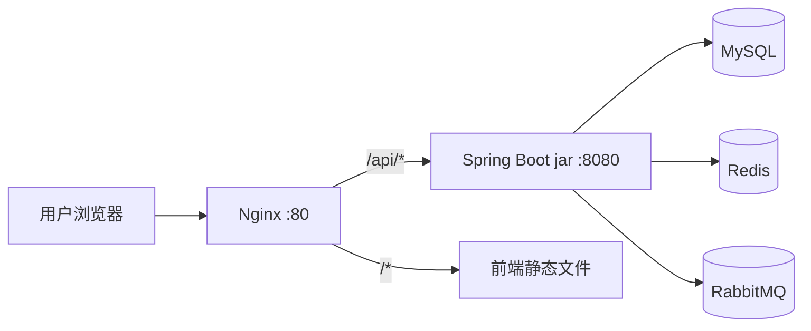

# Linux、Docker、Nginx 部署基础

<!-- 修改说明: 2026-06-30 按 EXPANSION-STANDARD 扩充 §0、FAQ、闭卷自测、费曼检验 -->

## 0. 读前导读（零基础也能跟上）

> **读者假设**：08 章 demo 在 IDEA 里跑通了，但还没真正「上线」——本章教你把 jar 跑起来、用 Docker 起中间件、用 Nginx 做入口。

### 0.1 用一句话弄懂本章

**一句话**：**Linux** 是服务器上的「操作系统」；**Docker** 像**集装箱**——把 MySQL/Redis 和依赖打包成标准箱，在哪都能同样方式卸货；**Nginx** 像商场**前台分流**——用户只看到一个入口，前台把 `/api` 请求转给后端、静态页直接接待。

**生活类比总表**：

| 概念 | 技术 | 生活类比 |
|------|------|----------|
| **Linux** | 服务器 OS | 仓库管理员的工作台——查日志、看进程、管文件 |
| **Docker 镜像** | `mysql:8.0` | **集装箱规格书**——规定箱里装什么 |
| **Docker 容器** | `docker run` 起的实例 | **正在卸货的一口箱**——运行中的 MySQL |
| **Volume 数据卷** | `-v mysql_data:/var/lib/mysql` | 集装箱旁的**固定货架**——箱搬走货还在 |
| **Nginx 反向代理** | `proxy_pass` | **前台分流**——访客找前台，前台转接对应部门 |
| **docker compose** | 多服务一键起 | **调度中心**——同时安排_mysql、Redis、MQ 几个集装箱 |

**为什么重要**：真实后端不是「本地能跑就行」，还要会打包、部署、查日志、让外网访问。09 章是 10 章项目实战的部署底座。

**本章用到的地方**：§5 Docker、§9 Nginx、§37 compose、§38 反代配置。

---

### 0.2 你需要提前知道什么（真不会就先跳到哪一章）

| 你现在的水平 | 建议动作 |
|--------------|----------|
| 没跑过 Spring Boot demo | 先学 [08 MQ 与整合](./08-RabbitMQ与消息队列实战.md) |
| 完全没碰过命令行 | 从 §2 Linux 命令 + §34 速查开始，逐条复制执行 |
| Windows 为主、怕 Linux | §2 命令在 Git Bash / WSL 也能练；部署概念通用 |
| 想一次起 MySQL+Redis | 直接跳 §37 docker-compose |
| 要做前后端联调部署 | 精读 §38、§43 Nginx 配置 |

**最低门槛**：08 章 demo 能 `mvn package` 并 `java -jar` 本地启动；知道 8080 是后端端口。

---

### 0.3 本章知识地图（学完后应能勾选全部 ☐→☑）

- [ ] 会用 `ls/cd/tail/grep/ps/kill` 等 10+ Linux 命令
- [ ] 能查端口占用并结束冲突进程
- [ ] 用 Docker **集装箱**方式启动 MySQL、Redis
- [ ] 会 `docker ps`、`docker logs`、`docker exec` 排查容器
- [ ] 理解 volume：删容器不丢 MySQL 数据
- [ ] 写 `docker-compose.yml` 一键起 06～08 章中间件
- [ ] 配置 Nginx **前台分流**：`/` 静态页 + `/api/` 反代后端
- [ ] `mvn package` + `nohup java -jar` 后台运行
- [ ] 部署失败按 §32 清单逐步排查
- [ ] 闭卷自测 10 题正确 ≥ 8 题

---

### 0.4 建议学习时长与节奏

| 阶段 | 建议时间 | 做什么 |
|------|----------|--------|
| §0 + §2～§3 Linux 命令 | 2 小时 | 查目录、看日志、查端口 |
| §5～§8 Docker 基础 | 2 小时 | run MySQL/Redis，理解集装箱类比 |
| §37 compose 一键环境 | 1.5 小时 | 与 06～08 章统一命名 |
| §38 Nginx 反代 | 1.5 小时 | 前台分流 + 静态资源 |
| §35～§36 打包部署 | 1 小时 | jar + Dockerfile |
| 分级练习 + 自测 | 2 小时 | 挑战：Nginx + jar 联调 |

---

### 0.5 学完本章你能做什么（可验证的具体动作）

1. **`docker compose up -d`** 起 MySQL+Redis+MQ，08 章 demo 连上 Docker 内数据库。
2. **`mvn package`** 打出 jar，`curl localhost:8080/api/users` 返回 JSON。
3. **Nginx 配置** `/api/` → 8080，浏览器访问 `http://localhost/api/users` 与直连 8080 结果一致。
4. **排错**：端口冲突时 `ss -tlnp` 找 PID 并 kill；容器连不上时 `docker logs mysql`。
5. **口述**：向朋友解释 Docker=集装箱、Nginx=前台分流（见 §48 费曼）。

---

### 0.6 手把手总览：从 jar 到 Nginx 上线

| 步骤 | 你的动作 | 预期看到什么 | 若不对 |
|------|----------|--------------|--------|
| 1 | `docker compose up -d`（§37） | 三个容器 STATUS=Up | 见 §41.1 报错表 |
| 2 | `mvn clean package -DskipTests` | BUILD SUCCESS | 查 pom 是否含 spring-boot-maven-plugin |
| 3 | `java -jar target/*.jar` | Started ... in x seconds | 看日志；查 8080 是否被占 |
| 4 | `curl localhost:8080/actuator/health` 或业务接口 | JSON 正常 | 核对 application.yml 连 Docker |
| 5 | 配置 Nginx §38，`nginx -t` | syntax is ok | 查 proxy_pass 端口 |
| 6 | `curl localhost/api/users` | 与步骤 4 相同 JSON | 502 则后端未起或 upstream 错 |

---

## 本章与上一章的关系

08 章你的 demo 在本地跑通了 Spring Boot + MySQL + Redis + RabbitMQ——但还只在 IDEA 里。真实后端必须回答：怎么打包、怎么部署、怎么查日志、怎么让外网访问？

这一章补「上线入门」：Linux 常用命令、Docker 一键起中间件、Nginx 反向代理。09 章学完后，你能把 jar 跑起来、用 docker-compose 起全套环境、用 Nginx 把 `/api` 转发到后端——为 10 章完整项目实战打底。



---

## 1. 为什么后端必须懂一点部署

你即使是初学者，也不能只会本地跑项目。

因为真实后端开发会遇到这些问题：

- 服务怎么启动
- 日志在哪看
- 端口被谁占了
- MySQL 和 Redis 怎么快速搭环境
- 前端请求怎么转发到后端

所以 Linux、Docker、Nginx 是很实用的基础能力。

## 2. Linux 常用命令

### 2.1 查看目录

```bash
pwd
# 预期输出：/home/user  （当前路径）

ls
# 预期输出：当前目录下的文件和文件夹名

ls -l
# 预期输出：带权限、大小、修改时间的详细列表
# drwxr-xr-x  2 user user 4096 Jan  1 10:00 logs
# -rw-r--r--  1 user user  123 Jan  1 09:00 app.log
```

### 2.2 切换目录

```bash
cd /home
cd ..
```

### 2.3 创建和删除

```bash
mkdir logs
rm file.txt
rm -r test_dir
```

### 2.4 复制和移动

```bash
cp a.txt b.txt
mv old.txt new.txt
```

### 2.5 查看文件

```bash
cat app.log
tail -f app.log
grep "error" app.log
```

这三个命令很常用：

- `cat`：直接看文件
- `tail -f`：实时看日志
- `grep`：查关键字

## 3. 进程和端口排查

### 3.1 看进程

```bash
ps -ef | grep java
# 预期输出（有 Java 进程时）：
# user  12345  1  0 10:00 ?  00:00:30 java -jar app.jar
```

### 3.2 看端口

```bash
# Linux
ss -tlnp | grep 8080
# 预期输出：
# LISTEN 0 100 *:8080 *:* users:(("java",pid=12345,fd=50))

# Windows PowerShell 替代命令
netstat -ano | findstr 8080
# 预期输出：
# TCP    0.0.0.0:8080    0.0.0.0:0    LISTENING    12345
```

### 3.3 结束进程

```bash
kill -9 12345
```

## 4. 权限基础

```bash
chmod +x start.sh
```

这通常用于给脚本增加执行权限。

## 5. Docker 是什么

**Docker（容器平台）**：把应用和依赖打包成**镜像**，在任何机器上用相同方式**运行容器**。

**生活类比——Docker = 集装箱**：

- **镜像** = 集装箱**规格书**（`mysql:8.0` 规定箱里预装 MySQL 8.0）
- **容器** = 码头上一口**正在使用的箱**（`docker run` 卸货、通电、开跑）
- **端口映射** `-p 3306:3306` = 箱门上的**编号**，外面 3306 对接箱内 3306
- **Volume** = 箱旁的**固定货架**，换箱（删容器）数据仍在货架上

**为什么重要**：「我电脑能跑、服务器报错」多半是环境不一致；集装箱标准化后，开发机与生产机**同一套规格书**。

**本章用到的地方**：§6 命令、§7 MySQL、§37 compose、§42 全栈示例。

它解决的问题是：

- 环境不一致
- 安装太麻烦
- 本地和服务器配置不统一

对你最实用的价值是：

- 可以快速启动 MySQL
- 可以快速启动 Redis
- 可以快速启动 RabbitMQ

## 6. Docker 常用命令

### 6.1 查看镜像

```bash
docker images
```

### 6.2 查看容器

```bash
docker ps
docker ps -a
```

### 6.3 启动容器

```bash
docker run -d --name redis -p 6379:6379 redis:latest
```

### 6.4 停止和删除

```bash
docker stop redis
docker rm redis
```

## 7. 用 Docker 启动 MySQL

```bash
docker run -d \
  --name mysql8 \
  -e MYSQL_ROOT_PASSWORD=123456 \
  -p 3306:3306 \
  mysql:8.0
```

### 这条命令做了什么

- 后台启动一个 MySQL 容器
- 容器名叫 `mysql8`
- root 密码是 `123456`
- 映射本机 `3306` 端口

## 8. 用 Docker 启动 Redis

```bash
docker run -d \
  --name redis \
  -p 6379:6379 \
  redis:latest
```

## 9. Nginx 是什么

**Nginx（Web 服务器 / 反向代理）**：对外提供统一 HTTP 入口，按 URL 规则转发到后端或返回静态文件。

**生活类比——Nginx = 商场前台分流**：

- 顾客（浏览器）**只找前台**（80 端口），不必知道后面有几个部门
- 问「商品 API」（`/api/*`）→ 前台转接**后端 Spring Boot**（8080）
- 看「宣传页、前端页面」（`/`）→ 前台直接给**静态文件**，不必打扰后端
- 多台后端时 → 前台**轮班分流**（负载均衡 upstream）

**为什么重要**：前后端分离后，浏览器往往只能访问一个域名；前台统一入口才能避免跨域、隐藏内网端口。

**本章用到的地方**：§10 反向代理、§38 配置、§43 实战。

你现在最应该理解的是：

- 浏览器请求可以先到 Nginx
- Nginx 再把请求转发到 Spring Boot

## 10. 什么是反向代理

用户访问的是 Nginx，对用户来说看不到后面的真实服务细节。

Nginx 帮你把请求转发给后端服务。

这就叫反向代理。

## 11. Nginx 配置示例

```nginx
server {
    listen 80;
    server_name localhost;

    location /api/ {
        proxy_pass http://127.0.0.1:8080/;
    }
}
```

### 这段配置的意思

- 监听 80 端口
- `/api/` 开头的请求转发给本机 `8080` 的 Spring Boot 服务

## 12. 前后端联调里为什么常用 Nginx

因为它可以：

- 统一入口
- 转发 API 请求
- 托管前端静态资源
- 做简单负载均衡

## 13. 部署一个 Spring Boot 项目的基础流程

一个简单流程通常是：

1. 打包 jar
2. 上传到服务器
3. 用 Java 命令启动
4. 查看日志
5. 用 Nginx 做反向代理

### 13.1 打包

```bash
mvn clean package
```

### 13.2 启动

```bash
java -jar app.jar
```

### 13.3 后台启动

```bash
nohup java -jar app.jar > app.log 2>&1 &
```

### 13.4 看日志

```bash
tail -f app.log
```

## 14. 真实项目里你至少要会什么

最少要会：

1. 查看日志
2. 查看 Java 进程
3. 查端口占用
4. 用 Docker 启 MySQL 和 Redis
5. 配基础 Nginx 代理

## 15. 常见错误

### 15.1 项目起不来只会重启

应该先看日志。

### 15.2 端口冲突不知道怎么查

学会用 `ps`、`netstat`、`ss`。

### 15.3 Docker 只会 run，不知道容器状态

至少要会：

- `docker ps`
- `docker logs`
- `docker exec`

## 16. 这一章练习建议

建议你自己完成：

1. 用 Docker 启一个 MySQL
2. 用 Docker 启一个 Redis
3. 打包并运行一个 Spring Boot 项目
4. 用 `tail -f` 看日志
5. 写一份基础 Nginx 代理配置

## 17. 学完标准

如果你能做到这些，这一章就过关了：

- 会基础 Linux 命令
- 会排查简单进程和端口问题
- 会用 Docker 起常见中间件
- 会配置基础 Nginx 反向代理
- 能把一个 Spring Boot 项目跑起来

## 18. Shell 脚本基础认知

在部署和运维中，Shell 脚本非常常见。

例如一个简单启动脚本：

```bash
#!/bin/bash
nohup java -jar app.jar > app.log 2>&1 &
```

你现在至少要知道：

- 脚本可以批量执行命令
- 可以减少重复操作

## 19. Dockerfile 基础认知

如果你以后想把自己的 Spring Boot 项目做成镜像，就会用到 `Dockerfile`。

示意：

```dockerfile
FROM openjdk:17
COPY app.jar /app.jar
ENTRYPOINT ["java", "-jar", "/app.jar"]
```

## 20. Docker Compose 基础认知

当你要同时启动：

- MySQL
- Redis
- RabbitMQ
- Spring Boot 服务

单个 `docker run` 会很麻烦，这时就会接触 `docker compose`。

## 21. Nginx 负载均衡基础认知

如果有多个后端实例，Nginx 可以把请求分发给它们。

示意：

```nginx
upstream backend {
    server 127.0.0.1:8080;
    server 127.0.0.1:8081;
}
```

你现在不必深入算法细节，但要知道：

- 它可以做请求分发

## 22. HTTPS 基础认知

你以后会经常看到：

- HTTP
- HTTPS

基础理解：

- HTTPS 更安全
- 依赖证书

这属于部署和网络基础的一部分。

## 23. Linux 这一章的进一步知识点

后面你还可以继续学习：

- `top`
- `free`
- `df`
- `du`
- `journalctl`
- `systemctl`
- 防火墙基础
- 常见日志目录

## 24. 文件系统路径基础认知

Linux 中很多目录都有固定用途。

你至少可以先认识这些：

- `/home`
- `/etc`
- `/var`
- `/usr`
- `/tmp`

基础理解：

- `/etc` 常见配置文件
- `/var/log` 常见日志目录
- `/tmp` 常见临时文件目录

## 25. 环境变量基础认知

很多程序运行依赖环境变量，比如：

- `JAVA_HOME`
- `PATH`

你现在至少要知道：

- 环境变量会影响命令能不能直接执行

## 26. 常见资源查看命令

### 看内存

```bash
free -h
```

### 看磁盘

```bash
df -h
```

### 看目录大小

```bash
du -sh logs
```

这些在排查服务器空间和资源时很常用。

## 27. docker logs 和 docker exec

### 看容器日志

```bash
docker logs redis
```

### 进入容器

```bash
docker exec -it redis /bin/sh
```

很多人会 `docker run`，但不会排查容器问题，这两个命令非常关键。

## 28. 数据卷 volume 基础认知

为什么要有数据卷：

- 容器删了，数据不能一起没了

常见场景：

- MySQL 数据目录挂载
- Redis 数据目录挂载
- 日志目录挂载

## 29. Dockerfile 再细一点

你以后把 Spring Boot 项目做成镜像时，常见步骤是：

1. 选择基础镜像
2. 复制 jar 包
3. 定义启动命令

这会帮助你把项目从“本地能跑”推进到“容器能跑”。

## 30. Docker Compose 场景

如果你要本地一次启动：

- MySQL
- Redis
- RabbitMQ
- 项目服务

Compose 会比一个个手敲命令方便很多。

## 31. Nginx 反向代理和静态资源

Nginx 不只可以转发 API，还可以托管前端静态文件。

所以前后端部署常见模式是：

- 前端静态资源交给 Nginx
- `/api` 请求转发给后端

## 32. 项目部署最基本的排错顺序

如果项目部署失败，建议按这个顺序查：

1. 服务是否启动成功
2. 端口是否监听
3. 日志是否报错
4. 数据库和 Redis 是否可连
5. Nginx 配置是否正确

## 33. 部署这一章的高频知识点总清单

建议整理这些点：

- Linux 基础命令
- 进程排查
- 端口排查
- 日志查看
- Docker 基本命令
- 镜像和容器区别
- volume
- Dockerfile
- Compose
- Nginx 反向代理
- Nginx 负载均衡

---

## 34. Linux 常用命令速查

```bash
# 文件与目录
ls -la          # 列表
cd /var/log     # 切换
tail -f app.log # 实时看日志
grep "ERROR" app.log | tail -20

# 进程与端口
ps -ef | grep java
netstat -tlnp | grep 8080    # 或 ss -tlnp
kill -15 <pid>               # 优雅停止

# 权限与打包
chmod +x start.sh
tar -czvf app.tar.gz ./dist
```

---

## 35. Spring Boot 打包与运行

```bash
# 项目根目录
mvn clean package -DskipTests
# 预期输出（成功时最后一行）：
# [INFO] BUILD SUCCESS
# [INFO] ------------------------------------------------------------------------
# jar 位置：target/demo-0.0.1-SNAPSHOT.jar

# 运行
java -jar target/demo-0.0.1-SNAPSHOT.jar
# 预期输出：
# Started DemoApplication in 3.xxx seconds

# 另开终端验证
curl http://localhost:8080/api/users
# 预期输出：JSON，如 {"code":0,"message":"success","data":[...]}

# 后台运行（Linux）
nohup java -jar target/demo-0.0.1-SNAPSHOT.jar > app.log 2>&1 &
# 预期输出：一行进程号

tail -f app.log
# 预期输出：实时刷新的 Spring Boot 启动日志
```

---

## 36. Dockerfile 示例

```dockerfile
FROM eclipse-temurin:17-jre
WORKDIR /app
COPY target/*.jar app.jar
EXPOSE 8080
ENTRYPOINT ["java", "-jar", "app.jar"]
```

```bash
docker build -t my-backend:1.0 .
docker run -d -p 8080:8080 --name backend my-backend:1.0
```

---

## 37. docker-compose 一键环境（推荐练习）

<!-- 修改说明: 统一容器命名，与 06/07/08 章一致 -->

与 06～08 章统一的 `docker-compose.yml`（放在项目根目录）：

```yaml
version: "3.8"
services:
  mysql:
    image: mysql:8.0
    container_name: study-mysql
    environment:
      MYSQL_ROOT_PASSWORD: 123456
      MYSQL_DATABASE: study_db
    ports:
      - "3306:3306"
    volumes:
      - mysql_data:/var/lib/mysql

  redis:
    image: redis:7
    container_name: study-redis
    ports:
      - "6379:6379"

  rabbitmq:
    image: rabbitmq:3-management
    container_name: study-rabbitmq
    ports:
      - "5672:5672"
      - "15672:15672"

volumes:
  mysql_data:
```

```bash
docker compose up -d
# 预期输出：
# [+] Running 4/4
#  ✔ Network study_default    Created
#  ✔ Container study-mysql    Started
#  ✔ Container study-redis    Started
#  ✔ Container study-rabbitmq Started

docker compose ps
# 预期输出：三个容器 STATUS 均为 Up，PORTS 映射正确

docker compose logs -f mysql
# 预期输出（最后几行）：
# ... ready for connections. Version: '8.0.x' ...
```

**本地 jar 连接**：`application.yml` 中 host 用 `localhost`（端口已映射到本机）。

**jar 也放进 compose 时**：同一网络内 host 改为服务名 `mysql`、`redis`、`rabbitmq`（见下方进阶练习）。

### §37 docker-compose.yml 逐行读

| 行/字段 | 含义 | 改错会怎样 |
|---------|------|------------|
| `version: "3.8"` | Compose 文件格式版本 | 过旧语法可能不被新版 CLI 识别 |
| `services.mysql.image` | 用哪个**集装箱规格书** | 镜像名错则 pull 失败 |
| `container_name: study-mysql` | 容器固定名，方便 `docker logs` | 不写则随机名，排查不便 |
| `MYSQL_ROOT_PASSWORD` | root 密码 | 与 application.yml 不一致则连库失败 |
| `ports: "3306:3306"` | 宿主机:容器 端口映射 | 3306 被占则容器起不来 |
| `volumes: mysql_data` | **固定货架**存数据 | 不写则删容器丢库 |
| `rabbitmq:3-management` | 带 Web 管理界面 | 15672 可开管理台 |

---

## 38. Nginx 反向代理配置

```nginx
server {
    listen 80;
    server_name localhost;

    # 前端静态资源
    location / {
        root /usr/share/nginx/html;
        try_files $uri $uri/ /index.html;
    }

    # 后端 API
    location /api/ {
        proxy_pass http://127.0.0.1:8080/;
        proxy_set_header Host $host;
        proxy_set_header X-Real-IP $remote_addr;
        proxy_set_header X-Forwarded-For $proxy_add_x_forwarded_for;
    }
}
```

```bash
nginx -t          # 检查配置
nginx -s reload   # 重载
```

---

## 39. 部署检查清单

- [ ] JDK 版本与打包一致
- [ ] `application-prod.yml` 数据库、Redis 地址正确
- [ ] 防火墙/安全组放行 80、8080
- [ ] 日志目录可写
- [ ] MySQL 已导入 `schema.sql`
- [ ] 健康检查：curl `http://ip:8080/actuator/health`（若开启）

---

## 40. 学完标准

- 会用 10+ 个 Linux 常用命令查日志、进程、端口
- 能 `mvn package` 并 `java -jar` 运行
- 能写简单 Dockerfile，用 compose 起 MySQL+Redis
- 能配置 Nginx 反代 `/api` 到后端
- 部署失败能按清单逐步排查

---

## 41. 分级练习

**基础**：本地 jar 跑起来，浏览器访问接口  
**进阶**：compose 起 MySQL，后端连 Docker 内数据库  
**挑战**：Nginx 托管前端静态页 + 反代后端，完成前后端联调部署

<!-- 修改说明: 新增分级练习参考答案 -->

### 参考答案

#### 基础：jar 跑起来

```bash
cd f:/study/demo   # 你的 demo 项目根目录
mvn clean package -DskipTests
java -jar target/demo-0.0.1-SNAPSHOT.jar
```

浏览器或 curl 访问 `http://localhost:8080/api/users`，看到 JSON 即成功。

#### 进阶：compose + 后端连 Docker MySQL

1. `docker compose up -d`（§37）
2. 确认 `application.yml`：

```yaml
spring:
  datasource:
    url: jdbc:mysql://localhost:3306/study_db?...
    username: root
    password: 123456
```

3. 导入建表 SQL（06 章）
4. 启动 jar，POST 新增用户，重启 jar 再查——数据仍在

#### 挑战：Nginx 反代 + 静态页

**最小静态页** `index.html`：

```html
<!DOCTYPE html>
<html>
<body>
  <button onclick="fetch('/api/users').then(r=>r.json()).then(d=>alert(JSON.stringify(d)))">测接口</button>
</body>
</html>
```

**Nginx 配置**（`/etc/nginx/conf.d/demo.conf` 或本地 nginx 配置）：

```nginx
server {
    listen 80;
    server_name localhost;
    location / {
        root /usr/share/nginx/html;
        index index.html;
    }
    location /api/ {
        proxy_pass http://127.0.0.1:8080;
    }
}
```

```bash
nginx -t
# 预期输出：syntax is ok / test is successful

nginx -s reload
# 预期：无输出即成功

curl http://localhost/api/users
# 预期输出：与直连 8080 相同的 JSON
```

---

<!-- 修改说明: 新增常见报错与排查 -->

## 41.1 常见报错与排查

| 报错信息（关键词） | 可能原因 | 解决方案 |
|-------------------|---------|---------|
| `BUILD FAILURE` | 编译错误、测试失败 | 看 Maven 报错行；加 `-DskipTests` 跳过测试 |
| `no main manifest attribute` | 没打可执行 jar | 确认 `spring-boot-maven-plugin` 在 pom.xml |
| `Address already in use :8080` | 端口被占 | `netstat`/`ss` 查 PID 并 kill；或改 `server.port` |
| `Communications link failure` | MySQL 容器未起或密码错 | `docker compose ps`；核对密码与库名 |
| `502 Bad Gateway` | 后端未启动或 Nginx upstream 地址错 | 确认 jar 在跑；检查 `proxy_pass` 端口 |
| `docker compose` 找不到命令 | Docker Desktop 未装或未启 | 安装 Docker Desktop；旧版用 `docker-compose` |

---

## 42. Docker Compose 全栈部署完整示例

### 42.1 `docker-compose.yml`（一键启动 MySQL + Redis + MQ + App）

```yaml
version: '3.8'
services:
  mysql:
    image: mysql:8.0
    container_name: study-mysql
    environment:
      MYSQL_ROOT_PASSWORD: 123456
      MYSQL_DATABASE: study_db
    ports:
      - "3306:3306"
    volumes:
      - mysql-data:/var/lib/mysql
      - ./sql/init.sql:/docker-entrypoint-initdb.d/init.sql
    healthcheck:
      test: ["CMD", "mysqladmin", "ping", "-h", "localhost"]
      interval: 10s
      timeout: 5s
      retries: 5

  redis:
    image: redis:7
    container_name: study-redis
    ports:
      - "6379:6379"
    volumes:
      - redis-data:/data
    healthcheck:
      test: ["CMD", "redis-cli", "ping"]
      interval: 10s
      timeout: 3s
      retries: 5

  rabbitmq:
    image: rabbitmq:3-management
    container_name: study-rabbitmq
    ports:
      - "5672:5672"
      - "15672:15672"

  app:
    build: .
    container_name: study-app
    ports:
      - "8080:8080"
    depends_on:
      mysql:
        condition: service_healthy
      redis:
        condition: service_healthy
    environment:
      SPRING_DATASOURCE_URL: jdbc:mysql://mysql:3306/study_db
      SPRING_DATASOURCE_USERNAME: root
      SPRING_DATASOURCE_PASSWORD: 123456
      SPRING_REDIS_HOST: redis
      SPRING_RABBITMQ_HOST: rabbitmq

volumes:
  mysql-data:
  redis-data:
```

### 用法

```bash
# 一键启动所有服务
docker compose up -d

# 看运行状态
docker compose ps

# 看日志
docker compose logs -f app

# 停止并清除
docker compose down -v
```

---

## 43. Nginx 配置实战（反向代理 + 静态资源 + HTTPS）

### 43.1 反向代理后端 API

```nginx
server {
    listen 80;
    server_name api.example.com;

    # 后端 API 代理
    location /api/ {
        proxy_pass http://localhost:8080/api/;
        proxy_set_header Host $host;
        proxy_set_header X-Real-IP $remote_addr;
        proxy_set_header X-Forwarded-For $proxy_add_x_forwarded_for;
        proxy_read_timeout 30s;
    }
}
```

### 43.2 前端静态资源 + 后端反向代理（同域名）

```nginx
server {
    listen 80;
    server_name example.com;

    # 前端静态资源
    location / {
        root /var/www/frontend;
        index index.html;
        try_files $uri $uri/ /index.html;  # SPA fallback
    }

    # 后端 API 反向代理
    location /api/ {
        proxy_pass http://localhost:8080/api/;
        proxy_set_header Host $host;
        proxy_set_header X-Real-IP $remote_addr;
    }

    # 静态资源缓存
    location ~* \.(js|css|png|jpg|svg|woff2)$ {
        root /var/www/frontend;
        expires 1y;
        add_header Cache-Control "public, immutable";
    }
}
```

---

## 44. 常用 Linux 命令速查

| 命令 | 用途 | 示例 |
|------|------|------|
| `ls -la` | 查看文件详情 | `ls -la /opt` |
| `cd` | 切换目录 | `cd /var/log` |
| `tail -f` | 实时查看日志 | `tail -f app.log` |
| `grep` | 搜索文本 | `grep ERROR app.log` |
| `ps aux` | 查看进程 | `ps aux | grep java` |
| `kill` | 终止进程 | `kill -9 12345` |
| `df -h` | 磁盘使用 | 看磁盘满没满 |
| `free -h` | 内存使用 | 看内存够不够 |
| `top` / `htop` | 实时资源监控 | CPU/内存/负载 |
| `netstat -tlnp` | 端口占用 | 看哪个进程占了端口 |
| `curl` | 发 HTTP 请求 | `curl localhost:8080/api/users` |
| `scp` | 远程文件传输 | `scp app.jar user@host:/opt/` |
| `chmod` | 修改权限 | `chmod +x start.sh` |
| `systemctl` | 服务管理 | `systemctl restart nginx` |

---

## 45. CI/CD 概念入门

```
开发者推送代码 → Git 仓库（GitHub/GitLab）
  → CI 工具（Jenkins/GitHub Actions）检测到变更
    → 自动编译（mvn package）
      → 自动测试（mvn test）
        → 构建 Docker 镜像
          → 推送到镜像仓库（Docker Hub/Harbor）
            → CD：自动部署到测试/生产环境
```

问"知道 CI/CD 吗？"的回答模板：
「在我们项目的流水线里，每次 push 到 main 分支后，GitHub Actions 自动执行 mvn build + 单元测试，通过后构建 Docker 镜像并推送到 Docker Hub，然后通过 docker compose 或 kubectl 部署到测试服务器。」

---

## 46. 日志管理

### 46.1 Spring Boot 默认日志（Logback）

```yaml
logging:
  level:
    root: info
    com.example.demo: debug    # 自己的代码 debug 级别
    org.springframework: warn  # Spring 框架只打警告
  file:
    path: /var/log/demo
```

### 46.2 日志查看

```bash
# 看最近 100 行错误日志
tail -100 /var/log/demo/spring.log | grep ERROR

# 统计 TOP 10 接口慢请求（假设日志有耗时字段）
grep "cost=" app.log | sort -t= -k2 -nr | head -10
```

---

## 47. 学完标准（扩充版）

- [ ] 会用 `mvn package` 打可执行 jar，`java -jar` 运行
- [ ] 能写 Dockerfile，构建并运行 Spring Boot 镜像
- [ ] 能写 `docker-compose.yml` 一键启动 MySQL + Redis + MQ + App
- [ ] 会配置 Nginx 反向代理 `/api` 到后端
- [ ] 熟悉 20 个常用 Linux 命令（tail/grep/ps/kill/top/curl 等）
- [ ] 知道 CI/CD 是什么，能说出基本流程
- [ ] 了解日志级别配置和基本查看方式
- [ ] 能把自己的项目从头部署一次：docker compose up → curl → 看到 JSON

---

## 48. 常见困惑 FAQ

### Q1：Linux 和 Windows 命令差别大吗？

**A**：概念相通。`ls`≈`dir`，`cat`≈`type`；部署多在 Linux 服务器，本章命令以 bash 为准。Windows 本地可用 Git Bash、WSL 练习。

### Q2：Docker 镜像和容器什么关系？

**A**：镜像 = **集装箱规格书**（只读模板）；容器 = 按规格书**运行中的一口箱**。同一镜像可 `docker run` 多个容器（多个 MySQL 实例需不同端口/名字）。

### Q3：`-p 3306:3306` 前后两个端口什么意思？

**A**：`宿主机端口:容器端口`。外面连 `localhost:3306` 进到容器内 MySQL 的 3306。宿主机端口冲突就改成 `3307:3306`。

### Q4：删容器数据会丢吗？

**A**：没挂 **volume** 会丢；挂了 `-v mysql_data:/var/lib/mysql` 数据在卷里，删容器再 `run` 新容器仍可用同名卷。

### Q5：docker compose 和多个 docker run 区别？

**A**：compose 用一份 YAML **调度中心**一次起多服务、统一网络；比手敲多条 `run` 不易漏参数，与 06～08 章命名统一。

### Q6：Nginx 正向代理和反向代理区别？

**A**：正向：代理**客户端**上网（VPN）；反向：代理**服务端**，用户访问 Nginx，Nginx 转后端。后端开发说的「反代」都是反向。

### Q7：`proxy_pass http://127.0.0.1:8080/` 末尾斜杠重要吗？

**A**：重要。`/api/users` 转发时，有无尾斜杠会影响路径拼接，502/404 常因这里配错；改完务必 `nginx -t`。

### Q8：`nohup java -jar` 和直接 `java -jar` 区别？

**A**：`nohup ... &` 关 SSH 窗口后进程仍跑，日志重定向到文件；直接跑则终端关掉进程可能退出。

### Q9：502 Bad Gateway 一般先查什么？

**A**：后端 jar 是否在跑、端口是否对、`proxy_pass` 地址是否正确；再查 Nginx error.log。

### Q10：Docker Desktop 和 Linux 服务器 Docker 一样吗？

**A**：命令几乎一样。Windows/Mac 用 Desktop 带图形；生产多为 Linux 守护进程。旧版命令可能是 `docker-compose`（带连字符）。

### Q11：为什么要 `nginx -t` 再 reload？

**A**：先语法检查，避免错误配置导致 Nginx 起不来、整站不可用。

### Q12：CI/CD 和本章部署什么关系？

**A**：§45 CI/CD 是「推送代码后自动打包、测、构建镜像、部署」；本章是**手动部署**基本功，自动化是在此之上加流水线。

---

## 49. 闭卷自测

> 先遮住答案，逐题口述或默写。

### 概念题（6 道）

1. 用**集装箱**类比说明 Docker 镜像、容器、volume 各是什么。
2. 用**前台分流**类比说明 Nginx 为什么要把 `/api` 和 `/` 分开处理。
3. `tail -f app.log` 和 `grep ERROR app.log` 分别解决什么问题？
4. `ss -tlnp | grep 8080` 查到 LISTEN 说明什么？接下来如何释放端口？
5. docker compose 里 `depends_on` + `healthcheck` 解决什么问题？
6. `Communications link failure` 连 MySQL 时，按什么顺序排查（至少 3 步）？

### 动手题（2 道）

7. 写一条 `docker run` 命令：后台启动 Redis，名 `study-redis`，映射 6379。
8. 写 Nginx 片段：`location /api/` 反代到 `http://127.0.0.1:8080/`，并设 `Host` 头。

### 综合题（2 道）

9. 08 章 demo 要部署到服务器：列出从 `mvn package` 到浏览器访问 `http://域名/api/users` 的 5 个关键步骤。
10. compose 起 MySQL 后，application.yml 用 `localhost` 还是 `mysql` 作 host？jar 在宿主机跑 vs jar 也在 compose 里分别说明。

### 自测参考答案

1. 镜像=规格书；容器=运行中的箱；volume=箱外固定货架，换箱货还在。
2. 访客只找前台；API 请求转后端部门，静态页前台直接给，统一入口、隐藏内网。
3. `tail -f` 实时盯日志；`grep ERROR` 从日志里筛错误行。
4. 8080 已被某进程监听；`kill` 该 PID 或改 `server.port`。
5. 应用等 MySQL 真正 ready 再起，避免连库时库未初始化完。
6. `docker compose ps` 是否 Up → 密码库名是否一致 → 端口映射 → 防火墙。
7. `docker run -d --name study-redis -p 6379:6379 redis:7`
8. `location /api/ { proxy_pass http://127.0.0.1:8080/; proxy_set_header Host $host; }`
9. 打包 jar → 上传/compose 起中间件 → `java -jar` 或 compose app → 配 Nginx 反代 → 放行 80/8080 → curl/浏览器验证。
10. jar 在宿主机：`localhost`（端口已映射）；jar 在 compose 同一网络：host 用服务名 `mysql`。

---

## 50. 费曼检验

**任务**：请在不看资料的情况下，用 **3 分钟** 向没学过编程的朋友解释「怎么把 Spring Boot 项目部署上线」。

**对照提纲**：

1. **打包**：`mvn package` 得到 jar，像把程序打成可携带的安装包。
2. **集装箱**：Docker 一口箱装 MySQL/Redis，开发机和服务器同一套，不用各自装一遍。
3. **前台分流**：Nginx 站在门口，看网页的请求给静态文件，调接口的请求转给后面 8080 的 Java 程序。
4. **排错习惯**：先看日志 `tail -f`，再查端口占没占，不要只会重启。

若朋友能说出「Docker 统一环境、Nginx 统一入口、出问题先看日志」，本章核心已掌握。

---

## 51. 本章与后续章节衔接速查

| 本章学会 | 10 章怎么用 | 11 章怎么用 |
|----------|-------------|-------------|
| docker compose | Week4 部署里程碑 | 多服务各自容器化 |
| Nginx 反代 | 前后端联调同域 | Gateway 是「加强版前台」 |
| jar 后台运行 | 演示环境常驻 | 每个微服务独立 jar/镜像 |
| 日志与端口排查 | 面试讲部署难点 | 多实例排错基础 |

**动手验收清单**：

- [ ] compose 起三中间件，08 demo 连库成功
- [ ] jar 后台运行 + `tail -f` 看日志
- [ ] Nginx `/api/` 反代 curl 通
- [ ] 闭卷自测 ≥ 8/10

---

## 52. 常见学习弯路与纠正

| 弯路 | 表现 | 纠正 |
|------|------|------|
| 只会 `docker run` 不会查 | 容器 Exited 就懵 | 养成 `docker logs` 第一反应 |
| 不挂 volume | 删容器丢 MySQL 数据 | §28、§37 必挂 `mysql_data` |
| Nginx 改完不 `-t` | 整站 502 或 Nginx 起不来 | 先 `nginx -t` 再 reload |
| 部署只 restart | 不看 `app.log` | §32 排错顺序：日志→端口→依赖 |
| compose 与 yml 密码不一致 | Communications link failure | 三处统一：compose、yml、导入 SQL |
| Windows 路径写反斜杠 | Docker mount 失败 | compose 里用 `/` 或双反斜杠 |
| 混淆镜像名与容器名 | `docker stop mysql8` 找不到 | `docker ps -a` 看 NAMES 列 |
| jar 与 Docker 网络混用 | host 写错 | 宿主机跑 jar 用 `localhost`；容器内用服务名 |

### 52.1 Dockerfile 逐行读（§36 延伸）

| 行 | 含义 | 改错会怎样 |
|----|------|------------|
| `FROM eclipse-temurin:17-jre` | 基础**集装箱规格**（仅 JRE 更小） | JDK 镜像更大；版本与打包 JDK 不一致可能跑不起来 |
| `WORKDIR /app` | 容器内工作目录 | 不写则路径混乱 |
| `COPY target/*.jar app.jar` | 把 jar 装进箱 | 没先 `mvn package` 则 COPY 失败 |
| `EXPOSE 8080` | 文档声明端口（不自动映射） | 仍需 `-p 8080:8080` 才能从外访问 |
| `ENTRYPOINT ["java", "-jar", "app.jar"]` | 开箱默认命令 | 写错则容器启动即退出 |

---

<!-- 修改说明: 新增下一章预告 -->

## 下一章预告

09 章你把「怎么部署」学会了——jar、Docker、Nginx 都能跑。但前面各章的知识还是散的：04 写接口、05 连库、07 缓存、08 MQ……怎么串成一个能写进简历、面试能讲 20 分钟的项目？

下一章（10 后端项目实战与面试准备）就是「总装车间」：选一个商城/二手平台 MVP，按模块清单逐项实现，并准备联调和面试话术。09 章让服务能跑，10 章让项目能讲。

---

*下一章：10 后端项目实战与面试准备*
