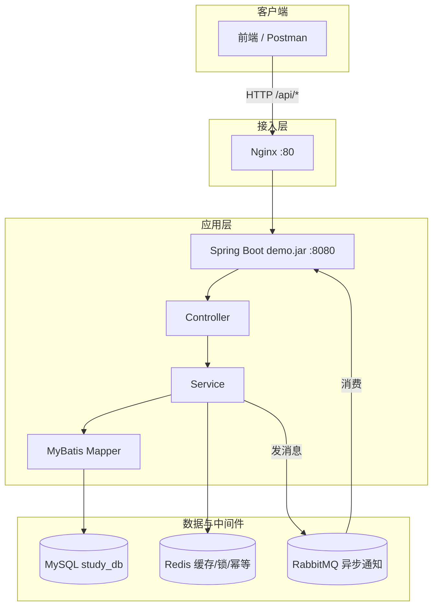

# 后端项目实战与面试准备

<!-- 修改说明: 2026-06-30 按 EXPANSION-STANDARD 扩充 §0、FAQ、闭卷自测、费曼检验 -->

## 0. 读前导读（零基础也能跟上）

> **读者假设**：01～09 章技术点学了不少，但还像「零件」——本章是**总装车间**，把 demo 扩成能写简历、能讲 20 分钟的商城 MVP。

### 0.1 用一句话弄懂本章

**一句话**：不是学新框架，而是把 **用户 / 商品 / 订单 + MySQL + Redis + MQ + Docker** 串成**一条完整故事**，并练会**怎么讲给面试官听**。

**生活类比——项目 = 一家能对外营业的店**：

| 概念 | 技术/模块 | 生活类比 |
|------|-----------|----------|
| **MVP** | 最小可演示版本 | 先开**一家总店**，能卖货、能下单，不追求全国连锁 |
| **分层架构** | Controller→Service→Mapper | 前台接待→店长办事→仓库取货 |
| **Redis 缓存** | 商品详情缓存 | 爆款商品**柜台样品**，不用每次跑仓库 |
| **事务** | 下单扣库存 | 收钱和减库存**必须同时成功**，不能只收不卖 |
| **RabbitMQ** | 下单异步通知 | 下单后**短信队**慢慢发，不堵收银台 |
| **09 章部署** | jar + compose + Nginx | 店装修好、挂牌营业 |
| **微服务（预告）** | 11 章 | 生意大了再开**分店**——本章先把总店做扎实 |

**为什么重要**：没有完整项目，面试只能说概念；有项目才能回答「你实际怎么做的」。

**本章用到的地方**：§4 模块清单、§16.1 四周里程碑、§33 简历模板、§36 分层结构。

---

### 0.2 你需要提前知道什么（真不会就先跳到哪一章）

| 你现在的水平 | 建议动作 |
|--------------|----------|
| 04～05 章接口/MyBatis 不熟 | 先补 CRUD 再做 Week1 |
| 没做过 Redis/MQ | Week3 前回 [07 Redis](./07-Redis核心原理与缓存实战.md)、[08 MQ](./08-RabbitMQ与消息队列实战.md) |
| 不会部署 | Week4 对照 [09 部署](./09-LinuxDockerNginx部署基础.md) §37 |
| 已有 demo 能跑 | 直接从 §16.1 里程碑 Week1 打勾 |
| 只想准备面试话术 | §8～§12、§33、§48 FAQ |

**最低门槛**：04 章能写 REST 接口；05 章能连 MySQL；有一个可扩展的 `demo` 仓库。

---

### 0.3 本章知识地图（学完后应能勾选全部 ☐→☑）

- [ ] 商城 MVP 含用户/商品/订单至少 10 个 REST 接口
- [ ] 商品详情 **Redis 缓存** + 能讲 Cache Aside
- [ ] 下单 **@Transactional** + 防超卖 SQL
- [ ] 下单后 **RabbitMQ** 异步通知（消费者打日志即可）
- [ ] README + Swagger 接口文档
- [ ] Week4：`docker compose` + jar + 可 curl 演示
- [ ] 15 分钟讲清：架构图、职责、2 个技术亮点、1 个难点
- [ ] 简历项目描述 4 条「动词+技术+效果」
- [ ] 自我介绍 1 分钟 / 3 分钟两版
- [ ] 闭卷自测 10 题正确 ≥ 8 题

---

### 0.4 建议学习时长与节奏

| 阶段 | 建议时间 | 做什么 |
|------|----------|--------|
| §0 + §4 模块规划 | 2 小时 | 定表结构、接口清单 |
| Week1 用户+商品 | 1 周 | §16.1 里程碑 |
| Week2 订单+事务 | 1 周 | 库存 SQL、事务边界 |
| Week3 缓存+MQ | 1 周 | 07/08 章能力落地 |
| Week4 部署+文档 | 1 周 | 09 章 + README |
| 面试准备 | 1 周 | §8～12、FAQ、自测、模拟口述 |

---

### 0.5 学完本章你能做什么（可验证的具体动作）

1. **Git 仓库**可公开演示：Postman/Swagger 跑通注册、商品列表、下单。
2. **口述 15 分钟**：项目背景 → 架构图 → 你负责的模块 → Redis 为什么加 → 事务怎么保证库存。
3. **简历一段**：按 §33 模板改 4 条 bullet，每条经得住追问。
4. **追问应答**：「缓存一致性？」「防重复下单？」「MQ 用在哪？」各 30 秒内答出。
5. **Week4 验收**：compose 起中间件 + jar 运行 + curl 返回 JSON。

---

### 0.6 手把手总览：四周 MVP 怎么推进

| 步骤 | 你的动作 | 预期看到什么 | 若不对 |
|------|----------|--------------|--------|
| 1 | 建 user/product/order 表 + 索引 | MyBatis 能 CRUD | 回 06 章表设计 |
| 2 | Week1 接口 Postman 全绿 | 注册/登录/商品分页/详情 | 看统一 Result 与异常 |
| 3 | Week2 下单 + `@Transactional` | 库存不足整单回滚 | 检查 SQL `WHERE stock >= ?` |
| 4 | Week3 Redis 命中 + MQ 消费日志 | 第二次详情更快/有消费 log | 07/08 章配置 |
| 5 | Week4 compose + jar | curl 通 | 09 章 §41.1 |
| 6 | 录音自讲项目 15 分钟 | 能连贯不卡壳 | 用 §48 费曼提纲 |

---

## 本章与上一章的关系

01～09 章你把语言、框架、数据库、缓存、MQ、部署都学了一遍——但知识还是「点状」的。04 写接口、05 连库、07 加缓存、08 发消息、09 打 jar，每一章各自为战。

这一章就是**总装车间**：把 demo 项目扩展成能写进简历的商城 MVP，并准备面试怎么讲。10 章不要求新学很多新技术，而是要求你**串起来、做出来、讲清楚**。

### 项目整体架构图



---

## 1. 为什么最后一定要落到项目

你学 Java、Spring、MySQL、Redis，不是为了把概念背下来，而是为了能做项目。

没有项目，你会出现这些问题：

- 知识点是散的
- 面试时讲不起来
- 不知道为什么要学这些技术

所以最后一定要把前面的知识串成一个完整项目。

## 2. 初学者最适合做什么项目

建议选择你容易理解的业务：

- 商城后端
- 博客社区后端
- 校园二手平台后端
- 用户中心 + 内容发布系统

不要一上来就做特别虚的大平台，也不要一上来就硬上微服务。

## 3. 一个合格项目至少该有的模块

建议你至少实现：

- 用户注册
- 用户登录
- 列表分页
- 条件查询
- 新增、修改、删除
- MySQL 持久化
- Redis 缓存
- 参数校验
- 统一异常处理
- 日志

如果你还能补上：

- RabbitMQ 异步通知
- 文件上传
- Docker 部署
- Nginx 代理

项目质量会更高。

## 4. 推荐你做的一个完整主线

这里给你一个很适合练手又适合面试讲解的主线：商城后端。

可以包含这些模块：

### 4.1 用户模块

- 注册
- 登录
- 用户信息查询
- 修改个人资料

### 4.2 商品模块

- 商品列表
- 商品详情
- 商品分类
- 商品搜索

### 4.3 订单模块

- 创建订单
- 订单列表
- 订单详情
- 取消订单

### 4.4 缓存模块

- 商品详情缓存
- 热门商品缓存
- 验证码缓存

### 4.5 异步模块

- 下单后异步发送通知消息

## 5. 项目技术栈建议

你可以按这个组合来做：

- Java
- Spring Boot
- MyBatis
- MySQL
- Redis
- RabbitMQ
- Docker
- Nginx

这套技术栈已经很像真实 Java 后端入门项目了。

## 6. 一个接口从请求到返回的大致流程

以“查询商品详情”为例：

1. 前端请求商品详情接口
2. `controller` 接收参数
3. `service` 先查 Redis
4. Redis 没命中再查 MySQL
5. 查到结果后写回 Redis
6. 组装 `VO`
7. 返回统一结果

如果你能把这个流程讲清楚，说明你已经开始真正理解后端项目了。

## 7. 创建订单的设计思路

你可以按这个顺序设计：

1. 校验用户是否登录
2. 校验商品是否存在
3. 校验库存是否足够
4. 创建订单
5. 扣减库存
6. 记录订单状态
7. 发送异步消息

### 这里涉及哪些知识点

- Spring Boot 接口
- MyBatis
- MySQL 事务
- Redis
- RabbitMQ

这就是为什么项目能把知识串起来。

## 8. 项目亮点怎么做

很多人项目做了，但讲不出亮点。

亮点不是“用了 Spring Boot”，因为大家都用。

亮点应该是“你解决了什么问题”。

### 好的亮点示例

- 为商品详情接口引入 Redis 缓存，减少数据库查询压力
- 在下单流程中使用事务保证订单和库存一致性
- 基于 RabbitMQ 实现异步通知，降低主流程响应时间
- 使用统一异常处理和参数校验提升接口稳定性
- 使用 Docker 启动 MySQL、Redis、RabbitMQ，降低环境搭建成本

## 9. 面试时怎么讲项目

建议按这个结构讲：

1. 项目是做什么的
2. 技术栈是什么
3. 你负责哪部分
4. 核心业务流程是什么
5. 做了哪些优化
6. 遇到了什么问题
7. 怎么解决的

### 示例表达

这个项目是一个商城后端系统，主要使用 Spring Boot、MyBatis、MySQL 和 Redis 开发。我主要负责用户、商品和订单模块的接口实现，并在商品详情接口中引入 Redis 缓存，在下单流程中通过事务保证订单与库存的一致性，同时使用 RabbitMQ 处理异步通知。

## 10. 大厂面试最常见的考察点

### 10.1 Java 基础

- 面向对象
- 集合
- 并发
- JVM

### 10.2 框架

- Spring
- Spring Boot
- MyBatis
- 事务

### 10.3 数据库

- SQL
- 索引
- 事务
- 锁

### 10.4 Redis

- 数据结构
- 缓存设计
- 缓存三大问题
- 分布式锁

### 10.5 中间件

- RabbitMQ
- Docker
- Linux
- Nginx

### 10.6 项目与场景题

- 为什么要加缓存
- 下单为什么要用事务
- 如何防重复下单
- 缓存和数据库一致性怎么做

## 11. 简历怎么写更靠谱

### 不要这样写

- 熟悉 Spring Cloud
- 熟悉分布式事务
- 熟悉海量数据架构

如果你讲不出来，这些话只会坑你。

### 更好的写法

- 基于 Spring Boot、MyBatis、MySQL 完成用户、商品、订单模块开发
- 基于 Redis 实现商品详情缓存和验证码存储
- 基于 RabbitMQ 实现下单后的异步通知流程
- 使用 Docker 部署 MySQL、Redis 和项目服务

## 12. 自我介绍怎么准备

一个简单靠谱的自我介绍结构：

1. 你是谁
2. 你的技术方向
3. 你学过和做过什么
4. 你现在找什么岗位

### 示例

我目前主要在学习和实践 Java 后端开发，重点掌握了 Java 基础、Spring Boot、MyBatis、MySQL、Redis 等技术，并完成了一个包含用户、商品和订单模块的商城后端项目。项目中我也实践了 Redis 缓存、事务处理和 RabbitMQ 异步消息，希望寻找 Java 后端开发相关的实习或初级岗位。

## 13. 算法要准备到什么程度

对初级岗位来说，建议重点准备：

- 数组
- 链表
- 栈
- 队列
- 哈希表
- 二叉树基础
- 双指针
- 滑动窗口
- 二分

不是说一定全会高难题，而是基础题你不能太虚。

## 14. 你现在最该做的事

如果你已经拿到这套文档，最重要的是：

1. 按顺序学
2. 一边学一边写代码
3. 逐步做出一个完整项目
4. 及时整理成自己的表达

## 15. 最终目标

当你做到下面这些时，你就已经具备较强的初级 Java 后端竞争力了：

- 会写 Spring Boot 接口
- 会用 MyBatis 和 MySQL
- 会用 Redis 做基础缓存
- 了解 RabbitMQ、Docker、Nginx
- 有一个能讲清楚的完整项目
- 能回答常见面试题并结合项目说明

## 16. 一个更完整的项目开发顺序

如果你准备真正开始做项目，建议按这个顺序推进：

1. 建库建表
2. 搭 Spring Boot 基础框架
3. 写用户模块
4. 写商品模块
5. 写订单模块
6. 补登录鉴权
7. 给热点接口加 Redis
8. 加 RabbitMQ 异步逻辑
9. 做部署

这样做的好处是：

- 学习节奏更清晰
- 每一阶段都有可见产出

---

<!-- 修改说明: 新增 MVP 里程碑检查表（Week1～Week4） -->

## 16.1 MVP 四周里程碑（照着打勾）

基于 04～09 章的 `demo` 项目扩展，每周一个可演示版本：

| 周次 | 目标 | 交付物 | 验收方式 |
|------|------|--------|----------|
| **Week 1** | 用户 + 商品 CRUD | 注册/登录/商品分页/详情接口；3 张表 + 索引 | Postman 跑通；README 写接口列表 |
| **Week 2** | 订单 + 事务 | 创建订单、扣库存、`@Transactional` | 库存不足时整单回滚；并发下单不超卖 |
| **Week 3** | 缓存 + MQ | 商品详情 Redis；下单后发 RabbitMQ | 第二次查详情走缓存；消费者打印日志 |
| **Week 4** | 部署 + 文档 | `mvn package`；docker-compose；Nginx 反代 | jar 启动；compose 起中间件；curl 通 |

**Week 1 最小接口清单**：

```text
POST   /api/register
POST   /api/login
GET    /api/products?pageNum=1&pageSize=10
GET    /api/products/{id}
POST   /api/products        （管理端，可选）
```

**Week 2 核心 SQL**：

```sql
UPDATE product SET stock = stock - #{qty}
WHERE id = #{id} AND stock >= #{qty};
```

**Week 3 与前面章节的对应**：

- 缓存 → 07 章 `ProductCacheService`
- MQ → 08 章 `OrderMessageProducer`

**Week 4 与 09 章的对应**：

- `docker compose up -d` → §37
- `java -jar target/demo-0.0.1-SNAPSHOT.jar`

---

## 17. 项目里最容易被面试官追问的点

你要重点准备：

- 订单为什么要加事务
- 商品详情为什么要加缓存
- 为什么选 Redis 而不是直接查数据库
- MQ 用在了哪里
- 登录鉴权怎么做
- 如果并发高了怎么办

## 18. 面试中的回答结构

建议你回答技术题时用这个结构：

1. 先说定义
2. 再说作用
3. 再说场景
4. 再说项目里的使用方式

这样会比只背概念更有说服力。

## 19. 如何积累自己的面试笔记

建议你每学一个点都写三行：

1. 这是什么
2. 解决什么问题
3. 项目里怎么用

长期积累下来，面试表达会越来越顺。

## 20. 这一章的进一步知识点

后面你还可以继续补：

- 微服务拆分
- 分布式事务
- 搜索系统
- 监控和告警
- 灰度发布
- 链路追踪

## 21. 一个更像样的商城项目表设计清单

如果你做商城项目，至少可以有这些表：

- 用户表
- 商品表
- 商品分类表
- 订单表
- 订单明细表
- 库存表
- 购物车表
- 操作日志表

如果再完整一些，还可以补：

- 地址表
- 收藏表
- 优惠券表

## 22. 一个更像样的接口清单

### 用户模块

- 注册
- 登录
- 查询用户信息
- 修改用户信息

### 商品模块

- 商品分页列表
- 商品详情
- 商品搜索

### 订单模块

- 创建订单
- 查询订单列表
- 查询订单详情
- 取消订单

### 购物车模块

- 加入购物车
- 查看购物车
- 删除购物车项

## 23. 你可以如何一步步把项目做得更强

### 第一版

- 只有基本 CRUD

### 第二版

- 增加登录鉴权
- 增加统一异常处理
- 增加参数校验

### 第三版

- 增加 Redis 缓存
- 增加日志

### 第四版

- 增加 RabbitMQ 异步处理
- 增加 Docker 部署
- 增加 Nginx 代理

这样你每做一版，项目的可讲价值都会明显提升。

## 24. 项目里常见的亮点提炼方式

你可以从这几个角度提炼亮点：

### 性能优化

- Redis 缓存
- SQL 优化

### 一致性保障

- 事务
- 幂等

### 工程能力

- 统一异常
- 参数校验
- Docker 部署

### 架构能力

- MQ 异步
- 限流
- 防重复提交

## 25. 面试官最喜欢怎么追问项目

你说一句“我用了 Redis”，面试官往往会接着问：

- 缓存的是什么
- 为什么缓存这个
- 更新时怎么保持一致
- 缓存雪崩怎么办

你说一句“我用了事务”，面试官往往会问：

- 哪些步骤放在事务里
- 为什么要放
- 事务失效场景知道吗

所以你要慢慢习惯：

- 每个技术点都要能落到“为什么”

## 26. 如何准备项目难点

你最好至少准备 2 到 3 个“项目难点”。

比如：

- 商品详情缓存设计
- 下单事务和库存扣减
- 异步通知和幂等消费

每个难点都可以按这个结构讲：

1. 问题是什么
2. 为什么会有这个问题
3. 你怎么解决
4. 方案有什么不足

## 27. 简历项目描述模板

你可以参考这种写法：

负责基于 Spring Boot、MyBatis、MySQL、Redis 实现商城后端核心模块开发，完成用户注册登录、商品分页查询、商品详情、订单创建与查询等业务功能；针对高频商品详情接口引入 Redis 缓存，降低数据库访问压力；在订单创建流程中使用事务保证订单与库存一致性，并通过 RabbitMQ 实现异步通知流程。

## 28. 自我介绍后的常见追问

面试官在听完你的自我介绍后，常见会追问：

- 你项目中最难的点是什么
- 你最熟的技术栈是什么
- 你为什么学 Java 后端
- 你平时怎么学习

你可以提前准备 1 分钟和 3 分钟两个版本。

## 29. 面试准备的知识组织方式

建议你把知识按这 5 组整理：

1. Java 基础
2. 框架
3. 数据库
4. Redis/MQ
5. 项目场景

这样复习时不会太乱。

## 30. 这一章的高频准备清单

建议你真正准备出来这些内容：

- 一版完整自我介绍
- 一版项目介绍
- 10 个 Java 高频题
- 10 个 MySQL 高频题
- 10 个 Redis 高频题
- 5 个 MQ 高频题
- 5 个场景设计题

## 31. 如果你要冲大厂，真正关键的是什么

不是把所有技术都学完，而是做到：

- 主线扎实
- 项目可信
- 表达清晰
- 基础题别崩

很多人并不是输在不会高级分布式，而是输在：

- Java 基础不牢
- MySQL 和 Redis 说不清
- 项目讲得像背稿
- 遇到追问就断

## 32. 这整套资料的正确使用方式

你可以按这个顺序反复循环：

1. 读一章
2. 写 demo
3. 写项目功能
4. 总结成自己的话
5. 再回来补薄弱点

这比“从头到尾只看一遍文档”有效得多。

---

## 33. 简历项目描述模板（可直接改）

```text
【项目名称】简易电商后端 API | Spring Boot + MyBatis + MySQL + Redis
【时间】2024.xx - 2024.xx
【描述】
- 实现用户 JWT 登录注册、商品 CRUD 与分页列表
- 商品详情使用 Redis 缓存，采用 Cache Aside 更新策略
- 下单接口事务保证订单与库存一致性，订单号幂等防重复提交
- 使用 RabbitMQ 实现订单超时未支付自动关闭
【技术栈】Java 17, Spring Boot 3, MyBatis, MySQL 8, Redis, RabbitMQ, Docker
```

**原则**：每条尽量 **动词 + 技术 + 效果**，能经得住追问。

---

## 34. 学完标准（全路线）

完成 10 篇时，你应已有：

- 1 个可演示的 Git 仓库（含 README、接口说明）
- 10 个以上 REST 接口
- 至少 3 张有索引设计的表
- 1 个 Redis 缓存场景 + 1 个 MQ 场景
- 能在 15 分钟内讲清项目架构与个人职责

---

## 35. 完整项目分层架构建议

```text
src/main/java/com/example/demo/
├── DemoApplication.java          # 启动类
├── common/
│   ├── Result.java               # 统一响应
│   ├── BusinessException.java    # 业务异常
│   └── GlobalExceptionHandler.java
├── config/
│   ├── CorsConfig.java
│   ├── WebMvcConfig.java        # 拦截器注册
│   └── RedisConfig.java
├── controller/
│   ├── UserController.java
│   ├── ProductController.java
│   └── OrderController.java
├── service/
│   ├── UserService.java
│   ├── impl/UserServiceImpl.java
│   ├── ProductService.java
│   └── impl/ProductServiceImpl.java
├── mapper/
│   ├── UserMapper.java
│   └── ProductMapper.java
├── entity/
│   ├── User.java
│   └── Product.java
├── dto/
│   ├── LoginDTO.java
│   └── CreateOrderDTO.java
├── vo/
│   ├── UserVO.java
│   └── OrderVO.java
└── interceptor/
    └── LoginInterceptor.java

src/main/resources/
├── application.yml
├── application-dev.yml
└── mapper/
    ├── UserMapper.xml
    └── ProductMapper.xml
```

---

## 36. Swagger / SpringDoc 接口文档

```xml
<!-- pom.xml 依赖 -->
<dependency>
    <groupId>org.springdoc</groupId>
    <artifactId>springdoc-openapi-starter-webmvc-ui</artifactId>
    <version>2.3.0</version>
</dependency>
```

```java
@Configuration
public class OpenApiConfig {
    @Bean
    public OpenAPI customOpenAPI() {
        return new OpenAPI()
            .info(new Info().title("电商演示 API").version("1.0")
                .description("Spring Boot + MyBatis + Redis 项目接口文档"));
    }
}
```

访问 http://localhost:8080/swagger-ui.html 即可看到所有接口。

---

## 37. 单元测试与集成测试

### 37.1 Service 层单元测试

```java
import static org.mockito.Mockito.*;
import static org.junit.jupiter.api.Assertions.*;

@ExtendWith(MockitoExtension.class)
class UserServiceTest {

    @Mock
    private UserMapper userMapper;

    @InjectMocks
    private UserService userService;

    @Test
    void testFindById() {
        User user = new User();
        user.setId(1L);
        user.setUsername("test");
        when(userMapper.selectById(1L)).thenReturn(user);

        User result = userService.findById(1L);
        assertNotNull(result);
        assertEquals("test", result.getUsername());
        verify(userMapper).selectById(1L);
    }
}
```

### 37.2 Controller 层集成测试

```java
@SpringBootTest(webEnvironment = SpringBootTest.WebEnvironment.RANDOM_PORT)
@AutoConfigureMockMvc
class UserControllerTest {

    @Autowired
    private MockMvc mockMvc;

    @Test
    void testGetUser() throws Exception {
        mockMvc.perform(get("/api/users/1"))
               .andExpect(status().isOk())
               .andExpect(jsonPath("$.code").value(200));
    }

    @Test
    void testCreateUserWithInvalidData() throws Exception {
        mockMvc.perform(post("/api/users")
               .contentType(MediaType.APPLICATION_JSON)
               .content("{\"username\":\"\"}"))
               .andExpect(status().isBadRequest());
    }
}
```

---

## 38. 前后端联调方案

| 阶段 | 前端 | 后端 | 联调方式 |
|------|------|------|----------|
| 本地开发 | localhost:5173 (Vite) | localhost:8080 | 前端 proxy 代理 `/api` |
| 开发联调 | 不改 | 不改 | 同上 |
| 测试环境 | Nginx 静态部署 | Docker 部署 | Nginx 反向代理同域 |

### Vite 代理配置（前端 `vite.config.js`）

```js
export default {
  server: {
    proxy: {
      '/api': {
        target: 'http://localhost:8080',
        changeOrigin: true,
      }
    }
  }
}
```

---

## 39. 学完标准（扩充版）

- [ ] 1 个可演示的 Git 仓库（含 README + 接口文档）
- [ ] 10+ REST 接口，含 JWT 登录、用户 CRUD、商品列表、订单创建
- [ ] 至少 3 张有索引设计的 MySQL 表
- [ ] 1 个 Redis 缓存场景 + 1 个 RabbitMQ 异步场景
- [ ] 会写 Service 层单元测试（Mockito）和 Controller 集成测试（MockMvc）
- [ ] 能在 15 分钟内讲清项目架构、技术选型和每个模块的职责
- [ ] 能带前端同学联调（Postman + Swagger 文档 + proxy 配置）

---

## 48. 常见困惑 FAQ

### Q1：没有前端可以做本章项目吗？

**A**：可以。Postman / Swagger / curl 足够验收；09 章 Nginx 静态页只是加分项。

### Q2：商城和其他项目（博客、二手）选哪个？

**A**：选你**能讲清业务**的。商城模块全、面试见得多；二手/博客也可，但要自己补「订单/交易」类亮点。

### Q3：一定要做 JWT 吗？

**A**：初级简历 **Session 或 JWT 二选一**即可；JWT 无状态更常出现在简历里，但要能讲清 Header 怎么带 token。

### Q4：Redis 缓存商品详情，更新商品怎么办？

**A**：Cache Aside——先更新 DB，再**删缓存**（不是立刻写缓存）；下回读再回填。面试够用。

### Q5：下单事务里应包含哪些步骤？

**A**：至少：查库存 → 插订单 → 扣库存 在同一 `@Transactional`；发 MQ 是否放事务内要能说权衡（常见：事务提交后发）。

### Q6：如何防重复下单？

**A**：订单号幂等（唯一索引 + 客户端传 idempotency key）、或 Redis 分布式锁 / 防重 token；能讲一种即可。

### Q7：项目要写多少接口算够？

**A**：**10+** REST 接口，覆盖增删改查 + 登录 + 一个复杂流程（下单）；质量 > 数量。

### Q8：简历能写 Spring Cloud 吗？

**A**：没做过就别写。写 **Spring Boot + MyBatis + Redis + MQ + Docker**，与 10 章栈一致。

### Q9：算法要刷多少题？

**A**：初级 **Hot 100 里数组/哈希/链表/双指针** 各若干；项目讲清楚比硬刷 Medium 更重要。

### Q10：Mockito 单元测试必须写吗？

**A**：§37 建议 Service 层 1～2 个示例；有比没有强，不必全覆盖。

### Q11：Week4 部署失败最常见原因？

**A**：application.yml 仍指向本地非 Docker 地址、MySQL 未导入 schema、8080 占用；对照 09 章清单。

### Q12：面试官问「并发高了怎么办」怎么答？

**A**：诚实分层答：Redis 缓存减读、MQ 异步减同步等待、SQL/索引优化、限流熔断（12/11 章视野）；结合你项目已做的 1～2 点。

---

## 49. 闭卷自测

> 先遮住答案，逐题口述或默写。

### 概念题（6 道）

1. 为什么说 10 章是「总装」而不是「新框架章」？
2. 商品详情接口的标准流程：Controller 之后到返回 JSON，至少写 5 步（含 Redis）。
3. Cache Aside 更新策略是什么？为什么下单事务和缓存不是一回事？
4. 简历里一条好的项目 bullet 应包含哪三要素？
5. 讲项目的推荐 7 步结构是什么（§9）？
6. 「用了 Redis」后面试官常追问哪 4 个问题？

### 动手题（2 道）

7. 写防超卖 UPDATE SQL（扣 `qty` 件，仅当库存足够）。
8. 列出 Week1 最小接口清单 4 个方法与路径（§16.1）。

### 综合题（2 道）

9. 设计「创建订单」接口：写出涉及的技术点（至少 5 个）及各自解决什么问题。
10. 用 1 分钟版本自我介绍，应包含哪 4 块内容？

### 自测参考答案

1. 把 04～09 知识串成可演示、可讲的完整 MVP，重在集成与表达。
2. Service 查 Redis → 未命中查 MySQL → 写 Redis → 组装 VO → 统一 Result 返回。
3. 更 DB 后删缓存；事务保证 DB 一致性，缓存最终一致靠失效策略。
4. 动词 + 技术 + 效果（量化更好）。
5. 做什么→栈→负责模块→核心流程→优化→问题→解决。
6. 缓存什么、为什么、更新一致性、雪崩/穿透/击穿（了解）。
7. `UPDATE product SET stock = stock - #{qty} WHERE id = #{id} AND stock >= #{qty}`
8. POST /api/register, POST /api/login, GET /api/products, GET /api/products/{id}
9. 例：JWT 鉴权、@Transactional、MyBatis、唯一订单号幂等、MQ 异步通知、参数校验等。
10. 你是谁、方向、做过什么项目/技术、求职意向。

---

## 50. 费曼检验

**任务**：请在不看资料的情况下，用 **3 分钟** 向朋友解释「你的商城后端项目做了什么、亮点在哪」。

**对照提纲**：

1. **店是干嘛的**：用户注册登录、逛商品、下单——一个能演示的 MVP 总店。
2. **怎么干的**：Spring Boot 分层；MySQL 存数据；Redis 给热门商品详情加速；下单用事务保证库存对得上。
3. **为什么这样**：缓存因为详情访问多；事务因为不能卖了货还不减库存；MQ 因为发短信不用堵在用户等响应上。
4. **你怎么证明**：Postman/Swagger 能跑、Week4 能部署、Git 有 README。

若朋友能复述「模块 + 两个优化点 + 一个难点」，说明项目已真正变成你的东西，不是背稿。

---

## 51. 面试追问应答速查（结合项目）

| 追问 | 30 秒答法要点 |
|------|----------------|
| 为什么 Redis 缓存详情？ | 读多写少、QPS 高、减轻 MySQL；key 如 `product:{id}`，TTL 30min |
| 缓存和 DB 不一致？ | 更新商品后删 key；接受短暂不一致 |
| 事务边界？ | 创建订单+扣库存在同一事务；MQ 可在 commit 后发 |
| 防重复下单？ | 订单号 UK / Redis 幂等 key / 前端防双点 |
| 项目最难？ | 准备 1 个：如库存并发、缓存穿透、联调部署 |

---

## 52. 核心表设计逐行读（商城 MVP）

```sql
CREATE TABLE product (
  id BIGINT PRIMARY KEY AUTO_INCREMENT,
  name VARCHAR(128) NOT NULL,
  price DECIMAL(10,2) NOT NULL,
  stock INT NOT NULL DEFAULT 0,
  category_id BIGINT,
  create_time DATETIME DEFAULT CURRENT_TIMESTAMP,
  KEY idx_category (category_id)
) ENGINE=InnoDB DEFAULT CHARSET=utf8mb4;
```

| 字段/子句 | 含义 | 改错会怎样 |
|-----------|------|------------|
| `DECIMAL(10,2)` | 精确价格 | 用 DOUBLE 对账可能差分 |
| `stock INT` | 可售库存 | 下单 SQL 依赖此字段防超卖 |
| `idx_category` | 分类列表加速 | 无索引分类页 `EXPLAIN type=ALL` |
| `InnoDB` | 支持事务 | 订单扣库存必须 InnoDB |

### 52.1 项目接口与分层对照表

| 接口 | Controller | Service 职责 | 涉及技术 |
|------|------------|--------------|----------|
| GET /api/products/{id} | ProductController | 查 Redis→MySQL→回填 | Redis Cache Aside |
| POST /api/orders | OrderController | 校验→事务下单→发 MQ | @Transactional, MQ |
| POST /api/login | UserController | 校验密码→发 JWT | BCrypt, JWT |

### 52.2 面试「项目难点」模板（填自己的数字）

```text
难点：高并发下商品详情访问打满 MySQL。
原因：详情 QPS 高、读多写少。
做法：Redis 缓存 product:{id}，TTL 30min，更新商品时删 key。
不足：极端热点 key 仍可能打穿；后续可加本地缓存或 singleflight。
```

---

<!-- 修改说明: 新增下一章预告 -->

## 下一章预告

10 章你把单体商城 MVP 做透、能讲 20 分钟了——面试可能还会问：「你们公司要是用户量大了，怎么拆微服务？」

下一章（11 微服务与 Spring Cloud 基础）不急着动手拆，先建立概念：Gateway 网关、服务注册、Feign 远程调用。单体做扎实了再学微服务，才不会「只会背名词」。

---

*下一章：11 微服务与 Spring Cloud 基础 · 配合 14 场景题、15 总表冲刺面试*
