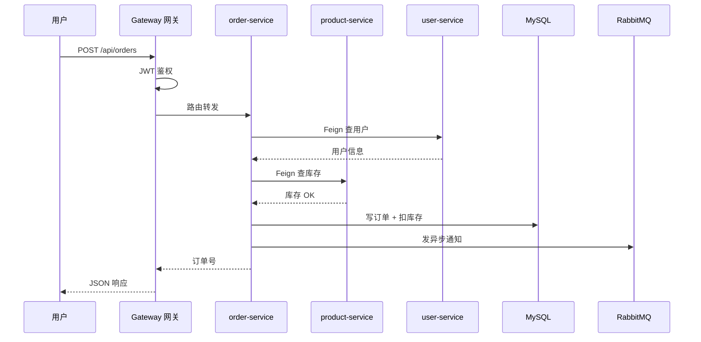

# 微服务与 Spring Cloud 基础

<!-- 修改说明: 新增本章与上一章的关系 + 微服务调用链路 Mermaid 图 -->

## 本章与上一章的关系

10 章你把单体商城 MVP 做透了——用户、商品、订单、缓存、MQ 都在一个 jar 里。当用户量上来、团队变大，一个 jar 会越来越难维护：改订单逻辑要重新部署整个系统，商品模块想扩容得把整个应用都扩。

这一章不急着动手拆，先建立**微服务概念**：为什么要拆、Gateway/Feign/Nacos 各干什么。11 章是「架构视野」，12 章是「高并发与分布式 deeper」——单体扎实后再看这些，才不会只会背组件名。

### 微服务调用链路图



---

## 1. 为什么要学这一章

当你单体项目做得越来越大时，会逐渐遇到这些问题：

- 一个项目太庞大
- 模块耦合太重
- 发布一次影响全部
- 不同模块扩容需求不同

这时就会引出微服务架构。

## 2. 什么是单体架构

单体架构就是：

- 所有模块都在一个项目里
- 一起开发
- 一起部署

优点：

- 开发简单
- 部署直接
- 初期成本低

缺点：

- 项目变大后维护压力上升
- 模块边界不清时容易互相影响

## 3. 什么是微服务架构

微服务可以理解为：

- 把一个大系统拆成多个小服务
- 每个服务独立开发、独立部署

例如商城系统可以拆成：

- 用户服务
- 商品服务
- 订单服务
- 支付服务

## 4. 微服务的优点

- 服务边界更清晰
- 可以独立扩容
- 团队协作更灵活

## 5. 微服务的缺点

微服务不是没有代价的，它会带来更多复杂度：

- 服务调用变复杂
- 需要注册发现
- 需要网关
- 需要配置中心
- 需要链路追踪
- 需要更强的运维能力

所以你要理解：

- 微服务不是“更高级就一定更好”
- 它是为了解决单体在特定阶段的问题

## 6. Spring Cloud 是干什么的

Spring Cloud 提供的是一整套微服务常见问题的解决方案。

你可以把它理解成：

- 微服务开发的一组基础设施工具

## 7. 你应该先掌握哪些概念

### 7.1 服务注册与发现

为什么需要：

- 服务拆多了，调用方要知道被调用方在哪

### 7.2 配置中心

为什么需要：

- 多个服务的配置不适合到处散落

### 7.3 网关

为什么需要：

- 统一入口
- 路由转发
- 鉴权控制

### 7.4 负载均衡

为什么需要：

- 同一个服务可能部署多个实例

### 7.5 熔断和降级

为什么需要：

- 某个下游服务异常时，不能把整个系统拖死

## 8. 微服务调用的基本认知

单体里通常是方法调用。

微服务里更多是：

- HTTP 调用
- RPC 调用
- 消息队列异步调用

## 9. 网关的角色

网关常做的事：

- 路由转发
- 统一鉴权
- 限流
- 日志
- 跨域处理

你可以把它理解成微服务系统的“统一门口”。

## 10. 配置中心的角色

多服务场景下，数据库地址、Redis 地址、MQ 地址等配置很多。

配置中心的作用是：

- 集中管理配置
- 动态更新配置

## 11. 链路追踪基础认知

服务拆多之后，一个请求可能要经过很多服务。

这时问题就来了：

- 请求到底卡在哪个服务
- 哪个环节最慢

所以要有链路追踪能力。

## 12. 分布式事务基础认知

单体系统一个数据库事务还能比较直接地处理。

微服务里如果跨多个服务、多个库，就会遇到分布式事务问题。

你现在先知道这是个难点即可，不用一开始深挖。

## 13. 初学微服务的正确顺序

建议顺序：

1. 先把单体项目做好
2. 再理解为什么要拆服务
3. 再学微服务基础设施

不要一上来就学一堆 Spring Cloud 组件名字。

## 14. 这一章学到什么程度够用

对于当前阶段，你至少要做到：

- 知道单体和微服务的区别
- 知道微服务为什么会引入注册中心、网关、配置中心
- 知道微服务会带来什么复杂度

这就已经足够支撑初级面试中的基础问答。

## 15. 服务注册中心再细一点

服务注册中心要解决的问题是：

- 服务地址不是写死的
- 实例可能会增减

常见思路：

1. 服务启动后把自己注册进去
2. 调用方去注册中心发现可用实例

你后面会看到的名字可能包括：

- Eureka
- Nacos

## 16. 服务调用基础认知

微服务之间不会像单体里那样直接方法调用。

常见方式：

- HTTP 调用
- OpenFeign 等声明式调用

你现在先知道：

- 服务调用会引入网络开销和失败风险

## 17. 网关为什么重要

如果没有网关，外部请求可能直接面对多个服务，管理会很乱。

网关的价值：

- 统一入口
- 路由转发
- 权限控制
- 限流
- 日志

## 18. 配置中心为什么重要

微服务多了以后，这些配置会越来越多：

- 数据库地址
- Redis 地址
- MQ 地址
- 第三方密钥

如果每个服务自己管，维护成本会很高。

## 19. OpenFeign 基础认知

这是微服务中很常见的调用工具。

你可以先简单理解：

- 用接口方式声明调用另一个服务

它让服务调用写法更清晰。

## 20. 熔断和降级再细一点

为什么需要熔断：

- 下游服务挂了，不能把上游一起拖死

为什么需要降级：

- 系统压力太大时，优先保证核心功能可用

## 21. 微服务拆分不是越细越好

这是非常重要的认知。

拆得太细会带来：

- 调用链更长
- 运维更复杂
- 故障面更多

所以拆分要有业务边界，而不是为了“高级”而拆。

## 22. 微服务这一章的高频知识点总清单

建议整理这些点：

- 单体架构
- 微服务架构
- 注册中心
- 服务发现
- 网关
- 配置中心
- 服务调用
- 熔断
- 降级
- 负载均衡
- 链路追踪
- 分布式事务基础

---

## 23. 单体 vs 微服务决策表

| 维度 | 单体 | 微服务 |
|------|------|--------|
| 团队规模 | 小团队 | 多团队并行 |
| 部署 | 一个 jar | 多个服务独立发布 |
| 技术栈 | 统一 | 可按服务选型 |
| 复杂度 | 低 | 高（治理、链路） |
| 适用 | 创业、MVP、学习 | 大流量、大组织 |

**学习建议**：第一个项目用 **单体 Spring Boot** 做完；11 篇理解概念即可。

---

## 24. Spring Cloud 常见组件速查

| 组件 | 作用 | 备注 |
|------|------|------|
| Nacos / Eureka | 注册与发现 | 服务名调用 |
| Gateway / Zuul | API 网关 | 路由、鉴权、限流 |
| OpenFeign | 声明式 HTTP 调用 | 像调本地方法 |
| Sentinel | 限流熔断 | 阿里系常用 |
| Config / Nacos Config | 配置中心 | 动态刷新 |
| Sleuth + Zipkin | 链路追踪 | 查慢调用 |

---

## 25. 一次微服务调用链示例

```text
用户 → Gateway（鉴权、路由）
     → order-service（下单）
         → Feign 调 product-service（查库存）
         → Feign 调 user-service（查用户）
         → 写 order-db
         → 发 RabbitMQ
```

你要能说出：**每一跳都可能超时、失败，需要熔断和超时配置**。

---

## 26. 学完标准

- 能画单体与微服务架构对比图
- 说出注册中心、网关、Feign 各解决什么问题
- 知道拆分原则：按业务域，不是按表
- 了解分布式事务 Seata/TCC 「听说过」级别

---

## 28. Spring Cloud 核心组件详解

| 组件 | 作用 | Spring Cloud 实现 |
|------|------|-------------------|
| 服务注册/发现 | 服务上线后自动注册，调用者自动发现 | Nacos / Eureka |
| 配置中心 | 配置统一管理、动态刷新 | Nacos Config |
| 网关 | 统一入口、鉴权、路由、限流 | Spring Cloud Gateway |
| 远程调用 | 服务间 HTTP 调用像本地方法 | OpenFeign |
| 负载均衡 | 调用者侧负载均衡 | LoadBalancer |
| 熔断降级 | 下游故障时快速失败 | Sentinel / Resilience4j |
| 链路追踪 | 追踪请求在各服务间的路径 | Micrometer + Zipkin/SkyWalking |

### 28.1 服务注册中心工作原理

```
启动时：order-service → 注册到 Nacos（"我叫 order-service，IP 192.168.1.10:8080"）
心跳：每 5 秒向 Nacos 发送心跳包
发现：user-service 调用时 → 从 Nacos 拿到 order-service 的实例列表
下线：order-service 停止 → Nacos 30 秒没收到心跳 → 踢掉实例
```

### 28.2 Gateway 网关路由配置

```yaml
spring:
  cloud:
    gateway:
      routes:
        - id: user-service
          uri: lb://user-service   # lb = 负载均衡，自动从注册中心发现
          predicates:
            - Path=/api/users/**
          filters:
            - StripPrefix=0
        - id: order-service
          uri: lb://order-service
          predicates:
            - Path=/api/orders/**
```

### 28.3 OpenFeign 声明式调用

```java
@FeignClient(name = "product-service")  // 通过注册中心自动发现
public interface ProductClient {

    @GetMapping("/api/products/{id}")
    Result<ProductVO> getProduct(@PathVariable Long id);

    @PutMapping("/api/products/{id}/stock")
    Result<Void> deductStock(@PathVariable Long id, @RequestBody StockDTO dto);
}
```

```java
@Service
public class OrderService {

    private final ProductClient productClient;  // 像调本地方法一样

    public void createOrder(CreateOrderDTO dto) {
        Result<ProductVO> result = productClient.getProduct(dto.getProductId());
        // ...
    }
}
```

### 28.4 Sentinel 熔断降级

```java
// 方式一：注解
@SentinelResource(value = "createOrder",
                  fallback = "createOrderFallback",
                  blockHandler = "createOrderBlockHandler")
public Result<Long> createOrder(CreateOrderDTO dto) {
    // 业务逻辑
}

// 降级方法（业务异常时走）
public Result<Long> createOrderFallback(CreateOrderDTO dto, Throwable e) {
    return Result.fail("下单服务暂不可用，请稍后重试");
}

// 限流方法（被 Sentinel 拦截时走）
public Result<Long> createOrderBlockHandler(CreateOrderDTO dto, BlockException e) {
    return Result.fail("系统繁忙，请稍后重试");
}
```

```yaml
# Sentinel 控制台规则示例（也可在控制台界面配置）
# 资源: createOrder
# 流控规则: QPS=100 → 超过后快速失败
# 降级规则: 慢调用比例 > 50% 且 RT > 200ms → 熔断 10 秒
# 热点规则: 参数 productId=0 → QPS 限制 10
```

---

## 29. 分布式事务概念

微服务环境下，一个业务可能跨多个数据库：

```
下单流程：
order-service 写订单库 → product-service 扣库存库 → account-service 扣款库

问题：扣库存成功了，扣款失败了—— 跨服务的"要么全成功要么全失败"怎么做？
```

| 方案 | 原理 | 适用场景 |
|------|------|----------|
| 2PC（XA） | 两阶段提交，协调者决定提交还是回滚 | 强一致但性能差，基本不用 |
| TCC | Try-Confirm-Cancel：预留资源 → 确认 → 取消 | 金融类强一致场景 |
| 最终一致性 | 本地事务 + MQ 异步补偿 | **互联网最常用** |
| Seata AT | 自动回滚 undo_log | 不想写补偿逻辑时的折中方案 |

```java
// 最终一致性 + MQ（最常用）
@Transactional
public void createOrder(CreateOrderDTO dto) {
    // 1. 本地事务：写订单
    orderMapper.insert(order);

    // 2. 发送 MQ 消息（扣库存、发通知等异步处理）
    rabbitTemplate.convertAndSend("order.created", order);

    // 如果 MQ 发送失败 → 事务回滚，订单也没创建
    // 如果 MQ 发送成功但消费者失败 → MQ 重试 / 死信补偿
}
```

---

## 30. 学完标准（扩充版）

- [ ] 能画出单体架构 vs 微服务架构对比图
- [ ] 说出注册中心（Nacos）、网关（Gateway）、远程调用（Feign）各解决什么问题
- [ ] 理解微服务拆分原则：**按业务域拆，不是按表拆**
- [ ] 能写一个 Feign 接口，通过服务名调用另一个服务
- [ ] 知道熔断降级（Sentinel）的基本用法：流控 + 降级 + 热点
- [ ] 了解分布式事务：最终一致性 + MQ 是互联网主流

---

## 31. FAQ

**Q：必须学 Spring Cloud Alibaba 吗？**  
国内 Nacos + Sentinel 组合很普遍；原理和 Netflix 系基本相通。

**Q：和 Dubbo 区别？**  
Feign 是 HTTP REST（文本协议，调试方便）；Dubbo 是 RPC（二进制协议，性能更高）。初学从 REST 开始，Dubbo 工作中遇到再学。

**Q：微服务初学要不要搭完整环境？**  
不用。先在脑子里把单体拆成几个独立服务的架构图画清楚，理解组件职责。单体项目做透再动手拆。

**Q：怎么判断要不要拆微服务？**  
团队小（<10人）、业务不复杂 → 单体做透。拆分是有成本的——分布式事务、网络延迟、运维复杂度都会增加。

---

<!-- 修改说明: 新增常见报错与排查 + 下一章预告 -->

## 27.1 微服务入门常见坑（排查表）

| 现象 | 可能原因 | 解决方案 |
|------|---------|---------|
| Feign 调用 404 | 服务名或路径与 Provider 不一致 | 核对 `@FeignClient(name=...)` 和 Controller 路径 |
| 注册中心看不到服务 | 未启动 Nacos/Eureka 或 namespace 错 | 看注册中心控制台；检查 `spring.cloud.nacos.discovery` |
| Gateway 路由不通 | `uri` 或 `Path` _predicate 配错 | 看 Gateway 日志；用 `lb://service-name` |
| 调用超时 | 默认超时太短或下游慢 | 配置 `feign.client.config.default.readTimeout` |
| 循环依赖 | A 调 B、B 又调 A | 重新划边界；改 MQ 异步解耦 |

---

## 下一章预告

11 章你知道微服务「是什么、为什么」了——但面试官还会问：「QPS 10 万怎么办？」「缓存和 DB 不一致怎么权衡？」

下一章（12 高并发与分布式系统基础）讲限流、熔断、CAP、秒杀思路——把 07 Redis、08 MQ 的知识放到更大架构里理解。

---

*下一章：12 高并发与分布式系统基础*
