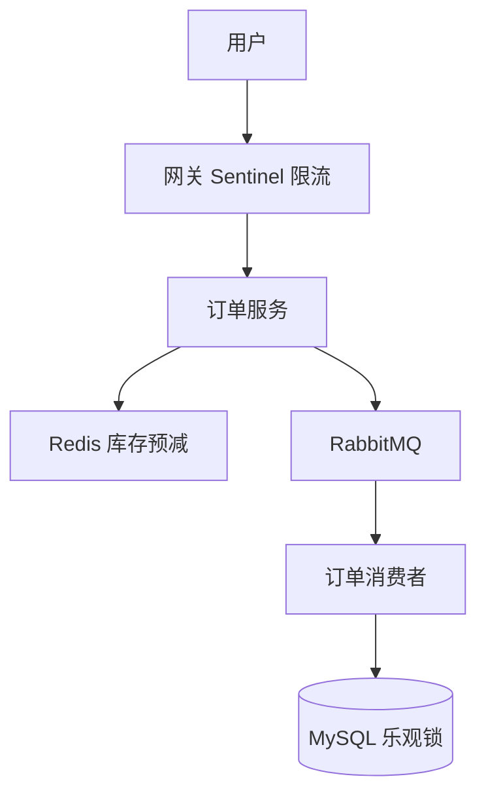

# 高并发与分布式系统基础

<!-- 修改说明: 新增本章与上一章的关系 -->

## 本章与上一章的关系

11 章你理解了微服务拆分和 Gateway/Feign——系统变复杂后，瓶颈从「一个 jar 太慢」变成「数据库被打垮、库存超卖、下游拖死上游」。这一章讲**高并发下的应对思路**：限流、熔断、幂等、分布式锁、CAP。

不需要你现在就搭秒杀系统，但要能**画架构、讲方案**——07 Redis、08 MQ 在这章会找到「为什么用在这里」的更大图景。

---

## 1. 什么是高并发

简单理解就是：

- 在同一时间有很多请求打到系统

高并发不是一个纯理论词，它会带来很多真实问题：

- 数据库扛不住
- 接口响应变慢
- 库存超卖
- 服务崩溃

## 2. 系统为什么会扛不住

一个后端系统的瓶颈可能出现在很多地方：

- CPU
- 内存
- 数据库
- Redis
- 网络
- 线程池
- 下游服务

所以高并发问题不能只盯着一个点看。

## 3. 常见优化思路

### 3.1 缓存

用 Redis 缓存热点数据，减轻数据库压力。

### 3.2 异步

用 MQ 把非核心流程异步化。

### 3.3 限流

保护系统不要被流量打垮。

### 3.4 降级

当系统扛不住时，先保住核心功能。

### 3.5 拆分

包括：

- 服务拆分
- 数据拆分

## 4. 限流基础认知

限流的目标是：

- 控制请求速率
- 保护服务稳定性

常见算法：

- 计数器
- 滑动窗口
- 令牌桶
- 漏桶

你现在不一定要全部会手写，但要知道基本思路。

## 5. 降级和熔断

### 降级

当系统压力太大时，临时关闭非核心功能或返回兜底数据。

### 熔断

当某个下游服务持续异常时，暂时不再继续调用它，防止整个系统被拖垮。

## 6. 幂等

高并发系统里，幂等特别重要。

典型场景：

- 支付回调重复
- 重复点击下单
- MQ 重复消费

## 7. 分布式锁

多实例部署后，同一份业务资源可能被多个节点同时处理。

这时需要分布式锁来控制并发。

Redis 是一种常见基础实现方式。

## 8. 分库分表基础认知

当单库单表数据量很大时，就可能考虑：

- 分库
- 分表

你现在先知道它是为了解决容量和性能问题。

初学阶段不需要马上投入太深。

## 9. 一致性问题

分布式系统里，很多问题的核心都和一致性有关，比如：

- 缓存和数据库一致性
- 多服务数据一致性
- 主从数据一致性

## 10. 最终一致性

很多系统并不是追求每一刻绝对一致，而是：

- 在合理时间内达到一致

这在缓存、MQ、异步补偿场景里非常常见。

## 11. 超卖问题

电商和秒杀场景经常会问。

为什么会超卖：

- 并发请求同时扣库存

常见解决方向：

- 数据库锁
- Redis 预扣库存
- Lua 脚本
- 队列削峰

## 12. 订单重复提交问题

常见原因：

- 用户重复点击
- 网络重试

解决方向：

- 前端防重
- 后端幂等
- token 防重
- 唯一索引

## 13. 系统设计时要学会问自己

当你看到一个高并发场景时，先问：

1. 热点在哪里
2. 写压力在哪里
3. 一致性要求多高
4. 哪些环节可以异步
5. 哪些环节必须同步

## 14. 这一章的学习目标

你现阶段不需要把所有高并发技术都学透，但至少要建立正确认知：

- 高并发问题从来不是单点问题
- 优化手段通常是组合拳
- 要结合业务目标和一致性要求做取舍

## 15. 常见性能指标

学习高并发时，你最好认识这些指标：

- QPS
- TPS
- RT
- 吞吐量

### QPS

每秒请求数。

### RT

响应时间。

如果一个接口 QPS 高但 RT 也高，系统体验通常不会好。

## 16. CAP 和 BASE 基础认知

分布式系统里常见这两个词。

你现在先有基础印象即可：

- CAP 讨论一致性、可用性、分区容错
- BASE 更偏向最终一致性的工程思想

当前阶段不必死抠理论证明，但要知道：

- 分布式系统设计常常是在做取舍

## 17. 读多写少和写多读少的优化思路不同

### 读多写少

常见优化：

- 缓存
- 读写分离

### 写多读少

常见更关注：

- 写入吞吐
- 幂等
- 队列削峰

## 18. 重试和补偿基础认知

分布式调用失败后，不一定只能“直接报错”。

常见策略：

- 立即重试
- 延迟重试
- 异步补偿

但要注意：

- 重试不是万能的
- 重试过多也可能放大问题

## 19. 高并发下库存扣减的常见方案

你可以逐渐建立这几个思路：

- 数据库扣减
- 乐观锁版本号
- Redis 预扣库存
- Lua 保证原子性
- 队列削峰

没有一种方案适合所有场景，要看：

- 并发量
- 一致性要求
- 系统复杂度接受程度

## 20. 服务雪崩基础认知

当某个下游服务异常，导致大量请求堆积、线程占满，进而影响更多服务，就可能出现雪崩式故障。

这也是为什么：

- 限流
- 熔断
- 降级

很重要。

## 21. 高并发这一章的高频知识点总清单

建议整理这些点：

- 高并发含义
- 常见瓶颈
- 缓存
- 异步
- 限流
- 降级
- 熔断
- 幂等
- 分布式锁
- 最终一致性
- 超卖
- 重试和补偿

---

## 22. 秒杀场景拆解（经典综合题）

### 问题

高并发抢购有限库存，易出现：超卖、DB 被打垮、重复下单。

### 分层方案

```text
前端：按钮防抖、活动开始时间校验
网关：限流（令牌桶）
服务：Redis 预减库存（DECR）+ 异步 MQ 创建订单
数据库：最终扣减，乐观锁 version
```

### 面试表达

「入口限流 → Redis 抗热点读写在内存完成资格校验 → 成功用户进 MQ 异步落单 → DB 乐观锁保证不超卖。」

---

## 23. 限流 / 熔断 / 降级 对比

| 手段 | 触发时机 | 目的 |
|------|----------|------|
| 限流 | 请求过多 | 保护自身 |
| 熔断 | 下游连续失败 | 快速失败，防雪崩 |
| 降级 | 系统压力大或功能非核心 | 关闭次要功能保核心 |

工具：Sentinel、Hystrix（老）、网关层限流。

---

## 24. 学完标准

- 能解释高并发瓶颈常在 IO、DB、锁
- 说出缓存、异步、限流、幂等、分布式锁的适用场景
- 能讲清超卖、缓存一致性、消息重复消费的思路
- 知道 CAP、最终一致性，不夸大「强一致 everywhere」

---

## 25. 分级练习

**基础**：用文字描述「双 11 下单」涉及哪些组件  
**进阶**：画一张含 Redis + MQ + MySQL 的下单架构图  
**挑战**：阅读 Sentinel 官方 demo，配置一个 QPS 限流规则

<!-- 修改说明: 新增分级练习参考答案 -->

### 参考答案

#### 基础：双 11 下单涉及组件

```text
用户 → CDN/静态页 → 网关限流 → 订单服务
  → Redis 预减库存 / 验证码
  → MySQL 订单表 + 乐观锁扣库存
  → RabbitMQ 异步创建订单明细、发通知
  → 消费者幂等落库
```

#### 进阶：架构图（Mermaid）



#### 挑战：Sentinel QPS 限流（关键步骤）

1. 引入 `spring-cloud-starter-alibaba-sentinel`
2. 配置 `spring.cloud.sentinel.transport.dashboard=localhost:8080`
3. 资源名 `@SentinelResource("createOrder")` 或网关 Route ID
4. 控制台 → 流控规则 → QPS 阈值 100 → 快速失败

---

<!-- 修改说明: 新增下一章预告 -->

## 下一章预告

12 章是架构层面的「扛流量」——算法则是面试里的「基础思维」。很多公司后端初面都有一两道 Easy～Medium 题。

下一章（13 算法与数据结构基础）给你刷题路线和 Java 模板，配合 14 章场景题一起冲刺。

---

## 26. 核心问题速答

**Q：初学要搞分布式吗？**  
先单体做透；12 篇建立词汇表即可。

**Q：分布式锁 Redis 够吗？**  
大多数场景够；强一致金融场景用 ZooKeeper/etcd 等（了解）。

**Q：CAP 到底怎么选？**  
P（分区容忍）必须选。剩下在 C（一致）和 A（可用）之间权衡。订单/支付系统通常优先 C；社交/内容推荐优先 A。

---

## 27. 分布式 ID 生成方案

| 方案 | 原理 | 优点 | 缺点 |
|------|------|------|------|
| UUID | `UUID.randomUUID()` | 简单、无中心 | 无序入库慢（B+树分裂）、字符串存占空间 |
| 自增 ID | 数据库 `AUTO_INCREMENT` | 有序、最简单 | 分库时有冲突 |
| 雪花算法（Snowflake） | 64bit: 时间戳 + 机器ID + 序列号 | **有序、高性能、分布式** | 依赖机器时钟（时钟回拨有问题） |
| 号段模式 | 一次从 DB 取一批号段，用完再取 | 减少 DB 压力 | 机器挂了可能丢一段 ID |
| Redis 自增 | `INCR id:order` | 简单 | 依赖 Redis 持久化 |

### 雪花算法结构（最常用）

```
64 bit (8 bytes)
┌───────┬───────────┬─────────┬──────────┐
│ 1 bit │  41 bit   │ 10 bit  │  12 bit  │
│未使用 │ 毫秒戳     │ 机器 ID │  序列号   │
└───────┴───────────┴─────────┴──────────┘

每毫秒可生成 4096 个 ID，理论 QPS 400 万
```

```java
// 需要雪花 ID？用 Hutool 工具类一行搞定
long id = IdUtil.getSnowflake(1, 1).nextId();
```

---

## 28. 限流算法

| 算法 | 原理 | 优点 | 缺点 |
|------|------|------|------|
| 固定窗口 | 1 秒 100 个请求 | 简单 | 窗口边界可能 2 倍突发 |
| 滑动窗口 | 把窗口分多个小格 | 比固定窗口平滑 | 实现复杂度适中 |
| 漏桶 | 固定速度流入 | 绝对平滑 | 无法应对突发 |
| 令牌桶 | 固定速度放令牌，有令牌才能请求 | **允许一定突发**，最常用 | — |

### 令牌桶实战（Guava RateLimiter）

```java
import com.google.common.util.concurrent.RateLimiter;

RateLimiter limiter = RateLimiter.create(100.0); // 每秒 100 个

@GetMapping("/api/product/{id}")
public Result<ProductVO> getProduct(@PathVariable Long id) {
    if (!limiter.tryAcquire(1, TimeUnit.SECONDS)) {
        return Result.fail("系统繁忙，请稍后重试");
    }
    return productService.getDetail(id);
}
```

---

## 29. 分布式事务方案深入

| 方案 | 一致性 | 性能 | 复杂度 | 适用 |
|------|--------|------|--------|------|
| 2PC | 强 | 差 | 低 | 几乎不用 |
| TCC | 最终/强 | 好 | **高** | 金融 |
| 本地消息表 | 最终 | 好 | 中 | 互联网主流 |
| MQ 事务消息 | 最终 | 好 | 中 | 互联网主流 |
| Seata AT | 最终 | 中 | 低 | 不想写补偿 |

### 本地消息表方案

```
                                        ┌───────┐
1. 写订单 + 写消息表（同一本地事务）→  │ MySQL │
                                        └──┬────┘
2. 定时任务轮询消息表 ─────────────────→  │
3. 发送 MQ ──────────────────────────────→  RabbitMQ
4. 消费者处理（扣库存、发通知）─────────→  │
5. 消费成功 → 更新消息表状态为"已处理"
6. 消费失败 → 定时任务重试
```

---

## 30. 降级熔断 Hystrix/Sentinel 对比

| 状态 | 含义 | 表现 |
|------|------|------|
| 关闭（Closed） | 正常 | 每次调用都走原方法 |
| 打开（Open） | 熔断中 | 直接走 fallback，不尝试调原方法 |
| 半开（Half-Open） | 试探恢复 | 放少量请求走原方法，成功则关闭熔断 |

```
熔断器状态机：
Closed ──错误率 > 阈值──→ Open
                         │
                       等待 N 秒
                         │
                        ↓
                    Half-Open
                      /     \
               成功 <阈值    失败 >阈值
                   ↓           ↓
                Closed       Open（继续等）
```

---

## 31. 学完标准（扩充版）

- [ ] 能解释 CAP 的 P 为什么必须选，C 和 A 怎么取舍
- [ ] 知道雪花算法的 64 位结构和为什么比 UUID 更适合入库
- [ ] 能用令牌桶/漏桶解释限流，知道 Sentinel QPS 限流
- [ ] 理解熔断器 Closed → Open → Half-Open 状态转换
- [ ] 能说出分布式事务三大方案（2PC/TCC/最终一致性+MQ）
- [ ] 知道分布式锁 Redisson Watch Dog 机制和 SETNX 的不足
- [ ] 能画秒杀系统的简要架构图（网关限流 → Redis 预扣 → MQ 削峰 → DB 落单）

---

*配合 14 篇场景题、11 篇微服务串联理解*
