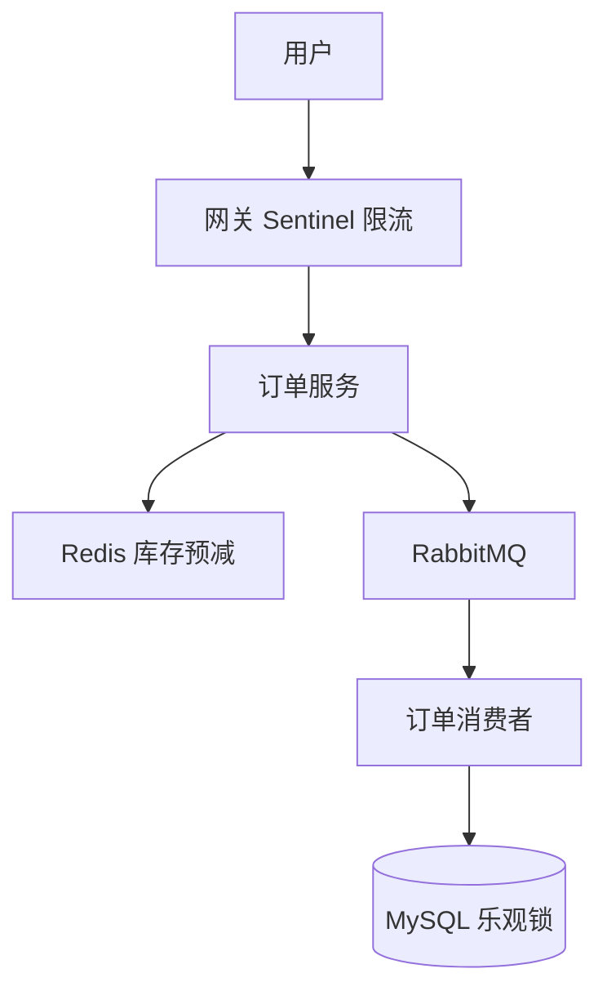

# 高并发与分布式系统基础

<!-- 修改说明: 2026-06-30 按 EXPANSION-STANDARD 扩充 §0、Sentinel 步骤表、逐行读、FAQ≥12、闭卷自测、费曼检验 -->

## 0. 读前导读（零基础也能跟上）

### 0.1 用一句话弄懂本章

**一句话**：高并发 = 同一时刻很多人同时访问系统；你要学的不是「造火箭」，而是**组合拳**——缓存扛读、MQ 削峰、限流保活、幂等防重复、分布式锁防并发乱扣。

**生活类比——餐厅高峰**：

| 概念 | 生活类比 | 本章位置 |
|------|----------|----------|
| **限流** | 门口保安：每分钟只进 100 人 | §4、§28 |
| **缓存** | 热门菜提前备好，不用现点现做 | §3.1、07 章 |
| **MQ 削峰** | 订单先写小票排队，厨房慢慢做 | §3.2、08 章 |
| **熔断** | 某供应商断货，暂时不接该菜订单 | §5、§30 |
| **幂等** | 同一桌重复点单只算一次 | §6、§12 |
| **分布式锁** | 多收银台共用一个「正在结账」牌 | §7 |
| **超卖** | 只剩 3 份却卖了 5 份 | §11、§22 |

**为什么重要**：11 章微服务拆开后，瓶颈从「一个 jar 慢」变成「数据库被打垮、库存超卖、下游拖死上游」——面试和项目设计都会问「双 11 怎么扛」。

### 0.2 你需要提前知道什么

| 术语 / 能力 | 零基础解释 | 真不会请先学 |
|-------------|------------|--------------|
| **QPS** | 每秒请求数，像每分钟进餐厅多少人 | 本章 §15 |
| **Redis** | 内存里的超快字典，存热点数据 | **07 Redis** |
| **RabbitMQ** | 留言板式异步消息 | **08 MQ** |
| **事务** | 要么全成功要么全回滚 | **05 MyBatis** |
| **微服务** | 大系统拆成多个小服务 | **11 Spring Cloud** |
| **乐观锁 version** | 改数据前看版本号，冲突就重试 | **06 MySQL** |

| 你现在的水平 | 建议动作 |
|--------------|----------|
| 刚学完 07～08 | ✅ 通读本章，把 Redis/MQ 放进「大图景」 |
| 还没学 Redis | ⏸ 先 **07**，再回来看 §11 超卖 |
| 准备面试 | ✅ 重点 §22 秒杀、§28 限流、§29 分布式事务 |

### 0.3 本章知识地图（学完后 ☐→☑）

- [ ] 能解释高并发瓶颈常在 DB、锁、下游服务，不是单点
- [ ] 能说出缓存、异步、限流、降级、熔断各解决什么问题
- [ ] 能讲清幂等、分布式锁、超卖三类经典题的思路
- [ ] 知道 CAP 中 P 必选，C 与 A 如何取舍
- [ ] 能画秒杀简要架构：网关限流 → Redis 预扣 → MQ → DB 乐观锁
- [ ] 能解释雪花 ID 为什么比 UUID 更适合入库
- [ ] 闭卷自测 ≥ 8/10

### 0.4 建议学习时长与节奏

| 阶段 | 内容 | 建议时长 |
|------|------|----------|
| 第 1 天 | §1～§12 概念建立 | 2 h |
| 第 2 天 | §22～§30 秒杀/限流/分布式事务 | 2.5 h |
| 第 3 天 | §32 分级练习 + Sentinel 挑战 | 2 h |
| 复盘 | 闭卷 §38 + 费曼 §39 | 30 min |

### 0.5 学完本章你能做什么

1. 用 3 分钟向面试官讲「双 11 下单」涉及哪些组件（网关、Redis、MQ、MySQL）。
2. 画出限流 / 熔断 / 降级对比表，说清触发时机。
3. 写出 `UPDATE stock SET num=num-1 WHERE id=? AND num>=1` 并解释为何防超卖。
4. 解释「先更新 DB 再删缓存」的 Cache Aside 顺序（配合 07 章）。

---

## 本章与上一章的关系

11 章你理解了微服务拆分和 Gateway/Feign——系统变复杂后，瓶颈从「一个 jar 太慢」变成「数据库被打垮、库存超卖、下游拖死上游」。这一章讲**高并发下的应对思路**：限流、熔断、幂等、分布式锁、CAP。

不需要你现在就搭秒杀系统，但要能**画架构、讲方案**——07 Redis、08 MQ 在这章会找到「为什么用在这里」的更大图景。

---

## 1. 什么是高并发

简单理解就是：

- 在同一时间有很多请求打到系统

高并发不是一个纯理论词，它会带来很多真实问题：

- 数据库扛不住
- 接口响应变慢
- 库存超卖
- 服务崩溃

## 2. 系统为什么会扛不住

一个后端系统的瓶颈可能出现在很多地方：

- CPU
- 内存
- 数据库
- Redis
- 网络
- 线程池
- 下游服务

所以高并发问题不能只盯着一个点看。

## 3. 常见优化思路

### 3.1 缓存

用 Redis 缓存热点数据，减轻数据库压力。

### 3.2 异步

用 MQ 把非核心流程异步化。

### 3.3 限流

保护系统不要被流量打垮。

### 3.4 降级

当系统扛不住时，先保住核心功能。

### 3.5 拆分

包括：

- 服务拆分
- 数据拆分

## 4. 限流基础认知

限流的目标是：

- 控制请求速率
- 保护服务稳定性

常见算法：

- 计数器
- 滑动窗口
- 令牌桶
- 漏桶

你现在不一定要全部会手写，但要知道基本思路。

## 5. 降级和熔断

### 降级

当系统压力太大时，临时关闭非核心功能或返回兜底数据。

### 熔断

当某个下游服务持续异常时，暂时不再继续调用它，防止整个系统被拖垮。

## 6. 幂等

高并发系统里，幂等特别重要。

典型场景：

- 支付回调重复
- 重复点击下单
- MQ 重复消费

## 7. 分布式锁

多实例部署后，同一份业务资源可能被多个节点同时处理。

这时需要分布式锁来控制并发。

Redis 是一种常见基础实现方式。

## 8. 分库分表基础认知

当单库单表数据量很大时，就可能考虑：

- 分库
- 分表

你现在先知道它是为了解决容量和性能问题。

初学阶段不需要马上投入太深。

## 9. 一致性问题

分布式系统里，很多问题的核心都和一致性有关，比如：

- 缓存和数据库一致性
- 多服务数据一致性
- 主从数据一致性

## 10. 最终一致性

很多系统并不是追求每一刻绝对一致，而是：

- 在合理时间内达到一致

这在缓存、MQ、异步补偿场景里非常常见。

## 11. 超卖问题

电商和秒杀场景经常会问。

为什么会超卖：

- 并发请求同时扣库存

常见解决方向：

- 数据库锁
- Redis 预扣库存
- Lua 脚本
- 队列削峰

## 12. 订单重复提交问题

常见原因：

- 用户重复点击
- 网络重试

解决方向：

- 前端防重
- 后端幂等
- token 防重
- 唯一索引

## 13. 系统设计时要学会问自己

当你看到一个高并发场景时，先问：

1. 热点在哪里
2. 写压力在哪里
3. 一致性要求多高
4. 哪些环节可以异步
5. 哪些环节必须同步

## 14. 这一章的学习目标

你现阶段不需要把所有高并发技术都学透，但至少要建立正确认知：

- 高并发问题从来不是单点问题
- 优化手段通常是组合拳
- 要结合业务目标和一致性要求做取舍

## 15. 常见性能指标

学习高并发时，你最好认识这些指标：

- QPS
- TPS
- RT
- 吞吐量

### QPS

每秒请求数。

### RT

响应时间。

如果一个接口 QPS 高但 RT 也高，系统体验通常不会好。

## 16. CAP 和 BASE 基础认知

分布式系统里常见这两个词。

你现在先有基础印象即可：

- CAP 讨论一致性、可用性、分区容错
- BASE 更偏向最终一致性的工程思想

当前阶段不必死抠理论证明，但要知道：

- 分布式系统设计常常是在做取舍

## 17. 读多写少和写多读少的优化思路不同

### 读多写少

常见优化：

- 缓存
- 读写分离

### 写多读少

常见更关注：

- 写入吞吐
- 幂等
- 队列削峰

## 18. 重试和补偿基础认知

分布式调用失败后，不一定只能“直接报错”。

常见策略：

- 立即重试
- 延迟重试
- 异步补偿

但要注意：

- 重试不是万能的
- 重试过多也可能放大问题

## 19. 高并发下库存扣减的常见方案

你可以逐渐建立这几个思路：

- 数据库扣减
- 乐观锁版本号
- Redis 预扣库存
- Lua 保证原子性
- 队列削峰

没有一种方案适合所有场景，要看：

- 并发量
- 一致性要求
- 系统复杂度接受程度

## 20. 服务雪崩基础认知

当某个下游服务异常，导致大量请求堆积、线程占满，进而影响更多服务，就可能出现雪崩式故障。

这也是为什么：

- 限流
- 熔断
- 降级

很重要。

## 21. 高并发这一章的高频知识点总清单

建议整理这些点：

- 高并发含义
- 常见瓶颈
- 缓存
- 异步
- 限流
- 降级
- 熔断
- 幂等
- 分布式锁
- 最终一致性
- 超卖
- 重试和补偿

---

## 22. 秒杀场景拆解（经典综合题）

### 问题

高并发抢购有限库存，易出现：超卖、DB 被打垮、重复下单。

### 分层方案

```text
前端：按钮防抖、活动开始时间校验
网关：限流（令牌桶）
服务：Redis 预减库存（DECR）+ 异步 MQ 创建订单
数据库：最终扣减，乐观锁 version
```

### 面试表达

「入口限流 → Redis 抗热点读写在内存完成资格校验 → 成功用户进 MQ 异步落单 → DB 乐观锁保证不超卖。」

---

## 23. 限流 / 熔断 / 降级 对比

| 手段 | 触发时机 | 目的 |
|------|----------|------|
| 限流 | 请求过多 | 保护自身 |
| 熔断 | 下游连续失败 | 快速失败，防雪崩 |
| 降级 | 系统压力大或功能非核心 | 关闭次要功能保核心 |

工具：Sentinel、Hystrix（老）、网关层限流。

---

## 24. 学完标准

- 能解释高并发瓶颈常在 IO、DB、锁
- 说出缓存、异步、限流、幂等、分布式锁的适用场景
- 能讲清超卖、缓存一致性、消息重复消费的思路
- 知道 CAP、最终一致性，不夸大「强一致 everywhere」

---

## 25. 分级练习

**基础**：用文字描述「双 11 下单」涉及哪些组件  
**进阶**：画一张含 Redis + MQ + MySQL 的下单架构图  
**挑战**：阅读 Sentinel 官方 demo，配置一个 QPS 限流规则

<!-- 修改说明: 新增分级练习参考答案 -->

### 参考答案

#### 基础：双 11 下单涉及组件

```text
用户 → CDN/静态页 → 网关限流 → 订单服务
  → Redis 预减库存 / 验证码
  → MySQL 订单表 + 乐观锁扣库存
  → RabbitMQ 异步创建订单明细、发通知
  → 消费者幂等落库
```

#### 进阶：架构图（Mermaid）



#### 挑战：Sentinel QPS 限流（关键步骤）

1. 引入 `spring-cloud-starter-alibaba-sentinel`
2. 配置 `spring.cloud.sentinel.transport.dashboard=localhost:8080`
3. 资源名 `@SentinelResource("createOrder")` 或网关 Route ID
4. 控制台 → 流控规则 → QPS 阈值 100 → 快速失败

---

<!-- 修改说明: 新增下一章预告 -->

## 下一章预告

12 章是架构层面的「扛流量」——算法则是面试里的「基础思维」。很多公司后端初面都有一两道 Easy～Medium 题。

下一章（13 算法与数据结构基础）给你刷题路线和 Java 模板，配合 14 章场景题一起冲刺。

---

## 26. 核心问题速答

**Q：初学要搞分布式吗？**  
先单体做透；12 篇建立词汇表即可。

**Q：分布式锁 Redis 够吗？**  
大多数场景够；强一致金融场景用 ZooKeeper/etcd 等（了解）。

**Q：CAP 到底怎么选？**  
P（分区容忍）必须选。剩下在 C（一致）和 A（可用）之间权衡。订单/支付系统通常优先 C；社交/内容推荐优先 A。

---

## 27. 分布式 ID 生成方案

| 方案 | 原理 | 优点 | 缺点 |
|------|------|------|------|
| UUID | `UUID.randomUUID()` | 简单、无中心 | 无序入库慢（B+树分裂）、字符串存占空间 |
| 自增 ID | 数据库 `AUTO_INCREMENT` | 有序、最简单 | 分库时有冲突 |
| 雪花算法（Snowflake） | 64bit: 时间戳 + 机器ID + 序列号 | **有序、高性能、分布式** | 依赖机器时钟（时钟回拨有问题） |
| 号段模式 | 一次从 DB 取一批号段，用完再取 | 减少 DB 压力 | 机器挂了可能丢一段 ID |
| Redis 自增 | `INCR id:order` | 简单 | 依赖 Redis 持久化 |

### 雪花算法结构（最常用）

```
64 bit (8 bytes)
┌───────┬───────────┬─────────┬──────────┐
│ 1 bit │  41 bit   │ 10 bit  │  12 bit  │
│未使用 │ 毫秒戳     │ 机器 ID │  序列号   │
└───────┴───────────┴─────────┴──────────┘

每毫秒可生成 4096 个 ID，理论 QPS 400 万
```

```java
// 需要雪花 ID？用 Hutool 工具类一行搞定
long id = IdUtil.getSnowflake(1, 1).nextId();
```

---

## 28. 限流算法

| 算法 | 原理 | 优点 | 缺点 |
|------|------|------|------|
| 固定窗口 | 1 秒 100 个请求 | 简单 | 窗口边界可能 2 倍突发 |
| 滑动窗口 | 把窗口分多个小格 | 比固定窗口平滑 | 实现复杂度适中 |
| 漏桶 | 固定速度流入 | 绝对平滑 | 无法应对突发 |
| 令牌桶 | 固定速度放令牌，有令牌才能请求 | **允许一定突发**，最常用 | — |

### 令牌桶实战（Guava RateLimiter）

```java
import com.google.common.util.concurrent.RateLimiter;

RateLimiter limiter = RateLimiter.create(100.0); // 每秒 100 个

@GetMapping("/api/product/{id}")
public Result<ProductVO> getProduct(@PathVariable Long id) {
    if (!limiter.tryAcquire(1, TimeUnit.SECONDS)) {
        return Result.fail("系统繁忙，请稍后重试");
    }
    return productService.getDetail(id);
}
```

---

## 29. 分布式事务方案深入

| 方案 | 一致性 | 性能 | 复杂度 | 适用 |
|------|--------|------|--------|------|
| 2PC | 强 | 差 | 低 | 几乎不用 |
| TCC | 最终/强 | 好 | **高** | 金融 |
| 本地消息表 | 最终 | 好 | 中 | 互联网主流 |
| MQ 事务消息 | 最终 | 好 | 中 | 互联网主流 |
| Seata AT | 最终 | 中 | 低 | 不想写补偿 |

### 本地消息表方案

```
                                        ┌───────┐
1. 写订单 + 写消息表（同一本地事务）→  │ MySQL │
                                        └──┬────┘
2. 定时任务轮询消息表 ─────────────────→  │
3. 发送 MQ ──────────────────────────────→  RabbitMQ
4. 消费者处理（扣库存、发通知）─────────→  │
5. 消费成功 → 更新消息表状态为"已处理"
6. 消费失败 → 定时任务重试
```

---

## 30. 降级熔断 Hystrix/Sentinel 对比

| 状态 | 含义 | 表现 |
|------|------|------|
| 关闭（Closed） | 正常 | 每次调用都走原方法 |
| 打开（Open） | 熔断中 | 直接走 fallback，不尝试调原方法 |
| 半开（Half-Open） | 试探恢复 | 放少量请求走原方法，成功则关闭熔断 |

```
熔断器状态机：
Closed ──错误率 > 阈值──→ Open
                         │
                       等待 N 秒
                         │
                        ↓
                    Half-Open
                      /     \
               成功 <阈值    失败 >阈值
                   ↓           ↓
                Closed       Open（继续等）
```

---

## 31. 学完标准（扩充版）

- [ ] 能解释 CAP 的 P 为什么必须选，C 和 A 怎么取舍
- [ ] 知道雪花算法的 64 位结构和为什么比 UUID 更适合入库
- [ ] 能用令牌桶/漏桶解释限流，知道 Sentinel QPS 限流
- [ ] 理解熔断器 Closed → Open → Half-Open 状态转换
- [ ] 能说出分布式事务三大方案（2PC/TCC/最终一致性+MQ）
- [ ] 知道分布式锁 Redisson Watch Dog 机制和 SETNX 的不足
- [ ] 能画秒杀系统的简要架构图（网关限流 → Redis 预扣 → MQ 削峰 → DB 落单）

---

---

## 32.1 手把手：Sentinel QPS 限流（完整步骤）

| 步骤 | 你的动作 | 预期看到什么 | 若不对 |
|------|----------|--------------|--------|
| 1 | demo 项目 `pom.xml` 加 `spring-cloud-starter-alibaba-sentinel` | Maven 下载成功 | 检查 Spring Cloud Alibaba BOM 版本 |
| 2 | `application.yml` 配 `spring.cloud.sentinel.transport.dashboard=localhost:8080` | 启动无报错 | 端口被占用则改 dashboard 端口 |
| 3 | 下载 Sentinel Dashboard jar，`java -jar sentinel-dashboard.jar` | 浏览器 `localhost:8080` 登录页 | 默认账号 sentinel/sentinel |
| 4 | 启动 demo，访问一次带 `@SentinelResource("createOrder")` 的接口 | Dashboard 出现应用名 | 未出现则检查 transport 配置 |
| 5 | 控制台 → 流控规则 → 资源 `createOrder` → QPS 阈值 5 | 规则列表有一条 | 资源名须与注解一致 |
| 6 | 用 JMeter 或循环脚本 10 次/秒调接口 | 部分返回「系统繁忙」 | 阈值太低则调高对比 |

---

## 33. 逐行读：Guava RateLimiter 示例

```java
RateLimiter limiter = RateLimiter.create(100.0); // 每秒 100 个

@GetMapping("/api/product/{id}")
public Result<ProductVO> getProduct(@PathVariable Long id) {
    if (!limiter.tryAcquire(1, TimeUnit.SECONDS)) {
        return Result.fail("系统繁忙，请稍后重试");
    }
    return productService.getDetail(id);
}
```

| 行号/代码 | 含义 | 改错会怎样 |
|-----------|------|------------|
| `RateLimiter.create(100.0)` | 令牌桶每秒放 100 个令牌 | 数值过小正常流量也被拒 |
| `tryAcquire(1, TimeUnit.SECONDS)` | 尝试拿 1 个令牌，最多等 1 秒 | 用 `acquire()` 会阻塞线程 |
| `!tryAcquire` 返回 fail | 拿不到令牌 → 快速失败 | 不限制则 DB 仍可能被压垮 |
| 通过后调 `productService` | 限流只挡入口，业务逻辑不变 | 限流放错层可能漏掉内部 RPC |

**术语（令牌桶 Token Bucket）**：固定速率往桶里放令牌，有令牌才允许请求；允许一定突发流量。  
**生活类比**：地铁闸机——每分钟放固定数量通行票，有票才进；比「固定窗口计数」更平滑。  
**为什么重要**：Sentinel、网关限流底层常用类似思想；面试爱对比漏桶。  
**本章用到的地方**：§4、§28、§33。

---

## 34. 逐行读：雪花 ID（Hutool 一行版）

```java
long id = IdUtil.getSnowflake(1, 1).nextId();
```

| 参数/位段 | 含义 | 改错会怎样 |
|-----------|------|------------|
| 第一个 `1` | workerId（机器编号，0～1023） | 多机同 ID 会冲突 |
| 第二个 `1` | datacenterId（机房编号） | 与 workerId 组合保证全局唯一 |
| 41 bit 时间戳 | 毫秒级，保证趋势递增 | 时钟回拨可能导致重复 ID |
| 12 bit 序列号 | 同毫秒内自增，4096/毫秒 | 超高并发同毫秒可能等下一毫秒 |
| 64 bit 有序 long | MySQL 主键 B+ 树顺序插入 | UUID 随机导致页分裂、插入慢 |

---

## 35. 常见报错与误解

| 报错/误解 | 可能原因 | 正确理解 / 解决方案 |
|-----------|----------|---------------------|
| 「加 Redis 就能扛一切并发」 | 忽视 DB 最终一致性 | Redis 预扣 + DB 乐观锁兜底 |
| 「分布式锁用 SETNX 就够了」 | 未设过期、未防误删 | `SET key val NX EX` + Lua 或 Redisson |
| 「CAP 必须全选」 | 理论误解 | P 分区容忍必选；C 与 A 权衡 |
| 「2PC 企业常用」 | 教材 vs 实践 | 互联网多用最终一致 + MQ/本地消息表 |
| 「限流和熔断是一回事」 | 概念混淆 | 限流护自身；熔断因下游失败 |
| 「重试越多越好」 | 放大风暴 | 指数退避 + 上限 + 熔断 |
| Sentinel 规则不生效 | 资源名不一致 | 注解名与控制台资源名对齐 |
| 「秒杀只靠数据库锁」 | 高并发 RT 爆炸 | 入口限流 + Redis 预扣 |

---

## 35.1 高并发故障速查表

| 现象 | 可能原因 | 应对层次 |
|------|----------|----------|
| 用户重复支付 | 幂等未做 | 应用层 + DB 唯一索引 |
| 缓存与 DB 不一致 | 更新顺序错 | Cache Aside：先更 DB 再删缓存 |
| 消息重复消费 | MQ 至少一次投递 | 消费端业务幂等（08 章） |
| 分库后 ID 冲突 | 自增 ID 局限 | 雪花 / 号段 / Redis INCR |

---

## 36. FAQ

**Q1：初学要搞分布式吗？**  
先单体做透；本章建立词汇表和方案思路即可，不必立刻搭秒杀集群。

**Q2：分布式锁 Redis 够吗？**  
大多数互联网场景够；强一致金融场景可了解 ZooKeeper/etcd（Redisson Watch Dog 续期）。

**Q3：CAP 到底怎么选？**  
P 必须选。分区发生时在 C（一致）与 A（可用）间权衡：订单/支付偏 C；内容推荐/社交 feed 偏 A。

**Q4：限流四种算法怎么记？**  
固定窗口最简单但有边界突发；滑动窗口更平滑；漏桶绝对匀速；**令牌桶允许突发**——生产最常用。

**Q5：超卖为什么 Redis 预扣还要 MySQL 乐观锁？**  
Redis 可能丢数据（重启/主从切换）；DB 是最终真相源，乐观锁 `WHERE stock>=?` 兜底不超卖。

**Q6：降级和熔断谁先触发？**  
不一定有先后：限流在入口；熔断看下游错误率；降级可在业务层主动关非核心功能（如推荐位）。

**Q7：分布式事务 2PC 为什么少用？**  
强一致但性能差、协调者单点；互联网多用**本地消息表 / MQ 事务消息**实现最终一致（§29）。

**Q8：雪花 ID 时钟回拨怎么办？**  
生产用成熟实现（Hutool、美团 Leaf）会检测回拨并等待或抛错；小项目 workerId 配唯一即可。

**Q9：和 14 章场景题关系？**  
12 章讲「方案与原理」；14 章讲「面试怎么在 3 分钟内讲清楚」——两章配合背诵。

**Q10：没做过高并发项目怎么答？**  
诚实说量级 + 强调**设计思路**（限流/缓存/MQ/幂等组合拳），可结合 demo 或课程项目。

**Q11：Redisson 和 SETNX 区别？**  
SETNX 需自己设过期和续期；Redisson 看门狗自动续期，防业务未完成锁就过期。

**Q12：分库分表什么时候考虑？**  
单表千万级、写入成为瓶颈时再考虑；初学知道概念即可，别过早优化。

---

## 37. 闭卷自测

1. **概念** 高并发下常见瓶颈有哪些？（至少 4 个）
2. **概念** 限流、熔断、降级各在什么时机触发？
3. **概念** 什么是幂等？支付回调重复为什么必须幂等？
4. **概念** CAP 中 P 为什么必选？C 和 A 各举一业务例子。
5. **概念** 令牌桶和漏桶的核心区别？
6. **概念** 最终一致性和强一致性各适合什么场景？
7. **动手** 写一条防超卖的 SQL（扣库存且库存不足时不更新）。
8. **动手** Guava `RateLimiter.create(50)` 表示什么？
9. **综合** 描述秒杀三层防护（前端/网关+Redis/MQ+DB）。
10. **综合** 分布式锁 + 数据库唯一索引如何配合防重复下单？

### 37.1 自测参考答案

1. CPU、内存、数据库、Redis、网络、线程池、下游 RPC 等。
2. 限流：请求过多；熔断：下游连续失败；降级：压力大或非核心功能。
3. 多次执行结果相同；支付网关可能重复通知，不幂等会重复入账。
4. 分布式系统网络分区不可避免；订单/支付偏 C；社交 timeline 偏 A。
5. 令牌桶允许一定突发；漏桶固定流出速率、更平滑但不容突发。
6. 强一致：转账；最终一致：缓存同步、MQ 异步、搜索索引更新。
7. `UPDATE stock SET num = num - ? WHERE id = ? AND num >= ?`
8. 每秒最多发放 50 个令牌，即约 50 QPS 限流。
9. 前端防抖+验证码 → 网关 Sentinel 限流 + Redis DECR 预扣 + MQ 异步落单 + MySQL 乐观锁。
10. Redis SETNX 快速挡重复请求；唯一订单号索引兜底，重复插入失败。

---

## 38. 费曼检验

请在不看资料的情况下，用 3 分钟向朋友解释本章核心。

**对照提纲**：

1. **餐厅比喻**：高并发像饭点挤爆——保安限流（限流）、热门菜预制（缓存）、小票排队（MQ）、某供应商断货暂不接单（熔断）、重复点单只算一次（幂等）。
2. **超卖比喻**：只剩 3 份却卖 5 份——入口 Redis 先扣资格，厨房 MySQL 用「还有货才扣」的 SQL 兜底。
3. **CAP 比喻**：分店之间网线断了（分区）——要么各店账目暂时对不上（选 A），要么停业直到对账（选 C），不能既要又要。

---

## 39. 本章核心速记卡

| 概念 | 一句话 | 类比 |
|------|--------|------|
| QPS | 每秒请求数 | 每分钟进店人数 |
| 限流 | 控制入口速率 | 门口保安 |
| 熔断 | 下游挂了快速失败 | 供应商断货暂停接单 |
| 降级 | 关非核心保核心 | 只卖招牌菜 |
| 幂等 | 多次执行=一次 | 重复点单只算一单 |
| 分布式锁 | 跨机器互斥 | 多收银台共用「结账中」牌 |
| 雪花 ID | 有序 64 位分布式 ID | 带时间戳的流水号 |
| 最终一致 | 短暂不一致，稍后对齐 | 各分店晚点对账 |

**排查口诀**：慢→看 RT 与 DB；超卖→Redis 预扣 + SQL 条件更新；重复→幂等键 + 唯一索引；雪崩→限流 + 熔断 + 降级。

---

*配合 14 篇场景题、11 篇微服务串联理解*

*本章已按 EXPANSION-STANDARD 扩充（§0+Sentinel 步骤表+逐行读+FAQ+自测+费曼）。*

**EXPANSION-STANDARD 自检**：☑ §0 ☑ 步骤表 §32.1 ☑ 逐行读 §33/§34 ☑ FAQ≥12 §36 ☑ 闭卷 10 题 §37 ☑ 费曼 §38
