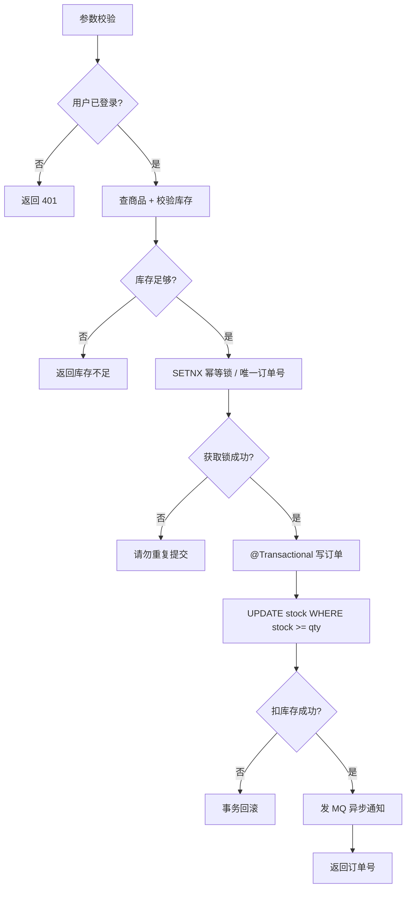

# 高频场景设计与面试专题

<!-- 修改说明: 新增本章与上一章的关系 -->

## 本章与上一章的关系

01～13 章把技术和算法都过了一遍——面试现场不会按章节编号提问，而是：**「设计一个登录系统」「下单怎么防超卖」「缓存和 DB 不一致怎么办」**。

这一章是**面试表达手册**：每类场景给思考框架 + 3 分钟回答模板。10 章讲项目落地，14 章讲怎么在 15 分钟内讲清楚设计取舍。

---

## 1. 这一章的定位

这一章不是单纯列问题，而是把后端面试中高频的场景题按“思考框架”整理出来。

因为真正难的不是记住答案，而是看到题目时知道从哪些角度思考。

## 2. 设计一个登录系统，你会考虑什么

至少要想到：

- 用户名密码校验
- 密码加密存储
- 登录成功后签发 token
- token 校验
- 权限控制
- 防暴力破解

如果再深入一点，还可以想到：

- 登录态续期
- 多端登录
- 退出登录

## 3. 设计一个商品详情接口，你会考虑什么

至少要想到：

- 商品信息存 MySQL
- 热点商品加 Redis 缓存
- 缓存过期时间
- 缓存和数据库一致性
- 商品不存在怎么处理

## 4. 设计一个下单接口，你会考虑什么

<!-- 修改说明: 新增下单流程 Mermaid 图 -->

### 下单完整流程图



至少要想到：

- 参数校验
- 用户是否登录
- 商品是否存在
- 库存是否足够
- 订单写库
- 库存扣减
- 事务控制
- 防重复下单

如果继续深入，还可以想到：

- 高并发下超卖
- MQ 异步通知
- 支付状态流转

## 5. 如何防止重复下单

你可以从几个层次回答：

### 前端层

- 按钮防重复点击

### 接口层

- token 防重
- 请求幂等号

### 数据层

- 唯一索引
- 状态校验

## 6. 如果数据库扛不住怎么办

可以从这些方向思考：

- 索引优化
- SQL 优化
- Redis 缓存
- 读写分离
- 分库分表

初级面试里，一般说到缓存和索引优化就已经很好了。

## 7. 如果 Redis 挂了怎么办

基础回答方向：

- 降级回源数据库
- 做好限流
- 有高可用方案时可以主从/哨兵

要注意：

- 不能只说“挂了就挂了”

## 8. 如果消息重复消费怎么办

回答方向：

- 业务幂等
- 唯一业务号
- 消费状态判断

## 9. 如何排查线上慢接口

可以从这个顺序回答：

1. 看日志
2. 看接口耗时
3. 看 SQL 是否慢
4. 看是否走索引
5. 看 Redis 是否命中
6. 看下游服务是否异常

## 10. 项目里最值得准备的 10 个说明点

你最好提前准备好这些内容的讲法：

1. 为什么这样设计数据库表
2. 为什么某个接口要加缓存
3. 为什么用事务
4. 为什么用 MQ
5. 如何做登录鉴权
6. 如何防重复提交
7. 如何处理异常
8. 如何记录日志
9. 如何部署
10. 项目里最大的难点是什么

## 11. 面试表达的关键

后端面试里很多人不是不会，而是说不清。

建议你回答问题时尽量带上这四个层次：

1. 定义
2. 原因
3. 方案
4. 项目实践

## 12. 这一章的使用方式

建议你学完前面技术文档后，再反过来看这一章。

这样你会发现：

- 这些场景题其实就是把 Java、Spring、MySQL、Redis、MQ 串起来

这也是大厂面试最喜欢考的方式。

## 13. 设计一个验证码系统，你会考虑什么

至少要想到：

- 验证码生成
- 短时间有效
- 存 Redis
- 发送频率限制
- 校验成功后是否删除

如果再进一步：

- 防止恶意刷短信
- 图形验证码或滑块验证

## 14. 设计一个排行榜，你会考虑什么

这是 Redis 高频场景。

常见思路：

- 用 ZSet
- 分数做排序依据
- 提供 Top N 查询
- 提供个人排名查询

## 15. 设计一个延迟关闭订单功能，你会考虑什么

常见思路包括：

- 定时任务扫描
- 延迟队列
- RabbitMQ 延迟方案

你回答这类题时，要体现：

- 不同方案的实现成本不同

## 16. 缓存一致性题怎么答更完整

你可以按这个结构回答：

1. 为什么会有一致性问题
2. 常见更新方案
3. 并发下的风险
4. 实际业务里的取舍

这样回答会比只背一句“更新数据库再删缓存”成熟得多。

## 17. 如何回答“项目里遇到的最大问题”

建议不要回答得太空。

更好的结构是：

1. 场景是什么
2. 问题为什么出现
3. 你怎么定位
4. 你怎么解决
5. 还有什么不足

## 18. 场景题这一章的高频知识点总清单

建议整理这些题型：

- 登录系统
- 商品详情缓存
- 下单流程
- 防重复下单
- 超卖问题
- MQ 重复消费
- 慢接口排查
- 验证码系统
- 排行榜
- 延迟关闭订单

---

## 19. 场景题万能答题框架（STAR + 技术分层）

回答任何场景题建议结构：

```text
1. 需求澄清（谁用、量级、一致性要求）
2. 整体架构（客户端 → 网关 → 服务 → DB/缓存/MQ）
3. 核心流程（分步骤）
4. 关键问题与方案（缓存、事务、幂等、安全）
5. 权衡与不足（没有银弹）
```

---

## 20. 登录系统 — 完整参考答案

### 流程

1. 用户提交用户名 + 密码（HTTPS）
2. 后端查库，比对 **BCrypt** 加密后的密码（禁止明文存库）
3. 成功则生成 **JWT**（含 userId、过期时间），返回前端
4. 前端存 token，后续请求头 `Authorization: Bearer xxx`
5. 拦截器校验 token，解析用户身份

### 安全要点

| 问题 | 方案 |
|------|------|
| 暴力破解 | 限流、验证码、账号锁定 |
| 密码泄露 | 加盐哈希，不可逆 |
| token 被盗 | 短过期 + refresh token；敏感操作二次验证 |
| 退出登录 | 黑名单存 Redis（可选） |

### 面试一句话

「登录用 BCrypt 存密码，JWT 无状态鉴权，网关或拦截器统一校验，配合 Redis 做 token 黑名单和限流。」

---

## 21. 商品详情缓存 — 完整参考答案

### 读流程

1. 先查 Redis `product:{id}`
2. 命中则直接返回
3. 未命中查 MySQL，写入 Redis（设 TTL，如 30 分钟），返回

### 更新策略（Cache Aside）

1. **先更新数据库**
2. **再删除缓存**（不是更新缓存，避免并发写乱）

### 三大问题

| 现象 | 原因 | 对策 |
|------|------|------|
| 穿透 | 查不存在的数据，缓存也没有 | 布隆过滤器 / 缓存空对象短 TTL |
| 击穿 | 热点 key 过期瞬间大量打到 DB | 互斥锁 / 逻辑过期 |
| 雪崩 | 大量 key 同时过期 | TTL 加随机值、集群高可用 |

---

## 22. 下单接口 — 完整参考答案

### 核心步骤

1. 鉴权：用户已登录
2. 校验：商品存在、上架、库存 ≥ 购买数量
3. 计算金额（**BigDecimal**）
4. 创建订单（待支付）
5. 扣减库存（同一事务内，或乐观锁 `version`）
6. 返回订单号；异步发 MQ 通知仓储/短信

### 事务边界

「创建订单 + 扣库存」必须在同一事务；调用支付、发消息可异步。

### 超卖方案（简述）

- 数据库：`UPDATE stock SET num = num - ? WHERE id = ? AND num >= ?`
- 乐观锁：version 字段 CAS
- Redis 预减 + 异步落库（高并发场景）

---

## 23. 幂等设计 — 完整参考答案

**幂等**：同一请求执行多次，结果与执行一次相同。

| 层级 | 手段 |
|------|------|
| 前端 | 提交后禁用按钮 |
| 接口 | 客户端传 `Idempotency-Key`（UUID），Redis `SETNX` 24h |
| 数据库 | 唯一索引（如 `order_no`） |
| 业务 | 先查状态，已处理则直接返回成功 |

---

## 24. 慢接口排查 — 完整话术

1. **复现**：Postman/日志确认哪条接口、参数
2. **监控**：看 P99 耗时、错误率
3. **链路**：网关 → 服务 → SQL → Redis → 下游 RPC
4. **SQL**：开启慢查询日志，`EXPLAIN` 看是否全表扫描、缺索引
5. **缓存**：命中率是否骤降
6. **代码**：是否有 N+1 查询、大循环远程调用
7. **修复**：加索引、加缓存、批量查询、异步化

---

## 25. 延迟关闭订单 — 方案对比

| 方案 | 优点 | 缺点 |
|------|------|------|
| 定时任务扫表 | 简单 | 延迟不精确、DB 压力 |
| Redis 过期 key + 监听 | 较实时 | 监听可靠性要设计 |
| RabbitMQ 延迟队列 / 死信 | 解耦、可扩展 | 运维复杂度 |
| 时间轮（高级） | 高性能 | 实现复杂 |

初级面试答：**创建订单时发一条延迟 30 分钟的 MQ，消费时检查状态仍为待支付则关闭**。

---

## 26. Java / MySQL / Redis 口述题速记

### Java

- `HashMap` 结构、扩容、线程不安全
- `ConcurrentHashMap` 与 `synchronized` 区别
- 线程池七大参数、拒绝策略
- JVM 内存分区、GC 基本概念

### MySQL

- 索引 B+ 树、最左前缀、覆盖索引
- 事务 ACID、隔离级别、脏读幻读
- 慢 SQL 优化思路

### Redis

- 五种基本类型及场景
- 持久化 RDB/AOF
- 缓存一致性、分布式锁 `SET NX EX`

---

## 27. 分级准备

**基础**：每类场景能讲 3 分钟  
**进阶**：结合自己项目说「我订单模块用了事务 + 唯一订单号幂等」  
**冲刺**：模拟面试录音，检查是否卡顿

---

## 28. 学完标准

- 10+ 场景题能按框架作答，不背死答案
- 能画登录、下单、缓存读写的简易流程图
- 慢接口、超卖、幂等、MQ 重复消费能答出 2 层以上方案
- 准备好「项目最大难点」的 STAR 故事 1 个

---

## 29. FAQ

**Q：没做过高并发项目怎么答？**  
诚实说量级，强调 **设计思路** 和 **学习过的方案**，可结合课程/demo 项目。

**Q：场景题要画图吗？**  
白板或纸上画 **框图** 很加分：用户 → API → DB/Redis/MQ。

**Q：和 10 篇区别？**  
10 篇偏项目落地；本篇偏 **面试表达与场景拆解**。

---

<!-- 修改说明: 新增场景题 3 分钟回答模板 + 下一章预告 -->

## 29.1 高频场景 3 分钟回答模板

**登录**：BCrypt 存密码 → 校验 → JWT 签发 → 拦截器验 token → Redis 可选存黑名单（退出登录）。

**商品详情缓存**：Cache Aside 读；写 DB 后删缓存；TTL + 随机偏移防雪崩；穿透用布隆/空值。

**防超卖**：事务内 `UPDATE ... WHERE stock >= ?`；高并发加 Redis 预减 + MQ 异步落单；乐观锁 version。

---

## 30. 完整场景设计参考答案

### 30.1 如何设计用户登录注册模块

```
注册流程：
1. 用户提交 username + password
2. 参数校验（@Valid：长度、格式）
3. 查 username 是否已存在
4. BCrypt 加密密码（不存明文）→ insert user 表
5. 返回"注册成功"

登录流程：
1. 用户提交 username + password
2. 查 user 表 → BCrypt 比对
3. 生成 JWT（payload 含 userId，expire 7 天）
4. 返回 token
5. 后续请求：Header 带 Authorization: Bearer <token>
6. 拦截器：解析 JWT → 存 ThreadLocal → 放行
7. 退出：token 加入 Redis 黑名单（TTL = token 剩余有效期）
```

### 30.2 如何设计秒杀系统

```
三层防护：
┌────────────────────────────────────────────┐
│ 第一层：前端                                │
│  - 按钮置灰 + 倒计时                         │
│  - 点击后防重复提交                          │
│  - 验证码（拉长用户时间，过滤脚本）            │
├────────────────────────────────────────────┤
│ 第二层：网关 + 业务层                         │
│  - Sentinel QPS 限流（如 500/s）              │
│  - Redis 预扣库存（DECR，到 0 直接拒绝）      │
│  - 每个用户只能抢一次（Redis Set 去重）        │
├────────────────────────────────────────────┤
│ 第三层：MQ + DB                              │
│  - 预扣成功 → 发 MQ → 消费者异步落单          │
│  - MySQL 乐观锁兜底：UPDATE ... WHERE stock>0 │
│  - 订单号唯一索引防重复                       │
└────────────────────────────────────────────┘
```

### 30.3 如何保证接口幂等

```
核心：同一个操作执行多次，结果和执行一次相同。

方案（按推荐度排序）：
1. 数据库唯一索引：最可靠。例如订单号建唯一索引，重复插入直接报错。
2. Redis SETNX：下单前 SETNX order:lock:{orderNo}，拿到锁才执行。
3. token 机制：下单前先获取 token，提交时带 token，校验后删除。
4. 乐观锁 version：UPDATE ... SET stock=stock-1, version=version+1 WHERE version=?

组合（推荐）：Redis SETNX（快速挡） + 数据库唯一索引（兜底）
```

### 30.4 如何实现订单超时自动取消

```
方案一：RabbitMQ 延迟消息（推荐）
- 下单时发消息到延迟队列（TTL 30 分钟）
- 30 分钟后消息进入死信队列
- 消费者收到死信消息 → 查订单状态
  - 已支付 → 忽略
  - 未支付 → 取消订单 + 释放库存

方案二：定时任务轮询
- @Scheduled 每 1 分钟扫 create_time > 30 分钟且未支付的订单
- 缺点：轮询间隔内用户看到过期订单仍显示"待支付"
- 适用于订单量不大的场景

方案三：Redis 过期回调
- SET order:timeout:{orderNo} 1 EX 1800
- 监听 Redis 过期 key → 处理取消逻辑
- 注意：Redis 过期回调可能丢（非精确）
```

---

## 31. 场景题回答框架（STAR-F）

面试中回答场景题，用这个框架：

```
S (Scenario)：什么场景？（"电商下单场景，高峰期 1000 QPS"）
T (Task)：要做什么？（"保证不超卖、数据一致"）
A (Action)：怎么做的？（"三层防护：Sentinel 限流 + Redis 预扣 + MySQL 乐观锁兜底"）
R (Result)：效果怎样？（"压测 5000 QPS 无超卖，RT < 50ms"）
F (Fallback)：兜底方案？（"如果 Redis 挂了，降级为纯 MySQL 限流直下"）
```

---

## 32. 项目最大难点 STAR 故事模板

```
「我做的项目中学到最多的是[XX模块]。

当时遇到的问题：用户[操作]时，[现象]（如"下单时同一订单号被重复提交，
导致库存多扣"）。

我的分析和方案：
1. 首先定位原因：[排查过程]
2. 调研了[N]种方案：[简单对比]
3. 最终选了：[Redis SETNX + 唯一索引双保险]
4. 效果：重复提交率降为 0

反思：如果[量级更大]，还可以[引入分布式事务/MQ削峰...]
```

---

## 33. 学完标准（扩充版）

- [ ] 10+ 场景题能按 STAR-F 框架完整作答
- [ ] 能画出登录、下单、秒杀三个流程的简易架构图
- [ ] 慢接口排查、超卖、幂等、MQ 重复消费各有 2 层以上方案
- [ ] 对"一致性 vs 可用性"有自己的判断（能举例）
- [ ] 准备 1 个「项目最大难点」STAR 故事，面试能讲 3 分钟
- [ ] 录音自测：每个场景 3 分钟内答完，不卡顿、不背稿

---

## 下一章预告

14 章是「怎么答」——15 章是「有没有漏」。学完全部文档后，用 15 篇总表逐项自评：⬜知道 / 🔶会用 / ✅会讲。

---

*复习时配合 15 篇总表勾选知识点*
