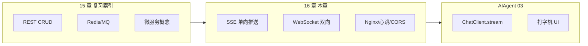
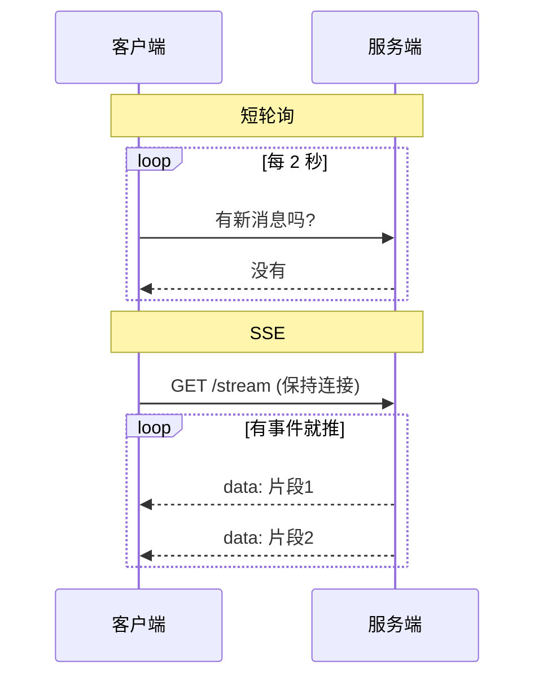
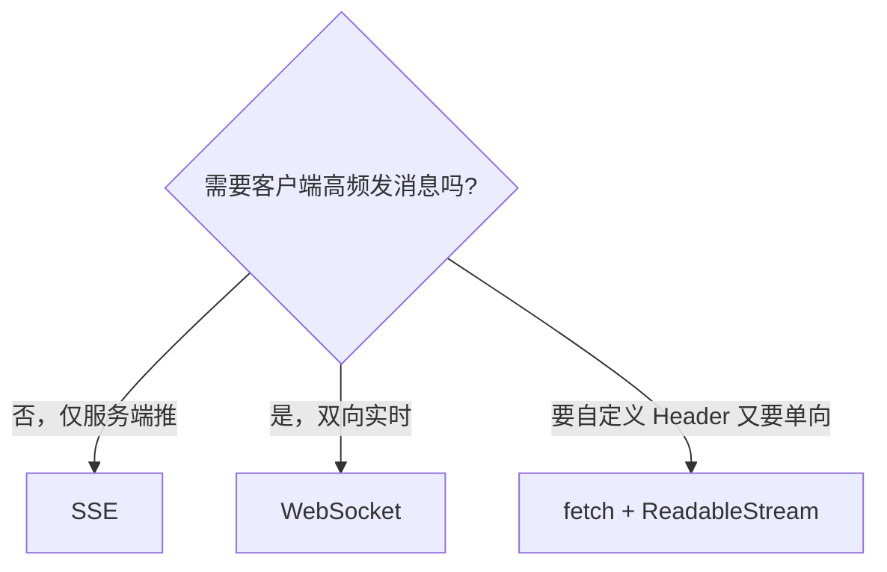
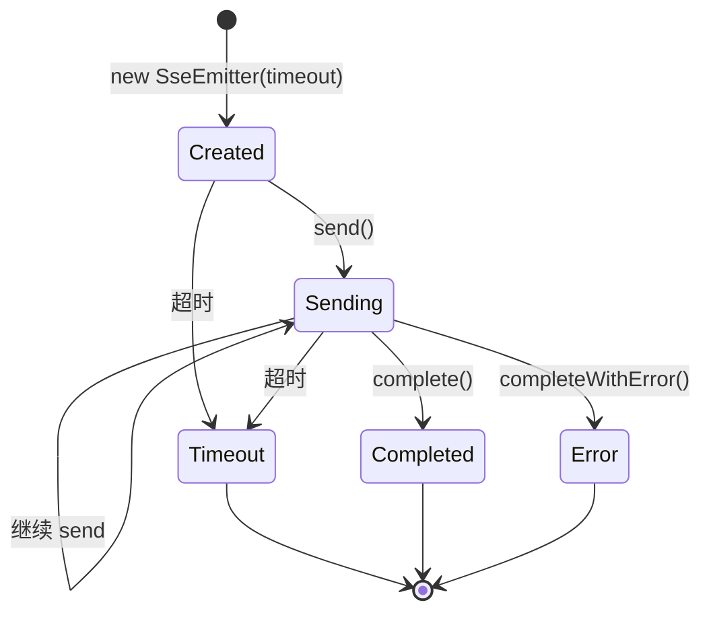
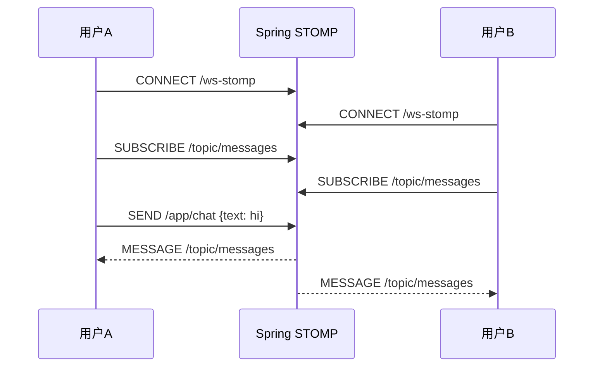
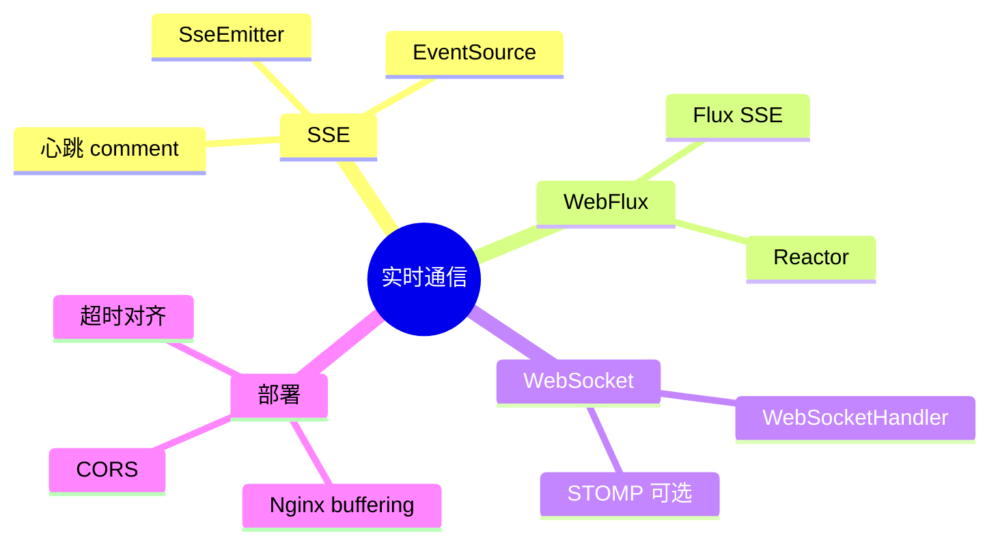

# SSE 与 WebSocket 实时通信

<!-- 修改说明: 2026-06-30 按 EXPANSION-STANDARD 扩充 §0、FAQ、闭卷自测、费曼检验 -->

> **文件编码**：UTF-8。本章系统讲解 **SSE（Server-Sent Events）** 与 **WebSocket** 在 Spring Boot 中的实战，覆盖协议原理、SseEmitter、WebFlux Flux、WebSocket/STOMP、心跳、Nginx 反代、CORS 与完整测试。
>
> **技术栈版本**：Spring Boot 3.2+、JDK 17+、Nginx 1.24+。
>
> **关联章节**：
> - [AIAgent 03 流式对话与 SSE 实战](../AIAgent/03-流式对话-SSE与会话管理.md)（LLM 打字机场景，本章是其 **通用后端底座**）
> - [Java 04 Spring Boot 核心开发](./04-SpringBoot核心开发.md)（Controller、CORS、分层）
> - [Java 09 Linux Docker Nginx 部署基础](./09-LinuxDockerNginx部署基础.md)（Nginx 反代）
> - [Java 10 后端项目实战与面试准备](./10-后端项目实战与面试准备.md)（项目联调）

---

## 本章与上一章的关系

上一章（15 补充知识点总表）是 **01～14 的复习索引**——帮你查漏补缺、面试前速览。但有两块能力在总表里只点到为止，却越来越成为现代后端的 **标配技能**：

1. **服务端主动推送**（AI 流式输出、行情、通知）
2. **双向实时通信**（在线协作、IM、游戏）

普通 REST 接口是 **请求-响应一次结束**。用户发 `GET /api/users/1`，服务端返回 JSON，连接关闭。可当 AI 一个字一个字往外吐、或股票每秒跳动时，你需要 **长连接 + 持续推送**——这就是本章要补上的能力。



| 15 章你已具备 | 16 章新增 |
|---------------|-----------|
| Spring Boot REST 接口 | `SseEmitter` / `Flux` 长连接推送 |
| CORS 基础配置 | SSE/WebSocket 专用 CORS 与代理注意点 |
| Nginx 反代静态与 API | `proxy_buffering off`、超时、WebSocket Upgrade |
| 10 章项目联调 | `curl -N`、`wscat`、浏览器 `EventSource` 测试 |

学完本章，你再读 [AIAgent 03](../AIAgent/03-流式对话-SSE与会话管理.md) 时，不会只盯着 `ChatClient.stream()`，而是能讲清 **底层 HTTP 协议、线程模型、网关超时**——面试和排障都靠这个。

---

## 0. 读前导读（零基础也能跟上）

> **读者假设**：你已会 Spring Boot REST（04 章）、复习过 15 章索引；知道 HTTP 是一次请求一次响应。

### 0.1 用一句话弄懂本章

**一句话**：当 AI 逐字输出、股价每秒跳动时，普通 HTTP 不够用了——**SSE** 是服务端沿一条 HTTP 长连接**单向推送**；**WebSocket** 升级协议后**双向实时**聊天。

**生活类比——推送 vs 对讲机**：

| 方案 | 类比 | 技术 |
|------|------|------|
| **短轮询** | 每 2 秒打电话问「有新消息吗」 | `setInterval` + HTTP |
| **SSE** | **广播电台**：只播不听，听众用收音机收 | `text/event-stream` |
| **WebSocket** | **对讲机**：你说我也说，实时双向 | `ws://` 升级连接 |
| **SseEmitter** | 电台导播间 | Spring MVC 异步推流 |
| **Nginx buffering** | 转播站攒一批再放 | 导致 AI 一字一顿变「一段一段」 |

**为什么重要**：AI 流式对话、实时通知、在线协作都依赖本章；上线后排障 60 秒断连、字批量出，全是 Nginx/超时问题。

**本章用到的地方**：§4 SseEmitter、§7 心跳、§8 Nginx、§11 测试。

---

### 0.2 你需要提前知道什么（真不会就先跳到哪一章）

| 你现在的水平 | 建议动作 |
|--------------|----------|
| 不会 Spring Boot 接口 | 先学 [04 Spring Boot](./04-SpringBoot核心开发.md) |
| 不懂 HTTP 长连接 | 先读 §1.1～§1.2，对照短轮询 vs SSE 图 |
| 要做 AI 打字机 | 本章 + [AIAgent 03](../AIAgent/03-流式对话-SSE与会话管理.md) |
| 已写 SSE 但上线卡顿 | 直接看 §7 心跳 + §8 Nginx |

**最低门槛**：会写 `@GetMapping`；会用 `curl`；知道 JSON 和 HTTP 状态码 200。

---

### 0.3 本章知识地图（学完后应能勾选全部 ☐→☑）

- [ ] 说出 SSE 与 WebSocket 选型：单向 vs 双向
- [ ] 写出 SSE 消息格式：`data:`、`event:`、`id:`、空行结束
- [ ] 用 `SseEmitter` 异步推送，不在 Tomcat 工作线程里 `sleep`
- [ ] 配置 `spring.mvc.async.request-timeout` 与 emitter 超时一致
- [ ] 写 SSE 心跳 `comment("ping")` 保活
- [ ] 配置 Nginx `proxy_buffering off` 和 `proxy_read_timeout`
- [ ] 用 `curl -N` 本地验证流式输出
- [ ] 用 `wscat` 测 WebSocket 回声
- [ ] 配置 CORS 让前端 `EventSource` 跨域
- [ ] 闭卷自测 10 题正确 ≥ 8 题

---

### 0.4 建议学习时长与节奏

| 阶段 | 建议时间 | 做什么 |
|------|----------|--------|
| §0 + §1～§3 协议 | 2 小时 | 轮询 vs SSE vs WS |
| §4～§6 代码实战 | 4 小时 | SseEmitter + WebSocket |
| §7～§9 部署 | 2 小时 | 心跳、Nginx、CORS |
| §10～§11 手把手+测试 | 2 小时 | realtime-demo + curl |
| 自测 + 对接 AIAgent 03 | 1 小时 | 串起 ChatClient 流 |

---

### 0.5 学完本章你能做什么（可验证的具体动作）

1. **curl -N** 看到逐字 SSE 输出，而非一次性倒出。
2. **浏览器** 打开 `sse-test.html`，点按钮看到打字机效果。
3. **wscat** 连 `/ws/echo`，发消息收到 `echo: ...`。
4. **解释** 为什么 `SseEmitter` 必须放异步线程。
5. **列出** SSE 四层超时要对齐：Emitter、MVC async、Nginx read、LB idle。

---

### 0.6 手把手总览：realtime-demo 验收步骤

| 步骤 | 你的动作 | 预期看到什么 | 若不对 |
|------|----------|--------------|--------|
| 1 | Spring Initializr 建项目，加 Web + WebSocket | 启动 `Started ...Application` | JDK 17+ |
| 2 | 复制 §4.2 `SseDemoController` | 编译通过 | 包名与目录一致 |
| 3 | `curl.exe -N "http://localhost:8080/api/sse/demo?msg=Hi"` | 逐条 `event:`/`data:` | 无 `-N` 会缓冲 |
| 4 | 浏览器打开 `sse-test.html` | 逐字显示 | 看 Network Content-Type |
| 5 | 注册 `EchoWebSocketHandler` | wscat 能连 | 查 `/ws/echo` 路径 |
| 6 | 加 15s 心跳 comment | 长连接不断 | 对齐 §7.4 超时表 |
| 7 | Nginx 反代并 `proxy_buffering off` | 经网关仍流畅 | 见 §14 报错表 |

---

## 1. 为什么需要实时通信？

### 1.1 普通 HTTP 的局限

```text
客户端 ──GET /api/chat──► 服务端
         （等待 5～20 秒）
客户端 ◄──整段 JSON──────── 服务端
         连接关闭
```

问题：

- **首字节延迟（TTFB）** 长：用户盯着空白页
- **无法服务端主动推**：只能轮询 `setInterval` 反复请求
- **轮询浪费**：没新数据也在打 HTTP，QPS 虚高

### 1.2 三种常见「 quasi-实时」方案

| 方案 | 原理 | 优点 | 缺点 |
|------|------|------|------|
| **短轮询** | 每 N 秒发一次 HTTP | 实现简单 | 延迟高、浪费带宽 |
| **长轮询** | 服务端 hold 住请求，有数据再返回 | 比短轮询省 | 仍反复建连 |
| **SSE / WebSocket** | 一条长连接持续传数据 | 真正实时 | 要处理断线、代理、超时 |



### 1.3 业务场景选型

| 场景 | 推荐 | 理由 |
|------|------|------|
| AI 对话打字机 | **SSE** | 单向、基于 HTTP、浏览器 `EventSource` 简单 |
| 股票/日志 tail | **SSE** | 服务端推为主 |
| 在线文档协作 | **WebSocket** | 双向、低延迟 |
| 游戏、IM | **WebSocket** | 高频双向 |
| 下单结果通知 | **SSE 或 MQ+轮询** | 单向通知够用 |
| 大文件上传 + 进度 | **HTTP 分块 或 WS** | SSE 不适合传二进制 |

---

## 2. SSE 协议深入

### 2.1 响应头

```http
HTTP/1.1 200 OK
Content-Type: text/event-stream
Cache-Control: no-cache
Connection: keep-alive
X-Accel-Buffering: no
```

要点：

- `text/event-stream`：告诉客户端这是 SSE
- `no-cache`：禁止中间缓存把流截断
- `keep-alive`：保持 TCP 连接
- `X-Accel-Buffering: no`：告诉 Nginx **不要缓冲**（后面 Nginx 节详讲）

### 2.2 消息格式

每条 **事件** 由若干行字段 + **空行** 结束：

```text
id: 42
event: message
data: 你好

data: 世界
data: 第二行会拼接

event: done
data: [DONE]

```

| 字段 | 含义 |
|------|------|
| `data:` | 正文（可多行，客户端拼接） |
| `event:` | 事件名，默认 `message` |
| `id:` | 事件 ID，断线重连时带 `Last-Event-ID` |
| `retry:` | 建议重连间隔（毫秒） |
| `: comment` | 以 `:` 开头为注释，常用于 **心跳** |

### 2.3 浏览器 EventSource

```javascript
const es = new EventSource('/api/sse/demo?topic=news');

es.onopen = () => console.log('connected');
es.onmessage = (e) => console.log('default event:', e.data);
es.addEventListener('tick', (e) => console.log('tick:', e.data));
es.addEventListener('done', () => es.close());
es.onerror = (e) => console.warn('error or closed', e);
```

**限制**（面试常考）：

- 仅 **GET**
- 原生 **不能** 自定义 Header（如 `Authorization: Bearer`）
- 同源策略；跨域要服务端 CORS
- 自动重连（带 `Last-Event-ID`）

带 Token 的常见方案：

1. Query：`/api/sse?token=短期JWT`（注意日志泄露）
2. Cookie Session（同域）
3. `fetch` + `ReadableStream` 手动解析 SSE 行
4. 改用 WebSocket（握手时可带 Header）

### 2.4 SSE 与 Chunked Transfer

HTTP/1.1 下 SSE 通常走 **分块传输（chunked）**：响应体没有固定 `Content-Length`，而是一块块推。

Spring 的 `SseEmitter` 和 `produces = TEXT_EVENT_STREAM_VALUE` 本质上都是在 Tomcat 上写 **符合 SSE 格式的 chunked 文本流**。

---

## 3. WebSocket 协议入门

### 3.1 握手升级

```http
GET /ws/chat HTTP/1.1
Host: localhost:8080
Upgrade: websocket
Connection: Upgrade
Sec-WebSocket-Key: dGhlIHNhbXBsZSBub25jZQ==
Sec-WebSocket-Version: 13
```

服务端响应 `101 Switching Protocols` 后，同一 TCP 连接切换为 **WebSocket 帧协议**，可 **双向** 发文本或二进制。

### 3.2 与 SSE 对比总表

| 维度 | SSE | WebSocket |
|------|-----|-----------|
| 通信方向 | 服务端 → 客户端（单向） | 双向 |
| 底层 | 普通 HTTP | 独立帧协议（握手用 HTTP） |
| 浏览器 API | `EventSource` | `WebSocket` |
| 自动重连 | 内置 | 需自己实现 |
| 自定义 Header | 原生 EventSource 不行 | 握手时可以 |
| 二进制 | 不适合 | 支持 |
| 穿透代理 | 友好（就是 HTTP） | 需配置 Upgrade |
| Spring 支持 | `SseEmitter` / `Flux` | `@ServerEndpoint` / `WebSocketHandler` |
| 典型场景 | AI 流、通知、监控 | IM、协作、游戏 |



### 3.3 STOMP 是什么（可选）

原生 WebSocket 只有 **帧**，没有「订阅哪个主题」的约定。**STOMP** 是运行在 WebSocket 之上的 **消息协议**（类似 MQ 的语义）：

- `SUBSCRIBE /topic/news` 订阅
- `SEND /app/chat` 发消息到服务端
- Spring 提供 `spring-boot-starter-websocket` + **消息代理**（内存或 RabbitMQ）

适合：**广播通知、聊天室、多 tab 同步**。简单点对点聊天用原生 `WebSocketHandler` 即可，不必强行上 STOMP。

---

## 4. Spring MVC + SseEmitter（主推路线）

### 4.1 为什么用 SseEmitter？

- 与 `spring-boot-starter-web`（Tomcat）**无缝共存**
- 不需要把整个项目改成 WebFlux
- [AIAgent 03](../AIAgent/03-流式对话-SSE与会话管理.md) 的 `ChatStreamController` 走的就是这条路

### 4.2 最小可运行示例

**pom.xml**（在 04 章 demo 基础上，只需 `spring-boot-starter-web`）：

```xml
<dependency>
    <groupId>org.springframework.boot</groupId>
    <artifactId>spring-boot-starter-web</artifactId>
</dependency>
```

**SseDemoController.java**：

```java
package com.example.realtime.controller;

import org.springframework.http.MediaType;
import org.springframework.web.bind.annotation.*;
import org.springframework.web.servlet.mvc.method.annotation.SseEmitter;

import java.io.IOException;
import java.util.concurrent.Executors;

@RestController
@RequestMapping("/api/sse")
public class SseDemoController {

  private static final long SSE_TIMEOUT_MS = 120_000L;

  @GetMapping(value = "/demo", produces = MediaType.TEXT_EVENT_STREAM_VALUE)
  public SseEmitter demo(@RequestParam(defaultValue = "hello") String msg) {
    SseEmitter emitter = new SseEmitter(SSE_TIMEOUT_MS);

    emitter.onTimeout(emitter::complete);
    emitter.onError(ex -> emitter.complete());

    Executors.newVirtualThreadPerTaskExecutor().execute(() -> {
      try {
        for (int i = 0; i < msg.length(); i++) {
          String ch = String.valueOf(msg.charAt(i));
          emitter.send(SseEmitter.event()
              .name("message")
              .data(ch));
          Thread.sleep(200);
        }
        emitter.send(SseEmitter.event().name("done").data("[DONE]"));
        emitter.complete();
      } catch (IOException | InterruptedException e) {
        emitter.completeWithError(e);
        Thread.currentThread().interrupt();
      }
    });

    return emitter;
  }
}
```

### 4.3 为什么必须异步？

`SseEmitter.send()` 若在 **Tomcat 工作线程** 里 `sleep` 或阻塞订阅外部流，会 **占满线程池**（默认 200），并发稍高就全站卡顿。

正确模式：

```text
Controller 方法：创建 SseEmitter → 立刻 return
异步线程：订阅 Flux / 循环 send → complete
```

JDK 21 用 `Executors.newVirtualThreadPerTaskExecutor()`；JDK 17 用 `newCachedThreadPool()` 或 `@Async`。

### 4.4 封装 Service 层（推荐）

```java
@Service
public class SsePushService {

  public SseEmitter streamTicks(int count, long intervalMs) {
    SseEmitter emitter = new SseEmitter(60_000L);
    emitter.onTimeout(emitter::complete);

    Executors.newVirtualThreadPerTaskExecutor().execute(() -> {
      try {
        for (int i = 1; i <= count; i++) {
          emitter.send(SseEmitter.event()
              .id(String.valueOf(i))
              .name("tick")
              .data("tick-" + i));
          Thread.sleep(intervalMs);
        }
        emitter.send(SseEmitter.event().name("done").data("ok"));
        emitter.complete();
      } catch (Exception e) {
        emitter.completeWithError(e);
      }
    });
    return emitter;
  }
}
```

### 4.5 对接外部 Flux（如 Spring AI）

```java
public SseEmitter streamFromFlux(Flux<String> flux) {
  SseEmitter emitter = new SseEmitter(180_000L);
  emitter.onTimeout(emitter::complete);

  Executors.newVirtualThreadPerTaskExecutor().execute(() ->
      flux.subscribe(
          chunk -> {
            try {
              emitter.send(SseEmitter.event().data(chunk));
            } catch (IOException e) {
              emitter.completeWithError(e);
            }
          },
          emitter::completeWithError,
          () -> {
            try {
              emitter.send(SseEmitter.event().name("done").data("[DONE]"));
            } catch (IOException ignored) {}
            emitter.complete();
          }
      )
  );
  return emitter;
}
```

这与 [AIAgent 03 §5](../AIAgent/03-流式对话-SSE与会话管理.md) 完全一致，本章补齐 **通用原理与排障**。

### 4.6 SseEmitter 生命周期



| 回调 | 触发时机 |
|------|----------|
| `onTimeout` | 超过 `SseEmitter(timeout)` 或无活动超时 |
| `onError` | 客户端断开、IO 异常 |
| `onCompletion` | `complete()` 之后 |

---

## 5. WebFlux + Flux\<ServerSentEvent\>（可选路线）

### 5.1 何时考虑 WebFlux？

- 项目已是 **全栈响应式**（R2DBC、WebClient）
- 网关层需要极高并发 IO
- 团队熟悉 Reactor

大多数学习项目和 `agent-demo` **不必** 为此引入 WebFlux。若只有一两个 SSE 接口，**SseEmitter 足够**。

### 5.2 依赖注意

```xml
<!-- 二选一为主，不要无脑两个都加 -->
<dependency>
    <groupId>org.springframework.boot</groupId>
    <artifactId>spring-boot-starter-webflux</artifactId>
</dependency>
```

Spring Boot 3 同时引入 `web` + `webflux` 时，默认仍以 **MVC 为主**；`Flux` 返回类型在 MVC 下也可工作（需 `spring-boot-starter-webflux` 在 classpath），但要小心 **两套栈混用** 的坑。

### 5.3 Flux SSE Controller 示例

```java
@RestController
@RequestMapping("/api/sse")
public class SseFluxController {

  @GetMapping(value = "/flux-demo", produces = MediaType.TEXT_EVENT_STREAM_VALUE)
  public Flux<ServerSentEvent<String>> fluxDemo() {
    return Flux.interval(Duration.ofSeconds(1))
        .take(5)
        .map(i -> ServerSentEvent.<String>builder()
            .id(String.valueOf(i))
            .event("tick")
            .data("tick-" + i)
            .build())
        .concatWith(Flux.just(
            ServerSentEvent.<String>builder()
                .event("done")
                .data("[DONE]")
                .build()
        ));
  }
}
```

### 5.4 MVC SseEmitter vs WebFlux Flux

| 对比项 | SseEmitter | Flux SSE |
|--------|------------|----------|
| 线程模型 | Tomcat 线程 + 异步线程 | 事件循环（Reactor） |
| 学习曲线 | 低 | 需懂 Reactor |
| 与 MyBatis 共存 | 自然 | 阻塞调用需 `subscribeOn` |
| 适合 | 业务项目、AI 流 | 响应式全栈 |

---

## 6. WebSocket 实战（Spring Boot）

### 6.1 依赖

```xml
<dependency>
    <groupId>org.springframework.boot</groupId>
    <artifactId>spring-boot-starter-websocket</artifactId>
</dependency>
```

### 6.2 原生 WebSocketHandler

**WebSocketConfig.java**：

```java
@Configuration
@EnableWebSocket
public class WebSocketConfig implements WebSocketConfigurer {

  @Override
  public void registerWebSocketHandlers(WebSocketHandlerRegistry registry) {
    registry.addHandler(new EchoWebSocketHandler(), "/ws/echo")
        .setAllowedOriginPatterns("*");  // 生产改具体域名
  }
}
```

**EchoWebSocketHandler.java**：

```java
public class EchoWebSocketHandler extends TextWebSocketHandler {

  @Override
  public void afterConnectionEstablished(WebSocketSession session) {
    send(session, "connected: " + session.getId());
  }

  @Override
  protected void handleTextMessage(WebSocketSession session, TextMessage message) {
    send(session, "echo: " + message.getPayload());
  }

  private void send(WebSocketSession session, String text) {
    try {
      session.sendMessage(new TextMessage(text));
    } catch (IOException e) {
      // 连接可能已关闭
    }
  }
}
```

### 6.3 STOMP 聊天室（可选）

**配置**：

```java
@Configuration
@EnableWebSocketMessageBroker
public class StompConfig implements WebSocketMessageBrokerConfigurer {

  @Override
  public void configureMessageBroker(MessageBrokerRegistry registry) {
    registry.enableSimpleBroker("/topic", "/queue");
    registry.setApplicationDestinationPrefixes("/app");
  }

  @Override
  public void registerStompEndpoints(StompEndpointRegistry registry) {
    registry.addEndpoint("/ws-stomp")
        .setAllowedOriginPatterns("*")
        .withSockJS();  // 不支持 WS 时降级
  }
}
```

**广播 Controller**：

```java
@Controller
public class ChatStompController {

  @MessageMapping("/chat")
  @SendTo("/topic/messages")
  public ChatMessage send(ChatMessage msg) {
    return msg;
  }
}
```

前端用 `sockjs-client` + `stompjs` 连接 `/ws-stomp`，订阅 `/topic/messages`。



---

## 7. 心跳（Heartbeat）

### 7.1 为什么需要心跳？

长连接中间经过 **Nginx、SLB、运营商 NAT**，空闲一段时间后会被 **静默断开**。客户端以为还连着，实则已死 —— 需要心跳保活与快速发现断线。

### 7.2 SSE 心跳写法

SSE 规范允许 **注释行** 作为心跳：

```java
// 每 15 秒发一次注释行（客户端 EventSource 会忽略）
emitter.send(SseEmitter.event().comment("ping"));
```

或：

```java
emitter.send(": ping\n\n");  // 注意 API 层面用 comment 更安全
```

**定时心跳示例**：

```java
ScheduledExecutorService scheduler = Executors.newSingleThreadScheduledExecutor();
ScheduledFuture<?> heartbeat = scheduler.scheduleAtFixedRate(() -> {
  try {
    emitter.send(SseEmitter.event().comment("heartbeat"));
  } catch (Exception e) {
    heartbeat.cancel(true);
    emitter.complete();
  }
}, 0, 15, TimeUnit.SECONDS);

emitter.onCompletion(() -> heartbeat.cancel(true));
```

### 7.3 WebSocket 心跳

常见做法：

- 应用层：客户端每 30s 发 `{"type":"ping"}`，服务端回 `pong`
- STOMP：内置 heart-beat 协商（`heart-beat: 10000,10000`）

```java
@Override
protected void handleTextMessage(WebSocketSession session, TextMessage message) {
  if ("ping".equals(message.getPayload())) {
    session.sendMessage(new TextMessage("pong"));
    return;
  }
  // 业务消息...
}
```

### 7.4 超时对齐清单

| 层级 | 配置项 | 建议值（LLM 流） |
|------|--------|------------------|
| SseEmitter | 构造参数 timeout | 120000～180000 ms |
| Spring MVC | `spring.mvc.async.request-timeout` | ≥ SSE timeout |
| Nginx | `proxy_read_timeout` | 300s |
| Nginx | `proxy_send_timeout` | 300s |
| 负载均衡 | idle timeout | ≥ 300s |

**四处超时取最小值生效** —— 任何一层太短都会截断流。

---

## 8. Nginx 反向代理 SSE / WebSocket

### 8.1 SSE 必关缓冲

Nginx 默认 **proxy_buffering on**，会把上游响应攒够再发给客户端，导致 SSE **一批一批跳字** 而非逐字显示。

```nginx
location /api/sse/ {
    proxy_pass http://127.0.0.1:8080;
    proxy_http_version 1.1;
    proxy_set_header Connection '';
    proxy_buffering off;
    proxy_cache off;
    chunked_transfer_encoding on;
    proxy_read_timeout 300s;
    proxy_send_timeout 300s;

    # 若后端未设，也可在 Nginx 加（通常后端 Controller 已 produces SSE）
    add_header X-Accel-Buffering no;
}
```

### 8.2 WebSocket 升级头

```nginx
location /ws/ {
    proxy_pass http://127.0.0.1:8080;
    proxy_http_version 1.1;
    proxy_set_header Upgrade $http_upgrade;
    proxy_set_header Connection "upgrade";
    proxy_set_header Host $host;
    proxy_read_timeout 3600s;
}
```

STOMP + SockJS 时路径可能更复杂（`/ws-stomp/**`），按实际 endpoint 配置。

### 8.3 现象对照

| 现象 | 可能原因 |
|------|----------|
| 字一大块一大块出 | Nginx buffering 未关 |
| 约 60s 必断 | `proxy_read_timeout` 默认 60 |
| 本地正常、上线就断 | 网关超时 < 生成长度 |
| WS 403 | `allowedOrigins` / Nginx 未配 Upgrade |

详见 [Java 09](./09-LinuxDockerNginx部署基础.md)。

---

## 9. CORS 与实时接口

### 9.1 SSE 跨域

`EventSource` 跨域时浏览器会发 **CORS 预检**（部分场景）并检查响应头。

```java
@Configuration
public class CorsConfig implements WebMvcConfigurer {

  @Override
  public void addCorsMappings(CorsRegistry registry) {
    registry.addMapping("/api/**")
        .allowedOriginPatterns("http://localhost:5173")
        .allowedMethods("GET", "POST", "OPTIONS")
        .allowedHeaders("*")
        .allowCredentials(true)
        .maxAge(3600);
  }
}
```

### 9.2 WebSocket 跨域

在 `registerWebSocketHandlers` 里：

```java
registry.addHandler(handler, "/ws/echo")
    .setAllowedOrigins("http://localhost:5173");
```

STOMP endpoint：

```java
registry.addEndpoint("/ws-stomp")
    .setAllowedOriginPatterns("http://localhost:5173")
    .withSockJS();
```

### 9.3 开发联调建议

| 环境 | 做法 |
|------|------|
| 本地 Vite + Boot | 前端 `proxy` 代理 `/api`（与 [Java 10 §38](./10-后端项目实战与面试准备.md) 一致） |
| 前后端分离部署 | 后端精确 CORS 域名 |
| 要带 JWT 的 SSE | `fetch` 流式读或 Query token |

---

## 10. 手把手：从零搭建 realtime-demo 项目

### 10.1 创建项目

1. IDEA → Spring Initializr → Artifact：`realtime-demo`
2. 依赖：**Spring Web**、**WebSocket**（可选 STOMP）
3. JDK 17+

### 10.2 目录结构

```text
realtime-demo/
├── pom.xml
└── src/main/java/com/example/realtime/
    ├── RealtimeDemoApplication.java
    ├── config/
    │   ├── CorsConfig.java
    │   ├── WebSocketConfig.java
    │   └── StompConfig.java          ← 可选
    ├── controller/
    │   ├── SseDemoController.java
    │   └── SseFluxController.java    ← 可选
    ├── handler/
    │   └── EchoWebSocketHandler.java
    ├── stomp/
    │   └── ChatStompController.java    ← 可选
    └── service/
        └── SsePushService.java
└── src/main/resources/
    ├── application.yml
    └── static/
        ├── sse-test.html
        └── ws-test.html
```

### 10.3 application.yml

```yaml
server:
  port: 8080

spring:
  mvc:
    async:
      request-timeout: 180000  # 与 SseEmitter 超时对齐

logging:
  level:
    com.example.realtime: debug
```

### 10.4 静态测试页 sse-test.html

```html
<!DOCTYPE html>
<html lang="zh-CN">
<head>
  <meta charset="UTF-8">
  <title>SSE 测试</title>
</head>
<body>
  <button id="start">开始 SSE</button>
  <pre id="out"></pre>
  <script>
    document.getElementById('start').onclick = () => {
      const out = document.getElementById('out');
      out.textContent = '';
      const es = new EventSource('/api/sse/demo?msg=你好SSE');
      es.onmessage = e => out.textContent += e.data;
      es.addEventListener('message', e => out.textContent += e.data);
      es.addEventListener('done', () => { out.textContent += '\n[完成]'; es.close(); });
      es.onerror = () => console.log('error');
    };
  </script>
</body>
</html>
```

浏览器打开 `http://localhost:8080/sse-test.html` 点按钮即可。

### 10.5 完整 pom.xml 参考

```xml
<?xml version="1.0" encoding="UTF-8"?>
<project xmlns="http://maven.apache.org/POM/4.0.0"
         xmlns:xsi="http://www.w3.org/2001/XMLSchema-instance"
         xsi:schemaLocation="http://maven.apache.org/POM/4.0.0 https://maven.apache.org/xsd/maven-4.0.0.xsd">
    <modelVersion>4.0.0</modelVersion>
    <parent>
        <groupId>org.springframework.boot</groupId>
        <artifactId>spring-boot-starter-parent</artifactId>
        <version>3.2.5</version>
    </parent>
    <groupId>com.example</groupId>
    <artifactId>realtime-demo</artifactId>
    <version>0.0.1-SNAPSHOT</version>
    <properties>
        <java.version>17</java.version>
    </properties>
    <dependencies>
        <dependency>
            <groupId>org.springframework.boot</groupId>
            <artifactId>spring-boot-starter-web</artifactId>
        </dependency>
        <dependency>
            <groupId>org.springframework.boot</groupId>
            <artifactId>spring-boot-starter-websocket</artifactId>
        </dependency>
        <dependency>
            <groupId>org.springframework.boot</groupId>
            <artifactId>spring-boot-starter-test</artifactId>
            <scope>test</scope>
        </dependency>
    </dependencies>
</project>
```

---

## 11. 测试：curl、wscat、浏览器

### 11.1 curl 测 SSE

**关键：`-N`（禁用缓冲）**，否则 curl 会攒够再输出。

```bash
curl -N "http://localhost:8080/api/sse/demo?msg=Hello"
```

预期输出类似：

```text
event:message
data:H

event:message
data:e
...
event:done
data:[DONE]
```

带 Header 调试：

```bash
curl -N -H "Accept: text/event-stream" "http://localhost:8080/api/sse/demo?msg=测试"
```

### 11.2 wscat 测 WebSocket

安装（需 Node.js）：

```bash
npm install -g wscat
```

连接：

```bash
wscat -c ws://localhost:8080/ws/echo
```

输入任意文字，应收到 `echo: ...`。

### 11.3 PowerShell 注意

Windows PowerShell 里 `curl` 可能是 `Invoke-WebRequest` 别名。请用：

```powershell
curl.exe -N "http://localhost:8080/api/sse/demo?msg=Hi"
```

### 11.4 Postman / Apifox

- SSE：部分版本支持「流式响应」；不如 `curl -N` 直观
- WebSocket：Apifox / Postman 均支持新建 WS 请求

### 11.5 集成测试思路（简述）

可对 `MockMvc` 使用 `asyncDispatch` 测 SSE 首包；WebSocket 用 `Spring WebSocketTestClient`。细节见 [Java 17 单元测试](./17-单元测试与Mockito深入.md)。

---

## 12. 生产级注意点

### 12.1 连接数与线程

每个 SSE 连接占用一个 **异步线程**（或虚拟线程）。1 万长连接要评估：

- Tomcat `maxConnections`
- 虚拟线程 vs 平台线程内存
- 是否需要专用推送层（Redis Pub/Sub + SSE）

### 12.2 客户端断开

订阅 `flux` 或写循环时，捕获 `IOException` 并 `complete()`，避免 **僵尸任务** 继续跑 LLM 计费。

```java
emitter.onError(e -> log.warn("client gone", e));
// Reactor: .takeUntilOther(cancelSignal)
```

### 12.3 安全

- SSE GET 带 token 会进 **访问日志**，用短期 token
- WebSocket 也要鉴权（握手拦截器或 STOMP `ChannelInterceptor`）
- 限流：每用户最大连接数

### 12.4 与 [AIAgent 03](../AIAgent/03-流式对话-SSE与会话管理.md) 衔接

| 03 章内容 | 16 章补齐 |
|-----------|-----------|
| `ChatClient.stream()` | SSE 协议、Nginx、心跳 |
| `ChatStreamController` | SseEmitter 生命周期、异步线程 |
| 前端打字机 | CORS、EventSource 限制 |
| `curl -N` 测流 | 完整排障表、超时对齐 |

---

## 13. 面试高频问题

### Q1：SSE 和 WebSocket 怎么选？

**答**：单向推送、基于 HTTP、要自动重连用 SSE；双向高频用 WebSocket。AI 打字机 SSE 足够。

### Q2：SseEmitter 为什么要异步？

**答**：发送过程长，阻塞 Tomcat 工作线程会耗尽线程池，别的 HTTP 请求进不来。

### Q3：Nginx 后 SSE 不流畅？

**答**：`proxy_buffering off`，加大 `proxy_read_timeout`，响应头 `X-Accel-Buffering: no`。

### Q4：EventSource 怎么带 JWT？

**答**：原生不行；用 Cookie、Query 短期 token，或 fetch 读流。

### Q5：WebSocket 和 HTTP 长连接一样吗？

**答**：握手后协议升级为 WebSocket 帧，不再是普通 HTTP 请求/响应语义。

---

## 14. 常见报错与排查

| 报错信息（关键词） | 可能原因 | 解决方案 |
|-------------------|---------|---------|
| `AsyncRequestTimeoutException` | SSE 超过 `async.request-timeout` 或 SseEmitter 超时 | 增大 `spring.mvc.async.request-timeout` 与 `new SseEmitter(ms)`，与 Nginx 对齐 |
| `java.io.IOException: Broken pipe` | 客户端已关闭连接仍 `send` | `onError` 里 `complete()`；捕获 IOException 停止推送 |
| `ResponseBodyEmitter has already completed` | 重复 `complete()` 或超时后又 `send` | 用 `AtomicBoolean` 标记结束，只 complete 一次 |
| curl 长时间无输出后一次性倒出 | 未加 `-N` 或 Nginx buffering | `curl -N`；Nginx `proxy_buffering off` |
| `EventSource` 立刻 `onerror` | 路径错、CORS、返回非 `text/event-stream` | 检查 URL、`produces`、浏览器 Network 面板 Content-Type |
| `403 Forbidden`（WebSocket） | 跨域未允许 | `setAllowedOrigins` / `allowedOriginPatterns` |
| `404` on `/ws/echo` | Handler 未注册或路径不一致 | 检查 `WebSocketConfig` 的 `addHandler` 路径 |
| `101` 未返回，WS 握手失败 | Nginx 未配 `Upgrade` | 加上 `proxy_set_header Upgrade` 与 `Connection upgrade` |
| 约 60 秒必断 | 默认 `proxy_read_timeout 60s` | 改为 300s 或更高 |
| `Tomcat thread pool exhausted` | 在请求线程阻塞推 SSE | 改为异步线程 + SseEmitter |
| STOMP `Whoops! Lost connection` | SockJS 代理路径错误 | Nginx 转发完整 `/ws-stomp` 前缀 |
| 中文乱码 | 编码不一致 | 统一 UTF-8；`produces` 可设 `charset=UTF-8` |

---

## 15. 分级练习

**基础**：实现 `/api/sse/demo`，用 curl -N 看到逐字输出  
**进阶**：加 15s 心跳 + Nginx 反代，经 `localhost/sse/` 仍流畅  
**挑战**：WebSocket 聊天室 + 在线人数广播（STOMP 或原生二选一）

### 参考答案

#### 基础

本章 §4.2 `SseDemoController` 即为标准答案。验收：

```bash
curl.exe -N "http://localhost:8080/api/sse/demo?msg=OK"
```

#### 进阶

1. `SsePushService` 内心跳 `emitter.send(SseEmitter.event().comment("hb"))`
2. Nginx：

```nginx
location /sse/ {
    proxy_pass http://127.0.0.1:8080/api/sse/;
    proxy_buffering off;
    proxy_read_timeout 300s;
}
```

3. 验收：`curl.exe -N "http://localhost/sse/demo?msg=nginx"`

#### 挑战（STOMP 思路）

1. `StompConfig` 开启 `/topic/online`
2. 用户连接时 `@EventListener SessionConnectEvent` 广播人数
3. 前端两个浏览器 tab 互发 `/app/chat`

原生 WebSocket 做法：用 `ConcurrentHashMap` 存 `sessionId → session`，`handleTextMessage` 里遍历广播。

---

## 15.1 常见困惑 FAQ

### Q1：SSE 和 WebSocket 怎么选？

**A**：仅服务端推、要自动重连、走 HTTP 友好 → SSE；双向高频（IM、游戏）→ WebSocket。AI 打字机 SSE 足够。

### Q2：SseEmitter 为什么要异步？

**A**：推送持续数十秒，占 Tomcat 工作线程会导致线程池耗尽；应 `return emitter` 后由异步线程 `send`。

### Q3：EventSource 怎么带 JWT？

**A**：原生不能自定义 Header；用 Cookie、Query 短期 token，或 `fetch` + `ReadableStream` 手解析 SSE。

### Q4：Nginx 后 SSE 一字一顿变一段？

**A**：`proxy_buffering off`，`X-Accel-Buffering: no`，加大 `proxy_read_timeout`。

### Q5：约 60 秒必断？

**A**：某层超时默认 60s；Emitter、MVC async、Nginx、LB 取**最小值**，统一调到 300s+。

### Q6：SSE 消息格式空行干什么？

**A**：分隔事件；`data:` 可多行拼接；`event:` 指定事件名供 `addEventListener`。

### Q7：WebFlux 和 SseEmitter 选哪个？

**A**：业务项目 MVC + MyBatis 为主用 **SseEmitter**；全栈响应式才考虑 WebFlux。

### Q8：STOMP 一定要学吗？

**A**：聊天室广播可选；简单回声用原生 `WebSocketHandler` 即可。

### Q9：客户端断开怎么省 LLM 费用？

**A**：`onError`/`IOException` 时 `complete()` 并取消上游 Flux 订阅。

### Q10：CORS 下 EventSource 失败？

**A**：检查 `allowedOriginPatterns`、响应 `Content-Type: text/event-stream`。

### Q11：`curl` 没输出？

**A**：Windows 用 `curl.exe -N`；PowerShell 的 `curl` 可能是别名。

### Q12：MockMvc 怎么测 SSE？

**A**：`asyncStarted()` + `asyncDispatch()`，见 [17 章 §12](./17-单元测试与Mockito深入.md)。

---

## 15.2 闭卷自测

> 先遮住答案，逐题口述或默写。

### 概念题（6 道）

1. 短轮询、长轮询、SSE 各一句话区别？
2. SSE 响应头 `Content-Type` 和 `Cache-Control` 应是什么？
3. 为什么 AI 流式场景优先 SSE 而非 WebSocket？
4. `SseEmitter` 生命周期：`complete`、`completeWithError`、`onTimeout` 何时触发？
5. WebSocket 握手 HTTP 状态码是多少？之后还是 HTTP 吗？
6. 心跳解决什么问题？SSE 心跳行格式？

### 动手题（2 道）

7. 写 `SseEmitter demo()` 骨架：创建 emitter、异步循环 `send` 3 次、`complete`。
8. 写 Nginx `location /api/sse/` 三个关键指令：关缓冲、读超时、HTTP/1.1。

### 综合题（2 道）

9. 本地 SSE 正常、上线经 Nginx 批量出字，排查顺序？
10. 设计 AI 聊天：错误用 JSON Result，成功流用 SSE——Controller 应如何组织？

### 自测参考答案

1. 短轮询定时问；长轮询 hold 到有数据；SSE 一条长连接持续推。
2. `text/event-stream`；`no-cache`。
3. 单向够用、HTTP 友好、EventSource 简单、自动重连。
4. 正常结束 complete；异常 completeWithError；超时或超时无活动 onTimeout。
5. `101 Switching Protocols`；之后 WebSocket 帧协议。
6. 防 NAT/代理空闲断连；`: comment` 或 `event().comment("ping")`。
7. 见 §4.2 结构：`new SseEmitter` → 虚拟线程/线程池 execute → for send → complete。
8. `proxy_buffering off; proxy_read_timeout 300s; proxy_http_version 1.1;`
9. curl 直连接口→加 Nginx→查 buffering/timeout→查 LB idle→对齐四层超时。
10. POST 校验参数；GET/POST stream 端点 `produces TEXT_EVENT_STREAM`，异常走全局 Advice 返回 JSON。

---

## 15.3 费曼检验

**任务**：请在不看资料的情况下，用 **3 分钟** 向朋友解释「SSE 和 WebSocket」。

**对照提纲**：

1. **普通 HTTP**：问一句答一句就挂；实时场景要长连接。
2. **SSE**：像广播，服务端一直往浏览器推（AI 打字）；**WebSocket**：像对讲机，双向。
3. **上线坑**：Nginx 别缓冲、超时调长；推送要异步别堵死线程池。

若朋友能说出「单向推用 SSE、双向用 WS、Nginx 要关缓冲」，本章核心已掌握。

---

## 15.4 本章与 AIAgent 衔接速查

| 16 章底座 | AIAgent 03 怎么用 | 排障时查 |
|-----------|-------------------|----------|
| SSE 协议格式 | `ChatClient.stream()` 输出片段 | Content-Type 是否 event-stream |
| `SseEmitter` 异步 | `ChatStreamController` | 是否占满 Tomcat 线程 |
| 心跳 comment | 长对话保活 | 是否 60s 被网关掐断 |
| Nginx `proxy_buffering off` | 上线打字机卡段 | 本地正常线上卡 = 代理 |
| CORS | 前端 Vite 跨域 EventSource | 浏览器 Network 面板 |
| `curl -N` | 后端自测 LLM 流 | 未加 `-N` 假像没流 |

### 15.4.1 SseDemoController 逐行读

```java
@GetMapping(value = "/demo", produces = MediaType.TEXT_EVENT_STREAM_VALUE)
public SseEmitter demo(@RequestParam(defaultValue = "hello") String msg) {
    SseEmitter emitter = new SseEmitter(SSE_TIMEOUT_MS);
    emitter.onTimeout(emitter::complete);
    Executors.newVirtualThreadPerTaskExecutor().execute(() -> {
        for (int i = 0; i < msg.length(); i++) {
            emitter.send(SseEmitter.event().name("message").data(ch));
            Thread.sleep(200);
        }
        emitter.send(SseEmitter.event().name("done").data("[DONE]"));
        emitter.complete();
    });
    return emitter;
}
```

| 行号/片段 | 含义 | 改错会怎样 |
|-----------|------|------------|
| `TEXT_EVENT_STREAM_VALUE` | 响应类型为 SSE | 浏览器不认 EventSource |
| `new SseEmitter(timeout)` | 超长无活动会超时 | 不设 timeout 可能悬挂过久 |
| `onTimeout(complete)` | 超时清理连接 | 不处理则僵尸连接 |
| `newVirtualThreadPerTaskExecutor` | 异步推流，不占 Tomcat 工作线程 | 在方法内 sleep 会堵死线程池 |
| `event().name("message")` | 前端 `addEventListener('message')` | 默认事件名不同需改监听 |
| `complete()` | 正常结束流 | 不 complete 客户端一直等 |
| `return emitter` 在循环外 | Controller 立刻返回，后台继续推 | 同步循环 return 会极慢 |

### 15.4.2 Nginx SSE 配置逐行读

```nginx
location /api/sse/ {
    proxy_pass http://127.0.0.1:8080;
    proxy_buffering off;
    proxy_read_timeout 300s;
    add_header X-Accel-Buffering no;
}
```

| 指令 | 含义 | 改错会怎样 |
|------|------|------------|
| `proxy_buffering off` | 不攒批再发 | AI 字一批一批跳 |
| `proxy_read_timeout 300s` | 上游 300s 无数据不断 | 默认 60s 长对话必断 |
| `X-Accel-Buffering no` | 提示 Nginx 别缓冲 | 与 proxy_buffering 双保险 |

**动手验收清单**：

- [ ] `curl.exe -N` 看到逐 event 输出
- [ ] 能画 SSE vs WebSocket 选型表
- [ ] 说出四层超时对齐项
- [ ] 闭卷自测 ≥ 8/10

---

## 15.5 常见学习弯路与纠正

| 弯路 | 表现 | 纠正 |
|------|------|------|
| Controller 里 sleep 推 SSE | 全站卡顿 | 异步线程 + 立刻 return emitter |
| 不测 Nginx 直接上线 | 本地流畅线上卡段 | §8 `proxy_buffering off` |
| 只设 SseEmitter 超时 | 60s 仍断 | 四层超时对齐 §7.4 |
| EventSource 带 Bearer | 连不上 | Cookie / Query token / fetch 流 |
| WebSocket 不配 Upgrade | 握手 404/403 | Nginx Upgrade 头 + CORS |
| 混 WebFlux + MVC 无规划 | 两套栈冲突 | 业务项目优先 SseEmitter |
| 客户端断了还推 LLM | 浪费 token | `onError` 取消订阅 |
| 用 PowerShell `curl` | 无流式输出 | `curl.exe -N` |

---

## 16. 学完标准

- [ ] 能口述 SSE 消息格式（`data`/`event`/`id`/空行）
- [ ] 能写 `SseEmitter` 异步推送，并设置超时与 `onError`
- [ ] 知道 WebFlux `Flux<ServerSentEvent>` 与 MVC 的适用边界
- [ ] 能配置 Spring WebSocket 回声或 STOMP 广播
- [ ] 会写 SSE/WebSocket 心跳，并对齐 Nginx/网关超时
- [ ] 会用 `curl -N` 和 `wscat` 测试
- [ ] 能配置 CORS / Nginx `proxy_buffering off`
- [ ] 能画 SSE vs WebSocket 选型表，并对接 [AIAgent 03](../AIAgent/03-流式对话-SSE与会话管理.md) 流式 Chat

---

## 17. 本章小结



**记忆口诀**：

- **单向推** → SSE + HTTP 友好  
- **双向聊** → WebSocket  
- **上线断** → 查 Nginx 缓冲与超时  
- **AI 流** → 先读 16 章再读 AIAgent 03  

---

## 下一章预告

实时推送写顺了，项目能跑——但改一行 Service 敢不敢发布？下一章（17 单元测试与 Mockito 深入）把 [Java 10 §37](./10-后端项目实战与面试准备.md) 的测试片段扩展成 **可落地的测试体系**：JUnit 5、Mockito、MockMvc、@SpringBootTest、测试金字塔与 CI。

---

*本章完 · 继续阅读 [17-单元测试与Mockito深入](./17-单元测试与Mockito深入.md)*
