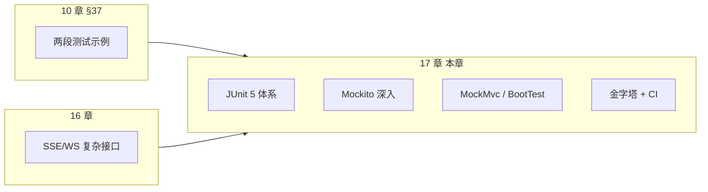
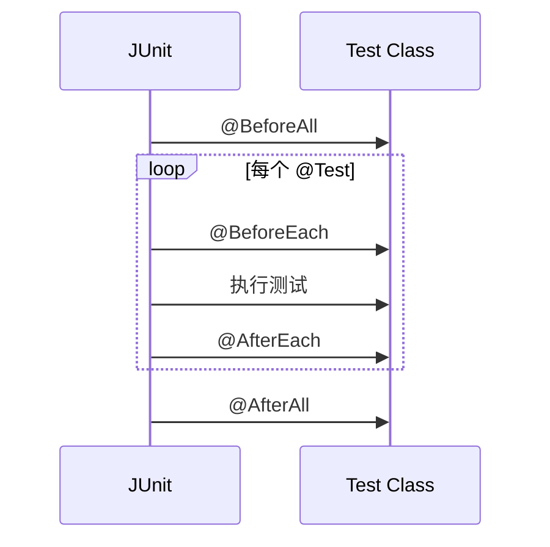
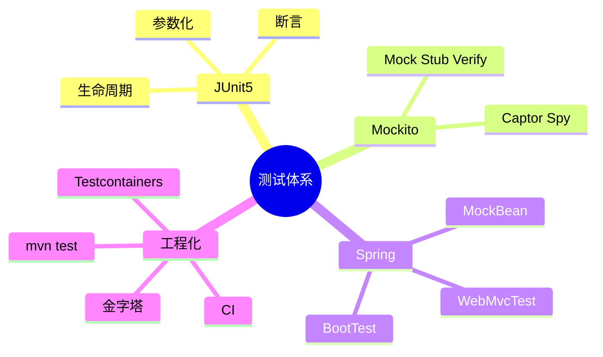

# 单元测试与 Mockito 深入

<!-- 修改说明: 2026-06-30 按 EXPANSION-STANDARD 扩充 §0、FAQ、闭卷自测、费曼检验 -->

> **文件编码**：UTF-8。本章在 [Java 10 §37](./10-后端项目实战与面试准备.md) 基础上，系统展开 **JUnit 5**、**Mockito**、**MockMvc**、**@SpringBootTest** 集成测试、测试金字塔、Testcontainers 简介与 **CI `mvn test`**。
>
> **技术栈版本**：Spring Boot 3.2+、JUnit 5.10+、Mockito 5.x、JDK 17+。
>
> **关联章节**：
> - [Java 10 后端项目实战与面试准备 §37](./10-后端项目实战与面试准备.md)（本章起点）
> - [Java 04 Spring Boot 核心开发](./04-SpringBoot核心开发.md)（分层、Controller、统一返回）
> - [Java 05 MyBatis 事务与接口工程化](./05-MyBatis事务与接口工程化.md)（Mapper、事务）
> - [Java 16 SSE 与 WebSocket 实时通信](./16-SSE与WebSocket实时通信.md)（异步接口测试思路）

---

## 本章与上一章的关系

上一章（16 SSE 与 WebSocket）让你能写 **长连接、流式推送**——功能很酷，但也很怕 **改一行挂一片**：线程超时、Nginx 缓冲、客户端断开，手工点一遍根本覆盖不完。

再往前，[Java 10 §37](./10-后端项目实战与面试准备.md) 只给了两段示例：

- `UserServiceTest`：`@Mock` + `@InjectMocks`
- `UserControllerTest`：`MockMvc` 打 `/api/users/1`

**本章要把「会抄示例」变成「敢重构」**：



| 10 章 §37 已有 | 17 章扩展 |
|----------------|-----------|
| 一个 Service 单元测试 | mock / stub / verify / 参数匹配 / 异常 |
| 一个 MockMvc 用例 | 完整 Controller 测试套路、JSON 断言 |
| 无 | `@MockBean` 替换容器 Bean |
| 无 | `@SpringBootTest` 集成测试边界 |
| 无 | 测试金字塔、Testcontainers、`mvn test` CI |

**学完的体感**：给 `OrderService.createOrder` 补 5 个测试用例，`mvn test` 全绿，你才敢改库存逻辑。

---

## 0. 读前导读（零基础也能跟上）

> **读者假设**：你已会写 Spring Boot Service/Controller（04～05 章）；改代码主要靠手动 Postman 点一点。

### 0.1 用一句话弄懂本章

**一句话**：**单元测试**是用代码自动检查代码——依赖用 **Mockito 假替身**，接口用 **MockMvc 模拟 HTTP**，`mvn test` 全绿才敢提交。

**生活类比——测试 = 彩排与替身**：

| 概念 | 代码 | 生活类比 |
|------|------|----------|
| **单元测试** | `OrderServiceTest` | **厨师单独练菜**：不真开餐厅，用料包（Mock）代替真库房 |
| **Mock** | `@Mock UserMapper` | **塑料道具蔬菜**：看起来像真的，行为你说了算 |
| **Stub** | `when(...).thenReturn(...)` | **剧本**：道具师按剧本递什么菜 |
| **Verify** | `verify(mapper).insert(...)` | **导演检查**：这幕有没有按剧本调用库房 |
| **MockMvc** | `@WebMvcTest` | **彩排服务员**：不真开门营业，模拟顾客点单 |
| **@SpringBootTest** | 起完整容器 | **带妆联排**：接近正式演出 |
| **测试金字塔** | 多单元少 E2E | **多练基本功，少整场大戏**（省钱省时间） |

**为什么重要**：重构不踩雷；面试常问 `@Mock` vs `@MockBean`；CI 强制 `mvn test` 是团队标配。

**本章用到的地方**：§3 Mockito、§6 MockMvc、§10 手把手、§11 CI。

---

### 0.2 你需要提前知道什么（真不会就先跳到哪一章）

| 你现在的水平 | 建议动作 |
|--------------|----------|
| 不会 Spring Boot 分层 | 先学 [04](./04-SpringBoot核心开发.md)、[05](./05-MyBatis事务与接口工程化.md) |
| 只看过 10 章两段示例 | 从 §4 OrderServiceTest **完整跟抄** |
| 要测 SSE 接口 | 本章 §12 + [16 章](./16-SSE与WebSocket实时通信.md) |
| 没有 Maven | 用 IDEA 右键 Run Test；命令行学 `mvn test` |

**最低门槛**：能看懂 `assertEquals`；知道 Service 调 Mapper；会运行 IDEA 绿色三角测试。

---

### 0.3 本章知识地图（学完后应能勾选全部 ☐→☑）

- [ ] 写 JUnit 5 测试类：`@Test`、`@BeforeEach`、AssertJ 断言
- [ ] 用 `@ExtendWith(MockitoExtension.class)` + `@Mock` + `@InjectMocks`
- [ ] `when(...).thenReturn(...)` stub 与 `verify(...)` 验证调用
- [ ] 测异常：`assertThatThrownBy(...).hasMessage(...)`
- [ ] 区分 `@Mock`（无 Spring）与 `@MockBean`（替换容器 Bean）
- [ ] `@WebMvcTest` + `MockMvc` 测 REST 状态码和 `jsonPath`
- [ ] `@SpringBootTest` + `@ActiveProfiles("test")` + H2 集成测试
- [ ] 理解测试金字塔：单元多、集成少、E2E 更少
- [ ] 本地与 CI 跑 `mvn test` 全绿
- [ ] 闭卷自测 10 题正确 ≥ 8 题

---

### 0.4 建议学习时长与节奏

| 阶段 | 建议时间 | 做什么 |
|------|----------|--------|
| §0 + §1～§2 JUnit | 2 小时 | 断言、参数化、生命周期 |
| §3～§4 Mockito + Service 测 | 3 小时 | 跟写 OrderServiceTest |
| §5～§7 MockMvc / BootTest | 3 小时 | Controller 切片与集成 |
| §10 手把手补 demo 测试 | 2 小时 | UserService + UserController |
| §11 CI + 自测 | 1 小时 | GitHub Actions 示例 |

---

### 0.5 学完本章你能做什么（可验证的具体动作）

1. **为** `createOrder` 写成功、商品不存在、库存不足 3 个单测，`mvn test` 通过。
2. **用** `@WebMvcTest` 断言 POST 校验失败返回 400。
3. **解释** 为什么单元测试不要 `@SpringBootTest` 起全容器。
4. **配置** `.github/workflows/ci.yml` 在 push 时跑 `mvn test`。
5. **说出** `@Mock` 和 `@MockBean` 各在什么场景用。

---

### 0.6 手把手总览：为 demo 补测试

| 步骤 | 你的动作 | 预期看到什么 | 若不对 |
|------|----------|--------------|--------|
| 1 | 确认 `spring-boot-starter-test` 在 pom | test 目录可 import JUnit5 | Reload Maven |
| 2 | 建 `UserServiceTest`，`@Mock UserMapper` | 测试类绿色运行 | `@ExtendWith(MockitoExtension.class)` |
| 3 | stub `selectById` + assert 返回值 | 1 test passed | 检查 when/verify |
| 4 | 测 `notFound` 抛 `BusinessException` | 2 tests passed | `assertThatThrownBy` |
| 5 | 建 `UserControllerTest` `@WebMvcTest` | MockMvc 200 + jsonPath | `@MockBean UserService` |
| 6 | `mvn test` | BUILD SUCCESS | 看 surefire 报告 |
| 7 | 加 `DemoApplicationTests contextLoads` | 容器能启动 | 修 test profile |

---

## 1. 为什么要写测试？

### 1.1 没有测试时发生了什么

```text
你：改了一行库存扣减
你：启动项目，手动 Postman 点创建订单
你：好像没问题，提交代码
同事：合并后支付回调挂了
你：加班 3 小时查日志
```

测试不能保证 **零 Bug**，但能：

1. **回归**：改 A 不会悄悄弄坏 B
2. **文档**：测试用例描述「方法应该怎么工作」
3. **设计反馈**：难测的代码往往耦合太重
4. **面试**：「你们项目有单测吗？」——能讲清楚是加分项

### 1.2 测试金字塔

```mermaid
pyramid
    title 测试金字塔（推荐比例）
    "E2E 端到端（少量）" : 10
    "集成测试（适中）" : 30
    "单元测试（大量）" : 60
```

| 层级 | 测什么 | 速度 | Spring 典型手段 |
|------|--------|------|-----------------|
| **单元测试** | 一个类、依赖全 Mock | 毫秒级 | JUnit 5 + Mockito |
| **集成测试** | 多层协作、真实 Servlet | 秒级 | `@SpringBootTest` + MockMvc |
| **端到端** | 全链路 + 真 DB | 分钟级 | Testcontainers、Playwright |

原则：**越多越往下层**。单元测试便宜，应多写；E2E 贵，只覆盖核心路径。

### 1.3 初学者常见误区

| 误区 | 正解 |
|------|------|
| 每个 `@SpringBootTest` 起完整容器 | 单元测试不要起容器 |
| 测试依赖执行顺序 | 每个测试独立 |
| 连真实生产库 | 用 H2 / Testcontainers 隔离 |
| 只断言 `200` | 断言业务字段、`verify` 调用 |
| 从不跑 `mvn test` | 提交前本地必跑 |

---

## 2. JUnit 5 核心

### 2.1 与 JUnit 4 的区别

| JUnit 4 | JUnit 5 |
|---------|---------|
| `@RunWith` | `@ExtendWith` |
| `@Before` / `@After` | `@BeforeEach` / `@AfterEach` |
| `@Ignore` | `@Disabled` |
| `org.junit.Test` | `org.junit.jupiter.api.Test` |

Spring Boot 3 默认 **JUnit 5**（Jupiter）。

### 2.2 依赖

`spring-boot-starter-test` 已包含：

- `junit-jupiter`
- `mockito-core` + `mockito-junit-jupiter`
- `assertj-core`
- `hamcrest`
- `json-path`（MockMvc 用）

```xml
<dependency>
    <groupId>org.springframework.boot</groupId>
    <artifactId>spring-boot-starter-test</artifactId>
    <scope>test</scope>
</dependency>
```

### 2.3 基础注解

```java
import org.junit.jupiter.api.*;

class CalculatorTest {

  @BeforeAll
  static void initAll() {
    // 整个类一次
  }

  @BeforeEach
  void init() {
    // 每个测试方法前
  }

  @Test
  @DisplayName("两数相加")
  void add() {
    assertEquals(3, 1 + 2);
  }

  @Test
  @Disabled("演示用，暂时跳过")
  void skipped() {}

  @AfterEach
  void tearDown() {}

  @AfterAll
  static void tearDownAll() {}
}
```

### 2.4 断言

**JUnit 5**：

```java
import static org.junit.jupiter.api.Assertions.*;

assertEquals(200, result.getCode());
assertNotNull(user);
assertThrows(BusinessException.class, () -> service.delete(-1L));
assertAll(
    () -> assertEquals("张三", vo.getName()),
    () -> assertTrue(vo.getId() > 0)
);
```

**AssertJ**（流式，推荐）：

```java
import static org.assertj.core.api.Assertions.*;

assertThat(user.getUsername()).isEqualTo("test");
assertThat(list).hasSize(3).contains("a");
assertThatThrownBy(() -> service.create(null))
    .isInstanceOf(IllegalArgumentException.class)
    .hasMessageContaining("不能为空");
```

### 2.5 参数化测试

```java
@ParameterizedTest
@ValueSource(strings = {"", "  ", "a"})
@NullAndEmptySource
void usernameInvalid(String username) {
  assertThrows(IllegalArgumentException.class,
      () -> validator.validateUsername(username));
}

@ParameterizedTest
@CsvSource({
    "1, true",
    "0, false",
    "-1, false"
})
void isPositive(int n, boolean expected) {
  assertEquals(expected, n > 0);
}
```

### 2.6 测试生命周期



---

## 3. Mockito 深入

### 3.1 核心概念

| 概念 | 含义 |
|------|------|
| **Mock** | 假对象，记录交互、可编程返回值 |
| **Stub** | `when(...).thenReturn(...)` 预设行为 |
| **Verify** | 断言某方法是否被调用、调用几次 |
| **Spy** | 部分 Mock：真实对象 + 可覆盖个别方法 |

### 3.2 启用 Mockito

```java
@ExtendWith(MockitoExtension.class)
class UserServiceTest {
  // ...
}
```

或在 JUnit 5 用：

```java
@Mock
private UserMapper userMapper;

@InjectMocks
private UserService userService;
```

`@InjectMocks` 把 `@Mock` 注入到被测类构造器或字段。

### 3.3 Stub 返回值

```java
@Test
void findById() {
  User user = new User();
  user.setId(1L);
  user.setUsername("alice");

  when(userMapper.selectById(1L)).thenReturn(user);

  UserVO vo = userService.findById(1L);

  assertThat(vo.getUsername()).isEqualTo("alice");
}
```

**void 方法**：

```java
doNothing().when(userMapper).deleteById(1L);
// 或
doThrow(new RuntimeException("db down")).when(userMapper).insert(any());
```

### 3.4 Verify 调用

```java
verify(userMapper).selectById(1L);
verify(userMapper, times(1)).insert(any(User.class));
verify(userMapper, never()).deleteById(anyLong());
verifyNoInteractions(emailClient);  // 完全不应调用
verifyNoMoreInteractions(userMapper);
```

### 3.5 参数匹配器

```java
when(userMapper.selectByUsername(eq("bob"))).thenReturn(user);
when(userMapper.selectPage(any(Page.class), any())).thenReturn(page);

verify(userMapper).updateById(argThat(u -> u.getId().equals(1L)));
```

注意：**混用 matcher 和 raw 值会报错**——要么全用 matcher，要么全用具体值。

```java
// ❌ when(mapper.select(1L, any())).thenReturn(x);
// ✅ when(mapper.select(eq(1L), any())).thenReturn(x);
```

### 3.6 模拟异常与连续返回

```java
when(userMapper.selectById(2L))
    .thenThrow(new DataAccessException("timeout") {});

when(stockService.getStock(1L))
    .thenReturn(100)
    .thenReturn(99)
    .thenThrow(new RuntimeException("sold out"));
```

### 3.7 @Captor 捕获参数

```java
@Captor
private ArgumentCaptor<Order> orderCaptor;

@Test
void createOrderSavesCorrectStatus() {
  service.createOrder(dto);

  verify(orderMapper).insert(orderCaptor.capture());
  assertThat(orderCaptor.getValue().getStatus()).isEqualTo("CREATED");
}
```

### 3.8 Spy 部分 Mock

```java
@Spy
private List<String> list = new ArrayList<>();

@Test
void spyExample() {
  list.add("real");
  doReturn(100).when(list).size();  // 覆盖 size()
  assertEquals(100, list.size());
  assertEquals(1, list.size());     // 若未 stub，走真实方法 —— 此处已 stub
}
```

**慎用 Spy**：容易调真实方法产生副作用。优先 `@Mock` 依赖。

### 3.9 mock / stub / verify 对照表

| 你想 | 写法 |
|------|------|
| 假依赖 | `@Mock UserMapper mapper` |
| 方法返回 X | `when(mapper.select(1L)).thenReturn(user)` |
| 方法抛异常 | `when(...).thenThrow(...)` |
| 断言调用了 | `verify(mapper).select(1L)` |
| 断言没调用 | `verify(mapper, never()).delete(...)` |
| 捕获入参 | `@Captor` + `capture()` |

---

## 4. Service 层单元测试（手把手）

### 4.1 被测代码示例

```java
@Service
@RequiredArgsConstructor
public class OrderService {

  private final OrderMapper orderMapper;
  private final ProductMapper productMapper;

  @Transactional
  public Long createOrder(CreateOrderDTO dto) {
    Product product = productMapper.selectById(dto.getProductId());
    if (product == null) {
      throw new BusinessException("商品不存在");
    }
    if (product.getStock() < dto.getQuantity()) {
      throw new BusinessException("库存不足");
    }
    product.setStock(product.getStock() - dto.getQuantity());
    productMapper.updateById(product);

    Order order = new Order();
    order.setProductId(dto.getProductId());
    order.setQuantity(dto.getQuantity());
    order.setStatus("CREATED");
    orderMapper.insert(order);
    return order.getId();
  }
}
```

### 4.2 完整测试类

```java
package com.example.demo.service;

import com.example.demo.dto.CreateOrderDTO;
import com.example.demo.entity.Order;
import com.example.demo.entity.Product;
import com.example.demo.exception.BusinessException;
import com.example.demo.mapper.OrderMapper;
import com.example.demo.mapper.ProductMapper;
import org.junit.jupiter.api.Test;
import org.junit.jupiter.api.extension.ExtendWith;
import org.mockito.ArgumentCaptor;
import org.mockito.InjectMocks;
import org.mockito.Mock;
import org.mockito.junit.jupiter.MockitoExtension;

import static org.assertj.core.api.Assertions.*;
import static org.mockito.ArgumentMatchers.*;
import static org.mockito.Mockito.*;

@ExtendWith(MockitoExtension.class)
class OrderServiceTest {

  @Mock
  private OrderMapper orderMapper;

  @Mock
  private ProductMapper productMapper;

  @InjectMocks
  private OrderService orderService;

  @Test
  void createOrder_success() {
    Product product = new Product();
    product.setId(10L);
    product.setStock(5);

    when(productMapper.selectById(10L)).thenReturn(product);
    when(orderMapper.insert(any(Order.class))).thenAnswer(inv -> {
      Order o = inv.getArgument(0);
      o.setId(100L);
      return 1;
    });

    CreateOrderDTO dto = new CreateOrderDTO();
    dto.setProductId(10L);
    dto.setQuantity(2);

    Long orderId = orderService.createOrder(dto);

    assertThat(orderId).isEqualTo(100L);
    assertThat(product.getStock()).isEqualTo(3);

    verify(productMapper).updateById(product);
    verify(orderMapper).insert(any(Order.class));
  }

  @Test
  void createOrder_productNotFound() {
    when(productMapper.selectById(99L)).thenReturn(null);

    CreateOrderDTO dto = new CreateOrderDTO();
    dto.setProductId(99L);
    dto.setQuantity(1);

    assertThatThrownBy(() -> orderService.createOrder(dto))
        .isInstanceOf(BusinessException.class)
        .hasMessage("商品不存在");

    verify(orderMapper, never()).insert(any());
  }

  @Test
  void createOrder_insufficientStock() {
    Product product = new Product();
    product.setId(1L);
    product.setStock(1);
    when(productMapper.selectById(1L)).thenReturn(product);

    CreateOrderDTO dto = new CreateOrderDTO();
    dto.setProductId(1L);
    dto.setQuantity(5);

    assertThatThrownBy(() -> orderService.createOrder(dto))
        .hasMessage("库存不足");
  }
}
```

### 4.3 测 `@Transactional` 的说明

**单元测试默认不启事务代理**——你测的是 `OrderService` 纯 Java 逻辑。事务行为用 **集成测试** 或 `@SpringBootTest` 验证。

---

## 5. @MockBean 与 Spring 容器

### 5.1 @Mock vs @MockBean

| 注解 | 作用域 | 场景 |
|------|--------|------|
| `@Mock` | 纯 Mockito，无 Spring | Service 单元测试 |
| `@MockBean` | 替换 Spring 容器里的 Bean | `@WebMvcTest` / `@SpringBootTest` |

```java
@WebMvcTest(UserController.class)
class UserControllerMockBeanTest {

  @Autowired
  private MockMvc mockMvc;

  @MockBean
  private UserService userService;

  @Test
  void getUser() throws Exception {
    UserVO vo = new UserVO();
    vo.setId(1L);
    vo.setUsername("test");
    when(userService.findById(1L)).thenReturn(vo);

    mockMvc.perform(get("/api/users/1"))
        .andExpect(status().isOk())
        .andExpect(jsonPath("$.data.username").value("test"));
  }
}
```

`@MockBean` 会 **从容器中移除真实 Bean**，插入 Mock。

### 5.2 @SpyBean

对真实 Bean 做部分 stub：

```java
@SpyBean
private UserService userService;

@Test
void partialSpy() {
  doReturn(fakeUser).when(userService).findById(1L);
  // 其它方法仍走真实实现
}
```

---

## 6. MockMvc Controller 测试

### 6.1 @WebMvcTest 切片

只加载 Web 层，不启完整容器，**快**：

```java
@WebMvcTest(OrderController.class)
@Import(GlobalExceptionHandler.class)  // 若需测统一异常
class OrderControllerTest {

  @Autowired
  private MockMvc mockMvc;

  @MockBean
  private OrderService orderService;

  @Autowired
  private ObjectMapper objectMapper;

  @Test
  void createOrder_returns201() throws Exception {
    when(orderService.createOrder(any())).thenReturn(42L);

    CreateOrderDTO dto = new CreateOrderDTO();
    dto.setProductId(1L);
    dto.setQuantity(1);

    mockMvc.perform(post("/api/orders")
            .contentType(MediaType.APPLICATION_JSON)
            .content(objectMapper.writeValueAsString(dto)))
        .andExpect(status().isOk())
        .andExpect(jsonPath("$.data").value(42));
  }

  @Test
  void createOrder_validationFail() throws Exception {
    mockMvc.perform(post("/api/orders")
            .contentType(MediaType.APPLICATION_JSON)
            .content("{\"productId\":null}"))
        .andExpect(status().isBadRequest());
  }
}
```

### 6.2 常用 MockMvc 断言

```java
mockMvc.perform(get("/api/users/1"))
    .andExpect(status().isOk())
    .andExpect(content().contentType(MediaType.APPLICATION_JSON))
    .andExpect(jsonPath("$.code").value(200))
    .andExpect(jsonPath("$.data.id").value(1))
    .andExpect(header().string("X-Request-Id", notNullValue()));
```

### 6.3 带 Header / Token

```java
mockMvc.perform(get("/api/orders")
        .header("Authorization", "Bearer fake-jwt-for-test"))
    .andExpect(status().isOk());
```

测拦截器时可用 `@AutoConfigureMockMvc(addFilters = false)` **关闭安全过滤器**（仅当测试目标不是鉴权本身）。

### 6.4 与 [Java 10 §37.2](./10-后端项目实战与面试准备.md) 对照

10 章示例：

```java
@SpringBootTest(webEnvironment = SpringBootTest.WebEnvironment.RANDOM_PORT)
@AutoConfigureMockMvc
class UserControllerTest { ... }
```

**更快做法**：改 `@WebMvcTest(UserController.class)` + `@MockBean UserService`，不必每次起全容器。

---

## 7. @SpringBootTest 集成测试

### 7.1 何时用？

- 测 **多 Bean 协作**（Service + 真 Mapper + H2）
- 测 **配置类、条件装配**
- 测 **事务回滚**

### 7.2 全容器启动

```java
@SpringBootTest
@AutoConfigureMockMvc
class OrderIntegrationTest {

  @Autowired
  private MockMvc mockMvc;

  @Autowired
  private OrderMapper orderMapper;

  @Test
  void createOrder_persistsToDb() throws Exception {
    // 需要 test profile + H2 或 Testcontainers
    mockMvc.perform(post("/api/orders")...)
        .andExpect(status().isOk());

    assertThat(orderMapper.selectCount(null)).isGreaterThan(0);
  }
}
```

### 7.3 WebEnvironment 选项

| 值 | 含义 |
|----|------|
| `MOCK`（默认） | Mock Servlet 环境，不真正起端口 |
| `RANDOM_PORT` | 真起 Tomcat 随机端口 |
| `DEFINED_PORT` | 用 `application.yml` 的 port |

```java
@SpringBootTest(webEnvironment = SpringBootTest.WebEnvironment.RANDOM_PORT)
class ApiLiveTest {

  @Autowired
  private TestRestTemplate restTemplate;

  @Test
  void health() {
  ResponseEntity<String> resp =
      restTemplate.getForEntity("/actuator/health", String.class);
    assertThat(resp.getStatusCode().is2xxSuccessful()).isTrue();
  }
}
```

### 7.4 @Transactional 测试回滚

```java
@SpringBootTest
@Transactional  // 每个测试结束回滚
class OrderMapperTest {

  @Autowired
  private OrderMapper orderMapper;

  @Test
  void insert() {
    // 插入测试数据，不会污染库
  }
}
```

### 7.5 测试 Profile

`src/test/resources/application-test.yml`：

```yaml
spring:
  datasource:
    url: jdbc:h2:mem:testdb;MODE=MySQL
    driver-class-name: org.h2.Driver
    username: sa
    password:
  h2:
    console:
      enabled: true
```

```java
@SpringBootTest
@ActiveProfiles("test")
class AppContextTest {

  @Test
  void contextLoads() {
    // 容器能起来就算过
  }
}
```

```mermaid
flowchart TB
    subgraph unit [单元测试]
        U[Service + @Mock Mapper]
    end
    subgraph slice [切片测试]
        S[@WebMvcTest + @MockBean]
    end
    subgraph integration [集成测试]
        I[@SpringBootTest + H2/Testcontainers]
    end
    unit --> slice --> integration
```

---

## 8. 测试目录与命名规范

### 8.1 Maven 约定

```text
src/
├── main/java/com/example/demo/...
└── test/java/com/example/demo/
    ├── service/OrderServiceTest.java
    ├── controller/OrderControllerTest.java
    └── integration/OrderIntegrationTest.java
```

### 8.2 命名

| 类型 | 类名 | 方法名 |
|------|------|--------|
| 单元 | `XxxServiceTest` | `methodName_condition_expected` |
| 示例 | | `createOrder_insufficientStock_throws` |

### 8.3 运行测试

```bash
# 全部
mvn test

# 单个类
mvn -Dtest=OrderServiceTest test

# 单个方法
mvn -Dtest=OrderServiceTest#createOrder_success test

# IDEA：右键类或方法 → Run
```

---

## 9. Testcontainers 简介

### 9.1 为什么不用 H2？

H2 `MODE=MySQL` 仍与真 MySQL 有差异（函数、索引行为）。**Testcontainers** 在测试时 **Docker 拉起真 MySQL**，测完销毁。

### 9.2 最小示例

**pom.xml**：

```xml
<dependency>
    <groupId>org.testcontainers</groupId>
    <artifactId>junit-jupiter</artifactId>
    <scope>test</scope>
</dependency>
<dependency>
    <groupId>org.testcontainers</groupId>
    <artifactId>mysql</artifactId>
    <scope>test</scope>
</dependency>
```

```java
@Testcontainers
@SpringBootTest
@ActiveProfiles("testcontainers")
class OrderRepoTcTest {

  @Container
  static MySQLContainer<?> mysql = new MySQLContainer<>("mysql:8.0")
      .withDatabaseName("test")
      .withUsername("test")
      .withPassword("test");

  @DynamicPropertySource
  static void props(DynamicPropertyRegistry registry) {
    registry.add("spring.datasource.url", mysql::getJdbcUrl);
    registry.add("spring.datasource.username", mysql::getUsername);
    registry.add("spring.datasource.password", mysql::getPassword);
  }

  @Autowired
  private OrderMapper orderMapper;

  @Test
  void realMysqlInsert() {
    // ...
  }
}
```

**前提**：本机 Docker 可用（见 [Java 09](./09-LinuxDockerNginx部署基础.md)）。

### 9.3 何时用？

| 场景 | 建议 |
|------|------|
| 日常 Service 单测 | Mockito，不用 TC |
| Mapper SQL 复杂 | H2 或 Testcontainers |
| 发版前流水线 | 核心链路 1～2 个 TC 用例 |

本章 **点到为止**；深入可查阅 Testcontainers 官方文档。

---

## 10. 手把手：为 demo 项目补全测试

### 10.1 第一步：确认 04 章 demo 结构

沿用 `com.example.demo` 的 `UserController` / `UserService` / `Result` 统一返回。

### 10.2 第二步：UserServiceTest（单元）

复制本章 §4 模式，`@Mock UserMapper`，测：

- `findById` 存在 / 不存在
- `createUser` 重名抛异常

### 10.3 第三步：UserControllerTest（切片）

```java
@WebMvcTest(controllers = UserController.class)
@Import({GlobalExceptionHandler.class})
class UserControllerWebTest {

  @Autowired MockMvc mockMvc;
  @MockBean UserService userService;
  @Autowired ObjectMapper objectMapper;

  @Test
  void listUsers() throws Exception {
    when(userService.listAll()).thenReturn(List.of());

    mockMvc.perform(get("/api/users"))
        .andExpect(status().isOk())
        .andExpect(jsonPath("$.code").value(200));
  }
}
```

### 10.4 第四步：contextLoads

```java
@SpringBootTest
class DemoApplicationTests {

  @Test
  void contextLoads() {}
}
```

### 10.5 第五步：验收

```bash
mvn test
# 预期：BUILD SUCCESS，Tests run: N, Failures: 0
```

---

## 11. CI 与 mvn test

### 11.1 本地提交前习惯

```text
1. git pull
2. mvn test
3. git commit
```

### 11.2 GitHub Actions 示例

`.github/workflows/ci.yml`：

```yaml
name: Java CI

on:
  push:
    branches: [ main, develop ]
  pull_request:
    branches: [ main ]

jobs:
  test:
    runs-on: ubuntu-latest
    steps:
      - uses: actions/checkout@v4

      - name: Set up JDK 17
        uses: actions/setup-java@v4
        with:
          java-version: '17'
          distribution: 'temurin'
          cache: maven

      - name: Run tests
        run: mvn -B test

      - name: Package (optional)
        run: mvn -B -DskipTests package
```

### 11.3 流水线常见策略

| 阶段 | 命令 | 说明 |
|------|------|------|
| PR 检查 | `mvn test` | 必过才能合并 |
| 夜间构建 | `mvn verify` | 含集成测试 |
| 发布 | `mvn deploy` | 跳过测试不推荐 |

### 11.4 测试报告

Surefire 报告：`target/surefire-reports/`

```bash
mvn test
cat target/surefire-reports/com.example.demo.service.OrderServiceTest.txt
```

---

## 12. 异步与 SSE 测试提示

结合 [Java 16](./16-SSE与WebSocket实时通信.md)：

```java
@Test
void sseEndpoint() throws Exception {
  MvcResult result = mockMvc.perform(get("/api/sse/demo?msg=ab"))
      .andExpect(request().asyncStarted())
      .andReturn();

  mockMvc.perform(asyncDispatch(result))
      .andExpect(status().isOk())
      .andExpect(content().contentTypeCompatibleWith("text/event-stream"));
}
```

WebSocket 集成测试可用 `WebSocketStompClient` 或单独 E2E，单元层只测 **Service 组装逻辑**。

---

## 13. 测试替身与边界

### 13.1 什么该测、什么不该测

| 测 | 不测 |
|----|------|
| 业务规则、分支 | getter/setter |
| 异常路径 | 框架本身 |
| 对外 API 契约 | 第三方 SDK 内部 |

### 13.2 测试私有方法？

**一般不直接测**。通过 **公有方法** 覆盖私有逻辑。若私有方法复杂到必须单测，考虑 **提取新类**。

### 13.3 静态方法 / final 类

Mockito 3.4+ `mockStatic`：

```java
try (MockedStatic<IdUtil> mocked = mockStatic(IdUtil.class)) {
  mocked.when(IdUtil::nextId).thenReturn(999L);
  // ...
}
```

能不用则不用，静态难以维护。

---

## 14. 面试高频问题

### Q1：单元测试和集成测试区别？

**答**：单元测试隔离依赖用 Mock，快；集成测试起 Spring 容器或多层协作，慢但更贴近真实。

### Q2：@Mock 和 @MockBean？

**答**：`@Mock` 纯 Mockito；`@MockBean` 替换 Spring 容器中的 Bean，用于 `@WebMvcTest` 等。

### Q3：MockMvc 测的是什么？

**答**：模拟 HTTP 请求 DispatcherServlet，不断网、不起浏览器，断言状态码和 JSON。

### Q4：如何保证测试不互相污染？

**答**：`@BeforeEach` 重置状态；`@Transactional` 回滚；不依赖执行顺序；不共用可变静态变量。

### Q5：项目没有测试你怎么推动？

**答**：新需求带测试；改 Bug 先写失败用例再修；核心 Service 覆盖率优先；CI 强制 `mvn test`。

---

## 15. 常见报错与排查

| 报错信息（关键词） | 可能原因 | 解决方案 |
|-------------------|---------|---------|
| `No qualifying bean of type 'XxxService'` | `@WebMvcTest` 未 `@MockBean` 依赖 | 对 Controller 依赖的 Service 加 `@MockBean` |
| `InvalidUseOfMatchersException` | when/verify 混用 matcher 与原始值 | 全部用 `eq()` / `any()` 等 matcher |
| `UnnecessaryStubbingException` | stub 了但测试未用到 | 删除多余 stub 或 `lenient()` |
| `Wanted but not invoked` | verify 的方法实际没调用 | 检查业务分支、参数是否匹配 |
| `Failed to load ApplicationContext` | 配置错误、Bean 冲突 | 看 Caused by；先用 `@SpringBootTest` + `contextLoads` |
| `java.lang.IllegalStateException: Failed to introspect Class` | 缺少 `@Import` 异常处理器等 | `@Import(GlobalExceptionHandler.class)` |
| `404` in MockMvc | 路径或 HTTP 方法不对 | 对照 Controller 注解 |
| `Content type not set` | POST 未设 JSON | `.contentType(MediaType.APPLICATION_JSON)` |
| `JSON path "$.data" not found` | 响应结构与断言不一致 | `andDo(print())` 打印实际 body |
| `Tests run: 0` | 测试类非 public、方法无 `@Test`、 surefire 配置 | 检查类名 `*Test`、JUnit 5 引擎依赖 |
| `Mockito cannot mock/spy class ... final` | final 类 / 旧版 Mockito | 升级 Mockito 3.12+；或 wrapper |
| Testcontainers `Could not find Docker` | CI 无 Docker | 仅本地跑 TC；CI 用 H2 或 `services: docker` |
| `@Transactional` 测试数据未回滚 | 自调用、多线程、非代理调用 | 同线程通过 Bean 调用；或 `@Rollback` |
| `ParameterResolutionException` | `@Autowired` 字段在无 Spring 测试里 | 单元测试用 `@ExtendWith(MockitoExtension.class)` 而非混用 |

---

## 16. 分级练习

**基础**：为 `UserService.findById` 写 2 个单元测试（存在 / 不存在）  
**进阶**：`@WebMvcTest` 测 `POST /api/users` 校验失败返回 400  
**挑战**：`@SpringBootTest` + H2 测订单创建后 `order` 表有记录

### 参考答案

#### 基础

```java
@Test
void findById_found() {
  User u = new User(); u.setId(1L); u.setUsername("a");
  when(mapper.selectById(1L)).thenReturn(u);
  assertThat(service.findById(1L).getUsername()).isEqualTo("a");
}

@Test
void findById_notFound() {
  when(mapper.selectById(9L)).thenReturn(null);
  assertThatThrownBy(() -> service.findById(9L))
      .isInstanceOf(BusinessException.class);
}
```

#### 进阶

```java
mockMvc.perform(post("/api/users")
    .contentType(MediaType.APPLICATION_JSON)
    .content("{\"username\":\"\"}"))
  .andExpect(status().isBadRequest())
  .andExpect(jsonPath("$.message").exists());
```

#### 挑战

1. `pom.xml` 加 H2，`application-test.yml` 配内存库  
2. `@SpringBootTest` + `@ActiveProfiles("test")` + `@Transactional`  
3. `mockMvc.perform(post("/api/orders")...)` 后 `assertThat(orderMapper.selectCount(null)).isEqualTo(1)`

---

## 16.1 常见困惑 FAQ

### Q1：单元测试和集成测试区别？

**A**：单元测试隔离依赖、Mock Mapper，毫秒级；集成测试起 Spring 容器或多层协作，秒级，更贴近真实。

### Q2：`@Mock` 和 `@MockBean`？

**A**：`@Mock` 纯 Mockito，无容器；`@MockBean` 替换 Spring 容器里的 Bean，用于 `@WebMvcTest`/`@SpringBootTest`。

### Q3：MockMvc 测的是什么？

**A**：模拟 HTTP 请求走 DispatcherServlet，不断网、不起浏览器，断言状态码和 JSON。

### Q4：如何保证测试不互相污染？

**A**：`@BeforeEach` 重置；`@Transactional` 回滚；不依赖执行顺序；避免共享可变静态状态。

### Q5：项目没测试怎么推动？

**A**：新需求带测试；修 Bug 先写失败用例；核心 Service 优先；CI 强制 `mvn test`。

### Q6：要不要测 private 方法？

**A**：一般不直接测，通过 public 方法覆盖；太复杂就提取新类。

### Q7：`@SpringBootTest` 太慢怎么办？

**A**：Service 用 `@ExtendWith(MockitoExtension.class)`；Controller 用 `@WebMvcTest` 切片。

### Q8：`InvalidUseOfMatchersException`？

**A**：`when`/`verify` 参数要么全用 matcher（`eq`、`any`），要么全用具体值，不能混用。

### Q9：测 `@Transactional` 事务行为？

**A**：单元测试不起事务代理；用 `@SpringBootTest` + `@Transactional` 集成测或专门测配置。

### Q10：H2 和 Testcontainers 选哪个？

**A**：日常 Service/Mapper 简单 SQL 用 H2；要 MySQL 方言/索引行为用 Testcontainers 真 MySQL。

### Q11：`UnnecessaryStubbingException`？

**A**：stub 了但本测试没走到；删掉多余 stub 或 `@MockitoSettings(strictness = LENIENT)`。

### Q12：怎么测 SSE？

**A**：MockMvc `asyncStarted` + `asyncDispatch`；或单测 Service 组装逻辑，E2E 用 curl。

---

## 16.2 闭卷自测

> 先遮住答案，逐题口述或默写。

### 概念题（6 道）

1. 测试金字塔三层分别测什么？为什么单元测试要多写？
2. Mock、Stub、Verify 各一句话？
3. `@WebMvcTest` 会启动完整 Spring 容器吗？为什么更快？
4. `assertThatThrownBy` 解决什么问题？
5. `@ActiveProfiles("test")` 典型用途？
6. `@Captor` 捕获参数有什么用？

### 动手题（2 道）

7. 写 stub：`when(userMapper.selectById(1L)).thenReturn(user)` 并 `verify` 一次。
8. 写 MockMvc：`GET /api/users/1` 期望 200 且 `$.data.username` 为 `alice`。

### 综合题（2 道）

9. `OrderService.createOrder` 应写哪几类测试用例？（至少 4 个场景名）
10. 对比全 `@SpringBootTest` 测 Service 与 `@Mock` Mapper 测 Service 的速度、隔离性、可信度。

### 自测参考答案

1. 单元/集成/E2E；单元快、定位准、成本低。
2. Mock 假对象；Stub 预设返回值；Verify 断言是否调用。
3. 不会，只加载 Web 层切片；依赖 `@MockBean`，所以快。
4. 断言某代码会抛指定异常及消息。
5. 加载 `application-test.yml`，如 H2 内存库。
6. 断言传给 `insert` 的 Order 状态、金额等字段正确。
7. 见 §3.3～§3.4 示例。
8. `mockMvc.perform(get("/api/users/1")).andExpect(status().isOk()).andExpect(jsonPath("$.data.username").value("alice"));`
9. 成功、商品不存在、库存不足、mapper 抛异常、quantity 非法等。
10. BootTest 慢但路径真；Mock 快、隔离好，适合分支逻辑，集成留给少量关键链路。

---

## 16.3 费曼检验

**任务**：请在不看资料的情况下，用 **3 分钟** 向朋友解释「为什么要写单元测试」。

**对照提纲**：

1. **改代码怕踩雷**：自动回归，改 A 不会悄悄弄坏 B。
2. **替身排练**：Mapper 用 Mock，不测真数据库也能测 Service 业务分支。
3. **提交前绿灯**：`mvn test` 是门禁；金字塔是多练单元、少靠手工点 Postman。

若朋友能说出「Mock 假依赖、MockMvc 测接口、mvn test 自动检查」，本章核心已掌握。

---

## 16.4 本章与工程实践衔接速查

| 17 章学会 | 日常开发 | CI / 面试 |
|-----------|----------|-----------|
| Service + `@Mock` | 改业务先补单测 | 能说清单元 vs 集成 |
| `@WebMvcTest` | 新接口先写契约测试 | MockMvc 断言 JSON |
| `@SpringBootTest` | 发版前关键链路 | contextLoads 冒烟 |
| `mvn test` | 提交前本地必跑 | GitHub Actions |
| SSE `asyncDispatch` | 16 章流式接口 | 异步测试套路 |

### 16.4.1 OrderServiceTest 核心片段逐行读

```java
@ExtendWith(MockitoExtension.class)
class OrderServiceTest {
  @Mock private OrderMapper orderMapper;
  @Mock private ProductMapper productMapper;
  @InjectMocks private OrderService orderService;

  @Test
  void createOrder_success() {
    when(productMapper.selectById(10L)).thenReturn(product);
    when(orderMapper.insert(any(Order.class))).thenAnswer(inv -> {
      Order o = inv.getArgument(0);
      o.setId(100L);
      return 1;
    });
    Long orderId = orderService.createOrder(dto);
    assertThat(orderId).isEqualTo(100L);
    verify(orderMapper).insert(any(Order.class));
  }
}
```

| 行号/片段 | 含义 | 改错会怎样 |
|-----------|------|------------|
| `@ExtendWith(MockitoExtension.class)` | 启用 Mockito，无需 Spring | 缺则 `@Mock` 不注入 |
| `@InjectMocks` | 把 Mock 塞进 OrderService | 缺则 service 里 mapper 为 null |
| `when(...).thenReturn` | stub 查库返回 | 不 stub 则返回 null NPE |
| `thenAnswer` 设置 id | 模拟数据库回填自增 id | 断言 orderId 无法测 |
| `verify(...).insert` | 断言确实调了插入 | 只 assert 返回值漏测调用 |
| `verify(..., never())` | 异常分支不应 insert | 库存不足仍 insert 则测不出 |

### 16.4.2 MockMvc POST 逐行读

```java
mockMvc.perform(post("/api/orders")
        .contentType(MediaType.APPLICATION_JSON)
        .content(objectMapper.writeValueAsString(dto)))
    .andExpect(status().isOk())
    .andExpect(jsonPath("$.data").value(42));
```

| 片段 | 含义 | 改错会怎样 |
|------|------|------------|
| `contentType(APPLICATION_JSON)` | 声明 JSON 体 | 415 或校验不触发 |
| `writeValueAsString(dto)` | Java 对象转 JSON 字符串 | 手写 JSON 易错引号 |
| `jsonPath("$.data")` | 断言统一返回结构 | 路径错则误报失败 |
| `andDo(print())` | 调试时打印响应 body | 仅开发排查用 |

**动手验收清单**：

- [ ] `OrderService` 至少 3 个分支单测全绿
- [ ] `@WebMvcTest` 测通一个 POST 校验失败
- [ ] 本地 `mvn test` BUILD SUCCESS
- [ ] 闭卷自测 ≥ 8/10

---

## 16.5 常见学习弯路与纠正

| 弯路 | 表现 | 纠正 |
|------|------|------|
| 全用 `@SpringBootTest` | 测一次几分钟 | Service 用 Mockito 单元测 |
| 只 assert 200 | 字段错了也发现不了 | `jsonPath` + `verify` |
| 不测异常分支 | 线上才暴露 | `assertThatThrownBy` 覆盖 |
| when/verify 混用 matcher | InvalidUseOfMatchers | 参数全 matcher 或全字面量 |
| 连生产库跑测试 | 数据被删 | H2 / Testcontainers |
| 不测校验失败 | 空参数竟 200 | POST 空 body 期望 400 |
| 忽略 `mvn test` | CI 红了才慌 | 提交前本地必跑 |
| Mock 过多实现细节 | 测试脆、难维护 | 测行为不测内部调用次数过载 |

---

## 17. 与 Java 10 学完标准对齐

[Java 10 §39](./10-后端项目实战与面试准备.md) 要求：

- [ ] 会写 Service 层单元测试（Mockito）和 Controller 集成测试（MockMvc）

本章完成后应升级为：

- [ ] Service：**mock + stub + verify + 异常分支**
- [ ] Controller：**@WebMvcTest** 切片，断言 `jsonPath`
- [ ] 集成：**@SpringBootTest** + test profile
- [ ] 流程：**本地 `mvn test` + CI 配置**
- [ ] 能说清 **测试金字塔** 与 `@Mock` / `@MockBean` 区别

---

## 18. 学完标准

- [ ] 能独立写 JUnit 5 测试类，`@BeforeEach` / 断言 / `@ParameterizedTest`
- [ ] 熟练使用 Mockito：`when` / `verify` / `ArgumentCaptor` / `any`
- [ ] 能区分 `@Mock` 与 `@MockBean` 使用场景
- [ ] 会用 `@WebMvcTest` + `MockMvc` 测 REST 接口
- [ ] 会用 `@SpringBootTest` + `@ActiveProfiles("test")` 做集成测试
- [ ] 理解测试金字塔，知道 Testcontainers 解决什么问题
- [ ] 能配置 GitHub Actions 跑 `mvn test`
- [ ] 对照 [Java 10 §37](./10-后端项目实战与面试准备.md) 能扩展出完整测试套件

---

## 19. 本章小结



**记忆口诀**：

- **Service** → `@Mock` 依赖，不起容器  
- **Controller** → `@WebMvcTest` + `MockMvc`  
- **全链路** → `@SpringBootTest` + H2/TC  
- **提交前** → `mvn test` 必须绿  

---

## 下一章预告

测试守护住重构之后，若你同时在学习 [AIAgent](../AIAgent/00-学习路线图与说明.md) 路线，建议回到 **03 流式对话** 把 SSE 流与单测一起练：Mock `ChatClient` 的 `Flux`，断言 `SseEmitter` 推送逻辑。Java 主线则可继续复习 [15 补充知识点总表](./15-补充知识点总表.md) 或投入真实项目迭代。

---

*本章完 · 上一章 [16-SSE与WebSocket实时通信](./16-SSE与WebSocket实时通信.md) · 关联 [10-后端项目实战 §37](./10-后端项目实战与面试准备.md)*
