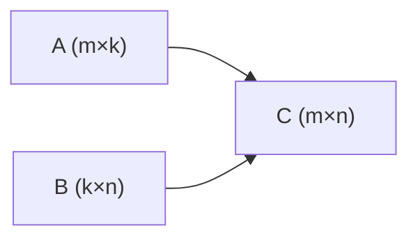

# 线性代数与数值计算基础

> **文件编码**：UTF-8。  
> **前置**：[LLMInfra 00](00-学习路线图与说明.md)、[C++ 01](../C++/01-C++基础语法与数据类型.md)、[数据结构 01](../数据结构/01-复杂度与基础/README.md)。
> **定位**：LLM Infra 的数学地基——向量、矩阵、GEMM、Softmax 数值稳定，为 02 章 Attention 手推与 05 章 cuBLAS 铺路。

---

## 0. 读前导读

### 0.1 用一句话弄懂本章

**线性代数** = 大模型里所有「张量运算」的数学语言；**数值计算** = 在有限精度浮点下算对、算稳、算快。

### 0.2 你需要提前知道什么

| 背景 | 建议 |
|------|------|
| 大一线代 | 本章是「Infra 视角」复习 + 补数值稳定 |
| 只会调 API | 必须手推一次矩阵乘与 Softmax |
| C++ 基础 | 至少完成 [C++ 01](../C++/01-C++基础语法与数据类型.md) 数组与循环 |

### 0.3 本章知识地图（☐→☑）

- [ ] 解释向量点积、矩阵乘维度规则 `(m×k)·(k×n)→(m×n)`
- [ ] 手算 2×2 矩阵乘与转置
- [ ] 写出 Softmax 的 log-sum-exp 稳定形式
- [ ] 说明 FP16/BF16 在 GEMM 中的取舍
- [ ] 完成 §12 闭卷自测 ≥8/10

### 0.4 建议学习时长

- **3～5 天**（每天 2 h：推导 1 h + 代码 1 h）

### 0.5 学完你能做什么

手推 Attention 中的 `QK^T/√d` 与 `softmax·V`；读懂 cuBLAS `cublasSgemm` 参数含义；解释为何 LayerNorm 需要方差稳定项 `ε`。

---

## 1. 这份文档学什么

- 向量、矩阵、张量索引与存储布局（Row-major vs Col-major）
- 矩阵乘法（GEMM）与计算复杂度
- 点积、外积、范数、正交性直觉
- 浮点误差、Softmax/LayerNorm 数值稳定
- 与 LLM 算子的对应关系

---

## 2. 向量与矩阵基础

### 2.1 记号

- 向量 **x** ∈ ℝⁿ，矩阵 **A** ∈ ℝᵐˣⁿ，元素 `A[i,j]`（行 i，列 j）
- **C++/CUDA 默认 Row-major**：同行元素在内存中相邻，`A[i,j]` 与 `A[i,j+1]` 连续

```cpp
// Row-major: A[m][n] 逻辑上 A[i][j] = data[i * n + j]
void matvec_rowmajor(const float* A, const float* x, float* y, int m, int n) {
    for (int i = 0; i < m; ++i) {
        float sum = 0.f;
        for (int j = 0; j < n; ++j)
            sum += A[i * n + j] * x[j];
        y[i] = sum;
    }
}
// 复杂度 O(m·n)，即 GEMV（矩阵-向量乘）
```

### 2.2 矩阵乘法

**C = A·B**，A 为 m×k，B 为 k×n，C 为 m×n：

\[
C_{ij} = \sum_{t=0}^{k-1} A_{it} B_{tj}
\]

- 时间复杂度 **O(m·k·n)**；Attention 中 n 为序列长度时成为瓶颈（见 02 章）
- **不可交换**：AB ≠ BA（维度允许时）



---

## 3. 张量形状与 LLM 中的矩阵

| 运算 | 典型形状 | Infra 关注点 |
|------|----------|--------------|
| Embedding | `[batch, seq, hidden]` | 查表 vs GEMM |
| QKV 投影 | `[batch·seq, hidden] × W` | 融合 GEMM |
| Attention scores | `[batch, heads, seq, seq]` | O(n²) 内存 |
| FFN | `[batch·seq, hidden] × W1/W2` | 占算力 ~2/3 |
| LM Head | `[batch·seq, hidden] × vocab` | 大 vocab 分块 |

**Head 拆分**：`hidden = num_heads × head_dim`，Q/K/V 各为 `[batch, heads, seq, head_dim]`。

---

## 4. 点积、范数与缩放

- **点积**：`a·b = Σ aᵢbᵢ`；Attention 中 `score = q·k / √d`
- **L2 范数**：`||x||₂ = √(Σ xᵢ²)`
- **缩放原因**：d 增大时点积方差增大，Softmax 易饱和；除以 √d 稳定梯度

---

## 5. 数值稳定：Softmax 与 LayerNorm

### 5.1 Naive Softmax（不稳定）

\[
\text{softmax}(x_i) = \frac{e^{x_i}}{\sum_j e^{x_j}}
\]

当 `x_i` 很大时 `exp` 溢出；很小时下溢。

### 5.2 Log-Sum-Exp 技巧

\[
\text{softmax}(x_i) = \frac{e^{x_i - m}}{\sum_j e^{x_j - m}}, \quad m = \max_j x_j
\]

```cpp
#include <cmath>
#include <algorithm>
#include <vector>

void softmax_stable(std::vector<float>& x) {
    float m = *std::max_element(x.begin(), x.end());
    float sum = 0.f;
    for (float& v : x) {
        v = std::exp(v - m);
        sum += v;
    }
    for (float& v : x)
        v /= sum;
}
```

### 5.3 LayerNorm

\[
y_i = \gamma \frac{x_i - \mu}{\sqrt{\sigma^2 + \epsilon}} + \beta
\]

`ε`（如 1e-5）防止除零；Infra 中常 **融合** 为单个 CUDA kernel（07、15 章）。

---

## 6. 浮点格式与 GEMM

| 格式 | 指数位 | 尾数位 | LLM 用途 |
|------|--------|--------|----------|
| FP32 | 8 | 23 | 训练主精度、累加器 |
| FP16 | 5 | 10 | 推理、Tensor Core |
| BF16 | 8 | 7 | 训练（范围大） |
| FP8 | 4/5 | 3/2 | H100 推理/训练 |

**混合精度 GEMM**：输入 FP16/BF16，累加 FP32（`cublasGemmEx` 见 05 章）。

---

## 7. 特征值直觉（不必深证）

- 对称矩阵可正交对角化；**SVD** 在 LoRA、量化敏感性分析中出现
- Infra 岗面试常问：「为什么 Attention 用 Softmax 不用 L2 归一化？」→ 非负权重、概率解释、与 cross-entropy 训练一致

---

## 8. 与复杂度的联系

矩阵乘 `[n,n]×[n,n]` 为 **O(n³)**；Attention 若物化 `[n,n]` 分数矩阵，内存 **O(n²)**。FlashAttention（15 章）通过分块避免物化。

详见 [数据结构 01 大 O](../数据结构/01-复杂度与基础/README.md)。

---

## 9. 练习建议

1. **手算**：给定 2×3 与 3×2 矩阵，纸笔求积并核对 C++ 循环结果
2. **编程**：实现 `matvec_rowmajor`，与 NumPy `A @ x` 对比（允许用 Python 验算）
3. **Softmax**：对 `[1000, 1000, 1000]` 与 `[1000, 1000, 1000.001]` 分别做 naive vs stable，观察差异
4. **阅读**：PyTorch `F.softmax` 文档中的 `dim` 参数；画 3D 张量哪个维度做归一化

---

## 10. 学完标准

- [ ] 闭卷写出 GEMM 三重循环与复杂度
- [ ] 解释 Row-major 下 `A[i,j]` 的线性索引
- [ ] 口述 log-sum-exp 为何防溢出
- [ ] 说出 LLM 中至少 4 个 GEMM 形状
- [ ] 能画 Attention 数据流（为 02 章预习）

---

## 11. FAQ

**Q1：Row-major 和 Col-major 哪个是「标准」？**  
C/C++/CUDA 习惯 Row-major；Fortran、cuBLAS 默认 Col-major。调用 cuBLAS 时常需转置等价（05 章）。

**Q2：向量和矩阵在 GPU 上怎么存？**  
一维连续 buffer + stride/shape 元数据；与 [C++ 02 指针](../C++/02-指针引用与内存管理.md) 的连续内存一致。

**Q3：为什么要学线代而不是直接学 vLLM？**  
读 kernel 和调度器时，shape mismatch 是最常见 bug；不懂维度无法 debug。

**Q4：Softmax 的 `dim` 在 Attention 里是哪个？**  
对 **key 维度**（最后一维 seq_k）做归一化，使每个 query 对 keys 的权重和为 1。

**Q5：BF16 和 FP16 怎么选？**  
训练优先 BF16（不易溢出）；推理 H100 上 FP8/FP16 看引擎支持。

**Q6：ε 在 LayerNorm 里能去掉吗？**  
不能；极小方差 batch 会 NaN。推理引擎固定写死 1e-5。

**Q7：GEMM 和「张量乘」一样吗？**  
二维是 GEMM；高维张量乘是 GEMM + broadcast/reshape（einsum 语义）。

**Q8：需要学特征值分解吗？**  
Infra 入门不必证；知道 SVD/低秩近似在 LoRA 中的角色即可。

**Q9：复数线代要学吗？**  
LLM 实数域为主；RoPE 用三角函数，不涉及复数矩阵。

**Q10：如何验证自己的 C++ 矩阵乘？**  
小矩阵手算；大矩阵用 `python -c "import numpy; ..."` 对比 max error < 1e-5。

---

## 12. 闭卷自测

1. GEMM (m×k)·(k×n) 的 FLOPs 数量级？
2. Row-major 下 A[2,3] 在一维数组中的下标公式（列数 n=4）？
3. Softmax 稳定化关键一步？
4. Attention 缩放因子 √d 的作用？
5. FP16 相对 FP32 主要风险？
6. LayerNorm 中 ε 的作用？
7. 物化 n×n Attention 矩阵的空间复杂度？
8. cuBLAS 默认列主序对调用有何影响？（预告 05 章）
9. 向量点积与矩阵乘的关系？
10. LLM FFN 两层线性层在形状上如何写？

<details>
<summary>参考答案</summary>

1. O(2mkn) FLOPs（每元素 k 次乘加）。
2. `2 * 4 + 3 = 11`。
3. 减去 max 再 exp：`x_i - max(x)`。
4. 控制点积量级，避免 Softmax 饱和。
5. 动态范围小，易溢出/下溢；累加需 FP32。
6. 防止 σ²→0 时除零。
7. O(n²)（每 head，乘 batch 与 heads）。
8. 需用 `CUBLAS_OP_T` 等等价转置或交换 A/B 角色。
9. 矩阵乘可看作行向量与列向量的点积集合。
10. `[*, hidden]→[*, 4h]→[*, hidden]`（SwiGLU 变体见 02 章）。

</details>

---

## 13. 下一章预告

01 章建立了矩阵与数值稳定——**Transformer 如何用这些积木拼出 Attention？** 02 章将手推 Self-Attention、Multi-Head、复杂度 O(n²)，并连接 KV Cache 动机。

---

*下一章：[02 Transformer 与注意力机制原理](02-Transformer与注意力机制原理.md)*
