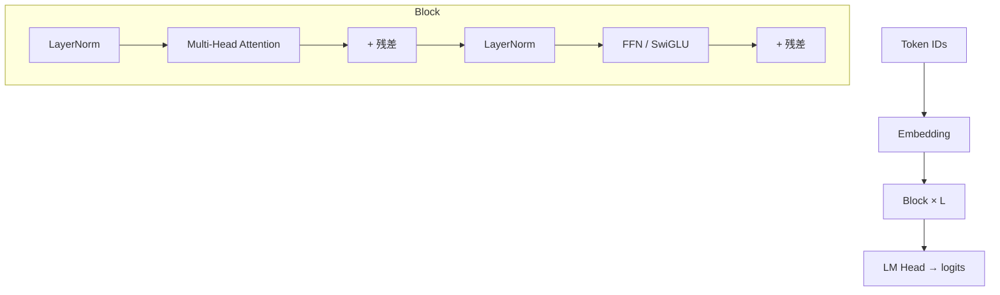
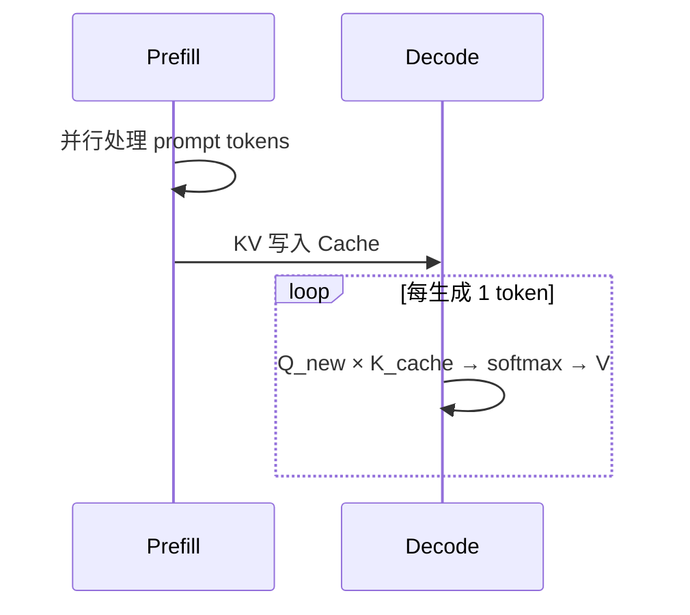

# Transformer 与注意力机制原理

> **文件编码**：UTF-8。  
> **前置**：[01 线性代数](01-线性代数与数值计算基础.md)、[AIAgent 17 Transformer 导读](../AIAgent/17-LLM原理与训练流程.md)（可选）。  
> **定位**：手推 Attention、理解 O(n²) 与 KV Cache 动机，为 07～08 章推理引擎打底。

---

## 0. 读前导读

### 0.1 用一句话弄懂本章

**Transformer** = 用 **Self-Attention** 让序列中每个 token「看见」其它 token，再堆叠 FFN 与 LayerNorm，构成现代 LLM 骨架。

### 0.2 你需要提前知道什么

- 完成 [01 章](01-线性代数与数值计算基础.md) 矩阵乘、Softmax 稳定化
- 向量、矩阵维度能一眼对齐
- 若已读 AIAgent 17，本章侧重 **手推 + Infra 复杂度**

### 0.3 本章知识地图（☐→☑）

- [ ] 手推 Self-Attention 四步（Q/K/V → scores → softmax → 加权 V）
- [ ] 解释 Multi-Head 为何 `hidden = heads × head_dim`
- [ ] 说出 Prefill vs Decode 计算特征
- [ ] 解释 KV Cache 避免重复算什么
- [ ] 完成 §12 闭卷自测 ≥8/10

### 0.4 建议学习时长

- **4～6 天**（含纸笔推导与 PyTorch 对照实验）

---

## 1. 这份文档学什么

- Encoder-Decoder 与 **Decoder-only**（GPT/Llama）区别
- Scaled Dot-Product Attention 公式与形状
- Multi-Head Attention（MHA）
- 位置编码：绝对、RoPE（Llama 系）
- FFN、残差、LayerNorm
- 复杂度与 KV Cache 动机

---

## 2. 整体架构（Decoder-only）



GPT、Llama、Qwen 等生成模型均为 **因果（Causal）** Mask：位置 i 只能 attend 到 j≤i。

---

## 3. Scaled Dot-Product Attention

输入 **X** ∈ ℝ^(seq×d_model)，可学习权重 **W_Q, W_K, W_V**：

\[
Q = XW_Q,\quad K = XW_K,\quad V = XW_V
\]

\[
\text{Attention}(Q,K,V) = \text{softmax}\left(\frac{QK^T}{\sqrt{d_k}}\right) V
\]

| 张量 | 形状（单 head） | 说明 |
|------|-----------------|------|
| Q, K, V | [seq, d_k] | 线性投影 |
| scores | [seq, seq] | 点积相似度 |
| weights | [seq, seq] | 行 softmax |
| output | [seq, d_k] | 加权值向量 |

### 3.1 因果 Mask

对 `j > i` 的位置，scores[i,j] = -∞（或加 `-1e9`），Softmax 后权重为 0。

```python
# 形状示意（PyTorch 对照，非本章必写）
import torch
seq, d_k = 4, 8
Q = torch.randn(seq, d_k)
K = torch.randn(seq, d_k)
scores = Q @ K.T / (d_k ** 0.5)
mask = torch.triu(torch.ones(seq, seq), diagonal=1).bool()
scores.masked_fill_(mask, float('-inf'))
weights = torch.softmax(scores, dim=-1)
```

---

## 4. Multi-Head Attention

h 个头，每头 d_k = d_model / h：

\[
\text{head}_i = \text{Attention}(QW_i^Q, KW_i^K, VW_i^V)
\]

\[
\text{MHA}(X) = \text{Concat}(\text{head}_1,\ldots,\text{head}_h) W^O
\]

**Infra 视角**：Q/K/V 可 **融合为一次 GEMM**（3×d_model 宽矩阵），再 reshape 为 [batch, heads, seq, d_k]。

---

## 5. FFN 与 SwiGLU

经典 FFN：

\[
\text{FFN}(x) = W_2\,\sigma(W_1 x + b_1) + b_2
\]

Llama 系 **SwiGLU**：

\[
\text{FFN}(x) = W_{\text{down}}\big(\text{SiLU}(W_{\text{gate}} x) \odot W_{\text{up}} x\big)
\]

中间维度常为 `4 × hidden` 或 `8/3 × hidden`（对齐 256）。FFN 占推理 **FLOPs ~60～70%**。

---

## 6. RoPE 位置编码（简述）

**Rotary Position Embedding**：在 Q/K 二维子空间旋转，注入相对位置信息；**长上下文外推** 与 Infra 的 **NTK/YaRN** 缩放相关（14 章源码）。

推理实现：预计算 `cos/sin` 表，按 position_id 查表旋转——CUDA kernel 常融合进 Q/K 投影后。

---

## 7. Prefill vs Decode

| 阶段 | 输入 | 计算特点 | KV Cache |
|------|------|----------|----------|
| **Prefill** | 整段 prompt | 并行算全 seq，GEMM 大 | 写入 K/V |
| **Decode** | 每次 1 token | seq=1，访存 bound | 读历史 K/V |

Decode 每步只对 **新 token** 算 Q，与 **全部历史 K** 做 attention——故需缓存每层 K/V（08 章）。



---

## 8. 复杂度分析

- 单层 MHA（seq=n，d 固定）：scores **O(n²·d)**，内存 **O(n²)**（若物化）
- L 层堆叠：时间 **O(L·n²·d)**；长上下文瓶颈在此
- FlashAttention（15 章）：IO-aware，不物化完整 n×n 到 HBM

与 [数据结构 01](../数据结构/01-复杂度与基础/README.md) 的 O(n²) 对照理解。

---

## 9. KV Cache 动机（预告 08 章）

无 Cache：生成第 t 个 token 时重复计算前 t−1 个 token 的 K/V → **O(n²)** 冗余。

有 Cache：每层存 `[batch, heads, max_seq, d_k]` 的 K/V；Decode 只 append 新列。

显存估算（FP16）：

\[
\text{KV bytes} \approx 2 \times L \times batch \times seq \times hidden
\]

（2 表示 K+V；GQA/MQA 可减少 K/V head 数。）

---

## 10. C++ 伪代码：单头 Attention（教学用）

```cpp
#include <vector>
#include <cmath>
#include <algorithm>

void causal_softmax(std::vector<float>& row) {
    float m = *std::max_element(row.begin(), row.end());
    float s = 0.f;
    for (float& v : row) { v = std::exp(v - m); s += v; }
    for (float& v : row) v /= s;
}

// Q,K,V: [seq][dk] 行主序；output[seq][dk]
void attention_one_head(const float* Q, const float* K, const float* V,
                        float* out, int seq, int dk, float scale) {
    std::vector<float> scores(seq);
    for (int i = 0; i < seq; ++i) {
        for (int j = 0; j < seq; ++j) {
            if (j > i) { scores[j] = -1e9f; continue; }
            float dot = 0.f;
            for (int t = 0; t < dk; ++t)
                dot += Q[i * dk + t] * K[j * dk + t];
            scores[j] = dot * scale;
        }
        causal_softmax(scores);
        for (int t = 0; t < dk; ++t) {
            float sum = 0.f;
            for (int j = 0; j < seq; ++j)
                sum += scores[j] * V[j * dk + t];
            out[i * dk + t] = sum;
        }
    }
}
```

真实引擎用 fused CUDA + 不物化全矩阵（15 章）。

---

## 11. 练习建议

1. **纸笔**：seq=3, d_k=2，给定 Q/K/V 小矩阵，手算 scores 与 output
2. **PyTorch**：`nn.MultiheadAttention` 打印 shape；对比 `batch_first=True/False`
3. **复杂度**：n=4096, L=32，估算 KV Cache FP16 显存（7B 模型 hidden≈4096）
4. **阅读**：HuggingFace `modeling_llama.py` 中 `LlamaAttention.forward` 一次

---

## 12. 学完标准

- [ ] 白板推导 MHA 数据流
- [ ] 解释 Causal Mask 必要性
- [ ] 区分 Prefill/Decode 与调度（16 章）
- [ ] 估算 KV 显存数量级
- [ ] 说明 GQA：K/V heads < Q heads

---

## 13. FAQ

**Q1：Encoder 和 Decoder-only 面试怎么答？**  
BERT 用 Encoder；GPT/Llama 用 Decoder-only + causal mask；T5 是 Encoder-Decoder。

**Q2：为什么用 LayerNorm 而不是 BatchNorm？**  
序列 batch 小、长度变长；BN 统计不稳定。

**Q3：Attention 是 O(n²) 还能做 128K 上下文吗？**  
靠 FlashAttention、稀疏注意力、Ring Attention、量化 KV 等（08、15 章）。

**Q4：GQA/MQA 是什么？**  
Grouped-Query：多 Q head 共享一组 K/V head，减 KV 显存与带宽。

**Q5：Softmax 在 CPU 还是 GPU 算？**  
全在 GPU；小 batch decode 时 softmax 可能非瓶颈，**GEMV/GEMM 访存** 才是。

**Q6：LM Head 和 Embedding 权重共享？**  
很多模型 **tie weights**，减参数量；推理引擎加载权重要注意。

**Q7：RoPE 和绝对位置编码比有何 Infra 优势？**  
相对位置、外推技巧多；实现上融合 Q/K 旋转 kernel。

**Q8：Cross-Attention 在 LLM 推理里常见吗？**  
纯生成 LLM 推理少见；多模态/Encoder-Decoder 会有。

**Q9：残差连接对数值有何影响？**  
梯度路径更短；深层需 Pre-LN 稳定训练。

**Q10：手推和调 HuggingFace 哪个重要？**  
面试手推；工程读 shape 与 kernel 融合——都要。

---

## 14. 闭卷自测

1. Scaled Dot-Product 公式三项？
2. Causal mask 作用？
3. Multi-Head concat 后还要乘什么矩阵？
4. Prefill 为何 GPU 利用率高？
5. Decode 瓶颈通常是什么？
6. KV Cache 存哪两个张量？
7. SwiGLU 比 ReLU FFN 多哪个门控？
8. RoPE 加在 Q 还是 V？
9. 物化 attention matrix 的空间复杂度？
10. GQA 主要优化什么资源？

<details>
<summary>参考答案</summary>

1. softmax(QK^T/√d_k)V。
2. 防止看到未来 token，保证自回归。
3. W^O（output projection）。
4. 长 prompt 并行，大 GEMM 吃满 SM。
5. 内存带宽（读 KV Cache + 小 GEMM）。
6. K 和 V（每层每 head）。
7. gate 分支与 up 分支逐元素乘（SiLU 激活 gate）。
8. 主要加在 Q 和 K（旋转）；V 通常不旋转。
9. O(n²) per head。
10. KV 显存与 decode 访存。

</details>

---

## 15. 下一章预告

02 章在 **数学模型** 上理解了 Transformer——算子要在 **GPU** 上跑起来。03 章进入 NVIDIA GPU 架构与第一个 CUDA kernel：向量加法、nvcc 编译、`nvidia-smi` 验证。

---

*下一章：[03 GPU 架构与 CUDA 编程入门](03-GPU架构与CUDA编程入门.md)*
