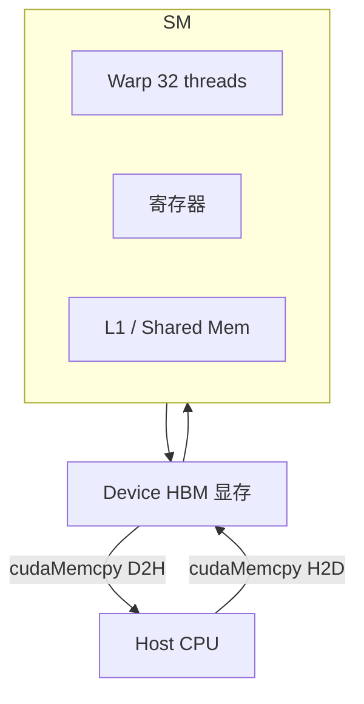

# GPU 架构与 CUDA 编程入门

> **文件编码**：UTF-8。  
> **前置**：[01 线性代数](01-线性代数与数值计算基础.md)、[C++ 01～02](../C++/01-C++基础语法与数据类型.md)、[Linux 01](../Linux/01-Linux入门与环境搭建.md)。  
> **定位**：第一个可运行的 CUDA 程序；理解 SM、线程、显存，为 04～05 章 kernel 优化奠基。

---

## 0. 读前导读

### 0.1 用一句话弄懂本章

**CUDA** = 用 C++ 语法写能在 NVIDIA GPU 上并行执行的 **kernel 函数**，通过 **host（CPU）** 调度 **device（GPU）** 计算。

### 0.2 你需要提前知道什么

- 会 C++ 指针、数组、函数（[C++ 02](../C++/02-指针引用与内存管理.md)）
- Linux/WSL 或 Windows + CUDA Toolkit
- 机器有 NVIDIA GPU 且驱动已装（见 00 章 §4）

### 0.3 本章知识地图（☐→☑）

- [ ] 成功编译运行 vector_add kernel
- [ ] 解释 Grid / Block / Thread 关系
- [ ] 写出 `cudaMalloc` / `cudaMemcpy` / `cudaFree` 流程
- [ ] 用 `nvidia-smi` 查看 GPU 占用
- [ ] 完成 §13 闭卷自测 ≥8/10

### 0.4 建议学习时长

- **5～7 天**（无 GPU 可用云实例做实验）

---

## 1. 这份文档学什么

- GPU 硬件：SM、CUDA Core、Warp、HBM
- Host / Device 模型
- 第一个 kernel：向量加法
- nvcc 编译与错误排查
- CUDA 运行时 API 基础

---

## 2. GPU 架构概览



| 概念 | 说明 |
|------|------|
| **SM** | Streaming Multiprocessor，调度基本单元 |
| **Warp** | 32 线程同步执行（SIMT） |
| **HBM** | 高带宽显存，容量大但延迟高 |
| **Occupancy** | 活跃 warp 比例，影响隐藏延迟（04 章） |

与 [C++ 22 体系结构](../C++/22-计算机体系结构导读.md) 的 CPU 缓存层次对照阅读。

---

## 3. CUDA 编程模型

- **Grid**：一次 kernel 启动的所有 block
- **Block**：线程协作单元，共享 shared memory
- **Thread**：最小执行单元

```cpp
// 核函数在 GPU 执行
__global__ void vec_add(const float* a, const float* b, float* c, int n) {
    int i = blockIdx.x * blockDim.x + threadIdx.x;
    if (i < n) c[i] = a[i] + b[i];
}
```

索引公式：`i = blockIdx.x * blockDim.x + threadIdx.x`（1D 情况）。

---

## 4. 完整示例：vector_add.cu

```cpp
#include <cuda_runtime.h>
#include <cstdio>

__global__ void vec_add(const float* a, const float* b, float* c, int n) {
    int i = blockIdx.x * blockDim.x + threadIdx.x;
    if (i < n) c[i] = a[i] + b[i];
}

#define CUDA_CHECK(call) do { \
    cudaError_t err = (call); \
    if (err != cudaSuccess) { \
        fprintf(stderr, "CUDA error %s:%d: %s\n", __FILE__, __LINE__, \
                cudaGetErrorString(err)); exit(1); \
    } \
} while(0)

int main() {
    const int n = 1 << 20;  // 1M
    size_t bytes = n * sizeof(float);

    float *h_a = new float[n], *h_b = new float[n], *h_c = new float[n];
    for (int i = 0; i < n; ++i) { h_a[i] = 1.f; h_b[i] = 2.f; }

    float *d_a, *d_b, *d_c;
    CUDA_CHECK(cudaMalloc(&d_a, bytes));
    CUDA_CHECK(cudaMalloc(&d_b, bytes));
    CUDA_CHECK(cudaMalloc(&d_c, bytes));

    CUDA_CHECK(cudaMemcpy(d_a, h_a, bytes, cudaMemcpyHostToDevice));
    CUDA_CHECK(cudaMemcpy(d_b, h_b, bytes, cudaMemcpyHostToDevice));

    int threads = 256;
    int blocks = (n + threads - 1) / threads;
    vec_add<<<blocks, threads>>>(d_a, d_b, d_c, n);
    CUDA_CHECK(cudaGetLastError());
    CUDA_CHECK(cudaDeviceSynchronize());

    CUDA_CHECK(cudaMemcpy(h_c, d_c, bytes, cudaMemcpyDeviceToHost));

    printf("c[0]=%f c[%d]=%f (expect 3.0)\n", h_c[0], n - 1, h_c[n - 1]);

    cudaFree(d_a); cudaFree(d_b); cudaFree(d_c);
    delete[] h_a; delete[] h_b; delete[] h_c;
    return 0;
}
```

---

## 5. 手把手：编译与运行

### 5.1 环境检查

```bash
nvcc --version
# 预期：Cuda compilation tools, release 12.x

nvidia-smi
# 预期：显示 GPU 名称、Driver Version、显存
```

### 5.2 编译

```bash
cd ~/cuda_lab
nvcc -O2 -std=c++17 -o vec_add vector_add.cu
./vec_add
```

**预期输出**：

```text
c[0]=3.000000 c[1048575]=3.000000 (expect 3.0)
```

### 5.3 常见错误

| 现象 | 原因 | 处理 |
|------|------|------|
| `nvcc: command not found` | Toolkit 未装或未进 PATH | 安装 CUDA Toolkit，export PATH |
| `no kernel image` | 架构不匹配 | `nvcc -arch=sm_86` 等 |
| 输出全 0 | 未 sync 或越界 | 加 `cudaDeviceSynchronize` |
| `invalid device function` | GPU 太老 / arch 错 | 查 [CUDA 兼容性表](https://docs.nvidia.com/cuda/cuda-c-programming-guide/index.html) |

### 5.4 Windows（PowerShell）

```powershell
nvcc -O2 -std=c++17 -o vec_add.exe vector_add.cu
.\vec_add.exe
```

---

## 6. 执行配置

```cpp
vec_add<<<gridDim, blockDim, sharedMemBytes, stream>>>(...);
```

- `blockDim.x` 常用 **128、256、512**（32 的倍数，整 warp）
- `gridDim.x = ceil(n / blockDim.x)`
- 04 章讲 2D/3D grid 与 shared memory

---

## 7. 内存拷贝方向

| 枚举 | 方向 |
|------|------|
| `cudaMemcpyHostToDevice` | CPU → GPU |
| `cudaMemcpyDeviceToHost` | GPU → CPU |
| `cudaMemcpyDeviceToDevice` | GPU → GPU |

**Pinned Memory**（Page-locked）可加速 H2D/D2H（06 章零拷贝延伸）。

---

## 8. 与 LLM Infra 的关系

| LLM 组件 | CUDA 对应 |
|----------|-----------|
| GEMM | cuBLAS / CUTLASS（05 章） |
| Attention | 自定义 kernel / FlashAttention |
| LayerNorm | elementwise kernel |
| KV Cache 写入 | memcpy / 自定义 append kernel |
| 多卡 | NCCL（10 章） |

PyTorch 的 `tensor.cuda()` 底层即类似 `cudaMalloc` + `cudaMemcpy`。

---

## 9. 调试技巧

```bash
# 计算能力
nvidia-smi --query-gpu=compute_cap --format=csv

# CUDA-GDB（Linux）
cuda-gdb ./vec_add
```

`printf` 在 kernel 内可用（调试，影响性能）：

```cpp
if (i == 0) printf("block %d thread %d\n", blockIdx.x, threadIdx.x);
```

---

## 10. 练习建议

1. 修改 n=10，单 block 10 线程，打印每个 thread 的 i
2. 实现 `vec_scale`：`c[i] = a[i] * scalar`
3. 故意去掉 `if (i < n)`，观察 n 非 256 倍数时的越界
4. 用 `nvidia-smi dmon` 运行大 n 时看 GPU 利用率

---

## 11. 学完标准

- [ ] 独立写出 malloc/memcpy/launch/sync/free 全流程
- [ ] 解释 SIMT 与 warp 宽度 32
- [ ] 根据 n 计算 blocks 数量
- [ ] 排查一次 arch mismatch 编译错误
- [ ] 说明 kernel 与 host 函数调用区别

---

## 12. FAQ

**Q1：CUDA 和 OpenCL 学哪个？**  
LLM Infra 岗 **CUDA 为主**；ROCm 了解即可。

**Q2：必须会 Linux 吗？**  
生产与 profiling 多在 Linux；Windows 可学语法，建议 WSL2 + GPU passthrough。

**Q3：`__global__` / `__device__` 区别？**  
`__global__`：host 可调，返回 void；`__device__`：仅 device 调。

**Q4：能否在 kernel 里 malloc？**  
不建议；用预先 `cudaMalloc` 的 pool。

**Q5：block 越大越好吗？**  
否；受寄存器、shared mem 限制 occupancy（04 章）。

**Q6：PyTorch 还要学 CUDA 吗？**  
推理引擎/算子岗 **必须**；纯 Python 训练岗可浅尝。

**Q7：Integrated GPU 能学吗？**  
NVIDIA 独显才行；无卡用云 GPU。

**Q8：cudaError_t 要每次都查吗？**  
工程代码要；学习期用 `CUDA_CHECK` 宏。

**Q9：stream 是什么？**  
异步执行队列；多 stream 重叠 H2D/计算（04 章）。

**Q10：vector_add 和 cuBLAS 关系？**  
加法带宽 bound；GEMM 用 cuBLAS（05 章）。

---

## 13. 闭卷自测

1. CUDA 中谁调用 kernel？
2. 线程全局索引公式（1D）？
3. Warp 大小？
4. H2D 拷贝 API 名称？
5. 为何需要 `cudaDeviceSynchronize`？
6. SM 是什么缩写？
7. `<<<blocks, threads>>>` 第一个参数含义？
8. kernel 能否 return 值给 host？
9. 显存分配 API？
10. n=1000, threads=256，blocks 多少？

<details>
<summary>参考答案</summary>

1. Host（CPU）代码。
2. `blockIdx.x * blockDim.x + threadIdx.x`。
3. 32。
4. `cudaMemcpy(..., cudaMemcpyHostToDevice)`。
5. 默认 kernel 异步；读结果前需等 GPU 完成。
6. Streaming Multiprocessor。
7. grid 中 block 数量（x 维）。
8. 不能；通过 device 内存传结果。
9. `cudaMalloc` / `cudaFree`。
10. `(1000 + 256 - 1) / 256 = 4`。

</details>

---

## 14. 下一章预告

03 章跑通了第一个 kernel——**线程如何协作？shared memory 怎么避免 bank conflict？** 04 章深入 CUDA 内存层次与核函数优化入门。

---

*下一章：[04 CUDA 核函数线程层次与内存模型](04-CUDA核函数线程层次与内存模型.md)*
