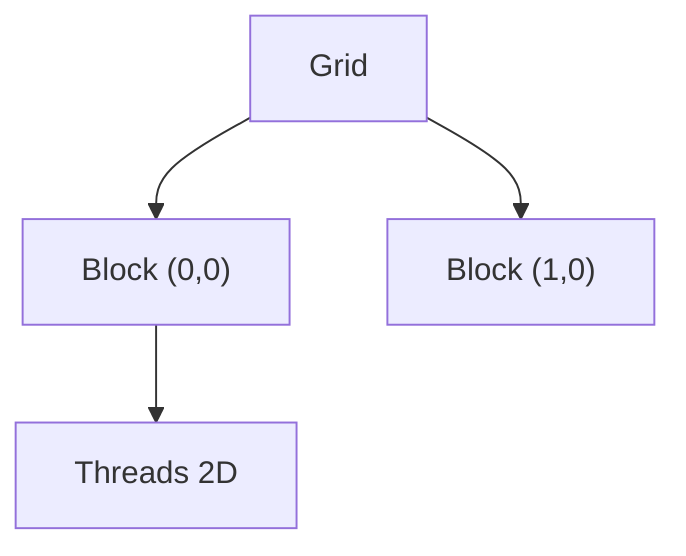

# CUDA 核函数、线程层次与内存模型

> **文件编码**：UTF-8。  
> **前置**：[03 GPU 与 CUDA 入门](03-GPU架构与CUDA编程入门.md)、[01 线性代数](01-线性代数与数值计算基础.md)。  
> **定位**：Shared Memory、合并访问、Occupancy、Stream——写出比 naive 快数倍的 reduction / tile GEMM 雏形。

---

## 0. 读前导读

### 0.1 用一句话弄懂本章

**内存模型** = GPU 上数据放哪（Register / Shared / L2 / HBM）决定 kernel **能跑多快**；**线程层次** = 如何用 block 内协作减少全局内存访问。

### 0.2 你需要提前知道什么

- 03 章 vector_add 能编译运行
- 理解 Row-major 数组（[01 章](01-线性代数与数值计算基础.md)）

### 0.3 本章知识地图（☐→☑）

- [ ] 画出 CUDA 内存层次图
- [ ] 实现 shared memory 归约并对比 naive 版
- [ ] 解释 coalesced vs strided 访问
- [ ] 说明 bank conflict 成因与避免
- [ ] 完成 §13 闭卷自测 ≥8/10

### 0.4 建议学习时长

- **7～10 天**（CUDA 核心难点，慢学）

---

## 1. 这份文档学什么

- 线程层次：Grid → Block → Thread，2D 索引
- 寄存器、Local、Shared、Global、Constant 内存
- Memory coalescing 与对齐
- Shared memory bank conflict
- Occupancy 与 `__launch_bounds__`
- CUDA Stream 与异步

---

## 2. 线程层次与索引

```cpp
// 2D 矩阵元素：row-major C[row][col]
__global__ void mat_set(float* C, int rows, int cols, float v) {
    int col = blockIdx.x * blockDim.x + threadIdx.x;
    int row = blockIdx.y * blockDim.y + threadIdx.y;
    if (row < rows && col < cols)
        C[row * cols + col] = v;
}

// launch: dim3 block(16,16); dim3 grid((cols+15)/16, (rows+15)/16);
```



---

## 3. CUDA 内存模型

| 类型 | 位置 | 生命周期 | 带宽 | 典型用途 |
|------|------|----------|------|----------|
| Register | SM 内 | thread | 最快 | 标量、循环变量 |
| Local | 近 SM | thread | 慢（可能 spill） | 大数组 → 溢出到 local |
| **Shared** | SM 内 | block | 高 | Tile 缓存、归约 |
| Global (HBM) | 设备 | 应用 | 相对低 | 大 tensor |
| Constant | 常量区 | 应用 | 有 cache | 小常量 |

**LLM kernel 优化核心**：把 HBM 数据 **复用到 Shared/Register**，提高算术强度（05 章 Roofline）。

---

## 4. Memory Coalescing（合并访问）

Warp 内 32 线程若访问 **连续 32 个 4-byte 字**，合并为少量 cache line 事务。

```cpp
// 好：thread i 访问 a[i]
__global__ void good(const float* a, float* b, int n) {
    int i = blockIdx.x * blockDim.x + threadIdx.x;
    if (i < n) b[i] = a[i] * 2.f;
}

// 差：stride 访问 a[i * stride]
```

Attention 中不规则访存是优化难点（15 章 FlashAttention 分块）。

---

## 5. Shared Memory 与 Bank Conflict

Shared memory 按 **4-byte bank** 组织，宽度 32 banks。

- 若 warp 内多线程访问 **同一 bank 不同地址** → **bank conflict**，串行化
- 避免：padding `__shared__ float tile[TILE+1][TILE]`

---

## 6. 手把手：Block 归约求和

### 6.1 Naive 全局原子（慢）

```cpp
__global__ void sum_atomic(const float* in, float* out, int n) {
    int i = blockIdx.x * blockDim.x + threadIdx.x;
    if (i < n) atomicAdd(out, in[i]);
}
```

### 6.2 Shared Memory 树形归约

```cpp
__global__ void sum_block(const float* in, float* block_out, int n) {
    __shared__ float sdata[256];
    int tid = threadIdx.x;
    int i = blockIdx.x * blockDim.x + threadIdx.x;

    sdata[tid] = (i < n) ? in[i] : 0.f;
    __syncthreads();

    for (int s = blockDim.x / 2; s > 0; s >>= 1) {
        if (tid < s) sdata[tid] += sdata[tid + s];
        __syncthreads();
    }
    if (tid == 0) block_out[blockIdx.x] = sdata[0];
}
```

Host 端对 `block_out` 再 CPU 求和或二次 kernel。

### 6.3 编译运行

```bash
nvcc -O2 -arch=sm_86 -o reduce reduce.cu
./reduce
```

**预期输出**（n=1M，输入全 1）：

```text
sum = 1048576.000000 (expect 1048576)
naive time vs block reduce: block reduce faster on large n
```

用 `cudaEvent_t` 计时可量化加速比。

---

## 7. Occupancy

Occupancy = 每 SM 活跃 warp / 最大 warp 数。

限制因素：

- 每 block 线程数
- 每 thread 寄存器用量
- Shared memory 用量

```cpp
__launch_bounds__(256, 2)  // 每 block 最多 256 thread，每 SM 至少 2 block
__global__ void foo() { ... }
```

工具：`nvcc --ptxas-options=-v` 看寄存器；Nsight Compute（17 章）。

---

## 8. Constant Memory 与 `__restrict__`

```cpp
__constant__ float c_scale;

__global__ void scale_k(const float* __restrict__ in, float* __restrict__ out, int n) {
    int i = blockIdx.x * blockDim.x + threadIdx.x;
    if (i < n) out[i] = in[i] * c_scale;
}
```

`__restrict__` 告诉编译器指针不别名，利于 load 优化。

---

## 9. CUDA Streams

```cpp
cudaStream_t s0, s1;
cudaStreamCreate(&s0);
cudaStreamCreate(&s1);
kernel<<<grid, block, 0, s0>>>(...);
kernel<<<grid, block, 0, s1>>>(...);
cudaStreamSynchronize(s0);
```

**LLM Serving**：H2D 下一 batch 权重/输入与当前 batch 计算重叠（16 章）。

---

## 10. Naive Tile GEMM 片段（预告 05 章）

```cpp
#define TILE 16
__global__ void gemm_tile(const float* A, const float* B, float* C,
                          int M, int N, int K) {
    __shared__ float As[TILE][TILE];
    __shared__ float Bs[TILE][TILE];
    int row = blockIdx.y * TILE + threadIdx.y;
    int col = blockIdx.x * TILE + threadIdx.x;
    float acc = 0.f;
    for (int t = 0; t < (K + TILE - 1) / TILE; ++t) {
        // load tile to shared ...
        __syncthreads();
        // compute partial dot ...
        __syncthreads();
    }
    if (row < M && col < N) C[row * N + col] = acc;
}
```

完整实现作 05 章练习；生产用 CUTLASS/cuBLAS。

---

## 11. 练习建议

1. 实现 `transpose` naive vs shared tile，对比带宽
2. 用 `cudaEvent` 测 vector_add 与 reduce 耗时
3. 故意制造 bank conflict（`sdata[threadIdx.x][0]`），Nsight 看 stall
4. 阅读 cuBLAS 文档中 leading dimension `lda` 含义

---

## 12. 学完标准

- [ ] 手写 2D thread 索引
- [ ] 解释 `__syncthreads()` 必要性
- [ ] 说出 coalescing 直观条件
- [ ] 完成 block reduce 实验并有 timing
- [ ] 描述 Occupancy 受哪些资源限制

---

## 13. FAQ

**Q1：Shared memory 大小？**  
常见每 SM 48～228 KB，与 GPU 型号相关；过大降 occupancy。

**Q2：为何 atomic 慢？**  
串行更新同一地址；归约应用 shared 树形再写一次。

**Q3：Global memory 有 cache 吗？**  
有 L2；只读数据可用 `__ldg`（只读 cache hint，视架构）。

**Q4：block 内 thread 能跨 block 同步吗？**  
不能；仅 `__syncthreads()` 块内。

**Q5：warp divergence 是什么？**  
分支导致 warp 内线程走不同路径，降低效率；Attention mask 需注意。

**Q6：Unified Memory（cudaMallocManaged）要学吗？**  
入门知道即可；推理引擎多用显式分配（06 章）。

**Q7：LLM 算子为何强调融合？**  
减 HBM 读写次数（LayerNorm+Linear+Activation 一条 kernel）。

**Q8：leading dimension 是什么？**  
Row-major 矩阵 **行 stride**；子矩阵视图常用 lda > 列数。

**Q9：如何选 block size？**  
256 常见起点；用 occupancy calculator 调。

**Q10：CPU-GPU 同步点过多会怎样？**  
Pipeline 断裂，吞吐下降；Serving 用 stream batching。

---

## 14. 闭卷自测

1. Shared memory 作用域？
2. `__syncthreads()` 调用位置约束？
3. Coalesced 访问直观描述？
4. Bank conflict 发生条件？
5. Occupancy 低常见原因？
6. Stream 作用？
7. Register spill 后果？
8. 2D grid 中 blockIdx.y 含义？
9. atomicAdd 适用场景？
10. Tile GEMM 为何用 shared memory？

<details>
<summary>参考答案</summary>

1. Block 内所有 thread 共享，block 结束即失效。
2. 必须在 block 内所有 thread 可达路径；不可分支内仅部分 thread 调用。
3. Warp 访问连续对齐地址，合并为宽事务。
4. 同一 warp 多线程访问同一 bank 不同 word（无 broadcast 时）。
5. 寄存器/shared 用量高、block 太大。
6. 异步队列，重叠拷贝与计算。
7. 寄存器溢出到 local memory，变慢。
8. Grid 中 block 的行方向索引。
9. 少量全局累加、histogram 等；大规模求和优先归约。
10. 复用 A/B 子块，减少对 HBM 重复读取。

</details>

---

## 15. 下一章预告

04 章掌握了内存与协作——**矩阵乘占 LLM 算力大头，如何用 cuBLAS 与分块 GEMM 逼近峰值？** 05 章进入 cuBLAS、Roofline 与 Tensor Core 入门。

---

*下一章：[05 矩阵运算 cuBLAS 与 GEMM 优化入门](05-矩阵运算cuBLAS与GEMM优化入门.md)*
