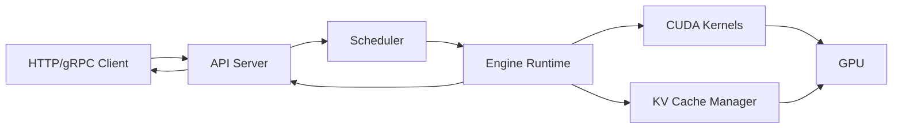

# 大模型推理引擎架构概览

> **文件编码**：UTF-8。  
> **前置**：[02 Transformer](02-Transformer与注意力机制原理.md)、[05 cuBLAS](05-矩阵运算cuBLAS与GEMM优化入门.md)、[06 高性能 C++](06-高性能C++对齐零拷贝与SIMD入门.md)。  
> **定位**：从请求到 token 的完整链路；对比 vLLM、TensorRT-LLM、llama.cpp 分层，为 08～09、14 章源码阅读定框架。

---

## 0. 读前导读

### 0.1 用一句话弄懂本章

**推理引擎** = 把静态权重 + 动态 KV + 调度策略，组织成 **低延迟、高吞吐** 的 token 生成流水线——不是简单 `model.forward()`。

### 0.2 你需要提前知道什么

- 02 章 Prefill/Decode、07 章前各 CUDA 基础
- 可选：[AIAgent 21 本地推理](../AIAgent/21-MCP-A2A协议与本地推理部署.md)

### 0.3 本章知识地图（☐→☑）

- [ ] 画出 Request → Scheduler → Worker → Token 数据流
- [ ] 区分 Prefill 与 Decode 调度差异
- [ ] 列出引擎四层：API / Scheduler / Runtime / Kernels
- [ ] 对比 3 种开源引擎特点
- [ ] 完成 §12 闭卷自测 ≥8/10

### 0.4 建议学习时长

- **4～5 天**

---

## 1. 这份文档学什么

- 推理 vs 训练系统差异
- 引擎分层架构
- 计算图与算子融合
- 批处理、连续批处理概念
- 主流引擎对比
- C++ 推理 runtime 伪结构

---

## 2. 推理 vs 训练

| 维度 | 训练 | 推理 |
|------|------|------|
| 目标 | 收敛、吞吐 | 延迟、成本 |
| 精度 | FP32/BF16 混合 | FP16/INT8/FP8 |
| 内存 | 参数+梯度+优化器 | 参数+KV Cache |
| 并行 | DP/TP/PP（10 章） | 多请求 batch、TP 推理 |
| 图 | 动态 autograd | 静态/半静态图 |

---

## 3. 端到端数据流



1. **Tokenize** prompt
2. **Prefill**：并行算 prompt，填充 KV
3. **Decode** 循环：采样 → append token → 停止条件
4. **Detokenize** 流式返回

---

## 4. 四层架构

### 4.1 API 层

- OpenAI-compatible `/v1/completions`、`/v1/chat/completions`
- 流式 SSE、gRPC streaming（11 章）
- 鉴权、限流（系统 design）

### 4.2 Scheduler 层

- 请求队列、优先级
- **Continuous Batching**：完成序列退出、新请求插入（16 章）
- Prefill/Decode **分离调度**（chunked prefill）

### 4.3 Runtime 层

- 模型加载（mmap、safetensors、GGUF）
- 张量生命周期、设备 placement
- 采样：temperature、top-p、top-k
- 投机解码（draft model）可选

### 4.4 Kernel 层

- cuBLAS/CUTLASS GEMM
- FlashAttention / PagedAttention
- 量化 kernel（09 章）
- Custom all-reduce（多卡 TP）

---

## 5. 计算图与算子

```text
For each layer:
  RMSNorm → QKV GEMM → RoPE → Attention → O-proj
         → RMSNorm → FFN (gate/up/down) → residual
```

**融合**：LayerNorm+Linear、SiLU+Mul（SwiGLU）合并 kernel，减 HBM 往返。

**图捕获**：CUDA Graph 固定 decode shape 时降低 launch overhead。

---

## 6. 引擎对比

| 引擎 | 语言 | 强项 | 典型场景 |
|------|------|------|----------|
| **vLLM** | Py+CUDA | PagedAttention、易用 | 研究、Serving |
| **TensorRT-LLM** | C++/CUDA | TRT 优化、低延迟 | 生产 NVIDIA |
| **llama.cpp** | C/C++ | CPU/GGUF、边缘 | 本地、嵌入式 |
| **TGI** | Rust+Py | HF 生态 | 云托管 |
| **SGLang** | Py | RadixAttention | 复杂 prompt 共享 |

14 章深入源码目录。

---

## 7. C++ Runtime 骨架（教学伪代码）

```cpp
struct Request {
    int id;
    std::vector<int> prompt_tokens;
    int max_new_tokens;
};

class InferenceEngine {
public:
    void load_weights(const std::string& path);  // mmap
    void enqueue(Request req);

    // 一步调度：可能混合 prefill + decode batch
    void step();

private:
    Scheduler scheduler_;
    KVCacheManager kv_;
    ModelRunner runner_;  // 调 CUDA kernels
};

void InferenceEngine::step() {
    Batch batch = scheduler_.build_batch();
    if (batch.has_prefill())
        runner_.prefill(batch, kv_);
    if (batch.has_decode())
        runner_.decode(batch, kv_);
    scheduler_.update_finished(batch);
}
```

与 [C++ 03 OOP](../C++/03-面向对象与类设计.md) 类设计呼应。

---

## 8. 性能指标

| 指标 | 含义 |
|------|------|
| **TTFT** | Time To First Token，prefill 延迟 |
| **TPOT** | Time Per Output Token，decode 延迟 |
| **Throughput** | tokens/s，整机房 |
| **MFU** | Model FLOPs Utilization |

优化往往 **TTFT 与 TPOT 权衡**（chunked prefill、max batch）。

---

## 9. 多卡推理简述

- **Tensor Parallelism**：单层切分到多 GPU，all-reduce（10 章）
- **Pipeline Parallelism**：层切分，micro-batch
- **Expert Parallel**（MoE）：路由到不同 GPU

单卡 7B FP16 ≈ 14GB 权重；72B 需 TP 或量化。

---

## 10. 练习建议

1. 画一张你理解的 vLLM 模块图（对照官方架构 blog）
2. 用 `curl` 调本地 OpenAI API，观察 stream chunk 时间间隔
3. 读 vLLM `vllm/engine/llm_engine.py` 的 `step()` 一次
4. 列表：Prefill 算 bound vs Decode 算 bound 各 3 因素

---

## 11. 学完标准

- [ ] 白板画四层架构
- [ ] 解释 TTFT/TPOT
- [ ] 说出 Continuous Batching 价值
- [ ] 对比 vLLM 与 llama.cpp 定位
- [ ] 指出 KV 管理在架构中的位置

---

## 12. FAQ

**Q1：推理引擎和 PyTorch 关系？**  
PyTorch 是框架；引擎是 **Serving 优化栈**（调度+KV+融合 kernel）。

**Q2：为何要 C++ runtime？**  
Python GIL、launch 开销、内存控制；生产路径 C++/CUDA。

**Q3：ONNX Runtime 算 LLM 引擎吗？**  
可跑小模型；大 LLM 主流专用引擎。

**Q4：Speculative decoding？**  
小 draft 模型猜 token，大模型验证，降 TPOT。

**Q5：Prefix caching？**  
相同 system prompt 共享 KV（SGLang RadixAttention）。

**Q6：Engine 如何选 max batch？**  
显存模型：权重+KV+激活；OOM 则减 batch。

**Q7：LoRA serving？**  
基础权重共享 + 动态 adapter GEMM；调度需合并 batch 同 LoRA。

**Q8：CPU fallback？**  
llama.cpp；GPU 引擎一般要求 CUDA。

**Q9：图优化谁做？**  
TensorRT-LLM builder；vLLM 部分 torch compile / 手写 fusion。

**Q10：和 Triton Inference Server？**  
Triton 是 **通用** serving 框架；后端可挂 TRT-LLM/vLLM backend。

---

## 13. 闭卷自测

1. 推理引擎四层？
2. TTFT 主要受哪阶段影响？
3. Continuous Batching 解决什么？
4. Prefill 典型 compute/memory 特征？
5. Decode 典型瓶颈？
6. vLLM 成名的内存技术？（08 章）
7. llama.cpp 主打哪种部署？
8. CUDA Graph 优化什么开销？
9. 算子融合减少什么？
10. TP 推理需要哪种集合通信？

<details>
<summary>参考答案</summary>

1. API / Scheduler / Runtime / Kernels。
2. Prefill（prompt 长度、并行度）。
3. GPU 空泡；动态组 batch 提吞吐。
4. 大 GEMM，偏 compute bound。
5. KV 访存、小 batch GEMM，偏 memory bound。
6. PagedAttention。
7. CPU/GGUF 本地与边缘。
8. Kernel launch 与 CPU 提交开销。
9. HBM 读写次数。
10. All-reduce（部分层需 all-gather）。

</details>

---

## 14. 下一章预告

07 章鸟瞰了引擎全局——**KV Cache 如何吃掉显存？PagedAttention 如何像 OS 分页一样管理 block？** 08 章专讲 KV Cache 与 vLLM 核心思想。

---

*下一章：[08 KV Cache 与 PagedAttention 原理](08-KVCache与PagedAttention原理.md)*
