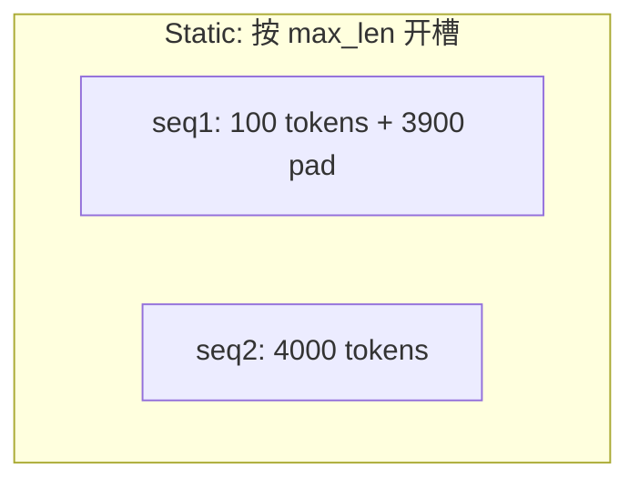

# KV Cache 与 PagedAttention 原理

> **文件编码**：UTF-8。  
> **前置**：[02 Transformer](02-Transformer与注意力机制原理.md)、[07 推理引擎](07-大模型推理引擎架构概览.md)、[04 CUDA 内存](04-CUDA核函数线程层次与内存模型.md)。  
> **定位**：LLM 推理第一内存瓶颈；理解 block 表、物理块池、fragmentation，对齐 vLLM 源码阅读。

---

## 0. 读前导读

### 0.1 用一句话弄懂本章

**KV Cache** = 存每层 Attention 的 K/V 历史，避免 Decode 重复计算；**PagedAttention** = 像虚拟内存一样 **非连续 block** 分配 KV，消除 padding 浪费。

### 0.2 你需要提前知道什么

- 02 章 Prefill/Decode、GQA
- 07 章 Scheduler 概念

### 0.3 本章知识地图（☐→☑）

- [ ] 估算 7B 模型 KV 显存公式
- [ ] 解释 static batch padding 浪费
- [ ] 画出 logical block → physical block 映射
- [ ] 说明 block size 权衡
- [ ] 完成 §12 闭卷自测 ≥8/10

### 0.4 建议学习时长

- **4～6 天**

---

## 1. 这份文档学什么

- KV Cache 张量形状与生命周期
- Static vs Continuous batching 的 KV 问题
- PagedAttention block 设计
- Block table 与 slot mapping
- Prefix caching 延伸
- 简化 C++ 分配器伪代码

---

## 2. KV Cache 是什么

Decode 步 t，只需为新 token 算 **q_t**，与 **K_{1:t}, V_{1:t}** 做 attention。

**缓存**：每层保存 K/V，形状示意（GQA 下 K/V head 数可能更少）：

```text
K: [num_layers, batch, num_kv_heads, seq_len, head_dim]
V: 同上
```

**不写 Cache**：每步重算 1..t 的 K/V → O(t) 冗余/步，总 O(n²)。

---

## 3. 显存估算

FP16 KV 近似：

\[
\text{Bytes} = 2 \times L \times B \times S \times H_kv \times D_h \times 2
\]

- 2：K+V  
- 最后 2：FP16 字节  

例：L=32, B=8, S=4096, H_kv=8（GQA）, D_h=128：

```text
2 * 32 * 8 * 4096 * 8 * 128 * 2 ≈ 4.3 GB（仅 KV）
```

长上下文 + 大 batch 易 OOM。

---

## 4. Static Batching 的浪费

固定 batch=8，序列长度 [100, 4000, 200, ...]：

- 按 **max_seq=4096** 分配 → 短序列 **padding 空块**
- 序列结束仍占 slot 直到整批结束



**Continuous Batching** 释放 finished 序列，但 KV **物理布局** 仍需高效管理 → PagedAttention。

---

## 5. PagedAttention 核心思想

借鉴 OS **虚拟内存**：

| OS | vLLM |
|----|------|
| 虚拟页 | **逻辑 block**（固定 token 数，如 16） |
| 物理页帧 | **GPU 物理 block** |
| 页表 | **block table** per sequence |

- 物理块在 **全局 pool** 中按需分配
- 逻辑连续、物理可不连续
- Kernel 通过 block table 索引物理块

---

## 6. Block Table 示意

序列长度 35，block_size=16：

| 逻辑 block id | 物理 block id |
|---------------|---------------|
| 0 | 7 |
| 1 | 2 |
| 2 | 15 |

第三块仅 3 个有效 token，仍占一整物理块（内部浪费小于 padding 4096）。

```cpp
// 简化：每序列一行 block table
struct Sequence {
    int seq_id;
    std::vector<int> logical_len;
    std::vector<int> block_table;  // physical block ids
};

class BlockAllocator {
    std::vector<int> free_blocks_;
public:
    int allocate_block();       // pop free
    void free_block(int id);    // push free
    bool can_allocate(int n_blocks) const;
};
```

---

## 7. Attention Kernel 如何读 Paged KV

标准：`K[batch, head, seq, dim]` 连续。

Paged：`K_cache[ num_blocks, num_kv_heads, block_size, head_dim ]`

根据 `block_table[seq][logical_block]` 找物理块 + 块内 offset。

**vLLM** 在 `paged_attention_v1/v2` CUDA kernel 中实现；seq_len 分块 reduce（v2 长序列）。

---

## 8. Block Size 选择

| 大 block | 小 block |
|----------|----------|
| 元数据少 | 内部碎片少 |
| 内部碎片多 | block table 长、索引开销 |

常见 **16～32 tokens/block**；与 warp、shared mem tile 对齐有关。

---

## 9. GQA / MQA 与 KV

- **MHA**：num_kv_heads = num_heads  
- **GQA**：num_kv_heads < num_heads，KV 显存 ↓  
- **MQA**：num_kv_heads = 1  

Llama-2/3、Qwen 等多用 GQA——Infra 必问。

---

## 10. Prefix Caching（延伸）

多请求共享相同 prefix（system prompt）：

- **RadixAttention**（SGLang）：radix tree 共享 KV 块  
- vLLM **Automatic Prefix Caching**：hash block 内容复用物理块  

降 Prefill 重复计算。

---

## 11. 练习建议

1. 手算：13B, L=40, S=8192, FP16, MHA → KV GB
2. 读 vLLM `vllm/core/block_manager.py` 类名与职责
3. 画 3 序列、block_size=4 的 block table 分配图
4. 对比「连续 KV tensor」与 paged 的 memcpy 需求（append token）

---

## 12. 学完标准

- [ ] 白板画 block pool + block table
- [ ] 解释 static padding 浪费比例例子
- [ ] 写出 KV 显存公式
- [ ] 说明 PagedAttention 对 kernel 的额外 indirection
- [ ] 区分 Continuous Batching 与 PagedAttention 各解决什么

---

## 13. FAQ

**Q1：KV 存 CPU 行吗？**  
可 offload（ZeRO-Infer 等），延迟↑；主流 GPU HBM。

**Q2：FP8 KV？**  
降带宽与容量；略损精度，长上下文常用。

**Q3：block 分配失败？**  
调度器 preempt 或拒绝新请求（vLLM waiting queue）。

**Q4：与 OS swap 类比极限？**  
GPU 上 swap 到 CPU 极慢；主要靠 block 复用与 quant。

**Q5：Prefill 写 KV 模式？**  
按 prompt token 追加 block；可能一次写多 block。

**Q6：Decode append 一步？**  
可能填满当前 block 末尾或新分配 block。

**Q7：多模态 KV？**  
视觉 token 同样进 cache；序列更长。

**Q8：block table 存在哪？**  
CPU 元数据 + GPU 拷贝给 kernel（或 unified 管理）。

**Q9：PagedAttention 论文作者？**  
vLLM 团队，OSDI 2023 相关实践。

**Q10：不用 vLLM 能否 paged？**  
TensorRT-LLM 等有类似 block 管理；思想通用。

---

## 14. 闭卷自测

1. KV Cache 存哪两个张量？
2. Decode 无 cache 的复杂度问题？
3. PagedAttention 类比 OS 的哪两概念？
4. block_table 作用？
5. GQA 相对 MHA 省什么？
6. Continuous batching 解决 GPU 什么？
7. block_size 过小副作用？
8. Prefix caching 优化哪阶段？
9. paged kernel 相对连续 KV 多做什么？
10. 8K context、32L、batch=4 时 KV 常占显存比例？

<details>
<summary>参考答案</summary>

1. K 和 V（每层）。
2. 每步重复算历史 K/V，浪费算力。
3. 虚拟页 vs 物理页帧；页表。
4. 逻辑 block 到物理 block 映射。
5. KV 显存与 decode 带宽。
6. 空泡（batch 内序列长短不一 finished 后槽位浪费）。
7. 表更长、索引与 launch 开销增。
8. 重复 prefix 的 prefill。
9. 通过表间接寻址物理 block。
10. 常接近或超过权重（长 context 时）。

</details>

---

## 15. 下一章预告

08 章解决了 **KV 放哪、怎么省**——**权重与激活如何用 INT8/FP8 再省一倍？校准怎么做？** 09 章进入模型量化。

---

*下一章：[09 模型量化 INT8-INT4-FP8 与校准](09-模型量化INT8-INT4-FP8与校准.md)*
