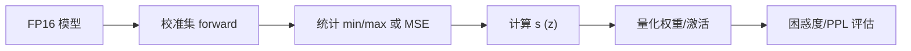

# 模型量化：INT8、INT4、FP8 与校准

> **文件编码**：UTF-8。  
> **前置**：[05 cuBLAS](05-矩阵运算cuBLAS与GEMM优化入门.md)、[06 高性能 C++](06-高性能C++对齐零拷贝与SIMD入门.md)、[07 推理引擎](07-大模型推理引擎架构概览.md)。  
> **定位**：权重/激活量化、PTQ/QAT、GPTQ/AWQ、FP8 训练推理；读懂 llama.cpp GGUF 与 TensorRT-LLM quant 路径。

---

## 0. 读前导读

### 0.1 用一句话弄懂本章

**量化** = 用更低 bit 表示权重/激活，换 **显存、带宽、吞吐**，代价是精度损失——靠 **校准（calibration）** 与 **per-channel scale** 控误差。

### 0.2 你需要提前知道什么

- GEMM 与 Tensor Core（05 章）
- FP16/BF16 格式（01 章）

### 0.3 本章知识地图（☐→☑）

- [ ] 区分 weight-only 与 W8A8
- [ ] 解释 symmetric/asymmetric 量化公式
- [ ] 描述 calibration 数据集作用
- [ ] 对比 INT4 GPTQ 与 INT8 PTQ
- [ ] 完成 §12 闭卷自测 ≥8/10

### 0.4 建议学习时长

- **5～7 天**

---

## 1. 这份文档学什么

- 量化基础：scale、zero point
- PTQ vs QAT
- INT8/INT4/FP8 格式与硬件支持
- Weight-only vs 全量化
- GPTQ、AWQ、SmoothQuant 直觉
- Calibration 流程
- C++ 反量化 GEMM 片段

---

## 2. 为什么量化

| 收益 | 说明 |
|------|------|
| 显存 | INT4 权重 ≈ FP16 的 1/4 |
| 带宽 | 读权重字节数 ↓ |
| 算力 | INT8/FP8 Tensor Core 峰值更高 |

7B FP16 ≈ 14GB；INT4 ≈ 3.5GB + scale 开销。

---

## 3. 线性量化公式

**Symmetric INT8**（常用权重）：

\[
q = \text{clip}\left(\text{round}\left(\frac{x}{s}\right), -128, 127\right),\quad x \approx s \cdot q
\]

**Asymmetric**（激活常遇）：

\[
q = \text{round}\left(\frac{x - z}{s}\right),\quad x \approx s \cdot q + z
\]

- **s**：scale  
- **z**：zero point  
- **Per-tensor** vs **per-channel**（沿 output channel 各一组 s，精度更好）

---

## 4. 量化粒度

| 方案 | 权重 | 激活 | 典型 |
|------|------|------|------|
| Weight-only INT4 | INT4 | FP16 | llama.cpp Q4_K_M |
| W8A8 | INT8 | INT8 | SmoothQuant |
| FP8 | FP8 | FP8 | H100 Transformer Engine |
| NVFP4 | 4bit | FP8 | Blackwell 一代 |

**Decode**：激活动态范围小 batch 波动大 → 激活量化更难。

---

## 5. PTQ vs QAT

| | PTQ（训练后） | QAT（训练中） |
|---|---------------|---------------|
| 成本 | 低，校准集即可 | 高，需重训/微调 |
| 精度 | INT4 权重量化常用 | 更好 |
| Infra | 引擎部署主流 | 训练框架 |

---

## 6. Calibration 流程



1. 准备 **128～512 条** 代表文本（Wiki、C4 子集）
2. 逐层或逐 tensor 跑 forward，收集激活分布
3. 选方法：**max**、**percentile 99.9**、**KL 散度**（TensorRT）
4. 写 scale 进 checkpoint sidecar

```python
# 示意：PyTorch 动态量化仅作理解，生产用 GPTQ/AutoAWQ
import torch
m = torch.nn.Linear(4096, 4096)
wq = torch.quantization.quantize_dynamic(m, {torch.nn.Linear}, dtype=torch.qint8)
```

---

## 7. GPTQ 与 AWQ（直觉）

**GPTQ**：逐列 Hessian 指导，一次 post-training 压到 INT4/INT3，存 scale + **g_idx**（可选）。

**AWQ**：认为 **1% 显著权重 channel** 更重要，缩放激活保护这些 channel 再 quant。

**Infra 阅读**：`AutoGPTQ`、`llama.cpp` 的 `ggml_type` 枚举。

---

## 8. FP8（E4M3 / E5M2）

H100 等支持 FP8 Tensor Core：

- **E4M3**：精度稍高，常用权重/激活  
- **E5M2**：动态范围大，常用梯度  

推理：`transformer_engine`、TRT-LLM FP8 checkpoint。

---

## 9. C++ Weight-Only 反量化乘（教学）

```cpp
// INT8 权重，FP16 激活的一列点积片段
float dot_int8_fp16(const int8_t* w, const float* x, int n, float scale_w) {
    int32_t acc = 0;
    for (int i = 0; i < n; ++i)
        acc += static_cast<int32_t>(w[i]) * static_cast<int32_t>(std::round(x[i] / scale_x));
    return static_cast<float>(acc) * scale_w * scale_x;
}
// 生产：整矩阵 INT8 GEMM + fusion scale（cublasLt）
```

真实 kernel 在 shared mem 反量化 pack 为 int8 tile。

---

## 10. GGUF 与 llama.cpp

| type | 约 bit | 说明 |
|------|--------|------|
| Q4_0 | 4.5 | 简单 block scale |
| Q4_K | ~4.5 | K-quant 混合 bit |
| Q8_0 | 8 | 更高精度 |

`mmap` 加载后直接 GPU/CPU kernel（06、14 章）。

---

## 11. 练习建议

1. 手写 symmetric quant：给定 float 向量，算 s，round 到 int8，反量化算 MSE
2. 用 `llama.cpp` 转换同一模型 Q4_K_M vs Q8_0，比 load 显存与 perplexity
3. 读 NVIDIA `cublasLtMatmul` INT8 文档摘要
4. 列表：weight-only 为何不影响训练框架

---

## 12. 学完标准

- [ ] 写出 symmetric 量化公式
- [ ] 解释 calibration 目的
- [ ] 区分 GPTQ 与 PTQ max-calib
- [ ] 说出 FP8 两种格式差异
- [ ] 解释 per-channel scale 优于 per-tensor 的原因

---

## 13. FAQ

**Q1：INT4 为何常 weight-only？**  
激活 per-token 动态范围大，INT4 误差累积明显。

**Q2：量化损智力吗？**  
PPL 略升；4bit 好方案常 <1% perplexity 增幅。

**Q3：KV Cache 能 INT4 吗？**  
可以 FP8/INT8 KV；需验证长文质量。

**Q4：SmoothQuant 做什么？**  
迁移激活难度到权重，使 W8A8 可行。

**Q5：TensorRT calibration 缓存？**  
entropy calibrator 层缓存 scale，build engine 时用。

**Q6：CPU 推理量化？**  
llama.cpp AVX2/NEON 专用 microkernel。

**Q7：量化与 TP 兼容？**  
各 rank 持分片量化权重；scale 随片走。

**Q8：NF4 vs INT4？**  
NF4 为 QLoRA 训练设计；推理常用 GPTQ/AWQ。

**Q9：如何评估 quant 模型？**  
PPL、MMLU 子集、业务 benchmark。

**Q10：FP16 权重还有必要吗？**  
精度敏感、小模型、调试 baseline。

---

## 14. 闭卷自测

1. symmetric 量化是否需要 zero point？
2. calibration 输入是什么？
3. weight-only INT4 主要省什么？
4. per-channel scale 沿哪维？
5. GPTQ 属于 PTQ 还是 QAT？
6. FP8 E4M3 相对 E5M2？
7. AWQ 保护哪类权重？
8. W8A8 相对 W4A16 算力特点？
9. GGUF Q4_K 用途？
10. 反量化 GEMM 在引擎哪层？

<details>
<summary>参考答案</summary>

1. 不需要，z=0。
2. 代表数据 forward 的样本集。
3. 权重显存与读带宽。
4. 通常 output channel（列）。
5. PTQ。
6. E4M3 精度更高；E5M2 范围更大。
7. 对激活影响大的 salient channel。
8. 激活也量化，Tensor Core INT8 吞吐高但标定难。
9. llama.cpp 常用 4bit 存储格式。
10. Kernel 层 fused dequant+GEMM。

</details>

---

## 15. 下一章预告

09 章压缩了 **单卡上的模型**——**多卡如何训练与通信？DP/TP/PP 与 NCCL 是什么？** 10 章进入分布式并行与 NCCL 入门。

---

*下一章：[10 分布式训练并行策略与 NCCL 入门](10-分布式训练并行策略与NCCL入门.md)*
