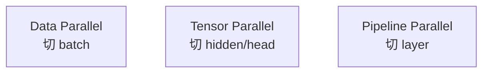

# 分布式训练：并行策略与 NCCL 入门

> **文件编码**：UTF-8。  
> **前置**：[05 GEMM](05-矩阵运算cuBLAS与GEMM优化入门.md)、[07 推理引擎](07-大模型推理引擎架构概览.md)、[Linux 07 网络](../Linux/07-网络命令与防火墙基础.md)。  
> **定位**：大模型训练与多卡推理的通信基础；DP/TP/PP/EP 策略与 NCCL 集合通信 API。

---

## 0. 读前导读

### 0.1 用一句话弄懂本章

**分布式训练** = 多 GPU/多机切分 **数据、参数、层**，用 **All-Reduce 等集合通信** 保持一致；**NCCL** = NVIDIA 多 GPU 通信库，PyTorch `distributed` 默认后端。

### 0.2 你需要提前知道什么

- GEMM 与张量 shape（01、05 章）
- 07 章 TP 推理简述

### 0.3 本章知识地图（☐→☑）

- [ ] 解释 DP、TP、PP 各切什么
- [ ] 画出 All-Reduce 数据流
- [ ] 写出 NCCL 初始化伪代码
- [ ] 估算 TP 通信量与 layer 关系
- [ ] 完成 §12 闭卷自测 ≥8/10

### 0.4 建议学习时长

- **5～7 天**

---

## 1. 这份文档学什么

- 为何需要并行（显存、算力）
- 数据并行 DP
- 张量并行 TP
- 流水线并行 PP
- 专家并行 EP（MoE）
- NCCL 集合通信原语
- 多机网络：NVLink、InfiniBand

---

## 2. 动机

单卡 80GB 放不下 175B 训练态（参数+梯度+优化器 ≈ 16× 参数量 FP16）。

**三路扩展**：



生产常 **3D 混合**：如 Megatron TP+PP+DP。

---

## 3. 数据并行（DP）

- 每卡 **完整模型副本**
- **不同 micro-batch** 数据
- 反向结束后 **All-Reduce 梯度**，同步更新

```text
GPU0: batch0 → grad0 ─┐
GPU1: batch1 → grad1 ─┼─ AllReduce(mean) → optimizer.step (同参)
GPU2: batch2 → grad2 ─┘
```

**ZeRO**（DeepSpeed）：分片 optimizer state，减显存，通信模式升级（12 章 checkpoint 相关）。

---

## 4. 张量并行（TP）

切单层大矩阵（Megatron-LM）：

**Column Parallel**：`Y = XA`，A 按列切到多卡，每卡 `Y_i = X A_i`  
**Row Parallel**：下一层输入需 **All-Gather** 或 **Reduce-Scatter**

Attention 中 QKV、FFN 两层 GEMM 各需约定切分与通信点。

| 优点 | 缺点 |
|------|------|
| 单层超大矩阵可算 | 每层多次通信 |
| 推理多卡 latency 可控 | 实现复杂 |

**通信量** 与 hidden、batch、seq 成正比；NVLink 域内带宽高。

---

## 5. 流水线并行（PP）

按 **Transformer layer** 切到不同 stage：

```text
Stage0: Layer 0-7   → 激活 → Stage1: Layer 8-15 → ... → Stage3
```

**Micro-batch** 填满 pipeline，减少 bubble（GPipe、1F1B 调度）。

| 优点 | 缺点 |
|------|------|
| 通信少（stage 边界传激活） | bubble 未填满时 GPU 空 |
| 适合层数深 | 负载均衡要调 stage 划分 |

---

## 6. 专家并行（EP）

MoE 模型：token 路由到 top-k expert，expert 分布在不同 GPU **All-to-All** 传 token。

---

## 7. NCCL 集合通信

| 原语 | 作用 |
|------|------|
| **AllReduce** | 各 rank 向量求和（等）后 **每 rank 得相同结果** |
| **ReduceScatter** | 归约后 **scatter** 分片 |
| **AllGather** | 各 rank 片 **拼成完整** |
| **Broadcast** | root 广播到所有 rank |
| **AllToAll** | MoE token 交换 |

NCCL 利用 NVLink/PCIe/IB **拓扑感知** 选算法（Ring、Tree）。

---

## 8. NCCL + CUDA 最小示例（概念）

```cpp
#include <nccl.h>
#include <cuda_runtime.h>

// 每进程/每 GPU 一份
ncclComm_t comm;
ncclUniqueId id;

// rank0: ncclGetUniqueId(&id); broadcast id to others
ncclCommInitRank(&comm, nranks, id, rank);

float *sendbuf, *recvbuf;
cudaMalloc(&sendbuf, count * sizeof(float));
cudaMalloc(&recvbuf, count * sizeof(float));

ncclAllReduce(sendbuf, recvbuf, count, ncclFloat, ncclSum, comm, stream);
cudaStreamSynchronize(stream);

ncclCommDestroy(comm);
```

PyTorch：

```python
import torch.distributed as dist
dist.init_process_group("nccl")
tensor = torch.ones(1, device="cuda") * rank
dist.all_reduce(tensor, op=dist.ReduceOp.SUM)
# 预期每 rank: sum(0..nranks-1)
```

---

## 9. 手把手：PyTorch 多进程 AllReduce

```bash
# 单机 2 卡
CUDA_VISIBLE_DEVICES=0,1 torchrun --nproc_per_node=2 allreduce_demo.py
```

`allreduce_demo.py`：

```python
import os, torch, torch.distributed as dist

dist.init_process_group("nccl")
rank = dist.get_rank()
x = torch.tensor([float(rank + 1)], device="cuda")
dist.all_reduce(x, op=dist.ReduceOp.SUM)
print(f"rank {rank} result {x.item()}", flush=True)
dist.destroy_process_group()
```

**预期输出**（2 卡）：

```text
rank 0 result 3.0
rank 1 result 3.0
```

（1+2=3，两 rank 相同）

---

## 10. 通信与计算重叠

- **Gradient Bucketing**：反向时边算边 AllReduce  
- **CUDA Graph + NCCL** 固定 decode  
- **InfiniBand GPUDirect RDMA**：多机绕过 CPU  

17 章 profiling 可看 NCCL kernel 时间线。

---

## 11. 并行策略选型（直觉）

| 模型规模 | 常见组合 |
|----------|----------|
| 7B 单卡训 | DP 多卡 |
| 70B | TP8 + DP |
| 405B+ | TP + PP + DP + EP |

**推理**：TP 减单卡显存；PP 减延迟难；DP 复制权重做吞吐扩展。

---

## 12. 练习建议

1. 跑通 `torchrun` AllReduce demo，改 4 卡
2. 画 4 layer、2 stage PP 的 micro-batch 时间线
3. 读 Megatron `tensor_parallel/layers.py` 中 ColumnParallelLinear 注释
4. `nvidia-smi topo -m` 看 NVLink 拓扑

---

## 13. 学完标准

- [ ] 白板对比 DP/TP/PP 切分对象
- [ ] 解释 AllReduce 输入输出
- [ ] 跑通 torchrun 2 卡 demo
- [ ] 说出 TP 在 MHA 的通信点
- [ ] 解释 pipeline bubble

---

## 14. FAQ

**Q1：NCCL 和 MPI？**  
GPU 集合通信用 NCCL；MPI 常作 CPU 进程启动，可 nccl+mpi 混用。

**Q2：Gloo 后端？**  
CPU tensor；GPU 训练用 nccl。

**Q3：单卡多进程？**  
可以测；真实训练一进程一 GPU。

**Q4：AllReduce 带宽如何测？**  
nccl-tests：`all_reduce_perf -b 8 -e 128M -f 2 -g 8`。

**Q5：TP 推理 latency？**  
层间 all-reduce/all-gather 增加；适合吞吐或大模型放不下的场景。

**Q6：DeepSpeed ZeRO-3？**  
参数分片；forward 时 all-gather 参数。

**Q7：多机 NCCL 环境变量？**  
`NCCL_SOCKET_IFNAME`、`NCCL_IB_DISABLE` 等排障常见。

**Q8：Ring AllReduce 步骤？**  
Scatter-reduce + Allgather 两阶段；带宽近似最优。

**Q9：PP 与 TP 能同时吗？**  
Megatron 标配 3D 并行。

**Q10：推理要做 AllReduce 吗？**  
TP 路径每层需要；纯 DP 推理各卡独立请求可无。

---

## 15. 闭卷自测

1. DP 同步的是什么？
2. TP 切的是哪一维？
3. PP 切的是什么？
4. AllReduce 后各 rank 数据关系？
5. NCCL 主要服务哪种硬件通信？
6. MoE 常用哪种通信原语？
7. Pipeline bubble 成因？
8. ZeRO 主要省什么显存？
9. torchrun 作用？
10. NVLink 相对 PCIe 对 TP 意义？

<details>
<summary>参考答案</summary>

1. 梯度（AllReduce 后各卡相同梯度再更新）。
2. hidden / head / column-row 等张量维。
3. Transformer 层（depth 维）。
4. 各 rank 持有相同完整归约结果。
5. NVIDIA GPU 间（NVLink/PCIe/IB）。
6. AllToAll（token 路由到 expert）。
7. pipeline 启动/结束阶段 stage 等待 micro-batch。
8. optimizer state、梯度、参数（视 stage）。
9. 启动多进程分布式训练/推理脚本。
10. 更高带宽更低延迟，TP 层间通信更快。

</details>

---

## 16. 下一章预告

10 章完成了 **多卡如何一起算**——下一模块进入 **Serving 接口与工程化**：11 章 **gRPC 与高性能 RPC**（见 [00 路线图](00-学习路线图与说明.md)），把推理引擎暴露给业务层；并可并行补 [C++ 19 gRPC](../C++/19-gRPC与Protobuf工程化.md)。

---

*下一章：[11 gRPC 与高性能 RPC 服务](11-gRPC与高性能RPC服务.md)（待编写）*
