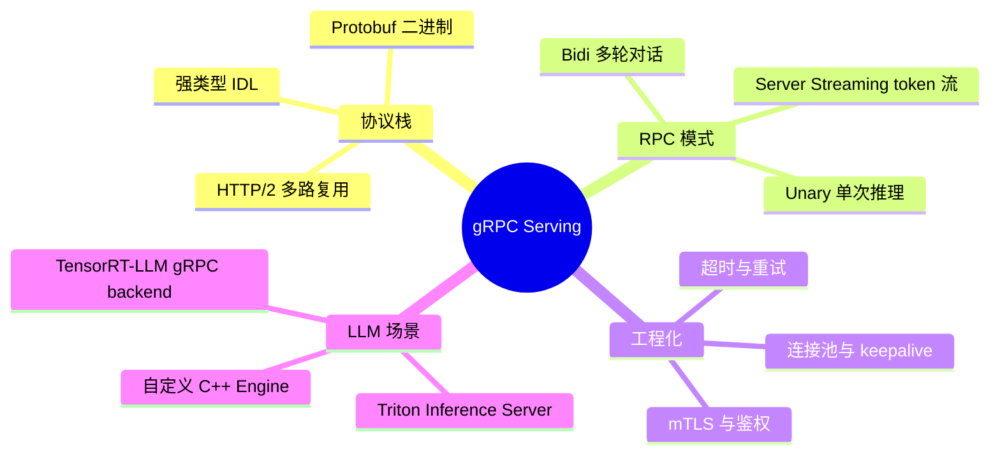
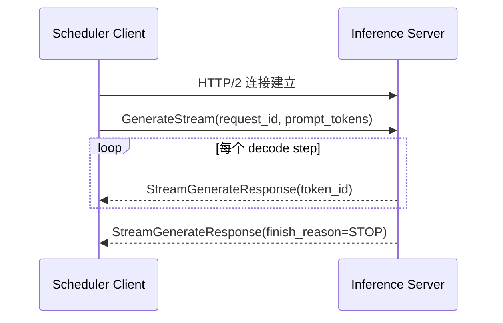

# gRPC 与高性能 RPC 服务

> **文件编码**：UTF-8。  
> **前置**：[10 分布式训练与 NCCL](10-分布式训练与NCCL.md)、[C++ 10 网络编程](../C++/10-网络编程与简易HTTP服务.md)。  
> **C++ 扩展**（建议并行）：[C++ 19 gRPC 与 Protobuf 工程化](../C++/19-gRPC与Protobuf工程化.md)（规划路径，与本章互补）。

---

## 0. 读前导读

### 0.1 用一句话弄懂本章

**gRPC** = 在 HTTP/2 之上用 **Protobuf 二进制序列化** 做 RPC——比 REST+JSON 更省带宽、更低延迟，是大模型 **Serving 层**（Triton、自定义 C++ Server）对接上游调度器的常见选择。

### 0.2 解决什么痛点

| 痛点 | 本章对应 |
|------|----------|
| HTTP+JSON 传大 tensor metadata 太慢 | §2 Protobuf vs JSON |
| 推理服务需要流式返回 token | §4 streaming RPC |
| 多语言客户端（Python 调度器调 C++ 引擎） | §3 IDL 一次定义 |
| 面试问「为什么 vLLM 也暴露 OpenAI HTTP 但内部用 gRPC」 | §1 分层 |

### 0.3 学完能做到

1. 画出 gRPC 四层栈：HTTP/2 → Protobuf → stub → 业务 handler
2. 写最小 `.proto` 定义 `Generate` / `StreamGenerate` 接口
3. 解释 unary / server streaming / bidirectional streaming 在 LLM 场景的选型
4. 对比 gRPC 与 REST 在 **吞吐、延迟、调试成本** 上的 trade-off
5. 说出生产环境 **连接池、keepalive、超时、背压** 四个必配项

### 0.4 难度与时长

- 难度：★★★☆☆  
- 建议：**1.5 个学习单元**（概念 0.5 + 跑通 demo 1）

---

## 1. 知识地图



---

## 2. 为什么 LLM Serving 需要 gRPC

### 2.1 REST vs gRPC 对照

| 维度 | REST + JSON | gRPC + Protobuf |
|------|-------------|-----------------|
| 序列化 | 文本，体积大 | 二进制，紧凑 |
| 传输 | HTTP/1.1 常见 | HTTP/2 多路复用 |
| 接口定义 | OpenAPI 可选 | `.proto` 强制 |
| 流式 | SSE / chunked | 原生 streaming RPC |
| 调试 | curl 友好 | grpcurl / BloomRPC |
| 浏览器直连 | 容易 | 需 grpc-web 网关 |

**LLM 典型分层**：

```text
产品 / Agent（HTTP OpenAI 兼容）
        ↓
API Gateway（鉴权、限流、协议转换）
        ↓
调度器（Python，选 batch、路由）
        ↓ gRPC
推理 Worker（C++/CUDA，算子 + KV）
```

对外 **HTTP** 便于生态接入；对内 **gRPC** 便于高性能、强类型、流式 token。

### 2.2 HTTP/2 与 LLM 延迟

HTTP/2 **单连接多 stream**，避免大量短连接握手开销；对 **高 QPS 小请求**（health check、metadata）尤其重要。Prefill 大包仍受带宽限制，但 **decode 阶段频繁小响应** 受益于多路复用。



---

## 3. Protobuf IDL 与代码生成

### 3.1 最小推理服务 proto 示例

```protobuf
syntax = "proto3";
package llminfer.v1;

message GenerateRequest {
  string request_id = 1;
  repeated int32 prompt_token_ids = 2;
  int32 max_new_tokens = 3;
  float temperature = 4;
}

message GenerateResponse {
  string request_id = 1;
  repeated int32 output_token_ids = 2;
  int32 prompt_tokens = 3;
  int32 completion_tokens = 4;
}

service InferenceService {
  rpc Generate(GenerateRequest) returns (GenerateResponse);
  rpc GenerateStream(GenerateRequest) returns (stream GenerateResponse);
}
```

### 3.2 代码生成流程

```bash
# C++（示意）
protoc --cpp_out=. --grpc_out=. --plugin=protoc-gen-grpc=`which grpc_cpp_plugin` infer.proto
# Python
python -m grpc_tools.protoc -I. --python_out=. --grpc_python_out=. infer.proto
```

**工程要点**：

- `repeated int32` 传 token id 比传 UTF-8 字符串更稳定（避免编码歧义）
- 大 payload（logits、embedding）考虑 **分片** 或 **共享内存 + 只传 handle**（见 [12 章](12-Checkpoint加载与mmap权重IO.md) 零拷贝思路）
- **向后兼容**：只增字段不删改编号；新字段用 `optional` 或默认值

---

## 4. 四种 RPC 模式与 LLM 选型

| 模式 | 语义 | LLM 场景 |
|------|------|----------|
| Unary | 一请求一响应 | 短文本、embedding 一次返回 |
| Server streaming | 一请求多响应 | **token 流式生成**（主流） |
| Client streaming | 多请求一响应 | 客户端分块上传长 prompt |
| Bidirectional | 双向流 | 多轮对话、tool call 往返 |

**Continuous batching 对接**：Scheduler 通过 **长连接 bidi stream** 或 **多路 unary + request_id** 提交/取消请求；Worker 在 stream 上推送 partial output。

---

## 5. 高性能 C++ Server 要点

### 5.1 线程模型


- **不要把 CUDA kernel 放在 gRPC 回调线程**——应入队到推理线程/GPU stream
- 使用 **异步 API**（`ServerCompletionQueue`）避免阻塞 poller
- 设置 `GRPC_ARG_KEEPALIVE_*` 防止 NAT/LB 静默断连

### 5.2 背压与超时

| 配置 | 建议 |
|------|------|
| `deadline` | Prefill 按 prompt 长度分级；decode 按 max_tokens |
| `max_concurrent_streams` | 与 GPU batch 上限对齐 |
| 队列深度 | 超过则 `RESOURCE_EXHAUSTED`，让上游限流 |
| 重试 | 仅对 **幂等** 只读 RPC；生成任务用 request_id 去重 |

### 5.3 与 OpenAI HTTP 网关并存

常见模式：**Envoy / 自研网关** 对外 `/v1/chat/completions`，对内转 gRPC `GenerateStream`。网关负责 SSE 格式转换；引擎专注算子。

---

## 6. 实战：最小 Server/Client 验证清单

| 步骤 | 动作 | 预期 |
|------|------|------|
| 1 | 编写 `infer.proto` 并生成 C++/Python | 无 protoc 报错 |
| 2 | C++ Server 监听 `0.0.0.0:50051` | `grpcurl list` 可见 service |
| 3 | Python Client 调 `Generate` | 返回固定 mock tokens |
| 4 | Client 调 `GenerateStream` | 逐条收到 N 个 response |
| 5 | 压测 100 并发 unary | P99 延迟可接受；无连接泄漏 |

---

## 7. 常见困惑 FAQ

**Q1：gRPC 一定比 HTTP 快吗？**  
不一定。小 payload、本地 loopback 时差距小；**高并发 + 二进制 + 流式** 时 gRPC 优势明显。

**Q2：为什么不用 flatbuffers / cap'n proto？**  
Protobuf 生态最大（Triton、K8s、etcd）；flatbuffers 零拷贝更强但 LLM 圈工具链少。

**Q3：streaming token 用 server streaming 还是 bidi？**  
单工生成用 **server streaming** 足够；需要中途 **cancel / inject system message** 用 bidi。

**Q4：grpc 和 triton 什么关系？**  
Triton 对外提供 **HTTP + gRPC** 两种 inference API；底层同一 model instance。

**Q5：如何调试 gRPC？**  
`grpcurl`、BloomRPC、开启 **grpc debug trace**；复杂问题用 **Wireshark + HTTP/2 dissector**。

**Q6：mTLS 必须吗？**  
集群内网可先用 plain text + 网络隔离；**跨租户 / 公网必须 TLS**。

**Q7：Protobuf 能传 GPU 指针吗？**  
不能跨进程。传 **CUDA IPC handle** 或 **共享内存 fd**（同机）；跨机用 RDMA/NCCL（见 10 章）。

**Q8：和 [C++ 19 gRPC](../C++/19-gRPC与Protobuf工程化.md) 怎么分工？**  
C++ 19 偏 **CMake + protoc 工程化**；本章偏 **LLM Serving 架构与 streaming 选型**。

**Q9：deadline 设多少？**  
Prefill：按 `prompt_len / 吞吐` 估算 × 2；Decode：`max_tokens × 单 token 延迟 × 1.5`。

**Q10：错误码怎么设计？**  
区分 `INVALID_ARGUMENT`（prompt 超长）、`RESOURCE_EXHAUSTED`（队列满）、`INTERNAL`（CUDA OOM）。

---

## 8. 练习

1. **概念**：画 REST vs gRPC 在 LLM Serving 中的分层图（产品→网关→调度→Worker）。
2. **编码**：为 `GenerateStream` 增加 `finish_reason` 枚举（STOP/LENGTH/ERROR）。
3. **编码**：Python client 消费 stream，打印首 token 延迟（TTFT）。
4. **工程**：为 Server 加 `--max-queue-size`，满时返回 `RESOURCE_EXHAUSTED`。
5. **对比**：同一 mock 服务，测 unary 1000 次 vs 1000 条 stream 的连接数差异。

---

## 9. 学完标准

- [ ] 能口述 gRPC 协议栈四层
- [ ] 能写含 streaming 的 `.proto` 并生成代码
- [ ] 能解释为何对外 HTTP、对内 gRPC
- [ ] 能列出 Server 侧线程模型与 CUDA 解耦原则
- [ ] 能配置 deadline / keepalive / 背压至少各一项

---

## 10. 闭卷自测（10 题）

1. gRPC 基于什么传输与序列化？
2. LLM token 流式输出适合哪种 RPC 模式？
3. 为何 token id 比 UTF-8 字符串更适合 Protobuf 传参？
4. 画出 Scheduler → Worker 的典型两层协议。
5. CUDA kernel 能否直接在 gRPC 回调线程执行？为什么？
6. `RESOURCE_EXHAUSTED` 应对应上游什么动作？
7. Protobuf 向后兼容的三条规则？
8. Triton 提供哪两种 inference 协议？
9. 与 REST 相比 gRPC 调试困难，如何缓解？
10. 本章与 C++ 19 章如何配合学习？

<details>
<summary>参考答案</summary>

1. HTTP/2 + Protobuf（二进制）。
2. Server streaming（或 bidi 需双向控制时）。
3. 固定整数序列、无编码歧义、体积可预测。
4. 对外 HTTP/OpenAI；对内 gRPC GenerateStream。
5. 不能；阻塞 poller 且 CUDA 上下文线程敏感，应入队推理线程。
6. 限流、退避、换副本或返回 429 给终端用户。
7. 只增字段；不改字段号；删字段用 `reserved`。
8. HTTP REST + gRPC。
9. grpcurl、BloomRPC、反射服务、结构化日志。
10. C++ 19 练工程化与 CMake；本章练 Serving 架构与 LLM 接口设计。

</details>

---

## 11. 下一章预告

[12 Checkpoint 加载与 mmap 权重 IO](12-Checkpoint加载与mmap权重IO.md) 解决 **几十 GB 权重如何快速进 GPU**——与 gRPC 传小 metadata、大权重走本地 mmap 的路径衔接。
