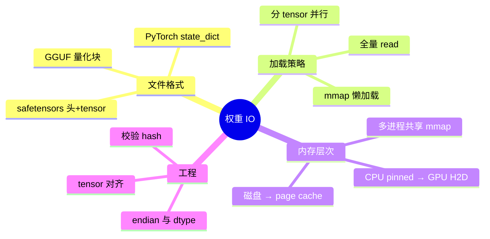
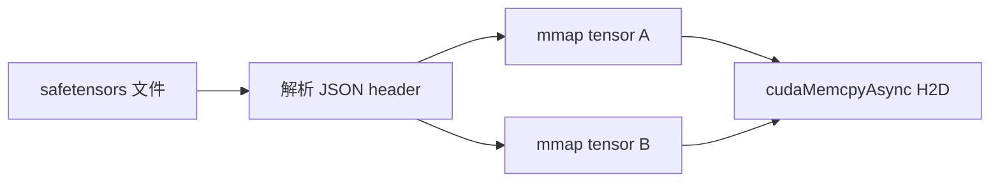

# Checkpoint 加载与 mmap 权重 IO

> **文件编码**：UTF-8。  
> **前置**：[06 高性能 C++](06-高性能C++对齐零拷贝与SIMD入门.md)、[09 模型量化](09-模型量化INT8-INT4-FP8与校准.md)、[10 分布式训练与 NCCL](10-分布式训练与NCCL.md)。

---

## 0. 读前导读

### 0.1 用一句话弄懂本章

**Checkpoint 加载** = 把磁盘上的 **safetensors / GGUF / PyTorch bin** 变成 GPU 上可计算的权重；**mmap** 让 OS 按需分页映射，避免一次性 `read()` 拷贝进用户态 heap，缩短 **冷启动** 与 **多进程共享** 成本。

### 0.2 解决什么痛点

| 痛点 | 本章 |
|------|------|
| 70B 模型启动要几分钟 | §3 mmap 懒加载 |
| 多 Worker 各读一份权重占满内存 | §4 共享映射 |
| 不知道 safetensors 为何比 pickle 安全 | §2 格式 |
| OOM 发生在 load 而非 infer | §5 GPU 上传策略 |

### 0.3 学完能做到

1. 对比 **PyTorch pickle / safetensors / GGUF** 的加载路径
2. 用 C++ 或 Python 演示 **mmap 读权重 shard**
3. 解释 **page cache、madvise、MADV_SEQUENTIAL** 对顺序读的影响
4. 设计 **分阶段加载**：CPU mmap → pin memory → async H2D
5. 说出 vLLM / llama.cpp 各自的权重 IO 特点（预告 14 章）

---

## 1. 知识地图



---

## 2. 常见 Checkpoint 格式

### 2.1 格式对照

| 格式 | 特点 | 典型项目 |
|------|------|----------|
| **safetensors** | JSON header + 原始字节；无代码执行 | HF Hub、vLLM |
| **GGUF** | 单文件含架构+量化权重 | llama.cpp、Ollama |
| **PyTorch .bin** | pickle，有安全风险 | 老模型 |
| **分片 `model-000xx-of-000yy`** | 单文件超 5GB 限制 | 大模型 Hub |

### 2.2 safetensors 结构（概念）

```text
[8 byte header_len LE]
[JSON header: name → {dtype, shape, data_offsets}]
[raw tensor bytes contiguous]
```

**优势**：header 解析后可 **按 tensor mmap 区间**，不必解析整个文件；与 [11 章 gRPC](11-gRPC与高性能RPC服务.md) 传 metadata、权重本地路径的组合常见。



---

## 3. mmap 原理与 C++ 示例

### 3.1 为什么 mmap

| 方式 | 峰值 RSS | 启动时间 | 多进程 |
|------|----------|----------|--------|
| `ifstream` 读入 `vector` | 文件大小 × 进程数 | 慢 | 不共享 |
| **mmap MAP_SHARED** | 按需 fault | 快（懒） | **共享 page cache** |

Linux：`mmap(fd, 0, PROT_READ, MAP_PRIVATE, ...)` — `MAP_PRIVATE` 写时复制只读权重足够。

### 3.2 最小 C++ 片段（只读映射）

```cpp
#include <sys/mman.h>
#include <fcntl.h>
#include <unistd.h>

void* map_weight_file(const char* path, size_t* out_size) {
    int fd = open(path, O_RDONLY);
    if (fd < 0) return nullptr;
    off_t sz = lseek(fd, 0, SEEK_END);
    void* addr = mmap(nullptr, sz, PROT_READ, MAP_PRIVATE, fd, 0);
    close(fd);
    if (addr == MAP_FAILED) return nullptr;
    *out_size = static_cast<size_t>(sz);
    madvise(addr, sz, MADV_SEQUENTIAL);  // 顺序读提示
    return addr;
}
```

**注意**：映射后仍需按 header **偏移** 定位每个 tensor；GGUF/safetensors 各有解析库（`ggml`、`safetensors` Rust/C binding）。

### 3.3 Python 侧 mmap

```python
import mmap
with open("model.safetensors", "rb") as f:
    mm = mmap.mmap(f.fileno(), 0, access=mmap.ACCESS_READ)
    # 解析 header 后 mm[offset:offset+ nbytes] 零拷贝 view
```

PyTorch 2.x `torch.load(..., mmap=True)` 对大 checkpoint 同样利用 mmap。

---

## 4. GPU 上传与流水线

### 4.1 分阶段加载

```text
Phase 1: mmap 权重文件（CPU 虚拟地址，未占物理页直到 touch）
Phase 2: 按层 pin + cudaMemcpyAsync（与解析下一层 overlap）
Phase 3: 释放 CPU 映射（可选，若权重已在 GPU）
```

**量化权重**：INT4/INT8 文件更小，mmap fault 次数少；解压/反量化可在 **GPU kernel** 完成（llama.cpp `ggml_cuda`）。

### 4.2 多 GPU / 多 Worker

| 场景 | 策略 |
|------|------|
| 同机多进程 Worker | 共享 mmap + 各自 H2D 所需层（TP 分片） |
| Tensor Parallel | 每 rank 只加载 **本地 shard**（Megatron 格式） |
| 反复重启 Pod | 依赖 **节点本地 SSD cache** + mmap 热 page |

---

## 5. 性能调优清单

| 手段 | 作用 |
|------|------|
| `MADV_SEQUENTIAL` | 顺序大读，内核预读 |
| `MADV_WILLNEED` | 启动前 warm fault |
| 本地 NVMe | 降 cold start（网络盘 mmap 仍慢） |
| 按层 lazy load | 超大模型先加载 embedding + 前几层 |
| checksum | SHA256 防损坏（Hub 提供） |

**Roofline 提醒**：加载瓶颈常在 **PCIe 带宽**（CPU→GPU），不是磁盘顺序读；mmap 主要省 **CPU 内存拷贝与 duplicate**。

---

## 6. 与分布式 Checkpoint

训练 checkpoint（[10 章](10-分布式训练与NCCL.md)）含 **optimizer state**，推理只需 **model weights**：

- 转换：`merge TP shards → 单 safetensors` 或 `save_pretrained(safe_serialization=True)`
- 推理引擎只读 **fp16/bf16/int 权重**，忽略 Adam moment

---

## 7. 常见困惑 FAQ

**Q1：mmap 会占用双倍内存吗？**  
不会。多进程 `MAP_PRIVATE` 只读时 **共享 page cache**；物理页按 touch 加载。

**Q2：mmap 后还要 cudaMemcpy 吗？**  
要。GPU 不能直接 dereference 普通 mmap 地址（除非 UVA + registered memory 等高级路径）。

**Q3：safetensors 和 GGUF 选型？**  
HF 生态用 safetensors；**CPU/边缘推理** 常用 GGUF 一体化。

**Q4：为什么不用 ifstream 一次读入？**  
简单但 **RSS 峰值 = 文件大小**，且无法与其他进程共享已读页。

**Q5：Windows 上 mmap？**  
`CreateFileMapping` + `MapViewOfFile`；llama.cpp 跨平台封装在 `ggml`。

**Q6：加载慢怎么 profile？**  
`strace -c` 看 read fault；`iostat` 看磁盘；Nsight 看 H2D（[17 章](17-GPU性能剖析Nsight与perf.md)）。

**Q7：网络挂载 NFS mmap 可靠吗？**  
可用但 **latency 高**；生产权重放 **本地盘或 init container 拉取**。

**Q8：tensor 对齐为何重要？**  
GPU kernel 常要求 **256B 对齐**；错位需额外 copy kernel。

**Q9：GGUF 量化块如何 mmap？**  
整文件 mmap 后按 `gguf` tensor info 偏移；块内是 packed quants。

**Q10：vLLM 启动慢查什么？**  
模型下载、tokenizer、权重 H2D、CUDA graph capture——逐项计时。

---

## 8. 练习

1. **概念**：画 safetensors 文件布局与 mmap 区间标注图。
2. **动手**：Python `mmap` 读取 Hub 小模型 safetensors，打印 tensor 数量与总字节。
3. **动手**：C++ 映射文件，对比 `read()` 与 `mmap` 的 RSS（`/usr/bin/time -v`）。
4. **分析**：说明 TP=4 时为何每 rank 不应 mmap 全量再丢弃 3/4。
5. **设计**：写 Pod 启动脚本：init 容器下载 → emptyDir → main 容器 mmap 路径。

---

## 9. 学完标准

- [ ] 能对比三种 checkpoint 格式优缺点
- [ ] 能解释 mmap 与 page cache、多进程共享
- [ ] 能描述 CPU mmap → GPU H2D 流水线
- [ ] 知道推理 vs 训练 checkpoint 差异
- [ ] 能列出至少 3 条加载性能调优手段

---

## 10. 闭卷自测（10 题）

1. safetensors 相比 pickle 的两项安全/工程优势？
2. mmap `MAP_PRIVATE` 只读时多进程如何共享物理页？
3. `MADV_SEQUENTIAL` 提示内核什么访问模式？
4. GPU 为何通常不能直接用 CPU mmap 指针？
5. GGUF 主要服务哪类推理栈？
6. Tensor Parallel 推理加载应加载全量还是 shard？
7. 冷启动瓶颈可能在磁盘、CPU 还是 PCIe？各如何验证？
8. `torch.load(mmap=True)` 解决什么问题？
9. 训练 checkpoint 里推理可丢弃的典型字段？
10. 与 [06 章零拷贝](06-高性能C++对齐零拷贝与SIMD入门.md) 的关系？

<details>
<summary>参考答案</summary>

1. 无任意代码执行；header 明确 tensor 边界便于随机访问/mmap。
2. 共享 file-backed page cache；各自页表，写时复制。
3. 顺序访问，利于 readahead。
4. GPU 地址空间 separate；需 cudaMemcpy 或 registered pinned memory。
5. llama.cpp / Ollama / CPU 与消费级 GPU 量化推理。
6. 只加载本 rank 对应 shard。
7. 磁盘 iostat；CPU fault/strace；PCIe Nsight H2D 或 nvidia-smi dmon。
8. 降 RSS 峰值与加载时间，利用 OS 分页。
9. optimizer states、gradients、training metadata。
10. 06 讲对齐与零拷贝思想；本章是权重 IO 上的具体应用。

</details>

---

## 11. 下一章预告

[13 pybind11 与 Python-C++ 混合编程](13-pybind11与Python-C++混合编程.md) 把 **mmap 加载的 C++ 算子** 暴露给 PyTorch Python 调度层——Serving 栈的典型胶水层。
