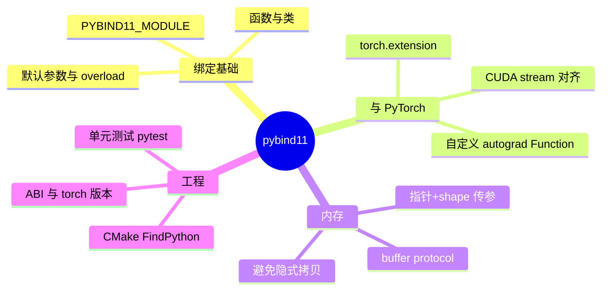

# pybind11 与 Python-C++ 混合编程

> **文件编码**：UTF-8。  
> **前置**：[06 高性能 C++](06-高性能C++对齐零拷贝与SIMD入门.md)、[12 Checkpoint 与 mmap](12-Checkpoint加载与mmap权重IO.md)。  
> **C++ 扩展**（建议并行）：[C++ 20 pybind11 与 Python 绑定入门](../C++/20-pybind11与Python绑定入门.md)（规划路径）。

---

## 0. 读前导读

### 0.1 用一句话弄懂本章

**pybind11** = 用少量 C++ 模板把 **CUDA/C++ 算子、mmap 加载器、调度逻辑** 暴露成 Python 模块——PyTorch/vLLM 的 `csrc/` 与 Python 层之间的标准桥梁。

### 0.2 解决什么痛点

| 痛点 | 本章 |
|------|------|
| Python 循环太慢，算子必须 C++/CUDA | §2 模块结构 |
| 如何把 `torch.Tensor` 传给 C++ 而不拷贝 | §4 buffer 协议 |
| 扩展编译链接 PyTorch ABI 报错 | §5 构建 |
| 面试问「vLLM 为什么大量 pybind」 | §1 分层 |

### 0.3 学完能做到

1. 写最小 pybind 模块 `add_tensors` 被 Python import
2. 用 `py::array_t` / DLPack 与 NumPy、PyTorch 零拷贝交互
3. 用 CMake + `torch.utils.cpp_extension` 两种构建方式
4. 解释 GIL 释放（`py::gil_scoped_release`）在长 CUDA kernel 前的必要性
5. 阅读 vLLM `csrc/` 入口时的 **模块注册** 路径

---

## 1. 知识地图



---

## 2. LLM 栈中的位置

```text
Python: scheduler / API / config
    ↓ import custom_ops.so
C++/CUDA: attention, paged KV, quant GEMM
    ↓
GPU kernels
```

| 项目 | pybind 用途 |
|------|-------------|
| vLLM | `_C` 模块：attention、cache ops |
| FlashAttention | `flash_attn_2_cuda` |
| torch itself | `torch._C` 大量绑定 |

**原则**：Python 做 **控制流**；C++/CUDA 做 **数据面热路径**。

---

## 3. 最小示例

### 3.1 C++ 扩展

```cpp
#include <pybind11/pybind11.h>
#include <pybind11/numpy.h>
namespace py = pybind11;

py::array_t<float> vec_add(py::array_t<float> a, py::array_t<float> b) {
    py::buffer_info ba = a.request(), bb = b.request();
    if (ba.size != bb.size) throw std::runtime_error("shape mismatch");
    auto out = py::array_t<float>(ba.size);
    py::buffer_info bo = out.request();
    float* pa = static_cast<float*>(ba.ptr);
    float* pb = static_cast<float*>(bb.ptr);
    float* po = static_cast<float*>(bo.ptr);
    for (py::ssize_t i = 0; i < ba.size; ++i) po[i] = pa[i] + pb[i];
    return out;
}

PYBIND11_MODULE(_mini_ops, m) {
    m.doc() = "mini LLM ops";
    m.def("vec_add", &vec_add, "element-wise add");
}
```

### 3.2 Python 调用

```python
import torch
from _mini_ops import vec_add
x = torch.randn(1024, device="cpu", dtype=torch.float32).numpy()
y = vec_add(x, x)
```

### 3.3 与 PyTorch 自定义 op（方向）

生产环境更常用 **`torch.library` / `cpp_extension.load`** 注册进 autograd；pybind 模块可被 `load_inline` 编译加载。

---

## 4. 零拷贝与 GIL

### 4.1 避免拷贝

| 做法 | 说明 |
|------|------|
| `py::array_t::request()` | 取 raw pointer，生命周期由 Python 对象持有 |
| `torch::Tensor` C++ API | LibTorch 扩展，与 ATen 共享 storage |
| DLPack | `torch.utils.dlpack.to_dlpack` 跨框架 |

**反模式**：在 C++ 里 `std::vector` 拷贝大 tensor 再算。

### 4.2 GIL

长时间 CUDA kernel 前应 **`py::gil_scoped_release release`**，否则阻塞其他 Python 线程（如 gRPC health、metrics）。

```cpp
{
    py::gil_scoped_release release;
    launch_attention_kernel(...);
}
```

---

## 5. 构建与 ABI

### 5.1 setuptools + torch

```python
from torch.utils.cpp_extension import BuildExtension, CUDAExtension
setup(
    ext_modules=[CUDAExtension(
        name="_mini_ops",
        sources=["ops.cpp", "kernel.cu"],
        extra_compile_args={"cxx": ["-O3"], "nvcc": ["-O3"]},
    )],
    cmdclass={"build_ext": BuildExtension},
)
```

### 5.2 常见报错

| 现象 | 原因 |
|------|------|
| `undefined symbol: _ZN3c1010...` | PyTorch 版本与编译时 torch 不一致 |
| CUDA arch 不匹配 | 未设 `TORCH_CUDA_ARCH_LIST` |
| ImportError | `.so` 路径未在 `PYTHONPATH` |

**规则**：扩展与 **运行时 torch 同版本** 编译；Docker 镜像固定 torch+cuda tag。

---

## 6. 与 [12 章 mmap](12-Checkpoint加载与mmap权重IO.md) 结合

典型模块：

```python
# Python
weights = native.load_safetensors_mmap("/models/llama.safetensors")
# C++ 返回 py::dict{name: (ptr, shape, dtype)} 或 torch.Tensor from blob
```

C++ 侧 mmap 后 **`torch::from_blob`**（注意生命周期：storage 需自定义 deleter 或 pin 住 mmap 对象）。

---

## 7. 常见困惑 FAQ

**Q1：pybind11 vs ctypes？**  
ctypes 调 C ABI，无 C++ 类/重载；算子库几乎都用 pybind 或 pyo3（Rust）。

**Q2：能否纯 Python + Numba？**  
小算子可以；LLM 需 **模板化 CUDA + 与 PyTorch stream** 集成，仍要 C++。

**Q3：和 SWIG 比？**  
pybind 头文件 only、现代 C++ 友好；PyTorch 生态默认 pybind。

**Q4：如何调试 segfault？**  
`gdb python`，`break` 在 kernel；先 `CUDA_LAUNCH_BLOCKING=1`。

**Q5：多线程 Python 调同一模块？**  
释放 GIL 后 C++ 需自己保证线程安全；CUDA 用同一 device context。

**Q6：和 [C++ 20 pybind](../C++/20-pybind11与Python绑定入门.md) 分工？**  
C++ 20 讲语法与 CMake 模板；本章讲 **LLM 算子绑定与 torch ABI**。

**Q7：必须写 pybind 才能Serving吗？**  
可用 **Triton Python backend** 纯 Python，但性能路径仍落 C++ backend。

**Q8：如何测试扩展？**  
pytest 对比 PyTorch 参考实现 `torch.allclose(rtol=1e-3)`。

**Q9：op 注册名冲突？**  
命名空间 `vllm._C`；自定义项目加前缀。

**Q10：Apple MPS / CPU only？**  
绑定层相同；kernel Implementation 换 CPU/MPS 源文件。

---

## 8. 练习

1. **编码**：实现 `vec_add` 并用 pytest 验证与 `a+b` 一致。
2. **编码**：在 CUDA kernel 前后加 `gil_scoped_release`，用线程压测证明 Python 线程不被阻塞。
3. **阅读**：克隆 vLLM，定位 `csrc/` 中 `PYBIND11_MODULE` 定义的文件列表。
4. **设计**：设计 `load_weights_mmap` 的 Python API（返回 dict of Tensor）。
5. **排错**：故意用错误 torch 版本 import `.so`，记录完整报错并修复。

---

## 9. 学完标准

- [ ] 能写最小 PYBIND11_MODULE 并被 import
- [ ] 能解释 GIL 与 CUDA kernel 的关系
- [ ] 能用 torch cpp_extension 编译 CUDA 扩展
- [ ] 能说明零拷贝传参的两种做法
- [ ] 能指出 vLLM Python/C++ 边界目录

---

## 10. 闭卷自测（10 题）

1. pybind11 在 LLM 栈中的典型位置？
2. 为何长 CUDA kernel 前要释放 GIL？
3. `py::array_t::request()` 返回什么？
4. `undefined symbol c10` 类错误最常见原因？
5. DLPack 解决什么问题？
6. Python 控制流 + C++ 数据面的分工一句话？
7. mmap 权重如何与 `torch::from_blob` 衔接（生命周期注意点）？
8. vLLM 扩展模块常见名字？
9. pybind vs LibTorch TorchScript？
10. 与 C++ 20 章如何配合？

<details>
<summary>参考答案</summary>

1. 把 attention/KV/quant 等 CUDA 算子暴露给 Python 调度与 API。
2. 否则 GIL 阻塞其他 Python 线程，影响并发与 health check。
3. buffer 的 ptr、shape、strides、format 等。
4. 扩展编译时与运行时 PyTorch 版本不一致。
5. 跨框架共享 tensor 内存而不拷贝。
6. Python 编排 batch/配置；C++/CUDA 执行热算子。
7. blob 指向 mmap 区间；需 custom deleter 或持有 mmap 对象防 unmap。
8. `vllm._C` 或类似 `_C` 子模块。
9. pybind 灵活绑 C++；TorchScript 序列化图，LLM 动态 shape 常用 eager+pybind。
10. C++ 20 练绑定语法；本章练 torch ABI 与算子工程。

</details>

---

## 11. 下一章预告

[14 vLLM、TensorRT-LLM、llama.cpp 架构导读](14-vLLM-TensorRT-LLM-llama.cpp架构导读.md) 纵览三大推理引擎如何把 **pybind 算子 + 调度 + 权重 IO** 组装成完整系统。
