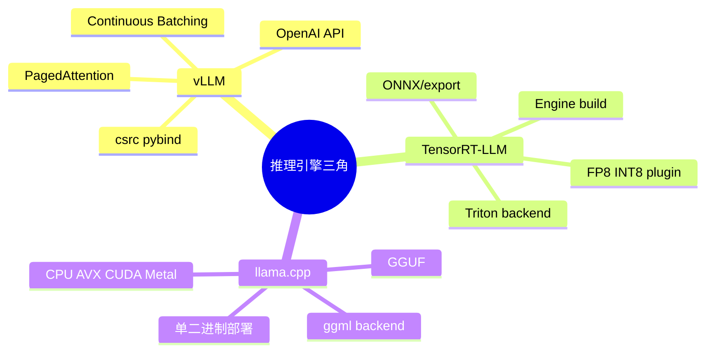
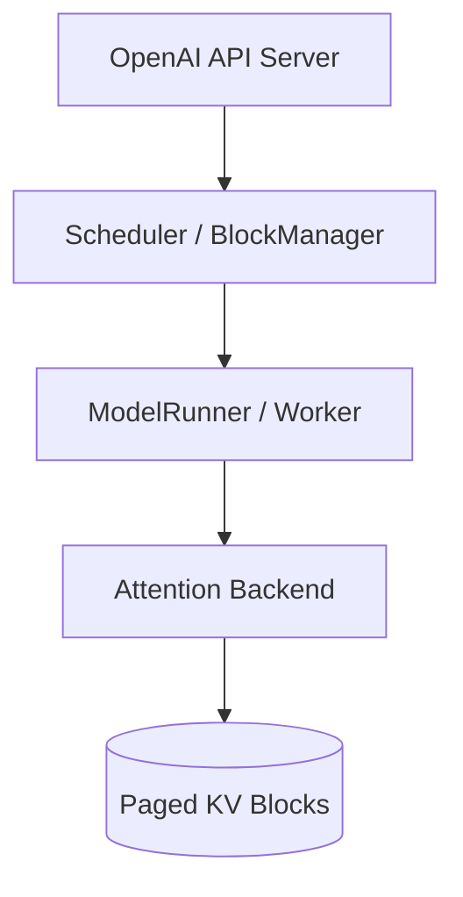
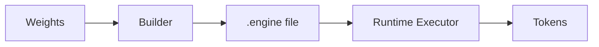

# vLLM、TensorRT-LLM、llama.cpp 架构导读

> **文件编码**：UTF-8。  
> **前置**：[07 推理引擎架构](07-大模型推理引擎架构概览.md)、[08 KV Cache](08-KV-Cache与PagedAttention原理.md)、[13 pybind11](13-pybind11与Python-C++混合编程.md)。

---

## 0. 读前导读

### 0.1 用一句话弄懂本章

三大引擎解决同一问题——**高吞吐 LLM 推理**——但路径不同：**vLLM** 用 Python 调度 + PagedAttention；**TensorRT-LLM** 用 NVIDIA 图编译 + 极致 kernel；**llama.cpp** 用 C/C++ 单文件 GGUF 与 CPU/GPU 通吃。

### 0.2 选型速查

| 场景 | 倾向 |
|------|------|
| 生产 GPU 集群、动态 batch | vLLM |
| NVIDIA 硬件、固定模型、极致延迟 | TensorRT-LLM |
| 本地/边缘、CPU、量化 GGUF | llama.cpp |
| 快速原型 OpenAI API | vLLM / Ollama(llama.cpp) |

### 0.3 学完能做到

1. 各画一张 **模块图**（API / Scheduler / Model Runner / Kernel）
2. 对照 [08 章 PagedAttention](08-KV-Cache与PagedAttention原理.md) 指出 vLLM 实现位置
3. 解释 TRT-LLM **build engine** 与 **runtime** 两阶段
4. 说明 llama.cpp **ggml** 张量与 **graph compute** 模型
5. 面试 3 分钟对比三者 **优势 / 代价 / 适用**

---

## 1. 知识地图



---

## 2. vLLM 架构

### 2.1 模块分层



| 目录（源码） | 职责 |
|--------------|------|
| `vllm/core/scheduler.py` | 请求队列、prefill/decode 调度 |
| `vllm/core/block_manager.py` | KV block 分配 |
| `vllm/attention/` | FlashAttn / xformers 后端 |
| `csrc/` | 自定义 CUDA、KV cache ops |

### 2.2 核心技术（复习）

- **PagedAttention**：KV 分 block，非连续物理页（[08 章](08-KV-Cache与PagedAttention原理.md)）
- **Continuous Batching**：迭代级进出 batch（[16 章](16-推理Batch调度与ContinuousBatching.md)）
- **Chunked Prefill**：长 prompt 分块，避免 decode 饿死

### 2.3 优势与代价

| 优势 | 代价 |
|------|------|
| 动态 shape、生态活跃 | Python 调度开销 |
| 多模型、LoRA、多模态扩展快 | 极致单请求延迟不如 TRT |
| OpenAI 兼容 | 深度优化依赖 NVIDIA stack |

---

## 3. TensorRT-LLM 架构

### 3.1 Build vs Runtime

```text
HuggingFace weights
    → TRT-LLM export / build scripts
    → TensorRT Engine (plan + weights)
    → C++ Runtime (executor)
    → Triton TRT-LLM backend / 独立 server
```



### 3.2 特点

- **层融合、kernel autotune**：编译期定 shape 策略（可配 multiple profiles）
- **FP8 / INT8 / SmoothQuant** 一等公民
- **Inflight batching**（类似 continuous batching）
- **强依赖 NVIDIA GPU + TensorRT 版本矩阵**

### 3.3 何时选 TRT-LLM

- 模型与部署环境 **相对固定**
- 需要 **最低 P99 latency** 或 **最高 SM 利用率**
- 团队能接受 **build 流水线**（CI 编 engine，非运行时 JIT）

---

## 4. llama.cpp 架构

### 4.1 ggml 计算图

```text
GGUF file → load tensors → build ggml_cgraph → ggml_graph_compute(backend)
```

| 概念 | 说明 |
|------|------|
| `ggml_tensor` | strides、type（Q4_K 等） |
| backend | CPU / CUDA / Metal / Vulkan |
| batch | `n_batch` prompt 并行度 |
| context | `n_ctx` 最大上下文 |

### 4.2 优势与代价

| 优势 | 代价 |
|------|------|
| 单文件部署、无 Python 运行时 | 集群调度需自建 |
| CPU 推理强 | 数据中心吞吐通常低于 vLLM |
| 量化格式丰富（GGUF） | 新架构支持滞后于 HF |

**Ollama** = llama.cpp + 模型管理 + REST，开发体验层。

---

## 5. 三引擎对照表

| 维度 | vLLM | TensorRT-LLM | llama.cpp |
|------|------|--------------|-----------|
| 主语言 | Python + CUDA | C++ | C/C++ |
| 权重格式 | safetensors/HF | engine 内置 | GGUF |
| 动态 batch | 强 | 强（inflight） | 较弱 |
| 编译 | 运行时 eager + 部分 compile | 离线 build engine | 无 TRT 级编译 |
| API | OpenAI HTTP | Triton/gRPC | HTTP/server 模式 |
| 多卡 | TP/PP 持续完善 | 成熟 | 有限 |

---

## 6. 源码阅读路线

| 引擎 | 第一周读什么 |
|------|--------------|
| vLLM | `scheduler.py` → `llm_engine.py` → `csrc/paged_attention*` |
| TRT-LLM | `examples/models/core` build 脚本 → `cpp/runtime` |
| llama.cpp | `ggml.c` tensor → `llama.cpp` graph → `ggml-cuda.cu` |

---

## 7. 常见困惑 FAQ

**Q1：vLLM 和 TRT-LLM 能一起用吗？**  
通常二选一作主引擎；可用 TRT 作 **draft** 做 speculative decoding。

**Q2：llama.cpp 能上生产 GPU 集群吗？**  
可以但需自建 **负载均衡与 batch**；多数公司 GPU 集群选 vLLM/TRT。

**Q3：PagedAttention 只有 vLLM 有吗？**  
思想已扩散；TRT-LLM、SGLang 等有类似 KV 管理。

**Q4：engine build 要多久？**  
大模型 **数十分钟到数小时**；需 CI 缓存 engine。

**Q5：GGUF 和 safetensors 互转？**  
`convert_hf_to_gguf.py`（llama.cpp 工具）；反向较少用。

**Q6：谁支持 Speculative Decoding？**  
三者均有不同实现成熟度；vLLM 配置 `speculative_model` 即可试。

**Q7：多模态模型？**  
vLLM 扩展快；TRT-LLM 需对应 export；llama.cpp 有 LLaVA 分支。

**Q8：如何 benchmark 公平？**  
固定 **prompt len、output len、并发、GPU**；报 **throughput + P50/P99 latency**。

**Q9：和 [11 章 gRPC](11-gRPC与高性能RPC服务.md) 关系？**  
Triton 暴露 gRPC；vLLM 默认 HTTP，可前置网关。

**Q10：19 章项目选哪个模仿？**  
建议 **mini vLLM**：Python 调度 + C++ KV block + pybind，范围可控。

---

## 8. 练习

1. **概念**：手绘 vLLM 四模块数据流（API→Scheduler→Runner→KV）。
2. **阅读**：在 vLLM GitHub 打开 `BlockSpaceManager` 类，写 200 字摘要。
3. **对比**：列表说明 TRT-LLM build 阶段与 runtime 阶段各做什么。
4. **动手**：本地 `ollama run` 与 `vllm serve` 各起一小模型，对比内存占用。
5. **面试**：准备 3 分钟「三者选型」口述稿。

---

## 9. 学完标准

- [ ] 能画三引擎架构简图
- [ ] 能指出 vLLM 调度与 KV 源码入口
- [ ] 能解释 TRT-LLM build/runtime 分离原因
- [ ] 能说明 ggml graph 执行模型
- [ ] 能根据场景给出引擎推荐

---

## 10. 闭卷自测（10 题）

1. vLLM 两大内存/吞吐技术是什么？
2. TRT-LLM 为何需要 offline build？
3. llama.cpp 权重文件典型格式？
4. Ollama 与 llama.cpp 关系？
5. PagedAttention 在 vLLM 大致哪个目录？
6. Inflight batching 近似对应哪一章概念？
7. 动态 shape 最友好的是哪个引擎？
8. Triton 与 TRT-LLM 典型组合方式？
9. ggml 中 `n_ctx` 含义？
10. 19 章 mini 引擎建议模仿谁？为什么？

<details>
<summary>参考答案</summary>

1. PagedAttention + Continuous Batching（+ Chunked Prefill）。
2. TensorRT 编译融合 kernel、固定优化策略，runtime 只执行 engine。
3. GGUF。
4. Ollama 封装 llama.cpp，加模型管理与 API。
5. `vllm/core/block_manager` + `csrc/paged_attention*`。
6. [16 章 Continuous Batching](16-推理Batch调度与ContinuousBatching.md)。
7. vLLM（相对 TRT engine 固定 profile）。
8. Triton TRT-LLM backend 加载 engine serving。
9. 上下文窗口最大 token 数。
10. mini vLLM：调度+KV 可裁剪，文档与社区最丰富。

</details>

---

## 11. 下一章预告

[15 FlashAttention 与算子融合](15-FlashAttention与算子融合.md) 深入 **Attention 如何 IO-aware**，以及 LayerNorm+GEMM 等 **融合 kernel** 如何支撑上述引擎的 SM 利用率。
