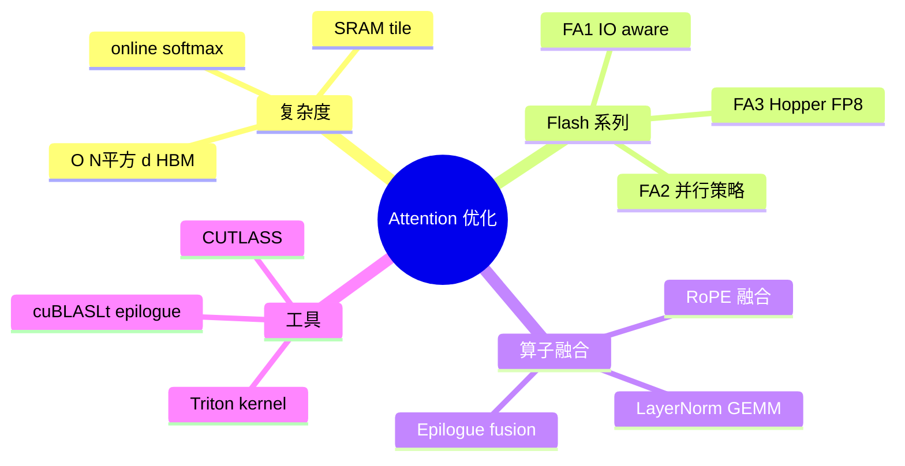
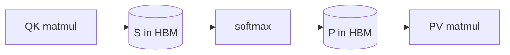
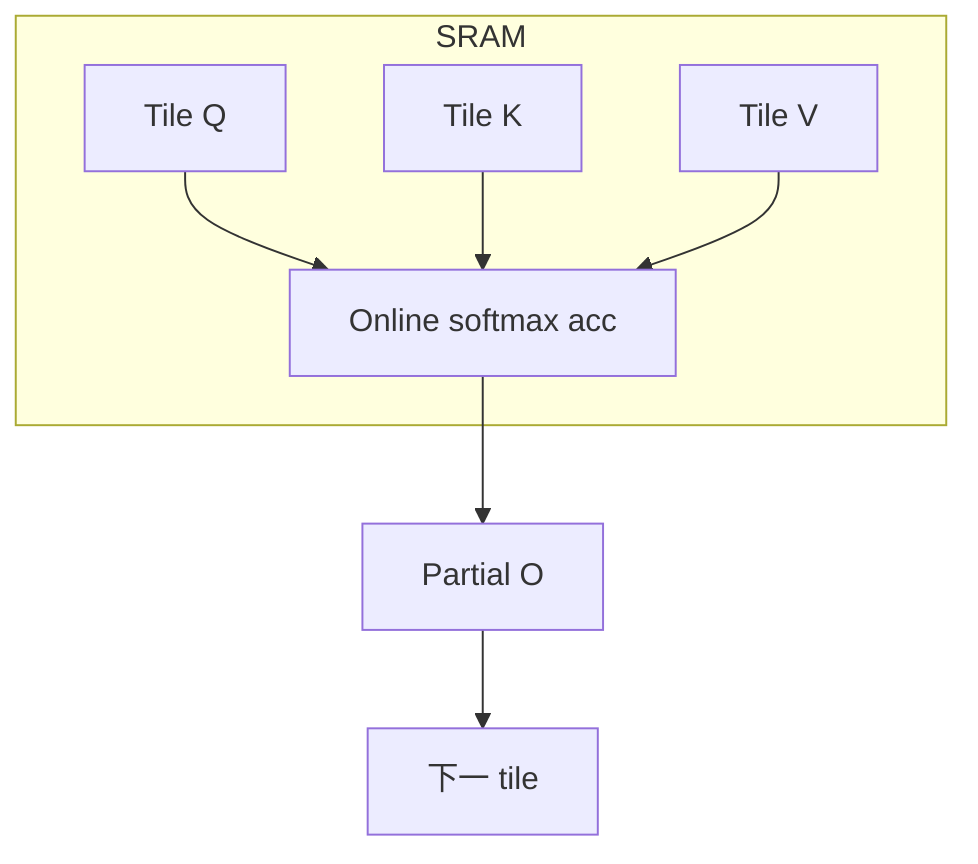

# FlashAttention 与算子融合

> **文件编码**：UTF-8。  
> **前置**：[02 Transformer 与注意力](02-Transformer与注意力机制原理.md)、[04 CUDA 核函数与内存](04-CUDA核函数线程层次与内存模型.md)、[05 矩阵运算与 cuBLAS](05-矩阵运算cuBLAS与GEMM优化入门.md)。

---

## 0. 读前导读

### 0.1 用一句话弄懂本章

**标准 Attention** 把 \(N \times N\) 分数矩阵 **写回 HBM**，带宽爆炸；**FlashAttention** 用 **tiling + online softmax** 在 SRAM 里算完一块再跳下一块，IO 复杂度从 \(O(N^2 d)\) 降到接近 **\(O(N^2 d / M)\)**（M 为 SRAM 级 tile）。**算子融合** 把相邻 op 合成一次 kernel，减读写次数。

### 0.2 解决什么痛点

| 痛点 | 本章 |
|------|------|
| 长上下文 Attention OOM / 慢 | §2 FlashAttention |
| GEMM 后立即 LayerNorm 两次 HBM | §4 融合 |
| vLLM 默认 FlashAttn backend | §5 引擎集成 |
| 面试手推 Attention 复杂度 | §1 复习 |

### 0.3 学完能做到

1. 对比 **naive / memory-efficient / FlashAttention-2** 的 HBM 访问次数
2. 解释 **online softmax** 三变量 \((m, \ell, O)\) 更新
3. 画出 **Q/K/V tile** 在 shared memory 的加载顺序
4. 列举 **LayerNorm+Linear、Bias+GELU+GEMM** 融合例子
5. 说明 FlashDecoding / FlashAttention-3 的改进方向（概念）

---

## 1. 知识地图



---

## 2. 标准 Attention 的瓶颈

### 2.1 计算步骤（复习）

\[
S = QK^\top / \sqrt{d},\quad P = \mathrm{softmax}(S),\quad O = PV
\]

**naive 实现**：物化 \(S,P \in \mathbb{R}^{N\times N}\) 到 HBM——**\(O(N^2)\)** 内存与带宽。



### 2.2 Roofline 视角

Attention 常为 **memory-bound**（算术强度低）；优化目标是 **减少 HBM round-trip**，不是再堆 FLOPs。

---

## 3. FlashAttention 核心思想

### 3.1 Tiling

将 Q、K、V 分块，每块 **完全在 shared memory / registers** 完成 partial softmax 与对 V 的加权，**不写完整 S/P**。



### 3.2 Online Softmax（直觉）

对行 \(i\)，分块见到新 max \(m'\) 时更新：

- 缩放旧输出以匹配新 max
- 累加 exp 和与加权 V

**结果**：数学等价全局 softmax，但 **只需 O(1) 额外状态 per row per tile**。

### 3.3 FlashAttention-2 改进

- 更好的 **warps 并行**（减少 sync）
- 对 batch/head 维度 **负载均衡**
- 训练 backward 同样 IO-aware

**FlashAttention-3**（Hopper）：利用 **TMA、FP8**，进一步压榨 H100 带宽。

---

## 4. 算子融合（Epilogue Fusion）

### 4.1 典型融合模式

| 融合 | 收益 |
|------|------|
| GEMM + Bias + GELU | 省 1～2 次 HBM 写读 |
| GEMM + LayerNorm | Transformer block 热路径 |
| RoPE + QK^T 部分 | 减中间 Q' 存储 |
| Quantize + GEMM (INT8) | W8A8 推理 |

### 4.2 实现途径

```text
cuBLASLt matmul + epilogue (bias, relu, gelu)
CUTLASS 自定义 tile + epilogue functor
Triton @triton.jit 手写融合（PyTorch 2 编译栈）
TensorRT layer fusion（编译期）
```

### 4.3 与 FlashAttention 关系

FlashAttention 本质是 **matmul + softmax + matmul 的大融合**；Engine 里还可与 **KV cache 写入** 融合（PagedAttention kernel）。

---

## 5. 在推理引擎中的位置

| 引擎 | 集成方式 |
|------|----------|
| vLLM | `flash_attn` / `flashinfer` backend |
| TRT-LLM | Plugin / fused MHA layer |
| llama.cpp | 自定义 CUDA MMHA kernel |
| PyTorch | `scaled_dot_product_attention` 调 flash |

**Prefill vs Decode**：

- Prefill：\(N\) 大，FlashAttention 收益巨大
- Decode：\(N=1\) 但 context 长，**FlashDecoding** 对 KV 长序列优化

---

## 6. 实现与调试要点

| 主题 | 要点 |
|------|------|
| head_dim | 常见 64/128；非 2 幂可能走 fallback |
| causal mask | 在 tile 内应用，避免物化 mask 矩阵 |
| dropout | 训练需要；推理关闭 |
| dtype | FP16/BF16；FP8 需 scale |
| 数值 | online softmax 需 stable max trick |

**验证**：同一输入对比 naive vs flash `max abs diff < 1e-2`（fp16）。

---

## 7. 常见困惑 FAQ

**Q1：FlashAttention 降低 FLOPs 吗？**  
不降低渐近 FLOPs；降 **HBM IO**，常使 **实际时间** 大幅下降。

**Q2：没有 Flash 能用 xformers 吗？**  
可以；许多引擎有多 backend，按 GPU/arch 选型。

**Q3：context 8k 还是慢？**  
检查是否 fallback 到 math backend；看 head_dim、sm 版本。

**Q4：算子融合谁来做？**  
手写 CUDA（Flash）、cuBLASLt、TensorRT builder、torch.compile。

**Q5：backward 推理岗要会吗？**  
推理只需 forward；训练岗需 backward 同样 IO-aware。

**Q6：和 [05 章 GEMM](05-矩阵运算cuBLAS与GEMM优化入门.md) 关系？**  
Attention 两侧是 GEMM；Flash 把中间 softmax 嵌进 tile pipeline。

**Q7：PagedAttention 和 Flash 冲突吗？**  
正交：Flash 算 attention 算术；Paged 管 **KV 物理布局**。

**Q8：Triton 会取代 CUDA 吗？**  
Triton 快速原型；极致性能仍 CUTLASS/手写，尤其 decode。

**Q9：CPU Attention？**  
llama.cpp MMQ/MMV；无 HBM 概念但 cache 友好仍重要。

**Q10：如何读 FlashAttention 论文？**  
先懂 online softmax 引理（Milakov & Gimelshein 等），再看 Algorithm 1 tile 循环。

---

## 8. 练习

1. **手推**：写出 512×512 attention 矩阵物化时的 HBM 字节量（FP16，仅 S 和 P）。
2. **概念**：解释 online softmax 为何数学等价。
3. **阅读**：FlashAttention-2 摘要，列出 2 条并行改进。
4. **对比**：画 naive vs Flash 的数据流 Mermaid 图各一张。
5. **工程**：在 vLLM 启动日志中确认 attention backend 名称。

---

## 9. 学完标准

- [ ] 能解释 Attention memory-bound 原因
- [ ] 能口述 tiling + online softmax
- [ ] 能举 3 个融合 op 例子
- [ ] 知道 prefill/decode 优化差异
- [ ] 能说明 Flash 与 PagedAttention 分工

---

## 10. 闭卷自测（10 题）

1. 标准 Attention 物化什么矩阵到 HBM？
2. FlashAttention 主要优化 IO 还是 FLOPs？
3. online softmax 需要 per-row 维护哪类状态？
4. FlashAttention-2 相对 FA1 改进什么？
5. cuBLASLt epilogue 可融合哪些 op？
6. Decode 阶段长 KV 可用什么 Flash 变体？
7. TensorRT 中融合发生在哪个阶段？
8. vLLM 如何切换 attention backend（概念）？
9. PagedAttention 与 Flash 各解决什么？
10. head_dim=80 可能遇到什么问题？

<details>
<summary>参考答案</summary>

1. S 与 P（N×N）。
2. HBM IO（memory traffic）。
3. running max、exp sum、加权输出 accumulator。
4. 并行与 work partitioning，backward 也更快。
5. bias、relu/gelu、aux output 等。
6. FlashDecoding / split-KV 类优化。
7. engine build 图优化阶段。
8. 配置 `--attention-backend` 或环境变量（版本而异）。
9. Flash=attention 计算 IO；Paged=KV 存储布局。
10. 非标准 head_dim 可能无优化 kernel，走慢路径。

</details>

---

## 11. 下一章预告

[16 推理 Batch 调度与 Continuous Batching](16-推理Batch调度与ContinuousBatching.md) 在 **Flash 算子够快** 之后，看 **如何把 GPU 空泡填满**——调度层才是吞吐的第二战场。
