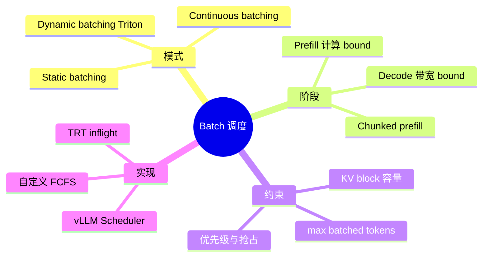
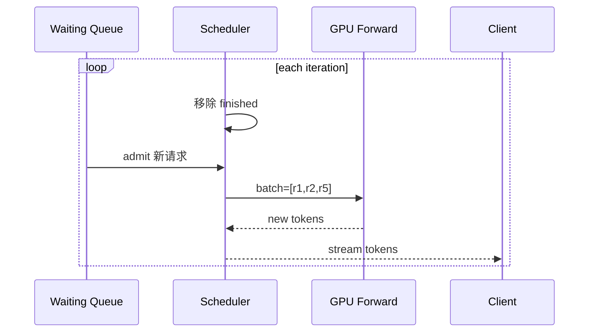

# 推理 Batch 调度与 Continuous Batching

> **文件编码**：UTF-8。  
> **前置**：[07 推理引擎架构](07-大模型推理引擎架构概览.md)、[08 KV Cache](08-KV-Cache与PagedAttention原理.md)、[14 vLLM 架构](14-vLLM-TensorRT-LLM-llama.cpp架构导读.md)。  
> **C++ 扩展**：[C++ 23 IO 多路复用](../C++/23-IO多路复用与高性能Server.md)（高并发连接与调度 Server 并行）。

---

## 0. 读前导读

### 0.1 用一句话弄懂本章

**Static batching** 等一批请求齐活再跑，短请求等长请求 **GPU 空转**；**Continuous batching（iteration-level scheduling）** 每个 decode step 后 **踢出已完成、插入新请求**，把 SM 利用率拉满——vLLM 吞吐 2～4× 的核心之一。

### 0.2 关键术语

| 术语 | 含义 |
|------|------|
| Prefill | 处理 prompt，算 KV，计算密集 |
| Decode | 每步生成 1 token，内存带宽敏感 |
| Iteration | 一次 forward（可能含多个 token prefill chunk） |
| Waiting / Running / Swapped | 请求状态机 |

### 0.3 学完能做到

1. 画 **static vs continuous** 时间线对比图
2. 解释 **prefill 与 decode 不能简单混 batch** 的原因与 **chunked prefill** 解法
3. 设计 mini **Scheduler 数据结构**（队列、优先级、KV block 约束）
4. 说明 **max_num_seqs、max_num_batched_tokens** 两个配置的含义
5. 关联 [11 章 gRPC](11-gRPC与高性能RPC服务.md) 流式输出与调度循环

---

## 1. 知识地图



---

## 2. Static Batching 的问题

```text
请求 A: prompt 512,  gen 128
请求 B: prompt 32,   gen 8
请求 C: prompt 64,   gen 16

Static: 等最慢 A 完成，B/C decode 空等 → GPU 利用率低
```



```mermaid
gantt
    title Static batch 时间线（示意）
    dateFormat X
    axisFormat %s
    section Batch1
    A prefill+decode :0, 640
    B waiting        :0, 640
    C waiting        :0, 640
```

**Padding 浪费**：为对齐 batch 维，短序列 pad 无效计算。

---

## 3. Continuous Batching 原理

每个 **iteration**（通常一个 decode step）：

1. 移除 `finished` 序列
2. 从 waiting 队列 **插入** 新序列（若 KV block 够）
3. 组 batch forward **一次 kernel**
4. 流式返回新 token



**吞吐提升**：GPU 上 **始终接近 max_num_seqs** 条序列在 decode（在负载足够时）。

---

## 4. Prefill vs Decode 调度

### 4.1 冲突

| 阶段 | 特性 | 混 batch 问题 |
|------|------|----------------|
| Prefill | 大 matmul，高 FLOPs | 与 decode 争抢 SM，decode 延迟抖动 |
| Decode | 小 batch 维，读 KV | 被长 prefill 阻塞 → **TTFT/ITL 变差** |

### 4.2 Chunked Prefill

长 prompt **分块** prefill，每块与 decode batch **交错**：

```text
iter1: decode 所有 running + prefill chunk1 of new request
iter2: decode + prefill chunk2
...
```

平衡 **吞吐与交互延迟**。

### 4.3 配置参数（vLLM 风格）

| 参数 | 作用 |
|------|------|
| `max_num_seqs` | 单 batch 最大并发序列 |
| `max_num_batched_tokens` | 单次 forward 最大 token 数（控 prefill 峰值） |
| `max_model_len` | 单序列 KV 上限 |
| `enable_chunked_prefill` | 开关分块 prefill |

---

## 5. KV Block 与调度耦合

调度 admit 新请求时需 **BlockManager** 分配 KV（[08 章](08-KV-Cache与PagedAttention原理.md)）：

```text
if free_blocks >= blocks_needed(prompt_len + max_gen):
    admit()
else:
    wait or preempt (swap to CPU / reject)
```

**抢占策略**（高级）：暂停低优先级长任务，释放 block 给短请求——生产需防 starvation。

---

## 6. Mini Scheduler 设计（19 章预习）

```python
@dataclass
class Request:
    id: str
    prompt_tokens: list
    output_tokens: list
    max_new: int
    state: Literal["waiting","running","done"]

class Scheduler:
    def schedule(self) -> list[Request]:
        # 1. 移除 done
        # 2. FCFS admit until block budget
        # 3. return running set for one forward
        ...
```

**里程碑**：先 FCFS + 固定 block；再加 chunked prefill；再加优先级。

---

## 7. 指标与 SLO

| 指标 | 含义 |
|------|------|
| **TTFT** | 首 token 时间（prefill 主导） |
| **ITL** | 逐 token 间隔（decode 主导） |
| **Throughput** | tokens/s 集群级 |
| **Goodput** | 满足 SLO 的有效吞吐 |

**矛盾**：压 `max_num_seqs` 提吞吐 → ITL 上升；需 **负载测试** 找 knee point。

---

## 8. 常见困惑 FAQ

**Q1：continuous batching 就是 dynamic batching？**  
内涵相近；LLM 圈特指 **iteration-level** + KV 生命周期管理。

**Q2：batch size 越大越好？**  
超过 KV/SM 上限 OOM 或 latency 爆炸；需配置上限。

**Q3：单请求延迟会变差吗？**  
高负载时 **ITL 增加**；低负载与 static 接近。

**Q4：和 speculative decoding 关系？**  
调度器需管理 **draft + verify** 两阶段 batch。

**Q5：CPU bottleneck？**  
Python 调度、tokenization、detokenize 可成瓶颈——[17 章](17-GPU性能剖析Nsight与perf.md) 分离 profile。

**Q6：TRT-LLM inflight batching？**  
同类思想；runtime C++ 侧调度。

**Q7：如何做公平队列？**  
加权 FCFS、token budget、租户 quota。

**Q8：流式 HTTP 与调度循环？**  
每 iteration 产生 token → push 到 per-request queue → SSE/gRPC stream。

**Q9：max_num_batched_tokens 设太小？**  
prefill 切太碎，TTFT 上升。

**Q10：和 [16 章 C++ epoll](../C++/23-IO多路复用与高性能Server.md) 关系？**  
网络层收请求；调度器在 GPU 侧组 batch——两层都要高并发设计。

---

## 9. 练习

1. **概念**：画 continuous batching 三轮 iteration 的 batch 成员变化表。
2. **设计**：给定 1000 free blocks，block_size=16，估算 admit prompt_len=200 需多少 blocks。
3. **编码**：实现 `Scheduler.admit` FCFS 伪代码（含 block 预算）。
4. **分析**：说明 chunked prefill 如何改善 decode 饿死。
5. **压测**：vLLM 改 `max_num_seqs`，记录 throughput vs P99 ITL 曲线（可写预期趋势）。

---

## 10. 学完标准

- [ ] 能对比 static 与 continuous batching
- [ ] 能解释 prefill/decode 调度矛盾与 chunked prefill
- [ ] 能说明 KV block 如何约束 admit
- [ ] 能解释 TTFT/ITL/throughput 权衡
- [ ] 能描述 vLLM Scheduler 职责边界

---

## 11. 闭卷自测（10 题）

1. Continuous batching 在哪个粒度重组 batch？
2. Static batching 两大浪费是什么？
3. Prefill 与 decode 谁更 compute-bound？
4. `max_num_batched_tokens` 限制什么？
5. Chunked prefill 解决什么问题？
6. BlockManager 在 admit 时检查什么？
7. TTFT 主要受哪个阶段影响？
8. 吞吐 2～4× 相对谁 baseline？
9. 抢占 KV 可能带来什么风险？
10. 19 章 Scheduler 第一版用什么策略？

<details>
<summary>参考答案</summary>

1. 每个 iteration（decode step）级别。
2. 等待齐 batch 的空转；padding 无效计算。
3. Prefill（相对 decode 更 compute-heavy）。
4. 单次 forward 参与计算的 token 总数上限。
5. 长 prefill 阻塞 decode、导致 ITL/交互延迟恶化。
6. 是否有足够 KV block 容纳 prompt+generation。
7. Prefill（首 token 前）。
8. 相对 static batching（同硬件同负载）。
9. 低优先级任务饥饿、swap 开销、复杂度上升。
10. FCFS + 固定 block size 的简化 BlockManager。

</details>

---

## 12. 下一章预告

[17 GPU 性能剖析：Nsight 与 perf](17-GPU性能剖析Nsight与perf.md) 当调度满负载仍慢时，用 **profiler 定位是 kernel、PCIe 还是 Python**。
