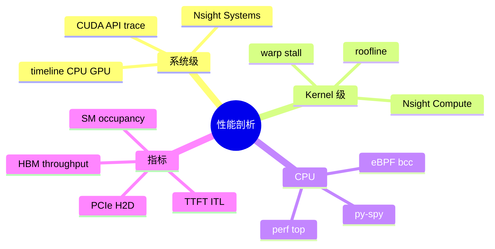
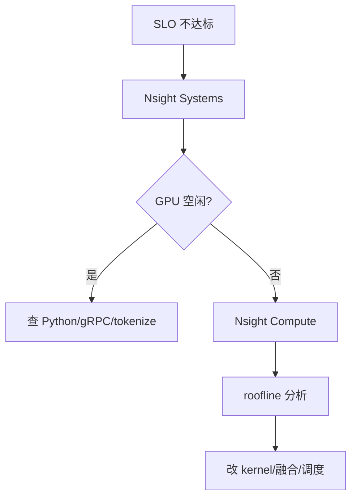

# GPU 性能剖析：Nsight 与 perf

> **文件编码**：UTF-8。  
> **前置**：[03 GPU 与 CUDA 入门](03-GPU架构与CUDA编程入门.md)、[05 矩阵运算与 cuBLAS](05-矩阵运算cuBLAS与GEMM优化入门.md)、[15 FlashAttention](15-FlashAttention与算子融合.md)。  
> **C++ 扩展**：[C++ 12 性能分析与调试](../C++/12-性能分析与调试.md)。

---

## 0. 读前导读

### 0.1 用一句话弄懂本章

**Profiling** = 用 **Nsight Systems / Nsight Compute / perf** 回答「慢在哪」——是 **kernel 算得慢、HBM 带宽满、CPU 调度堵、还是 PCIe 拷贝**；没有测量就没有优化方向。

### 0.2 解决什么痛点

| 痛点 | 本章 |
|------|------|
| vLLM 吞吐低于预期 | §3 Nsight Systems 时间线 |
| 单个 kernel SM 利用率低 | §4 Nsight Compute |
| Python 占 CPU 过高 | §2 分层 profile |
| 只会 `nvidia-smi` 不够 | §5 工具矩阵 |

### 0.3 学完能做到

1. 用 **Nsight Systems** 抓一次 vLLM serving 的 CPU-GPU timeline
2. 用 **Nsight Compute** 看 FlashAttention kernel 的 **Memory Throughput / Occupancy**
3. 用 **perf record** 定位 C++ Server 热点函数
4. 画 **Roofline** 判断 kernel memory-bound vs compute-bound
5. 写一份 **优化假设 → 测量 → 结论** 三段式报告

---

## 1. 知识地图



---

## 2. 剖析分层方法论

```text
L0 业务指标: tokens/s, TTFT, P99 ITL
L1 系统 timeline: Nsight Systems — 谁在等谁
L2 Kernel 细节: Nsight Compute — 为何 SM 空
L3 源码: 热点 kernel / Python 栈
```



**原则**：先 **Systems** 找瓶颈大类，再 **Compute** 钻单 kernel；避免一上来就看寄存器。

---

## 3. Nsight Systems

### 3.1 适用场景

- 多线程 Python + CUDA **overlap** 是否有效
- **cudaMemcpy** 是否阻塞 compute stream
- **NCCL** 集体通信与 compute 是否串行
- Prefill 与 decode **phase** 时间占比

### 3.2 典型命令

```bash
nsys profile -o report --trace=cuda,nvtx,osrt python -m vllm.entrypoints.openai.api_server ...
# 或
nsys profile -o infer ./your_grpc_server
```

**NVTX 标记**（强烈建议）：

```cpp
#include <nvtx3/nvToolsExt.h>
nvtxRangePushA("Scheduler::step");
// ...
nvtxRangePop();
```

在 timeline 上区分 **schedule / prefill / decode**。

### 3.3 读图 checklist

| 现象 | 可能原因 |
|------|----------|
| GPU 长时间空白 | batch 不足、同步点、I/O 阻塞 |
| 大量 `cudaDeviceSynchronize` | 调试代码或错误 stream 用法 |
| H2D 与 compute 无 overlap | 未用 async + pinned memory |
| CPU 100% 单核 | GIL、tokenize、JSON |

---

## 4. Nsight Compute

### 4.1 适用场景

单个 kernel（如 `flash_fwd_kernel`）为何 **Memory Throughput 低** 或 **Occupancy 低**。

```bash
ncu --set full -o flash_report python bench_flash.py
# 或指定 kernel
ncu -k regex:flash --metrics sm__throughput.avg.pct_of_peak_sustained_elapsed ...
```

### 4.2 关键指标

| 指标 | 含义 |
|------|------|
| **SM Occupancy** | 活跃 warp 比例；过低可能寄存器/shared mem 过多 |
| **Memory Throughput % of peak** | 接近 peak → memory-bound |
| **Compute Throughput % of peak** | 接近 peak → compute-bound |
| **Warp Stall Reasons** | Memory Dependency / Barrier / … |
| **L2 Hit Rate** | cache 友好性 |

### 4.3 Roofline（与 05 章衔接）

\[
\text{Attainable FLOPs} = \min(\text{Peak FLOPs},\ \text{Intensity} \times \text{Peak BW})
\]

Attention decode 常 **低 arithmetic intensity → memory-bound** → 优化 IO（Flash、量化 KV）而非加 FLOPs。

---

## 5. Linux perf 与 Python

### 5.1 perf

```bash
perf record -g -p $(pidof infer_server) -- sleep 30
perf report
```

定位 **C++ gRPC 线程、调度器、内存分配** 热点。

### 5.2 py-spy

```bash
py-spy record -o profile.svg --pid <vllm_pid>
```

**无需改代码** 看 Python 栈——找 **scheduler、detokenize** 热点。

### 5.3 其他

| 工具 | 用途 |
|------|------|
| `nvidia-smi dmon` | 实时 SM/mem 利用 |
| `dcgm-exporter` | K8s Prometheus 监控 |
| `strace` | 异常 syscall（mmap fault 风暴） |

---

## 6. LLM Serving 专项 Profile 计划

| 阶段 | 测什么 | 工具 |
|------|--------|------|
| 冷启动 | load 权重 H2D | nsys + timestamps |
| Prefill | TTFT、prefill kernel | NVTX range |
| Decode 稳态 | ITL、batch size | nsys + metrics |
| 高并发 | queue 深度、reject | 应用 metrics + nsys |

**对照实验**：改一项（如 `max_num_seqs`）→ 只变一项 → 重测。

---

## 7. 常见困惑 FAQ

**Q1：Nsight Systems 和 Compute 区别？**  
Systems=全局时间线；Compute=单 kernel 深度指标。

**Q2：profile 会改变性能吗？**  
会；用 **release build**，profile 开销相对趋势仍有效。

**Q3：生产能开 profile 吗？**  
短窗口采样、NVTX 轻量标记；完整 nsys 仅 staging。

**Q4：GPU 利用率 100% 还慢？**  
可能 **memory-bound 100%** 仍不够 tokens/s；看 **有效吞吐** 非 SM 数字。

**Q5：两个 kernel 交替慢？**  
看 **stream 依赖** 与 **false synchronization**。

**Q6：和 [C++ 12 perf](../C++/12-性能分析与调试.md) 关系？**  
C++ 12 讲 gprof/valgrind；本章 **GPU + 混合栈**。

**Q7：FlashAttention kernel 找不到？**  
`ncu --list-kernels` 或 nsys CUDA trace 过滤 `flash`。

**Q8：PCIe 瓶颈怎么认？**  
nsys 中 H2D 带宽顶满且与 compute 串行；见 [12 章 mmap](12-Checkpoint加载与mmap权重IO.md)。

**Q9：多卡 profile？**  
nsys 支持 multi-GPU；注意 rank0 不代表全部。

**Q10：优化后如何回归？**  
固定 benchmark prompt/并发，对比 TTFT/ITL/tokens/s 表格。

---

## 8. 练习

1. **动手**：对 `vector_add` CUDA 样例跑 `ncu`，记录 occupancy 与 memory throughput。
2. **动手**：vLLM 或自建 server 抓 30s nsys，标出 GPU idle 比例。
3. **分析**：根据 roofline 判断 decode MHA 该优化 FLOPs 还是 BW。
4. **工程**：在 scheduler 加 3 个 NVTX range，重抓 timeline 截图解读。
5. **报告**：写半页「假设-测量-结论」优化备忘录模板。

---

## 9. 学完标准

- [ ] 能选择 Systems vs Compute 使用场景
- [ ] 能解读 SM occupancy 与 memory throughput
- [ ] 会用 perf/py-spy 查 CPU 热点
- [ ] 能画三层 profile 方法论图
- [ ] 能设计 serving 对照 benchmark

---

## 10. 闭卷自测（10 题）

1. LLM 优化 profile 应先 Systems 还是 Compute？
2. NVTX 作用？
3. memory-bound kernel 在 roofline 哪侧？
4. py-spy 适用什么语言栈？
5. GPU timeline 长空白首先怀疑什么？
6. Occupancy 低常见两原因？
7. `cudaDeviceSynchronize` 在 timeline 上意味什么？
8. decode 阶段常用哪个 Nsight 指标判断 BW 瓶颈？
9. 冷启动 profile 要关注哪类 memcpy？
10. 与 16 章调度关系？

<details>
<summary>参考答案</summary>

1. 先 Systems 定位大类（GPU 空 vs 满）。
2. 在 timeline 标注自定义区间（schedule/prefill/decode）。
3. 斜率受内存带宽限制区域。
4. Python（无需 instrumentation）。
5. batch 不足、CPU 阻塞、同步、I/O。
6. 寄存器/shared memory 占用高；launch config 不当。
7. CPU 等待 GPU 或强制全局同步点。
8. Memory Throughput % of peak、sustained BW。
9. 权重 H2D（与 mmap fault 叠加看 CPU）。
10. 调度不当导致 GPU 空泡——Systems 先证伪再调 scheduler。

</details>

---

## 11. 下一章预告

[18 容器化与 Kubernetes GPU 推理部署](18-容器化与Kubernetes-GPU推理部署.md) 把 profile 过的引擎 **装箱、调度到 GPU 节点、暴露 metrics**。
