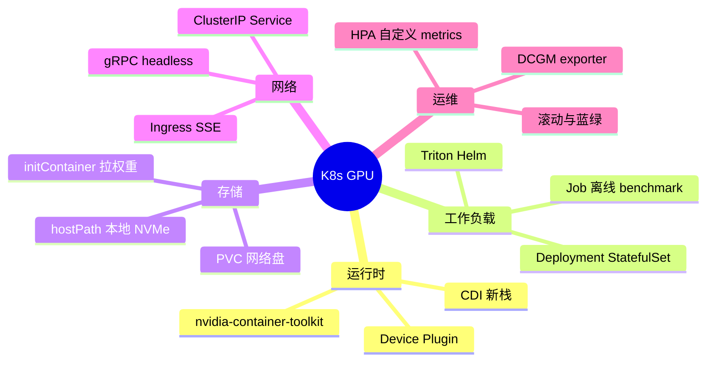
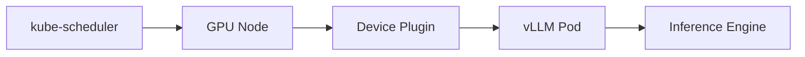

# 容器化与 Kubernetes GPU 推理部署

> **文件编码**：UTF-8。  
> **前置**：[11 gRPC Serving](11-gRPC与高性能RPC服务.md)、[16 Batch 调度](16-推理Batch调度与ContinuousBatching.md)、[17 性能剖析](17-GPU性能剖析Nsight与perf.md)、[Linux 12 Docker](../Linux/07-Docker与Compose.md)。

---

## 0. 读前导读

### 0.1 用一句话弄懂本章

**GPU 推理上 K8s** = 用 **Device Plugin + 镜像内 CUDA** 把 vLLM/TRT 进程跑在 **独占或 MIG 切分的 GPU** 上，通过 **Service / Ingress / HPA** 对外 serving，并用 **Prometheus + DCGM** 看 **tokens/s 与显存**。

### 0.2 解决什么痛点

| 痛点 | 本章 |
|------|------|
| 手工 ssh 起 vLLM 不可扩展 | §3 Deployment |
| 多模型多版本滚动升级 | §4 发布策略 |
| GPU 资源碎片化 | §2 调度与 MIG |
| 监控只有 nvidia-smi | §6 可观测性 |

### 0.3 学完能做到

1. 写 **GPU Deployment** YAML（`resources.limits.nvidia.com/gpu`）
2. 解释 **NVIDIA Device Plugin、runtimeclass、CUDA 镜像** 关系
3. 设计 **模型权重 initContainer + 本地 cache** 方案
4. 配置 **readiness：/health + warmup** 避免流量打到冷引擎
5. 列出 **multi-tenant GPU** 的 quota 与隔离要点

---

## 1. 知识地图



---

## 2. GPU 节点基础

### 2.1 组件链

```text
物理 GPU
  → NVIDIA Driver（节点）
  → nvidia-container-toolkit
  → kubelet + device plugin 分配 GPU
  → Pod spec resources.limits: nvidia.com/gpu: 1
  → 容器内 nvidia-smi 可见 1 卡
```



### 2.2 镜像要点

| 项 | 建议 |
|------|------|
| Base | `nvcr.io/nvidia/cuda:12.x-runtime-ubuntu22.04` + Python/torch |
| 版本锁 | **Driver ≥ 镜像 CUDA 要求**（查兼容性矩阵） |
| 非 root | 生产用非 root + readOnlyRootFilesystem（需可写 tmp） |
| SHM | `/dev/shm` 增大（PyTorch DataLoader / 部分框架） |

---

## 3. 推理 Deployment 示例（概念 YAML）

```yaml
apiVersion: apps/v1
kind: Deployment
metadata:
  name: vllm-llama
spec:
  replicas: 2
  selector:
    matchLabels:
      app: vllm-llama
  template:
    metadata:
      labels:
        app: vllm-llama
    spec:
      initContainers:
        - name: fetch-model
          image: curlimages/curl
          command: ["sh", "-c", "curl -L -o /models/model.safetensors ..."]
          volumeMounts:
            - name: model-cache
              mountPath: /models
      containers:
        - name: vllm
          image: vllm/vllm-openai:latest
          args:
            - --model=/models/...
            - --max-num-seqs=256
          resources:
            limits:
              nvidia.com/gpu: "1"
              memory: "32Gi"
            requests:
              nvidia.com/gpu: "1"
              memory: "24Gi"
          ports:
            - containerPort: 8000
          readinessProbe:
            httpGet:
              path: /health
              port: 8000
            initialDelaySeconds: 120
            periodSeconds: 10
          volumeMounts:
            - name: model-cache
              mountPath: /models
            - name: dshm
              mountPath: /dev/shm
      volumes:
        - name: model-cache
          emptyDir:
            sizeLimit: 50Gi
        - name: dshm
          emptyDir:
            medium: Memory
            sizeLimit: 16Gi
```

**要点**：

- **initContainer** 拉权重到 **emptyDir / 本地 SSD hostPath**（见 [12 章 mmap](12-Checkpoint加载与mmap权重IO.md)）
- **readiness 延迟** 覆盖冷启动 + CUDA graph
- **一 Pod 一 GPU** 最常见；TP 多卡用 **单 Pod 多 GPU limit**

---

## 4. 发布、伸缩与多版本

| 策略 | 适用 |
|------|------|
| RollingUpdate | 小版本、可接受 brief 降容 |
| 蓝绿 | 新 engine 整体验证后切流 |
| Canary | 10% 流量试 latency |

**HPA**：默认 CPU 不适合 GPU 推理；用 **自定义 metrics**（Prometheus `vllm:generation_tokens_total` rate）或 **KEDA**。

**注意**：scale up 新 Pod = **再次冷启动**；大模型常 **固定副本 + 队列** 而非激进 HPA。

---

## 5. Tensor Parallel 与多卡 Pod

```yaml
resources:
  limits:
    nvidia.com/gpu: "4"
```

- 容器内 **NCCL** 通信（[10 章](10-分布式训练与NCCL.md)）
- **Pod 反亲和**：避免多副本挤同一节点导致 GPU 争用
- **hostNetwork** 有时用于 RDMA（高级）

---

## 6. 可观测性

| 层级 | 工具 |
|------|------|
| GPU 硬件 | DCGM Exporter → Prometheus |
| 推理业务 | vLLM metrics、自定义 TTFT histogram |
| 日志 | 结构化 JSON、request_id |
| Trace | OpenTelemetry（可选） |

**告警**：GPU mem > 90%、queue depth、P99 ITL、OOMKilled。

---

## 7. 安全与多租户

- **租户隔离**：Namespace + ResourceQuota + 独立 GPU 节点池
- **镜像扫描**：Trivy
- **密钥**：模型 URL token 用 Secret，不 baked 进镜像
- **网络策略**：仅 Ingress 可达 API

---

## 8. 常见困惑 FAQ

**Q1：Docker 和 K8s 都要学吗？**  
先 [Linux 12 Docker](../Linux/07-Docker与Compose.md)；K8s 是生产编排。

**Q2：GPU 共享一张卡多个 Pod？**  
默认 **不支持** .fraction 需 MIG 或 time-slicing（延迟差）。

**Q3：权重放 NFS？**  
可 mmap 但 **冷启动慢**；推荐 **节点本地 cache**。

**Q4：liveness 和 readiness 区别？**  
liveness 杀重启；readiness 摘流量——推理用 readiness 挡冷启动。

**Q5：SSE 长连接与 Ingress？**  
需 **proxy read timeout** 足够大；或 gRPC streaming。

**Q6：Triton on K8s？**  
NVIDIA 提供 Helm；模型 repo 挂 PVC。

**Q7：CUDA OOM Pod 状态？**  
可能 exit 137；看 previous log + 调 `gpu-memory-utilization`。

**Q8：与 [11 gRPC](11-gRPC与高性能RPC服务.md) 暴露？**  
ClusterIP + gRPC health service；Ingress 需支持 HTTP/2。

**Q9：MIG 是什么？**  
A100/H100 切分物理 GPU 为多个实例，K8s 可分配 `nvidia.com/mig-1g.10gb` 等资源类型。

**Q10：19 章项目要部署 K8s 吗？**  
Milestone 可选：Docker Compose 必做；K8s 为加分项。

---

## 9. 练习

1. **概念**：画 kubelet → device plugin → Pod GPU 分配链。
2. **YAML**：为 7B 模型写 resources requests/limits 估算依据。
3. **设计**：initContainer + hostPath 缓存避免重复下载方案。
4. **运维**：列出 rolling update 时推理服务 3 条风险与对策。
5. **监控**：写 PromQL 示例：每秒生成 token 数。

---

## 10. 学完标准

- [ ] 能写带 GPU limit 的 Deployment
- [ ] 能解释 device plugin 与 toolkit 角色
- [ ] 能设计权重缓存与 readiness 策略
- [ ] 知道 HPA 需自定义 GPU/业务指标
- [ ] 能列举多租户 GPU 隔离 3 项

---

## 11. 闭卷自测（10 题）

1. Pod 如何申请 1 张 GPU？
2. initContainer 在推理部署中典型用途？
3. readiness 为何 inference 比 liveness 更重要？
4. 为何 HPA 默认 CPU 不适合 vLLM？
5. emptyDir vs PVC 存模型权衡？
6. TP=4 在 YAML 如何体现？
7. DCGM exporter 监控什么？
8. MIG 解决什么问题？
9. SSE 经 Ingress 需注意什么？
10. 19 章部署最低交付物？

<details>
<summary>参考答案</summary>

1. `resources.limits.nvidia.com/gpu: "1"`（需 device plugin）。
2. 下载/校验模型到 shared volume。
3. 冷启动未完成时不应接流量；误杀 liveness 会反复重启。
4. GPU 推理瓶颈在 GPU/批调度非 CPU。
5. emptyDir 快但 Pod 删即失；PVC 持久但可能慢网盘。
6. 单 Pod `nvidia.com/gpu: "4"` + 应用内 TP。
7. GPU 利用率、显存、温度、ECC 等。
8. 单卡多租户硬隔离、提高利用率。
9. 增大 proxy timeout、支持 HTTP/2/SSE。
10. Dockerfile + compose 或单节点 deploy；metrics 可选。

</details>

---

## 12. 下一章预告

[19 项目实战：简易推理引擎](19-项目实战简易推理引擎.md) 把 **CUDA 算子 + mmap + scheduler + gRPC** 合成可写进简历的 **Phase A～F 里程碑项目**。
