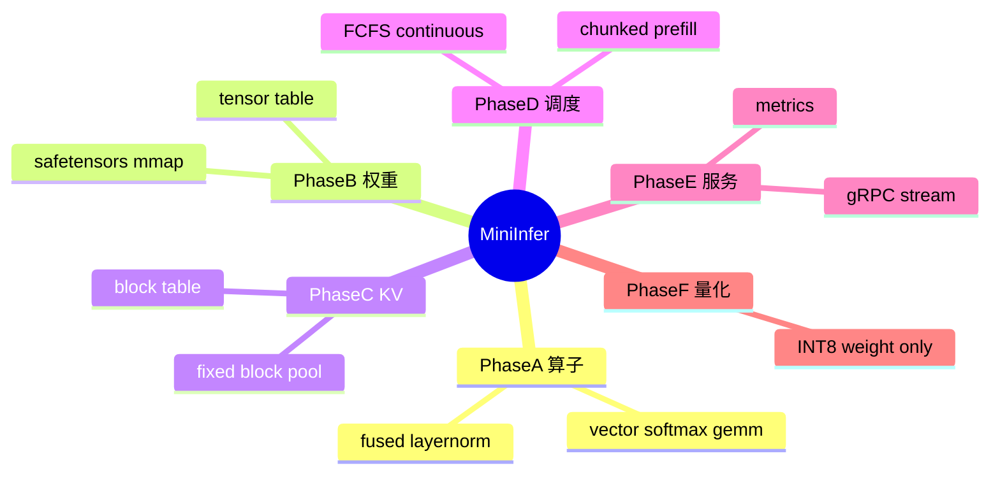
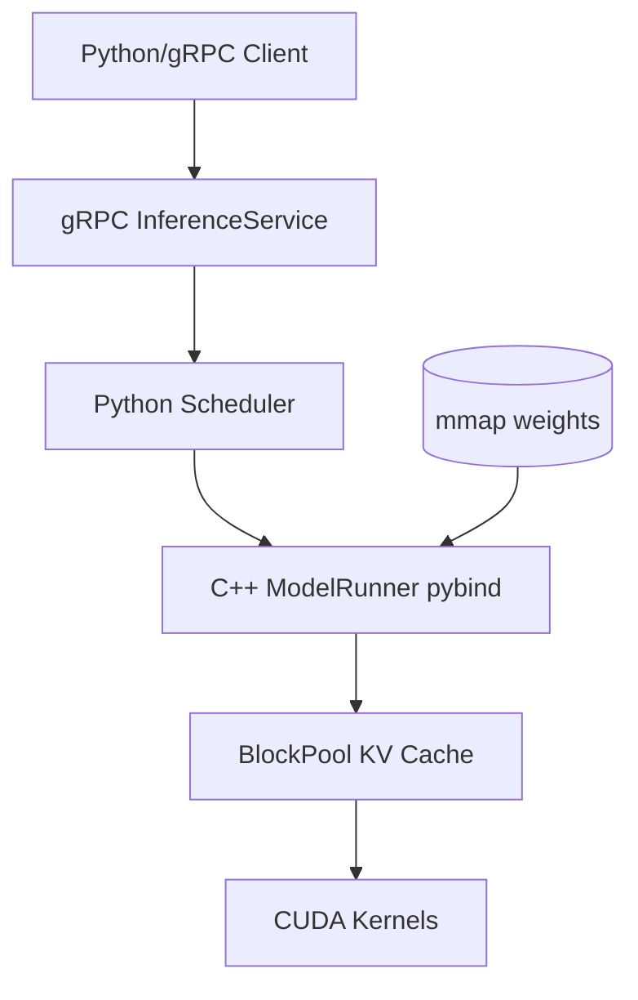
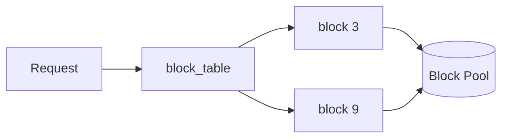

# 项目实战：简易推理引擎

> **文件编码**：UTF-8。  
> **前置**：完成 [01～18 章](00-学习路线图与说明.md) 理论；**06、11～13、16** 为直接依赖。  
> **交叉引用**：[C++ 19 gRPC](../C++/19-gRPC与Protobuf工程化.md)、[C++ 20 pybind11](../C++/20-pybind11与Python绑定入门.md)、[C++ 09 CMake](../C++/09-CMake与项目工程化.md)。

---

## 0. 读前导读

### 0.1 用一句话弄懂本章

本章不是再讲原理，而是一份 **可执行的迷你 vLLM 项目规格书**：从 **CUDA 算子 → mmap 权重 → KV Block → Continuous Scheduler → gRPC Serving → 量化路径**，分 **Phase A～F 里程碑** 交付，可直接写进简历并用 **STAR** 讲述。

### 0.2 项目定位

| 项 | 说明 |
|----|------|
| 名称 | **MiniInfer**（可自定） |
| 目标 | 7B 级 **小模型** 或 **Toy Transformer** 在单卡 GPU 上 **流式生成** |
| 非目标 | 不做完整 HF 生态、不做多模态、不追求 SOTA 吞吐 |
| 对标 | vLLM 子集：Block KV + iteration scheduler + pybind + gRPC |
| 语言 | C++/CUDA 核心 + Python 调度/客户端 |

### 0.3 学完 / 做完标准

- [ ] GitHub 仓库可 **clone → build → curl/grpc 出 token**
- [ ] README 含架构图、benchmark 数字、已知限制
- [ ] 能 3 分钟 STAR：难点 + 测量 + 结果
- [ ] 至少完成 **Phase A～E**；Phase F 为加分

---

## 1. 知识地图



---

## 2. 总体架构



### 2.1 目录结构（建议）

```text
mini-infer/
├── proto/infer.proto
├── csrc/
│   ├── ops/           # CUDA kernels
│   ├── kv/block_pool.{h,cpp}
│   ├── model/runner.{h,cpp}
│   └── binding.cpp    # PYBIND11_MODULE
├── python/
│   ├── scheduler.py
│   ├── engine.py
│   └── server_grpc.py
├── tests/
├── benchmarks/
├── docker/
├── CMakeLists.txt
└── README.md
```

### 2.2 技术栈绑定

| 模块 | 技术 | 对应章节 |
|------|------|----------|
| RPC | gRPC + protobuf | [11](../LLMInfra/11-gRPC与高性能RPC服务.md)、C++ 19 |
| 权重 | safetensors mmap | [12](12-Checkpoint加载与mmap权重IO.md) |
| 绑定 | pybind11 | [13](13-pybind11与Python-C++混合编程.md) |
| Attention | FlashAttn 或 naive→优化 | [15](15-FlashAttention与算子融合.md) |
| 调度 | Continuous batching | [16](16-推理Batch调度与ContinuousBatching.md) |
| Profile | Nsight 报告一节 | [17](17-GPU性能剖析Nsight与perf.md) |
| 部署 | Docker Compose | [18](18-容器化与Kubernetes-GPU推理部署.md) |

---

## 3. Phase A：CUDA 算子包（第 1～2 周）

### 3.1 目标

独立 **CUDA 扩展** 通过 pytest；为后续 ModelRunner 提供 op 原语。

### 3.2 交付物

| 算子 | 输入 | 验收 |
|------|------|------|
| `vector_add` | fp32 tensor | allclose |
| `softmax` | 2D fp32 | 与 torch 对比 |
| `naive_gemm` | M,N,K fp16 | 误差 < 1e-2 |
| `fused_layernorm` | hidden | 与 torch.nn.LayerNorm |

### 3.3 里程碑 checklist

- [ ] `torch.utils.cpp_extension` 或 CMake 一键 build
- [ ] CI（GitHub Actions）编译通过（可选 CPU-only job）
- [ ] `benchmarks/ops_benchmark.py` 输出 GFLOPs/s

### 3.4 风险

| 风险 | 缓解 |
|------|------|
| CUDA arch 不匹配 | 设 `TORCH_CUDA_ARCH_LIST=8.0` 等 |
| fp16 精度 | 关键路径用 fp32 参考对比 |

---

## 4. Phase B：权重加载（第 3 周）

### 4.1 目标

**mmap safetensors**，按 name 提供 **device tensor** 视图，冷启动 < 基线 read() 50% 时间（自测记录）。

### 4.2 交付物

- `load_safetensors_mmap(path) -> Dict[str, Tensor]`（Python API）
- C++ 解析 header JSON，**零拷贝** blob → `torch::from_blob` + 自定义 deleter 持有 mmap
- 支持 **Qwen2-0.5B / TinyLlama** 等小模型

### 4.3 里程碑 checklist

- [ ] 单元测试：tensor 数量、shape、dtype 与 `safetensors` Python 库一致
- [ ] 文档：文件布局 ASCII 图（链 [12 章](12-Checkpoint加载与mmap权重IO.md)）

---

## 5. Phase C：KV Block 管理（第 4～5 周）

### 5.1 目标

实现 **固定 block_size**（如 16）的 KV 池，模拟 [08 章 PagedAttention](08-KV-Cache与PagedAttention原理.md)。

### 5.2 核心数据结构

```python
# 概念
block_pool: Tensor  # [num_blocks, 2, block_size, num_heads, head_dim]
block_table: Dict[req_id, List[block_id]]
free_blocks: deque
```



### 5.3 交付物

- `BlockManager.allocate(seq_len) -> block_ids`
- `BlockManager.free(req_id)`
- CUDA：`paged_write_kv` / `paged_attention_naive`（可先 CPU 验证）

### 5.4 验收

- [ ] 模拟 100 个随机长度请求，**无泄漏**（free_blocks 回收）
- [ ] 碎片率统计脚本（对比连续分配浪费比例）

---

## 6. Phase D：Batch Scheduler（第 6～7 周）

### 6.1 目标

**Iteration-level continuous batching**，FCFS admit，支持 **prefill + decode** 交替。

### 6.2 接口

```python
class LLMEngine:
    def add_request(self, request_id, prompt_token_ids, max_new_tokens): ...
    def step(self) -> List[StepOutput]:  # 一次 forward，多个 req 的 new tokens
    def has_unfinished(self) -> bool: ...
```

### 6.3 调度规则（v1）

1. 每 `step()` 先移除 `finished`
2. FCFS 从 waiting admit，直到 **KV block 不足**
3. Running 集合做一次 forward（pybind `ModelRunner.forward`）
4. 可选：**chunked prefill**（`max_chunk_tokens=512`）

### 6.4 里程碑 checklist

- [ ] 单 seq  greedy decode 与 HuggingFace `generate` 一致（小模型）
- [ ] 3 seq 并发 continuous batch，吞吐 > static batch demo（自测表格）
- [ ] 指标：`tokens/s`、`TTFT` 打印

---

## 7. Phase E：gRPC Serving（第 8 周）

### 7.1 目标

对外 **GenerateStream**；对内 `LLMEngine` 循环。

### 7.2 proto（扩展 [11 章](11-gRPC与高性能RPC服务.md)）

```protobuf
service InferenceService {
  rpc GenerateStream(GenerateRequest) returns (stream GenerateResponse);
  rpc Health(HealthRequest) returns (HealthResponse);
}
```

### 7.3 交付物

- `server_grpc.py` 或 C++ Server + Python engine 子进程（择一）
- **Deadline / max queue**；队列满返回 `RESOURCE_EXHAUSTED`
- Prometheus `/metrics`：queue depth、tokens_total

### 7.4 验收

- [ ] `grpcurl` 或 Python client **流式收到 token**
- [ ] 10 并发 stream 无死锁（压测 5 min）

---

## 8. Phase F：量化路径（加分，第 9～10 周）

### 8.1 目标

**Weight-only INT8** 推理路径（见 [09 章](09-模型量化INT8-INT4-FP8与校准.md)）。

### 8.2 交付物

- 离线：`calibrate_activation_scales`（可选）+ weight pack INT8
- CUDA：`int8_gemm` 或调用 cuBLASLt
- 对比：FP16 vs INT8 **吞吐 + 精度**（小 benchmark set）

### 8.3 验收

- [ ] perplexity 或 10 条 prompt 人工对比「可接受退化」
- [ ] README **Known Issues** 一节诚实写限制

---

## 9. 测试与 Benchmark 规范

### 9.1 固定 benchmark suite

| Case | prompt tokens | gen tokens | concurrency |
|------|---------------|------------|-------------|
| S1 | 128 | 64 | 1 |
| S2 | 512 | 128 | 1 |
| M1 | 256 | 64 | 8 |
| M2 | 1024 | 128 | 4 |

报告：**tokens/s、TTFT P50/P99、ITL P99、GPU mem**。

### 9.2 Profile 交付

- 附 **Nsight Systems** 截图 1 张 + 200 字解读（[17 章](17-GPU性能剖析Nsight与perf.md)）

---

## 10. Docker 与部署（最低交付）

```yaml
# docker-compose.yml 概念
services:
  mini-infer:
    build: .
    deploy:
      resources:
        reservations:
          devices:
            - driver: nvidia
              count: 1
              capabilities: [gpu]
    ports:
      - "50051:50051"
      - "9090:9090"
    volumes:
      - ./models:/models:ro
```

K8s YAML 作 **Stretch Goal**（[18 章](18-容器化与Kubernetes-GPU推理部署.md)）。

---

## 11. 简历 STAR 模板

**Situation**：高并发 LLM 服务需提高 GPU 利用率。  
**Task**：实现迷你推理引擎，含 KV 分页与 continuous batching。  
**Action**：C++/CUDA 算子 + mmap 加载；Python scheduler；gRPC 流式；Nsight 定位 prefill 瓶颈并 chunked prefill。  
**Result**：相对 static batch **吞吐 +X%**（填实测）；单卡 **N tokens/s**；代码开源。

---

## 12. 常见困惑 FAQ

**Q1：没有 GPU 能做吗？**  
Phase A 可 CPU；B～F 需 GPU，建议云租卡。

**Q2：必须实现完整 Transformer 吗？**  
可先用 **2 层 toy 模型** 验证 scheduler，再换真实权重。

**Q3：能否直接用 vLLM 改？**  
练习目的在 **自写 BlockManager+step**；fork vLLM 学不到调度内核。

**Q4：FlashAttention 必须？**  
Phase A naive attention 可跑；性能里程碑再换 FlashAttn 库。

**Q5：gRPC 还是 HTTP？**  
规格要求 gRPC（[11 章](11-gRPC与高性能RPC服务.md)）；可加 HTTP 网关转换。

**Q6：和 C++ 19/20 如何并行？**  
CMake/pybind 细节问 C++ 章；本章管 **里程碑与验收**。

**Q7：多久能做完？**  
全职 **8～10 周**；业余 **12～16 周**（见 [00 路线图](00-学习路线图与说明.md)）。

**Q8：如何防 scope creep？**  
严格按 Phase 交付；F 可选；多模态/LoRA 不做。

**Q9：测试 ground truth？**  
同一模型 HuggingFace `generate` greedy 对比 token ids。

**Q10：开源许可？**  
Apache-2.0；注意模型权重 license 单独说明。

---

## 13. 练习（自检里程碑）

1. 为 Phase C 画 block_table 与物理 pool 映射图。
2. 写 Phase D `step()` 伪代码 30 行。
3. 列 Phase E 健康检查应覆盖的 3 种失败模式。
4. 设计 benchmark 表格并空出结果列待填。
5. 用 STAR 写一稿项目描述（200 字）。

---

## 14. 闭卷自测（10 题）

1. MiniInfer 六大 Phase 顺序？
2. Phase C 模拟的是哪一章概念？
3. continuous batching 落在哪个 Phase？
4. mmap 权重属于哪 Phase？
5. 相对 static batch 你要证明什么指标？
6. gRPC 流式对应哪个 RPC 模式？
7. Phase F 做哪种量化？
8. 最低部署交付物？
9. 为何建议 toy 模型先行？
10. 简历 Result 应含哪两类数字？

<details>
<summary>参考答案</summary>

1. A算子 → B权重 → C KV → D调度 → E gRPC → F量化。
2. PagedAttention / KV block（08 章）。
3. Phase D。
4. Phase B。
5. 吞吐 tokens/s 提升 + latency 分位数。
6. Server streaming。
7. Weight-only INT8。
8. Dockerfile + compose + README benchmark。
9. 降调试复杂度，先验证 scheduler/KV 正确性。
10. 吞吐/延迟 + 相对 baseline 提升百分比。

</details>

---

## 15. 下一章预告

[20 面试专题与知识点总表](20-面试专题与知识点总表.md) 把 **01～19 章** 收成面试索引，像 Java 15 一样 **逐项自评 ⬜/🔶/✅** 冲刺 Infra 岗。
