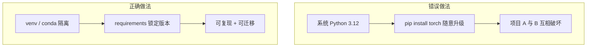

# Python 科学计算环境与 Jupyter

> **文件编码**：UTF-8。默认 **Python 3.10+**、**PyTorch 2.x**、**CUDA 12**（GPU 章节）。  
> **前置**：[Python 01 基础语法](../Python/01-Python基础语法与面向对象.md)、[LLMPython 00](00-学习路线图与说明.md)。  
> **定位**：搭建深度学习实验环境——venv/conda、Jupyter、pip、依赖锁定与 GPU 自检，为 02～08 章 PyTorch 实战铺路。

---

## 0. 读前导读

### 0.1 用一句话弄懂本章

**科学计算环境** = 可复现的 Python 虚拟环境 + 交互式 Notebook + 正确安装的 CUDA/PyTorch 栈。

### 0.2 你需要提前知道什么

| 背景 | 建议 |
|------|------|
| 只会系统 Python | 必须隔离环境，避免污染全局 site-packages |
| 有后端 FastAPI 经验 | [Python 04](../Python/04-FastAPI核心开发.md) 与 DL 环境独立，本章专注 ML 栈 |
| Windows 用户 | 优先 WSL2 或原生 conda；GPU 驱动与 CUDA 版本需对齐 |

### 0.3 本章知识地图（☐→☑）

- [ ] 用 venv 或 conda 创建独立环境并激活
- [ ] 用 `requirements.txt` / `environment.yml` 锁定依赖
- [ ] 启动 Jupyter Lab 并在 Notebook 中 `%pip install`
- [ ] 运行 GPU 自检脚本确认 `torch.cuda.is_available()`
- [ ] 完成 §12 闭卷自测 ≥8/10

### 0.4 建议学习时长

- **1～2 天**（环境搭建 0.5 天 + Jupyter 熟练 0.5～1 天）

### 0.5 学完你能做什么

独立搭建 PyTorch 开发环境；用 Notebook 做交互式张量实验；向队友交付可复现的 `requirements.txt`。

---

## 1. 为什么深度学习需要独立环境

深度学习项目依赖链长：PyTorch、CUDA、cuDNN、transformers、accelerate 等。混用系统 Python 会导致：

- 版本冲突（如 `numpy` 与 `torch` 不兼容）
- 无法复现实验（「我这能跑你这不行」）
- GPU 库与 CPU 库混装引发 segfault



与 [LLMInfra 03 GPU/CUDA](../LLMInfra/03-GPU架构与CUDA编程入门.md) 的关系：Python 侧装 **PyTorch 预编译包**（内含 CUDA runtime）；C++ 侧需单独装 **CUDA Toolkit** 写 kernel。

---

## 2. venv：轻量虚拟环境

### 2.1 创建与激活

```bash
# Windows PowerShell
python -m venv .venv
.\.venv\Scripts\Activate.ps1

# Linux / macOS / WSL
python3 -m venv .venv
source .venv/bin/activate
```

激活后提示符前出现 `(.venv)`，`which python` 指向项目内解释器。

### 2.2 安装 PyTorch（CPU 示例）

```bash
pip install --upgrade pip
pip install torch torchvision torchaudio --index-url https://download.pytorch.org/whl/cpu
pip install numpy jupyter ipykernel matplotlib
```

**GPU 版**（以 CUDA 12.1 为例，见 [pytorch.org](https://pytorch.org) 最新命令）：

```bash
pip install torch torchvision torchaudio --index-url https://download.pytorch.org/whl/cu121
```

### 2.3 注册 Jupyter Kernel

```bash
python -m ipykernel install --user --name=llm-dev --display-name="Python (llm-dev)"
```

---

## 3. conda / mamba：科学计算常用

适合需要 **非 pip 二进制依赖**（如特定 CUDA、MKL）的场景。

```bash
# 安装 Miniforge / Miniconda 后
conda create -n llm python=3.11 -y
conda activate llm
conda install pytorch pytorch-cuda=12.1 -c pytorch -c nvidia -y
conda install jupyterlab numpy matplotlib -y
```

导出环境：

```bash
conda env export > environment.yml
conda env create -f environment.yml
```

| 工具 | 优点 | 缺点 |
|------|------|------|
| venv + pip | 轻、与 PyPI 一致 | 部分 CUDA 包需手动选对 wheel |
| conda | 预编译科学栈全 | 体积大、通道混用易冲突 |
| mamba | conda 更快求解器 | 需额外安装 |

---

## 4. pip 与依赖管理

### 4.1 requirements.txt

```text
# requirements.txt 示例
torch==2.2.0
numpy>=1.24,<2.0
jupyterlab>=4.0
matplotlib>=3.8
```

```bash
pip freeze > requirements-lock.txt   # 精确锁定（交付用）
pip install -r requirements.txt
```

### 4.2 可选：uv / pip-tools

大型项目可用 `uv pip compile` 或 `pip-compile` 生成可复现 lock 文件。入门阶段 `requirements.txt` 足够。

---

## 5. Jupyter 工作流

### 5.1 启动

```bash
cd f:\study\后端学习\LLMPython
jupyter lab
# 或
jupyter notebook
```

浏览器打开 `http://localhost:8888`；Token 见终端输出。

### 5.2 Notebook 内安装包

```python
%pip install einops -q
```

 `%pip` 保证包装进 **当前 kernel** 对应的环境，优于旧式 `!pip`。

### 5.3 常用魔法命令

```python
%timeit sum(range(1000))      # 微基准
%matplotlib inline            # 内联绘图
%load_ext autoreload
%autoreload 2                 # 改 .py 后自动重载
```

### 5.4 目录与版本控制

- Notebook 放 `notebooks/` 或各章配套目录
- 用 `.gitignore` 忽略 `.ipynb_checkpoints/`、大数据、`.venv/`
- 大输出清空前：`Cell → All Output → Clear`


---

## 6. 项目结构建议

```text
my-llm-project/
├── .venv/
├── requirements.txt
├── environment.yml          # 可选
├── notebooks/
│   └── 01-env-check.ipynb
├── src/
│   └── train.py
└── data/                    # 通常 gitignore
```

与 [Python 10 项目实战](../Python/10-后端项目实战与面试准备.md) 的工程化思路一致，但 DL 项目额外关注 **GPU 与数据路径**。

---

## 7. GPU 环境自检

### 7.1 驱动与 CUDA

```bash
nvidia-smi
```

应看到 GPU 型号、驱动版本、CUDA Version（驱动支持的上限）。

### 7.2 PyTorch GPU 检查

```python
import torch

print("PyTorch:", torch.__version__)
print("CUDA available:", torch.cuda.is_available())
if torch.cuda.is_available():
    print("Device:", torch.cuda.get_device_name(0))
    print("CUDA version (built):", torch.version.cuda)
    x = torch.randn(3, 3, device="cuda")
    print("Tensor on GPU:\n", x)
```

**预期输出（有 GPU 时示例）**：

```text
PyTorch: 2.2.0+cu121
CUDA available: True
Device: NVIDIA GeForce RTX 4060
CUDA version (built): 12.1
Tensor on GPU:
 tensor([[...]], device='cuda:0')
```

**无 GPU 时**：`CUDA available: False`，后续章节可用 CPU 学习，08 章再补 GPU。

### 7.3 常见问题速查

| 现象 | 可能原因 |
|------|----------|
| `False` 但 nvidia-smi 正常 | 装了 CPU 版 torch |
| DLL load failed (Windows) | CUDA 运行时与 wheel 不匹配 |
| 多卡只认一张 | `CUDA_VISIBLE_DEVICES=0` |

---

## 8. VS Code / Cursor 集成

1. 打开项目文件夹，选择解释器：`.venv\Scripts\python.exe`
2. 安装 Python + Jupyter 扩展
3. Notebook 右上角选择 kernel **Python (llm-dev)**
4. 调试 `.py` 训练脚本与 Notebook 共用同一 venv

---

## 9. 与 LLM 学习路线的衔接

| 本章 | 后续 |
|------|------|
| 环境 + Jupyter | [02 NumPy](02-NumPy深度与张量思维.md) 张量思维 |
| GPU 自检 | [08 GPU/AMP](08-GPU训练与混合精度AMP.md) 深入 |
| pip 依赖 | [12 HuggingFace](00-学习路线图与说明.md) 生态（路线图 12 章） |

数学地基可并行：[LLMInfra 01 线代](../LLMInfra/01-线性代数与数值计算基础.md)。

---

## 10. 练习

1. **venv 全流程**：创建 `.venv`，安装 torch + jupyter，写 `check_env.py` 打印版本与 CUDA 状态。
2. **requirements**：为上述环境生成 `requirements.txt`，在新目录 `pip install -r` 复现。
3. **Notebook**：新建 notebook，用 `%timeit` 对比 `numpy.dot(1000x1000)` 与 `torch.mm`（CPU）。
4. **conda 对比**（可选）：用 conda 建环境，对比 `environment.yml` 与 pip 工作流差异。
5. **文档化**：写 README 三节——创建环境、安装依赖、启动 Jupyter。

---

## 11. 学完标准

- [ ] 能口述 venv 与 conda 选型理由
- [ ] 独立激活环境并启动 Jupyter Lab
- [ ] 解释 `pip freeze` 与宽松 `requirements.txt` 的区别
- [ ] 运行 GPU 自检并截图/记录输出
- [ ] 知道 PyTorch CUDA wheel 与系统 CUDA Toolkit 的区别

---

## 12. FAQ

**Q1：venv 和 conda 二选一还是都用？**  
日常 PyTorch 训练 **venv + pip** 足够；多 CUDA 版本并存或依赖复杂 C 库时用 conda。

**Q2：Jupyter Notebook 和 Lab 选哪个？**  
**Lab** 为现行默认（多标签、文件树）；Notebook 经典界面仍可用。

**Q3：为什么不在系统 Python 里 pip install torch？**  
污染全局、升级其它软件时易 breakage；生产与论文复现均要求隔离环境。

**Q4：CUDA 12 和 11 怎么选？**  
跟 **显卡驱动** 和 **PyTorch 官网 wheel** 对齐；`nvidia-smi` 的 CUDA Version 是驱动上限，不必等于 Toolkit 小版本。

**Q5：Mac M 系列没有 CUDA 怎么办？**  
用 `pip install torch` 默认 **MPS** 后端；本章 GPU 检查改为 `torch.backends.mps.is_available()`。

**Q6：Notebook 要不要提交 git？**  
可以提交，但 **清除巨大输出**；敏感路径与 API Key 绝不入库。

**Q7：`%pip` 和 `!pip` 区别？**  
`%pip` 确保包装进当前 kernel 环境；`!pip` 可能装到 shell 默认 python。

**Q8：WSL2 下 GPU 怎么用？**  
Windows 装 NVIDIA WSL 驱动，WSL 内装 CUDA 版 PyTorch；`nvidia-smi` 在 WSL 终端可运行。

**Q9：Python 3.12 能装 PyTorch 吗？**  
查官网支持矩阵；不稳定时用 **3.10 或 3.11** 最省心。

**Q10：如何与队友共享环境？**  
提交 `requirements.txt` 或 `environment.yml` + README；大数据与权重用网盘/对象存储，不进 repo。

---

## 13. 闭卷自测

1. 创建 venv 的两条核心命令（创建 + 激活 Windows）？
2. `pip freeze` 与手写 `requirements.txt` 各适合什么场景？
3. Jupyter 中 `%pip install X` 优于 `!pip install X` 的原因？
4. `torch.cuda.is_available()` 返回 False 时首先检查什么？
5. conda 的 `environment.yml` 对应 pip 的什么文件？
6. `ipykernel install` 的作用？
7. nvidia-smi 里的 CUDA Version 表示什么？
8. 为何 DL 项目常忽略 `.venv` 在 git 中？
9. `%autoreload 2` 解决什么问题？
10. PyTorch GPU wheel 自带的 CUDA 与系统 CUDA Toolkit 关系？

<details>
<summary>参考答案</summary>

1. `python -m venv .venv`；`.\.venv\Scripts\Activate.ps1`（Windows）。
2. freeze 精确复现；手写宽松约束便于跨平台小版本升级。
3. `%pip` 绑定当前 notebook kernel 的 Python 环境。
4. 是否误装 CPU 版 torch；驱动是否正常；CUDA 版本是否匹配 wheel。
5. 大致对应 `requirements.txt` + 显式 Python 版本与 conda 通道包。
6. 把该虚拟环境注册为 Jupyter 可选 kernel。
7. 驱动支持的最高 CUDA 运行时 API 版本（非已安装 Toolkit 版本）。
8. 体积极大、平台相关；每人本地创建即可。
9. 修改外部 `.py` 模块后 notebook 自动重新 import，无需重启 kernel。
10. wheel 内嵌运行时库，写 CUDA C++ 扩展才需单独装 Toolkit（见 LLMInfra）。

</details>

---

## 14. 下一章预告

环境就绪后，NumPy 的 **ndarray 与广播** 是理解 PyTorch 张量的捷径。02 章将对比 `einsum`、内存布局，并建立与 `torch.Tensor` 的一一映射。

---

*上一章：[00 学习路线图](00-学习路线图与说明.md)*  
*下一章：[02 NumPy 深度与张量思维](02-NumPy深度与张量思维.md)*
