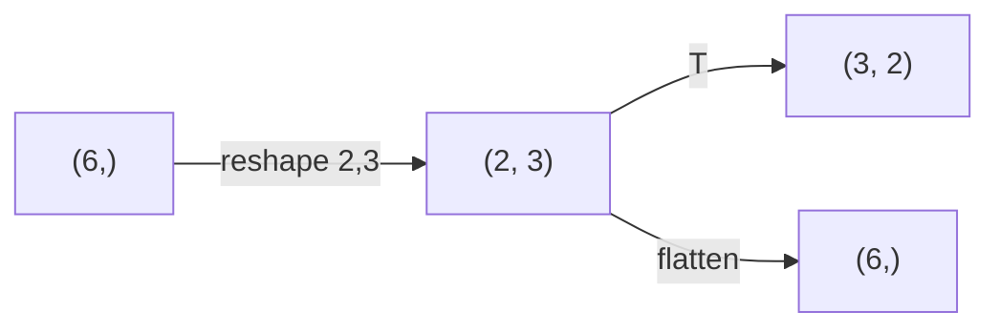
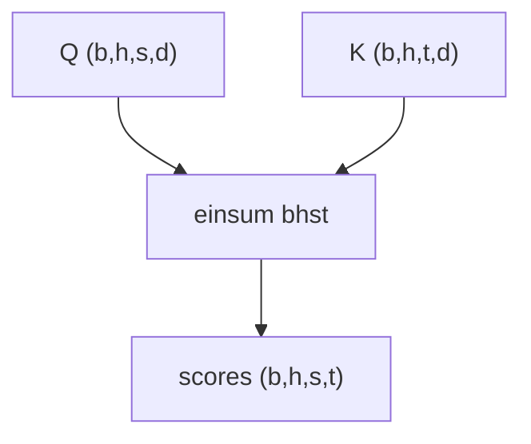

# NumPy 深度与张量思维

> **文件编码**：UTF-8。  
> **前置**：[01 科学计算环境](01-Python科学计算环境与Jupyter.md)、[Python 02 内置类型](../Python/02-Python内置类型模块与类型注解.md)、[LLMInfra 01 线代](../LLMInfra/01-线性代数与数值计算基础.md)。  
> **定位**：用 NumPy 建立 **张量形状、广播、einsum** 思维，平滑过渡到 PyTorch。

---

## 0. 读前导读

### 0.1 用一句话弄懂本章

**NumPy** = Python 科学计算的 ndarray 基石；**张量思维** = 一切深度学习运算都是 **形状变换 + 逐元素/归约/矩阵乘**。

### 0.2 你需要提前知道什么

| 背景 | 建议 |
|------|------|
| Python 列表 | 理解 list vs ndarray 性能差异 |
| 线代基础 | 复习 [LLMInfra 01](../LLMInfra/01-线性代数与数值计算基础.md) GEMM 维度 |
| 已装 PyTorch | 本章末尾对比 torch，03 章深入 |

### 0.3 本章知识地图（☐→☑）

- [ ] 创建 ndarray 并解释 dtype、shape、strides
- [ ] 使用切片与视图 vs 拷贝
- [ ] 手推广播规则并解决 shape mismatch
- [ ] 用 `einsum` 写 batch 矩阵乘与 attention 雏形
- [ ] 对比 NumPy 与 PyTorch API 差异
- [ ] 完成 §13 闭卷自测 ≥8/10

### 0.4 建议学习时长

- **3～4 天**（每天 1.5～2 h：概念 + 代码）

### 0.5 学完你能做什么

读训练脚本里的 `reshape/transpose/einsum` 不再晕；debug shape 错误；用 NumPy 快速验证公式再写 torch。

---

## 1. ndarray 核心概念

### 1.1 创建与属性

```python
import numpy as np

a = np.array([[1, 2, 3], [4, 5, 6]], dtype=np.float32)
print("shape:", a.shape)      # (2, 3)
print("dtype:", a.dtype)      # float32
print("ndim:", a.ndim)        # 2
print("size:", a.size)        # 6
print("strides (bytes):", a.strides)
```

**预期输出**：

```text
shape: (2, 3)
dtype: float32
ndim: 2
size: 6
strides (bytes): (12, 4)
```

Row-major（C 顺序）：最后一维 stride 最小，与 [LLMInfra 01](../LLMInfra/01-线性代数与数值计算基础.md) 一致。

### 1.2 常用创建函数

```python
zeros = np.zeros((2, 3))
ones = np.ones((3, 1))
rng = np.random.default_rng(42)
randn = rng.standard_normal((2, 2))
eye = np.eye(3)
arange = np.arange(0, 10, 2)
```

---

## 2. 索引、切片与视图

```python
x = np.arange(12).reshape(3, 4)
row1 = x[1, :]           # 第 2 行
sub = x[:2, 1:3]         # 子矩阵
x[0, 0] = 999
print(sub.base is x)     # True → 视图，共享内存
```

**拷贝**：

```python
y = x.copy()
y[0, 0] = 0
print(x[0, 0])           # 仍为 999
```

⚠️ 训练中对 leaf tensor 的原地修改在 PyTorch 中有 autograd 含义（见 04 章）；NumPy 无计算图。

---

## 3. 形状操作

```python
v = np.arange(6)
print(v.reshape(2, 3))
print(v.reshape(2, 3).T.shape)   # (3, 2)
print(v.reshape(2, 3).flatten().shape)  # (6,)

# -1 自动推断
b = np.arange(24).reshape(2, 3, 4)
print(b.reshape(2, -1).shape)      # (2, 12)
```



---

## 4. 广播（Broadcasting）

**规则**（从右对齐维度）：

1. 维度相等或其一为 1 → 可广播
2. 缺失维度视为 1

```python
a = np.ones((3, 4))
b = np.arange(4)          # (4,) → 视为 (1, 4)
c = a + b
print(c.shape)            # (3, 4)

d = np.arange(3).reshape(3, 1)
e = d + b                   # (3,1) + (1,4) → (3,4)
print(e[0])                 # [0,1,2,3]
print(e[1])                 # [1,2,3,4]
```

**失败示例**：

```python
try:
    np.ones((3, 4)) + np.ones((3,))
except ValueError as err:
    print(err)  # shape mismatch
```

Attention 中 `[batch, heads, seq, dim]` 与 bias `[1, heads, 1, 1]` 即广播应用。

---

## 5. 向量化与 ufunc

避免 Python 循环：

```python
a = rng.standard_normal((1000, 1000))
b = rng.standard_normal((1000, 1000))

# 慢
# c = np.zeros_like(a)
# for i in range(1000):
#     for j in range(1000):
#         c[i,j] = a[i,j] * b[i,j]

c = a * b   # 逐元素，底层 SIMD/BLAS
print(c.shape, c.mean())
```

归约：

```python
m = np.arange(12).reshape(3, 4)
print(m.sum(axis=0))     # 列求和 → shape (4,)
print(m.sum(axis=1))     # 行求和 → shape (3,)
print(m.max(axis=None))  # 全局 max
```

---

## 6. 矩阵乘 vs 逐元素乘

```python
A = np.array([[1., 2.], [3., 4.]])
B = np.array([[5., 6.], [7., 8.]])

print("element-wise:\n", A * B)
print("matmul @:\n", A @ B)
print("np.dot:\n", np.dot(A, B))
```

**预期输出**：

```text
element-wise:
 [[ 5. 12.]
 [21. 32.]]
matmul @:
 [[19. 22.]
 [43. 50.]]
```

- `*` 逐元素（需 broadcast 兼容）
- `@` / `np.dot` 矩阵乘（最后两维）

Batch 矩阵乘：

```python
X = rng.standard_normal((8, 32, 64))   # batch=8
W = rng.standard_normal((64, 128))
Y = X @ W                             # (8, 32, 128)
print(Y.shape)
```

---

## 7. einsum：爱因斯坦求和约定

显式写下标，避免 `reshape/transpose` 混乱。

```python
# 矩阵乘 C_ik = sum_j A_ij B_jk
A = rng.standard_normal((2, 3))
B = rng.standard_normal((3, 4))
C = np.einsum("ij,jk->ik", A, B)
print(np.allclose(C, A @ B))  # True

# batch matmul: (b,i,j) x (b,j,k) -> (b,i,k)
Ba = rng.standard_normal((4, 2, 3))
Bb = rng.standard_normal((4, 3, 5))
Bc = np.einsum("bij,bjk->bik", Ba, Bb)
print(Bc.shape)  # (4, 2, 5)

# 注意力分数雏形 QK^T: (b,h,s,d) x (b,h,d,s) -> (b,h,s,s)
Q = rng.standard_normal((2, 4, 8, 16))
K = rng.standard_normal((2, 4, 8, 16))
scores = np.einsum("bhsd,bhtd->bhst", Q, K)
print(scores.shape)  # (2, 4, 8, 8)
```

与 [LLMInfra 02 Attention](../LLMInfra/02-Transformer与注意力机制原理.md) 公式直接对应。



---

## 8. 随机数与可复现

```python
rng = np.random.default_rng(42)
a = rng.standard_normal(3)
b = rng.standard_normal(3)
print(a)
print(b)

rng2 = np.random.default_rng(42)
print(rng2.standard_normal(3))  # 与 a 相同
```

PyTorch 用 `torch.manual_seed`；实验报告应固定 seed（见 05 章训练循环）。

---

## 9. NumPy vs PyTorch 对照

| 概念 | NumPy | PyTorch |
|------|-------|---------|
| 数组 | `ndarray` | `Tensor` |
| GPU | 不支持 | `.to("cuda")` |
| 自动微分 | 无 | `requires_grad` |
| 矩阵乘 | `@` | `@` / `torch.mm` / `bmm` |
| 广播 | 相同规则 | 相同规则 |
| 与 Python 交互 | 天然 | `.numpy()` / `torch.from_numpy` |

```python
import torch
n = np.array([1., 2., 3.])
t = torch.from_numpy(n)   # 共享内存（CPU）
t[0] = 99
print(n[0])               # 99.0

n2 = t.detach().numpy()   # 需 CPU + contiguous
```

03 章起默认 **PyTorch**；NumPy 仍用于 **数据预处理、指标计算、可视化**。

---

## 10. 性能与内存提示

1. **dtype**：训练常用 `float32`；索引用 `int64`
2. **避免频繁 copy**：优先切片视图
3. **大数组**：内存布局连续 `np.ascontiguousarray` 再送 C 扩展
4. **别在热路径用 Python 循环**

---

## 11. 练习

1. 手算 `(3,1)` 与 `(1,4)` 广播结果矩阵（纸笔），再用代码验证。
2. 用 `einsum` 实现 batch 内 `(seq, dim)` 对 `(dim,)` 权重的线性层：`Y = X @ W`。
3. 实现 `softmax_stable(x, axis=-1)`，与 `scipy.special.softmax` 对比 max error。
4. 将 `(batch, seq, heads, head_dim)` transpose 为 `(batch, heads, seq, head_dim)`，分别用 `transpose` 与 `einsum`。
5. 测 `1000×1000` 的 `A@B`：`np` vs `torch`（CPU），记录耗时。

---

## 12. 学完标准

- [ ] 闭卷解释广播三条规则
- [ ] 区分 `*` 与 `@`
- [ ] 写出 attention scores 的 einsum 字符串
- [ ] 说明 view 与 copy 对内存的影响
- [ ] 说出 NumPy 与 torch 在 autograd 上的根本区别

---

## 13. FAQ

**Q1：为什么 LLM 脚本里还见 NumPy？**  
指标（accuracy、BLEU）、数据加载预处理、matplotlib 绘图常用 NumPy。

**Q2：axis=0 和 axis=-1 哪个是「行」？**  
二维下 `axis=0` 沿行向下（列聚合）；`axis=-1` 是最后一维（常对 seq 或 feature）。

**Q3：einsum 比 @ 快吗？**  
不一定；优势在 **可读性与少 transpose**。热路径 torch 可能融合算子。

**Q4：float64 训练可以吗？**  
可以但慢且占内存；DL 默认 float32 / bf16。

**Q5：C 顺序和 F 顺序？**  
NumPy 默认 C（行主序）；`order='F'` 列主序，与 Fortran/cuBLAS 习惯相关（见 LLMInfra 05）。

**Q6：`np.dot(a, b)` 高维行为？**  
对最后两维做矩阵乘，前面 batch 维广播——与 `@` 类似。

**Q7：from_numpy 共享内存安全吗？**  
仅 CPU；若 numpy 被改，torch 也变。只读数据可接受。

**Q8：如何处理 shape mismatch 报错？**  
打印各张量 `.shape`，从右对齐维度；画小图标注 batch/seq/hidden。

**Q9：需要学 NumPy masked array 吗？**  
DL 入门不必；padding 多在 DataLoader 用 0 mask（06 章）。

**Q10：einsum 下标字母有限制吗？**  
任意 Unicode 不行；用小写字母表示维度，箭头右侧为输出保留的下标。

---

## 14. 闭卷自测

1. shape `(2, 3, 4)` 的 `sum(axis=1)` 结果 shape？
2. `(5, 1)` 与 `(1, 7)` 广播后 shape？
3. `A (m,k) @ B (k,n)` 输出 shape？
4. einsum `"ij,jk->ik"` 等价于什么运算？
5. 视图修改会否影响原数组？
6. `torch.from_numpy` 与 `torch.tensor(numpy_array)` 关键区别？
7. Row-major 下 stride 最小的是哪一维？
8. batch matmul `(8,32,64) @ (64,128)` 输出 shape？
9. attention einsum `bhsd,bhtd->bhst` 中 t 含义？
10. 为何训练少用 Python 双重 for 算矩阵乘？

<details>
<summary>参考答案</summary>

1. `(2, 4)`。
2. `(5, 7)`。
3. `(m, n)`。
4. 标准矩阵乘法 C = A·B。
5. 会，视图与原数组共享底层 buffer。
6. from_numpy 共享内存（CPU）；tensor() 拷贝数据。
7. 最后一维（C 顺序）。
8. `(8, 32, 128)`。
9. key 序列位置（与 s query 位置对应）。
10. 无法利用 BLAS/SIMD/GPU，慢几个数量级。

</details>

---

## 15. 下一章预告

03 章进入 **PyTorch Tensor**：device 迁移、`reshape/view`、GPU 上的 `matmul`，并在真实训练脚本中替换本章 NumPy 写法。

---

*上一章：[01 科学计算环境](01-Python科学计算环境与Jupyter.md)*  
*下一章：[03 PyTorch 入门与张量操作](03-PyTorch入门与张量操作.md)*
