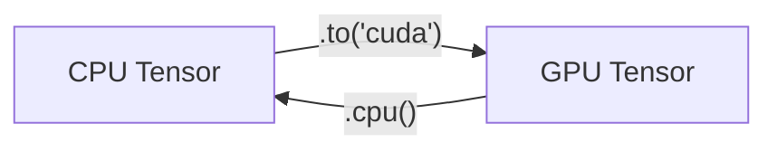

# PyTorch 入门与张量操作

> **文件编码**：UTF-8。默认 **PyTorch 2.x**。  
> **前置**：[02 NumPy 与张量思维](02-NumPy深度与张量思维.md)、[01 科学计算环境](01-Python科学计算环境与Jupyter.md)。  
> **定位**：掌握 `torch.Tensor` 创建、设备、形状变换与矩阵运算——深度学习代码的直接载体。

---

## 0. 读前导读

### 0.1 用一句话弄懂本章

**PyTorch 张量** = 带 GPU 加速与自动微分潜力的多维数组；训练代码 90% 是在 **正确 device 上保持正确 shape**。

### 0.2 你需要提前知道什么

| 背景 | 建议 |
|------|------|
| NumPy | 02 章广播与 `@` 规则直接迁移 |
| Python 类型注解 | [Python 02](../Python/02-Python内置类型模块与类型注解.md) 可选 |
| GPU 环境 | [01 章](01-Python科学计算环境与Jupyter.md) 自检通过更佳 |

### 0.3 本章知识地图（☐→☑）

- [ ] 创建 tensor 并设置 `dtype`、`device`
- [ ] 使用 `view/reshape/permute/contiguous`
- [ ] 区分 `matmul`、`mm`、`bmm`、`@`
- [ ] CPU/GPU 间 `.to()` 与同步直觉
- [ ] 完成 §13 闭卷自测 ≥8/10

### 0.4 建议学习时长

- **3～5 天**

### 0.5 学完你能做什么

编写不含 autograd 的张量脚本；把 NumPy 预处理结果送入 GPU；读懂模型 forward 中的 shape 打印。

---

## 1. Tensor 基础

```python
import torch

t = torch.tensor([[1, 2], [3, 4]], dtype=torch.float32)
print(t)
print(t.shape, t.dtype, t.device)
```

**预期输出**：

```text
tensor([[1., 2.],
        [3., 4.]])
torch.Size([2, 2]) torch.float32 cpu
```

### 1.1 常用工厂函数

```python
zeros = torch.zeros(2, 3)
ones = torch.ones(2, 3)
eye = torch.eye(3)
r = torch.randn(2, 2)                    # 标准正态
a = torch.arange(0, 10, 2)
x = torch.linspace(0, 1, 5)
full = torch.full((2,), 3.14)
```

### 1.2 从 NumPy

```python
import numpy as np
n = np.array([1., 2., 3.])
t = torch.from_numpy(n)       # 共享 CPU 内存
t2 = torch.tensor(n)          # 拷贝
```

---

## 2. dtype 与设备 device

```python
f32 = torch.ones(2, dtype=torch.float32)
f64 = torch.ones(2, dtype=torch.float64)
i64 = torch.arange(3, dtype=torch.long)   # 索引 / label

device = torch.device("cuda" if torch.cuda.is_available() else "cpu")
x = torch.randn(3, 3, device=device)
print(x.device)
```

**GPU 迁移**：

```python
if torch.cuda.is_available():
    x = x.cuda()              # 或 x.to("cuda")
    x = x.to(device="cuda:0")
    cpu_x = x.cpu()
    cpu_x = x.to("cpu")
```



⚠️ CPU 与 GPU tensor 不能直接运算，需同一 device。

---

## 3. 形状操作

### 3.1 reshape 与 view

```python
t = torch.arange(12)
v = t.view(3, 4)
r = t.reshape(2, 6)
print(v.shape, r.shape)
```

`view` 要求 **内存连续**；否则先 `contiguous()`：

```python
t2 = t.view(3, 4).transpose(0, 1)
try:
    t2.view(12)
except RuntimeError as e:
    print("need contiguous:", "contiguous" in str(e).lower() or True)
    t2c = t2.contiguous().view(12)
    print(t2c.shape)
```

### 3.2 permute / transpose

```python
b = torch.randn(2, 3, 4, 5)   # batch, seq, heads, dim
b_bh = b.permute(0, 2, 1, 3)    # → batch, heads, seq, dim
print(b_bh.shape)               # torch.Size([2, 4, 3, 5])
```

### 3.3 squeeze / unsqueeze

```python
x = torch.randn(3, 1, 4)
print(x.squeeze(1).shape)       # (3, 4)
y = x.unsqueeze(-1)             # (3, 1, 4, 1)
```

---

## 4. 索引与切片

```python
x = torch.arange(20).view(4, 5)
print(x[1, 2])          # 标量 tensor
print(x[1:3, :])        # 行切片
print(x[:, [0, 4]])     #  fancy 列索引
mask = x > 10
print(x[mask].shape)
```

布尔 mask 在 loss 计算（ignore padding）中常见（06 章）。

---

## 5. 运算：逐元素与矩阵乘

```python
A = torch.tensor([[1., 2.], [3., 4.]])
B = torch.tensor([[5., 6.], [7., 8.]])

print(A * B)              # 逐元素
print(A @ B)              # 矩阵乘
print(torch.mm(A, B))     # 2D mm
print(torch.matmul(A, B)) # 通用 matmul
```

### 5.1 batch 矩阵乘 bmm

```python
batch = 8
X = torch.randn(batch, 32, 64)
W = torch.randn(batch, 64, 128)
Y = torch.bmm(X, W)       # (8, 32, 128)
# 等价
Y2 = torch.matmul(X, W)
print(torch.allclose(Y, Y2))
```

### 5.2 高维 matmul 广播

```python
A = torch.randn(5, 3, 4)
B = torch.randn(4, 6)
C = A @ B                 # (5, 3, 6)
print(C.shape)
```

---

## 6. 拼接与堆叠

```python
a = torch.randn(2, 3)
b = torch.randn(2, 3)
cat0 = torch.cat([a, b], dim=0)   # (4, 3)
cat1 = torch.cat([a, b], dim=1)   # (2, 6)
stack = torch.stack([a, b], dim=0)  # (2, 2, 3)
```

---

## 7. 广播

与 NumPy 规则相同：

```python
x = torch.ones(3, 4)
y = torch.arange(4)
z = x + y
print(z.shape)  # torch.Size([3, 4])

u = torch.arange(3).view(3, 1)
v = torch.arange(4).view(1, 4)
print((u + v).shape)  # (3, 4)
```

---

## 8. 归约与统计

```python
t = torch.randn(2, 3, 4)
print(t.mean(), t.mean(dim=1).shape)
print(t.sum(dim=-1).shape)
print(t.argmax(dim=-1))
```

---

## 9. GPU 实践片段

```python
device = torch.device("cuda" if torch.cuda.is_available() else "cpu")
A = torch.randn(1024, 1024, device=device)
B = torch.randn(1024, 1024, device=device)
C = A @ B
print(C.device, C.shape)
```

**预期（有 GPU）**：

```text
cuda:0 torch.Size([1024, 1024])
```

同步与计时：

```python
if torch.cuda.is_available():
    torch.cuda.synchronize()
    %timeit (torch.randn(512,512,device='cuda') @ torch.randn(512,512,device='cuda'); torch.cuda.synchronize())
```

---

## 10. 打印与 debug 技巧

```python
def shape_print(name, *tensors):
    for t in tensors:
        print(f"{name}: shape={tuple(t.shape)}, dtype={t.dtype}, device={t.device}")

x = torch.randn(2, 8, 64, device=device)
shape_print("hidden", x)
```

训练时 `assert x.dim() == 3` 比事后 nan debug 更省时间。

---

## 11. 与 nn.Module 的衔接（预告）

```python
import torch.nn as nn
linear = nn.Linear(64, 128)
x = torch.randn(4, 32, 64)   # batch, seq, in_features
y = linear(x)                # (4, 32, 128)
print(y.shape)
```

05 章展开 Module；本章只需 **Linear 即最后一维做矩阵乘**。

---

## 12. 练习

1. 创建 `float32` 的 `(3,4,5)` tensor，转 `(3,5,4)` 再 flatten 为 `(60,)`。
2. 在 GPU 上计算 `(512,512) @ (512,512)`，对比 CPU 耗时（若可用）。
3. 用 `bmm` 实现 batch=16 的 `(seq, in) @ (in, out)`。
4. 解释 `view` 失败时为何 `contiguous()` 可修复。
5. 写函数 `to_device(batch, device)` 递归迁移 dict 中的 tensor（预告 DataLoader collate）。

---

## 13. 学完标准

- [ ] 闭卷写出 `.to(device)` 用法
- [ ] 区分 `view` 与 `reshape`、`permute` 与 `transpose`
- [ ] 说明 `mm`、`bmm`、`matmul` 适用维度
- [ ] GPU tensor 与 NumPy 互转步骤（detach/cpu/numpy）
- [ ] 解释跨 device 运算报错原因

---

## 14. FAQ

**Q1：torch.tensor 和 torch.Tensor 区别？**  
`torch.tensor(data)` 工厂函数；`torch.Tensor` 是默认 dtype 的类（少用直接构造）。

**Q2：reshape 和 view 选哪个？**  
优先 `reshape`（必要时拷贝）；确定连续时用 `view` 零拷贝。

**Q3：为什么 GPU 上 print 很慢？**  
默认异步；需 `torch.cuda.synchronize()` 才准确计时。

**Q4：half/bfloat16 tensor 怎么建？**  
`torch.randn(2, dtype=torch.bfloat16, device='cuda')`（08 章 AMP）。

**Q5：能混用 numpy 和 cuda tensor 吗？**  
不能；先 `.cpu().numpy()`。

**Q6：`torch.arange` 和 Python range？**  
返回 tensor；终点 `end` 不包含（与 NumPy 一致）。

**Q7：in-place 运算如 `x.add_(1)` 要注意什么？**  
破坏 autograd 需要的版本计数（04 章）；推理可用。

**Q8：MPS（Apple GPU）怎么用？**  
`device = torch.device("mps")` 若 `torch.backends.mps.is_available()`。

**Q9：随机种子？**  
`torch.manual_seed(42)`；GPU 加 `torch.cuda.manual_seed_all(42)`。

**Q10：张量占多少显存？**  
`element_size * numel()` 字节；不含 autograd 缓存（04 章）。

---

## 15. 闭卷自测

1. `torch.randn(2,3).to('cuda')` 后 `.device` 显示什么？
2. `(8,32,64) @ (64,128)` 结果 shape？
3. `view` 失败最常见原因？
4. `bmm` 输入三维含义？
5. CPU tensor 与 GPU tensor 相加会怎样？
6. `permute(0,2,1,3)` 对 `(b,s,h,d)` 的输出 shape？
7. `squeeze(1)` 作用？
8. `torch.from_numpy` 改 numpy 会影响 tensor 吗？
9. `matmul` 与 `mm` 对 2D 输入关系？
10. 为何 Linear 默认作用在最后一维？

<details>
<summary>参考答案</summary>

1. `cuda:0`（有 GPU 时）。
2. `(8, 32, 128)`。
3. 内存不连续，需 contiguous。
4. `(batch, n, m) @ (batch, m, p)`。
5. RuntimeError，device 不一致。
6. `(b, h, s, d)`。
7. 去掉 size=1 的第 1 维（若存在）。
8. 会，共享 CPU 内存。
9. 2D 时等价于矩阵乘。
10. `nn.Linear` 对最后一维 in_features 做 `y = xW^T + b`，符合 `(batch, *, in)` 批处理习惯。

</details>

---

## 16. 下一章预告

04 章 **Autograd**：`requires_grad`、`backward()`、计算图与 `no_grad`——从「算结果」到「算梯度」。

---

*上一章：[02 NumPy](02-NumPy深度与张量思维.md)*  
*下一章：[04 Autograd 与计算图](04-Autograd与计算图.md)*
