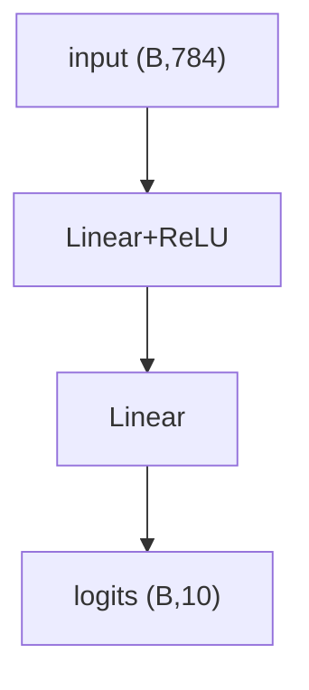

# nn.Module 与训练循环

> **文件编码**：UTF-8。  
> **前置**：[04 Autograd](04-Autograd与计算图.md)、[03 PyTorch 张量](03-PyTorch入门与张量操作.md)。  
> **定位**：用 `nn.Module` 组织模型，配合 **loss、optimizer** 写出标准 **train/eval 循环**——深度学习工程的最小闭环。

---

## 0. 读前导读

### 0.1 用一句话弄懂本章

**nn.Module** = 带参数的层容器；**训练循环** = `zero_grad → forward → loss → backward → step` 的重复。

### 0.2 你需要提前知道什么

| 背景 | 建议 |
|------|------|
| 04 章 autograd | 必须 |
| 03 章 tensor | 必须 |
| 06 章 DataLoader | 本章先用合成数据，06 章换真实管道 |

### 0.3 本章知识地图（☐→☑）

- [ ] 继承 `nn.Module` 实现 `forward`
- [ ] 使用 `nn.Linear`、`nn.ReLU`、`nn.Sequential`
- [ ] 选择 `CrossEntropyLoss`、`MSELoss`
- [ ] 配置 `SGD` / `AdamW` 并完成完整 epoch 循环
- [ ] 区分 `model.train()` 与 `model.eval()`
- [ ] 完成 §14 闭卷自测 ≥8/10

### 0.4 建议学习时长

- **4～5 天**

### 0.5 学完你能做什么

从零训练一个小 MLP 分类器；读懂 HuggingFace Trainer 内部在做什么（11～15 章）。

---

## 1. nn.Module 基础

```python
import torch
import torch.nn as nn

class TinyMLP(nn.Module):
    def __init__(self, in_dim=784, hidden=128, num_classes=10):
        super().__init__()
        self.fc1 = nn.Linear(in_dim, hidden)
        self.relu = nn.ReLU()
        self.fc2 = nn.Linear(hidden, num_classes)

    def forward(self, x):
        x = x.view(x.size(0), -1)   # flatten
        x = self.relu(self.fc1(x))
        return self.fc2(x)

model = TinyMLP()
x = torch.randn(32, 1, 28, 28)
logits = model(x)
print(logits.shape)  # torch.Size([32, 10])
```

**预期**：输出 `(batch, num_classes)` logits，**未做 softmax**（CrossEntropyLoss 内置 log-softmax）。

---

## 2. Sequential 与模块树

```python
model = nn.Sequential(
    nn.Flatten(),
    nn.Linear(784, 128),
    nn.ReLU(),
    nn.Linear(128, 10),
)

for name, param in model.named_parameters():
    print(name, param.shape)
```



`model.parameters()` 供 optimizer；`model.to(device)` 递归迁移。

---

## 3. Loss 函数

### 3.1 分类 CrossEntropyLoss

```python
criterion = nn.CrossEntropyLoss()
logits = torch.randn(4, 10)
labels = torch.tensor([3, 0, 9, 1], dtype=torch.long)
loss = criterion(logits, labels)
print(loss.item())
```

内部：`log_softmax + NLLLoss`；勿手动 softmax 再 NLL（数值更差）。

### 3.2 回归 MSELoss

```python
mse = nn.MSELoss()
pred = torch.randn(4, 1)
target = torch.randn(4, 1)
print(mse(pred, target).item())
```

---

## 4. Optimizer

```python
optimizer = torch.optim.SGD(model.parameters(), lr=0.01, momentum=0.9)
# 或
optimizer = torch.optim.AdamW(model.parameters(), lr=1e-3, weight_decay=0.01)
```

07 章详述 SGD/AdamW/warmup；本章 `lr=1e-3` 即可跑通。

---

## 5. 完整训练循环（合成数据）

```python
import torch
import torch.nn as nn

device = torch.device("cuda" if torch.cuda.is_available() else "cpu")
model = TinyMLP().to(device)
criterion = nn.CrossEntropyLoss()
optimizer = torch.optim.AdamW(model.parameters(), lr=1e-3)

# 合成：1000 样本，10 类
X = torch.randn(1000, 784, device=device)
y = torch.randint(0, 10, (1000,), device=device)

batch_size = 64
num_epochs = 5

for epoch in range(num_epochs):
    model.train()
    perm = torch.randperm(X.size(0))
    total_loss = 0.0
    correct = 0
    for i in range(0, X.size(0), batch_size):
        idx = perm[i : i + batch_size]
        batch_x, batch_y = X[idx], y[idx]

        optimizer.zero_grad()
        logits = model(batch_x.view(-1, 1, 28, 28))
        loss = criterion(logits, batch_y)
        loss.backward()
        optimizer.step()

        total_loss += loss.item() * batch_x.size(0)
        correct += (logits.argmax(1) == batch_y).sum().item()

    print(f"epoch {epoch+1} loss={total_loss/1000:.4f} acc={correct/1000:.4f}")
```

**预期**：loss 下降、acc 上升（随机数据也会过拟合，仅演示流程）。

---

## 6. 验证循环

```python
@torch.no_grad()
def evaluate(model, X, y, batch_size=64):
    model.eval()
    correct = 0
    total_loss = 0.0
    criterion = nn.CrossEntropyLoss()
    for i in range(0, X.size(0), batch_size):
        bx, by = X[i:i+batch_size], y[i:i+batch_size]
        logits = model(bx.view(-1, 1, 28, 28))
        total_loss += criterion(logits, by).item() * bx.size(0)
        correct += (logits.argmax(1) == by).sum().item()
    return total_loss / X.size(0), correct / X.size(0)
```

`model.eval()` 影响 **Dropout/BatchNorm** 行为（09 章 CNN 会遇）。

---

## 7. train vs eval

| 模式 | 调用 | Dropout | BatchNorm |
|------|------|---------|-----------|
| 训练 | `model.train()` | 随机丢弃 | 用 batch 统计 |
| 推理 | `model.eval()` | 关闭 | 用 running mean/var |

验证/测试前 **必须** `eval()` + `no_grad()`。

---

## 8. 保存与加载

```python
torch.save(model.state_dict(), "tiny_mlp.pt")
model2 = TinyMLP()
model2.load_state_dict(torch.load("tiny_mlp.pt", map_location=device))
model2.eval()
```

完整 checkpoint（含 optimizer）：

```python
ckpt = {"epoch": epoch, "model": model.state_dict(), "opt": optimizer.state_dict()}
torch.save(ckpt, "ckpt.pt")
```

与 [LLMInfra 12 Checkpoint](../LLMInfra/12-Checkpoint加载与mmap权重IO.md) 大模型加载思路相通，规模不同。

---

## 9. 设备与 seed

```python
def set_seed(seed=42):
    torch.manual_seed(seed)
    if torch.cuda.is_available():
        torch.cuda.manual_seed_all(seed)

set_seed(42)
model = model.to(device)
```

---

## 10. 训练循环模板（可复用）

```python
def train_one_epoch(model, loader, criterion, optimizer, device):
    model.train()
    running_loss = 0.0
    for batch_x, batch_y in loader:
        batch_x, batch_y = batch_x.to(device), batch_y.to(device)
        optimizer.zero_grad()
        loss = criterion(model(batch_x), batch_y)
        loss.backward()
        optimizer.step()
        running_loss += loss.item()
    return running_loss / len(loader)
```

06 章将 `loader` 换为 `DataLoader`。

---

## 11. 常见错误排查

| 症状 | 检查 |
|------|------|
| loss 不变 | lr 太小、忘记 step、requires_grad False |
| loss nan | lr 太大、未归一化输入 |
| acc 随机 | label 与 logits 维不对、未 eval |
| CUDA OOM | batch_size↓、08 章 AMP |

---

## 12. 练习

1. 把合成数据循环改为 **train/val 8:2 划分**，每 epoch 打印 val acc。
2. 加 **EarlyStopping**：val loss 3 epoch 不降则停。
3. 用 `nn.Sequential` 重写 `TinyMLP`，对比参数量 `sum(p.numel() for p in model.parameters())`。
4. 保存/加载 checkpoint 后继续训练 2 epoch。
5. 画 train loss 曲线（matplotlib）。

---

## 13. 学完标准

- [ ] 闭卷写出单 step 五步顺序
- [ ] 解释为何 CE loss 接 raw logits
- [ ] 实现带 train/eval 的最小脚本
- [ ] 说明 `state_dict` 与整个 model 保存区别
- [ ] 知道 Dropout 为何 eval 必须切换模式

---

## 14. FAQ

**Q1：forward 里能写 if 分支吗？**  
可以；动态图支持。注意分支一致性与 trace（torch.compile 时）。

**Q2：loss.item() 必须吗？**  
打日志用 item() 释标量；别对整个 batch loss tensor 累加进 list 占显存。

**Q3：多个 loss 怎么 backward？**  
`loss = l1 + l2` 一次 backward；或 `l1.backward(retain_graph=True)` 再 `l2.backward()`。

**Q4：梯度裁剪？**  
`torch.nn.utils.clip_grad_norm_(model.parameters(), max_norm=1.0)` 在 step 前；LLM 训练常用。

**Q5：为何验证也要 criterion？**  
监控泛化 loss，不只是 acc。

**Q6：batch 最后一个不足 batch_size？**  
上面循环已处理；Dropout/BN 仍合法。

**Q7：CPU 训练慢怎么办？**  
小实验可接受；正式用 GPU + 08 章 AMP。

**Q8：HuggingFace Trainer 还需要手写吗？**  
微调可用 Trainer；**理解底层循环** 才能 debug 与自定义。

**Q9：`model.parameters()` 含 buffer 吗？**  
不含；BN running stats 在 `buffers()`。

**Q10：冻结 backbone？**  
`for p in model.fc1.parameters(): p.requires_grad = False` 仅训 head（09 章迁移学习）。

---

## 15. 闭卷自测

1. 训练单 step 标准五步？
2. CrossEntropyLoss 输入要 softmax 吗？
3. `model.eval()` 不调用会怎样（含 Dropout 时）？
4. `optimizer.zero_grad()` 能否省略？
5. `state_dict` 存什么？
6. logits shape 与 num_classes 关系？
7. `view(x.size(0), -1)` 作用？
8. train acc 高 val acc 低说明什么？
9. `map_location` 在 load 时作用？
10. AdamW 与 Adam 主要区别（预告 07）？

<details>
<summary>参考答案</summary>

1. zero_grad → forward → loss → backward → step。
2. 不要；内部 log_softmax。
3. Dropout 仍随机丢弃，验证指标抖动、偏低。
4. 不能；梯度会累加。
5. 各层 Parameter/B buffer 的 tensor 字典。
6. `(batch, num_classes)`。
7. 保留 batch 维，其余 flatten 成 784。
8. 过拟合。
9. 指定加载到 CPU/GPU，避免无 GPU 机器报错。
10. AdamW 解耦 weight decay，正确正则化权重（07 章）。

</details>

---

## 16. 下一章预告

06 章 **Dataset 与 DataLoader**：自定义数据集、`collate_fn`、多 worker 加载——替换本章内存合成 batch。

---

*上一章：[04 Autograd](04-Autograd与计算图.md)*  
*下一章：[06 DataLoader 与数据管道](06-DataLoader与数据管道.md)*
