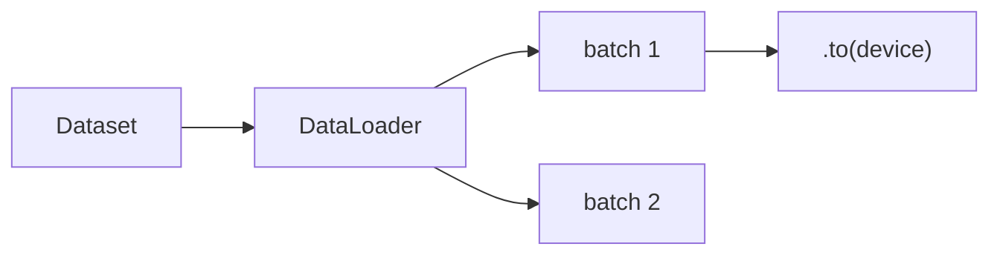

# DataLoader 与数据管道

> **文件编码**：UTF-8。  
> **前置**：[05 训练循环](05-nn.Module与训练循环.md)、[03 张量操作](03-PyTorch入门与张量操作.md)。  
> **定位**：用 **Dataset / DataLoader / collate_fn** 构建可扩展数据管道——从磁盘到 GPU batch 的标准路径。

---

## 0. 读前导读

### 0.1 用一句话弄懂本章

**DataLoader** = 按 batch **并行取样本、拼成 tensor、可选 shuffle** 的迭代器；LLM 训练的数据吞吐瓶颈常在这里。

### 0.2 你需要提前知道什么

| 背景 | 建议 |
|------|------|
| 05 章训练循环 | 必须 |
| Python 文件 IO | [Python 02](../Python/02-Python内置类型模块与类型注解.md) |
| LLM tokenization | 12 章 HuggingFace 会封装类似逻辑 |

### 0.3 本章知识地图（☐→☑）

- [ ] 实现 `__len__` / `__getitem__` 的 Dataset
- [ ] 配置 `DataLoader`：batch_size、shuffle、num_workers
- [ ] 编写 `collate_fn` 处理变长序列
- [ ] 理解 pin_memory 与 prefetch
- [ ] 完成 §14 闭卷自测 ≥8/10

### 0.4 建议学习时长

- **3～4 天**

### 0.5 学完你能做什么

为 CSV/JSON/图像目录写 Dataset；为 NLP padding 写 collate；debug DataLoader 死锁与慢加载。

---

## 1. Dataset 抽象

PyTorch 约定：

- `__len__` → 样本数
- `__getitem__(idx)` → 单样本（tensor、tuple、dict 均可）

```python
import torch
from torch.utils.data import Dataset

class SyntheticClassificationDataset(Dataset):
    def __init__(self, num_samples=1000, dim=784, num_classes=10, seed=42):
        g = torch.Generator().manual_seed(seed)
        self.X = torch.randn(num_samples, dim, generator=g)
        self.y = torch.randint(0, num_classes, (num_samples,), generator=g)

    def __len__(self):
        return len(self.y)

    def __getitem__(self, idx):
        return self.X[idx], self.y[idx]

ds = SyntheticClassificationDataset(100)
x0, y0 = ds[0]
print(x0.shape, y0)
```

**预期输出**：

```text
torch.Size([784]) tensor(3)
```

---

## 2. DataLoader 基础

```python
from torch.utils.data import DataLoader

loader = DataLoader(
    ds,
    batch_size=32,
    shuffle=True,
    num_workers=0,      # Windows 调试先用 0
    drop_last=False,
)

for batch_x, batch_y in loader:
    print(batch_x.shape, batch_y.shape)
    break
```

**预期**：

```text
torch.Size([32, 784]) torch.Size([32])
```



---

## 3. TensorDataset 快捷方式

```python
from torch.utils.data import TensorDataset

X = torch.randn(500, 20)
y = torch.randint(0, 2, (500,))
tds = TensorDataset(X, y)
loader = DataLoader(tds, batch_size=16, shuffle=True)
```

小实验够用；真实项目仍建议自定义 Dataset 读文件。

---

## 4. 从 CSV 读取示例

```python
import csv
from pathlib import Path

class CSVDataset(Dataset):
    def __init__(self, csv_path):
        self.rows = []
        with open(csv_path, newline="", encoding="utf-8") as f:
            reader = csv.DictReader(f)
            for row in reader:
                self.rows.append(row)

    def __len__(self):
        return len(self.rows)

    def __getitem__(self, idx):
        row = self.rows[idx]
        features = torch.tensor([float(row["f1"]), float(row["f2"])])
        label = int(row["label"])
        return features, label
```

大数据集应 **懒加载** 或 **内存映射**，勿一次读入 RAM（18 章数据工程）。

---

## 5. collate_fn：变长 batch

NLP 常见：句子长度不一，需 **padding + length**。

```python
def pad_collate(batch):
    """batch: list of (seq_tensor, label)"""
    seqs, labels = zip(*batch)
    lengths = torch.tensor([s.size(0) for s in seqs])
    max_len = int(lengths.max())
    dim = seqs[0].size(-1)
    padded = torch.zeros(len(seqs), max_len, dim)
    for i, s in enumerate(seqs):
        padded[i, : s.size(0)] = s
    labels = torch.tensor(labels, dtype=torch.long)
    return padded, labels, lengths

class VariableLenDataset(Dataset):
    def __init__(self, n=100):
        self.data = [(torch.randn(torch.randint(5, 20, (1,)).item(), 8),
                      torch.randint(0, 3, (1,)).item()) for _ in range(n)]

    def __len__(self):
        return len(self.data)

    def __getitem__(self, idx):
        return self.data[idx]

vds = VariableLenDataset(50)
vloader = DataLoader(vds, batch_size=8, shuffle=True, collate_fn=pad_collate)
padded, labels, lengths = next(iter(vloader))
print(padded.shape, lengths)
```

**预期**：`padded` 为 `(8, max_len, 8)`，`lengths` 为 `(8,)`。

LLM 中 HuggingFace `DataCollatorWithPadding` 做类似事（12 章）。

---

## 6. 与训练循环集成

```python
device = torch.device("cuda" if torch.cuda.is_available() else "cpu")
model = ...  # 05 章模型
optimizer = torch.optim.AdamW(model.parameters(), lr=1e-3)
criterion = torch.nn.CrossEntropyLoss()

train_ds = SyntheticClassificationDataset(2000)
train_loader = DataLoader(train_ds, batch_size=64, shuffle=True)

for epoch in range(3):
    model.train()
    for batch_x, batch_y in train_loader:
        batch_x = batch_x.to(device)
        batch_y = batch_y.to(device)
        optimizer.zero_grad()
        logits = model(batch_x.view(batch_x.size(0), 1, 28, 28))
        loss = criterion(logits, batch_y)
        loss.backward()
        optimizer.step()
    print(f"epoch {epoch+1} done, batches={len(train_loader)}")
```

---

## 7. num_workers 与 pin_memory

```python
loader = DataLoader(
    ds,
    batch_size=32,
    shuffle=True,
    num_workers=4,           # 子进程预取
    pin_memory=True,         # 锁页内存，加速 CPU→GPU
    persistent_workers=True, # workers>0 时减少重启开销
)
```

| 参数 | 作用 |
|------|------|
| `num_workers` | 并行 `__getitem__` |
| `pin_memory` | 配合 `.to(device, non_blocking=True)` |
| `prefetch_factor` | 每 worker 预取 batch 数 |

**Windows**：multiprocessing 需 `if __name__ == "__main__"` 保护；调试设 `num_workers=0`。

---

## 8. RandomSplit 与 Subset

```python
from torch.utils.data import random_split

full = SyntheticClassificationDataset(1000)
train_ds, val_ds = random_split(full, [800, 200], generator=torch.Generator().manual_seed(42))
train_loader = DataLoader(train_ds, batch_size=32, shuffle=True)
val_loader = DataLoader(val_ds, batch_size=32, shuffle=False)
```

---

## 9. dict 样本与 LLM 预览

```python
def __getitem__(self, idx):
    return {
        "input_ids": torch.tensor([101, 234, 567]),
        "labels": torch.tensor(567),
        "attention_mask": torch.tensor([1, 1, 1]),
    }

def llm_collate(batch):
    keys = batch[0].keys()
    return {k: torch.stack([b[k] for b in batch]) for k in keys}
```

Trainer 接收 dict batch 直接 `model(**batch)`。

---

## 10. 性能与 debug

1. **瓶颈定位**：`num_workers=0` vs `4` 对比 epoch 时间
2. **死锁**：worker 里调 CUDA 易挂；只在 main 进程 `.to(cuda)`
3. **shuffle False**：验证集、时间序列预测
4. **drop_last True**：BN 小 batch 不稳定时

---

## 11. 练习

1. 实现读取本地 `.txt` 每行一句的 Dataset，label 为行号 mod 5。
2. 为变长整数序列写 collate，返回 `padded` 与 `mask`（padding 处为 0）。
3. 用 `random_split` 做 7:3，训练 3 epoch 并算 val acc。
4. 对比 `pin_memory=True/False` 在有 GPU 时的 step 时间（粗略即可）。
5. 画 DataLoader 数据流 Mermaid（Dataset→collate→batch→GPU）。

---

## 12. 学完标准

- [ ] 闭卷实现最小 Dataset + DataLoader
- [ ] 解释 collate_fn 何时必需
- [ ] 配置 train shuffle / val 不 shuffle 的理由
- [ ] 知道 worker 里不宜做 GPU 运算
- [ ] 说出 LLM padding batch 的基本字段

---

## 13. FAQ

**Q1：batch_size 怎么选？**  
显存允许下尽量大；OOM 则减半。LLM 还受 seq_len 影响。

**Q2：IterableDataset 与 Map-style？**  
流式/超大数据用 IterableDataset；随机访问用 Map-style。

**Q3：为何 collate 默认 stack 失败？**  
样本 tensor 形状不一致。

**Q4：Samplers 是什么？**  
控制索引顺序；DistributedSampler 用于 DDP（17 章）。

**Q5：重复样本会影响 shuffle 吗？**  
`shuffle=True` 每 epoch 重排索引；过拟合小集需正则或增广。

**Q6：图像增广放哪？**  
`__getitem__` 或 torchvision `transforms`（09 章）。

**Q7：tokenize 在 Dataset 还是 collate？**  
都可；动态 padding 常在 collate，静态长度可在 Dataset。

**Q8：DataLoader 能复现吗？**  
固定 `generator` on DataLoader + worker seed 函数。

**Q9：空 batch？**  
`drop_last=True` 且样本少于 batch_size 时可能无 batch；注意 len。

**Q10：与 Web 后端队列区别？**  
DataLoader 为 **训练吞吐** 优化；[Python 08 Celery](../Python/08-Celery与消息队列实战.md) 为任务异步，场景不同。

---

## 14. 闭卷自测

1. Dataset 必须实现哪两个方法？
2. `shuffle=True` 通常用于 train 还是 val？
3. collate_fn 输入输出是什么？
4. `num_workers=0` 含义？
5. `pin_memory` 主要加速哪一步？
6. `drop_last=True` 何时有用？
7. 变长序列 batch 为何要 padding？
8. dict batch 如何 stack？
9. 为何 worker 中避免 CUDA？
10. RandomSplit 第二个参数含义？

<details>
<summary>参考答案</summary>

1. `__len__` 和 `__getitem__`。
2. train；val 一般 False 保序可复现。
3. 输入 list of samples；输出一个 batch（tensor 或 dict）。
4. 主进程同步加载，便于 debug。
5. 页锁定内存，加快异步 H2D 拷贝。
6. 每 batch 大小严格一致（BN、分布式）。
7. stack 需要规则形状；mask 标记有效位。
8. 对每个 key 分别 stack/cat。
9. 多进程与 CUDA 上下文冲突易死锁。
10. 各子集样本数量（或比例需自行计算）。

</details>

---

## 15. 下一章预告

07 章 **优化器与学习率调度**：SGD、AdamW、warmup、cosine——让 05 章循环「学得更快更稳」。

---

*上一章：[05 训练循环](05-nn.Module与训练循环.md)*  
*下一章：[07 优化器与学习率调度](07-优化器与学习率调度.md)*
