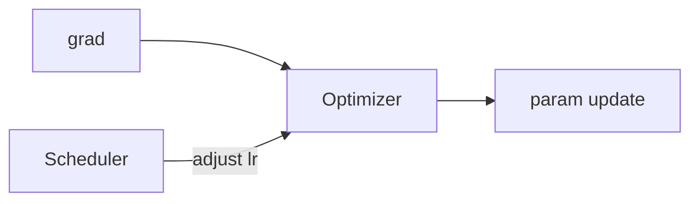

# 优化器与学习率调度

> **文件编码**：UTF-8。  
> **前置**：[05 训练循环](05-nn.Module与训练循环.md)、[04 Autograd](04-Autograd与计算图.md)。  
> **定位**：掌握 **SGD、AdamW** 与 **warmup、cosine** 调度——控制收敛速度与泛化的关键旋钮。

---

## 0. 读前导读

### 0.1 用一句话弄懂本章

**优化器** 用梯度更新参数；**学习率调度** 随 step/epoch 改变 lr，避免训不动或训飞。

### 0.2 你需要提前知道什么

| 背景 | 建议 |
|------|------|
| 05 章 optimizer.step | 必须 |
| loss 曲线直觉 | 上升/平台/震荡 |
| LLM 预训练 | 14 章会用 warmup+cosine |

### 0.3 本章知识地图（☐→☑）

- [ ] 配置 SGD（momentum、weight_decay）与 AdamW
- [ ] 使用 `StepLR`、`CosineAnnealingLR`、`OneCycleLR`
- [ ] 实现 linear warmup + cosine decay
- [ ] 理解 param group 与不同 lr
- [ ] 完成 §14 闭卷自测 ≥8/10

### 0.4 建议学习时长

- **3～4 天**

### 0.5 学完你能做什么

为 CV/NLP 小项目选 optimizer+scheduler；读懂 HuggingFace `get_scheduler`；解释 warmup 必要性。

---

## 1. 梯度下降回顾

\[
\theta_{t+1} = \theta_t - \eta \cdot g_t
\]

η = learning rate；\(g_t = \nabla L\)。η 太大 → 震荡/nan；太小 → 收敛慢。



---

## 2. SGD 与 Momentum

```python
import torch
import torch.nn as nn

model = nn.Linear(10, 2)
opt = torch.optim.SGD(
    model.parameters(),
    lr=0.1,
    momentum=0.9,
    weight_decay=1e-4,
    nesterov=True,
)
```

- **momentum**：累积历史梯度方向，减震荡
- **weight_decay**：L2 正则（与 AdamW 实现方式不同）
- **nesterov**：先看一步 momentum 再算梯度，常略快

```python
x = torch.randn(4, 10)
y = torch.tensor([0, 1, 0, 1])
criterion = nn.CrossEntropyLoss()

for step in range(3):
    opt.zero_grad()
    loss = criterion(model(x), y)
    loss.backward()
    opt.step()
    print(f"step {step} loss={loss.item():.4f} lr={opt.param_groups[0]['lr']}")
```

---

## 3. Adam 与 AdamW

```python
opt = torch.optim.AdamW(
    model.parameters(),
    lr=1e-3,
    betas=(0.9, 0.999),
    eps=1e-8,
    weight_decay=0.01,
)
```

| 优化器 | 特点 | 常用场景 |
|--------|------|----------|
| SGD+momentum | 泛化有时更好 | CV 经典、大 batch |
| Adam | 自适应 lr | 快速实验 |
| AdamW | 解耦 weight decay | **Transformer/LLM 微调默认** |

**AdamW vs Adam**：decay 直接减权重，而非加进梯度；LLM 微调几乎总是 AdamW。

---

## 4. 参数组 param_groups

```python
backbone = nn.Linear(10, 10)
head = nn.Linear(10, 2)
opt = torch.optim.AdamW([
    {"params": backbone.parameters(), "lr": 1e-4},
    {"params": head.parameters(), "lr": 1e-3},
], weight_decay=0.01)
```

迁移学习：**backbone 小 lr，head 大 lr**（09 章 ResNet）。

---

## 5. 学习率调度器 API

```python
from torch.optim.lr_scheduler import StepLR, CosineAnnealingLR

opt = torch.optim.SGD(model.parameters(), lr=0.1)
scheduler = StepLR(opt, step_size=30, gamma=0.1)

for epoch in range(100):
    train_one_epoch(...)
    scheduler.step()
    print(epoch, opt.param_groups[0]["lr"])
```

**注意**：`scheduler.step()` 通常放 **epoch 末**；`ReduceLROnPlateau` 传 `val_loss`。

---

## 6. Cosine Annealing

```python
scheduler = CosineAnnealingLR(opt, T_max=50, eta_min=1e-6)
for epoch in range(50):
    train(...)
    scheduler.step()
    print(f"epoch {epoch} lr={scheduler.get_last_lr()[0]:.6f}")
```

**预期**：lr 从初值平滑降至 `eta_min`，曲线像余弦半周期。

LLM 预训练常用 **warmup + cosine**（更长 T_max = total steps）。

---

## 7. Warmup 原理与手写

训练初期参数随机，大 lr 易不稳定；**线性 warmup** 从 0（或很小）增到 base_lr。

```python
import math

def lr_lambda_warmup_cosine(step, warmup_steps, total_steps, min_lr_ratio=0.0):
    if step < warmup_steps:
        return float(step) / float(max(1, warmup_steps))
    progress = (step - warmup_steps) / float(max(1, total_steps - warmup_steps))
    return min_lr_ratio + (1 - min_lr_ratio) * 0.5 * (1 + math.cos(math.pi * progress))

from torch.optim.lr_scheduler import LambdaLR

total_steps = 1000
warmup = 100
opt = torch.optim.AdamW(model.parameters(), lr=1e-3)
scheduler = LambdaLR(opt, lr_lambda=lambda s: lr_lambda_warmup_cosine(s, warmup, total_steps))

for step in range(5):
    opt.zero_grad()
    loss = criterion(model(x), y)
    loss.backward()
    opt.step()
    scheduler.step()
    if step < 3:
        print(f"step {step} lr={opt.param_groups[0]['lr']:.6f}")
```

**预期前几步**：lr 从 ~0 线性上升。

HuggingFace：

```python
# from transformers import get_cosine_schedule_with_warmup
# scheduler = get_cosine_schedule_with_warmup(opt, num_warmup_steps=100, num_training_steps=1000)
```

---

## 8. OneCycleLR（了解）

```python
from torch.optim.lr_scheduler import OneCycleLR

opt = torch.optim.SGD(model.parameters(), lr=0.1)
scheduler = OneCycleLR(opt, max_lr=0.1, steps_per_epoch=100, epochs=10)

for epoch in range(10):
    for batch in loader:
        train_step(...)
        scheduler.step()   # 每个 batch step
```

单周期先升后降，fast.ai 风格；CV 快速训练常用。

---

## 9. 调度器与 optimizer.step 顺序

| 调度器 | step 时机 |
|--------|-----------|
| StepLR, Cosine | 每 epoch 末 |
| LambdaLR (per-step) | 每 **batch** 末，在 optimizer.step 之后 |
| ReduceLROnPlateau | 每 epoch，传入 metric |

```python
optimizer.step()
scheduler.step()   # per-step 调度
```

---

## 10. 监控 lr

```python
lrs = []
for epoch in range(10):
    lrs.append(opt.param_groups[0]["lr"])
    scheduler.step()
print(lrs[:3], "...", lrs[-1])
```

TensorBoard / WandB 可 log `learning_rate`（22 章 MLOps）。

---

## 11. 与 LLM 训练的关系

| 场景 | 典型配置 |
|------|----------|
| LLM 预训练 | AdamW, lr~1e-4, warmup 1～3%, cosine |
| LoRA 微调 | AdamW, lr~1e-4～3e-4, 短 warmup |
| 全参 SFT | 更小 lr, 更长 warmup |

见 [LLMPython 00 路线图](00-学习路线图与说明.md) 14～16 章与 [LLMInfra 10 分布式](../LLMInfra/10-分布式训练并行策略与NCCL入门.md)（多卡 lr 线性缩放规则：batch×k → lr×k，需 warmup 配合）。

---

## 12. 练习

1. 同一模型对比 SGD vs AdamW 100 step 的 loss 曲线。
2. 画 warmup+cosine 的 lr 随 step 曲线（1000 steps, warmup 100）。
3. 为 backbone/head 设不同 lr，打印两组 param lr。
4. 使用 `CosineAnnealingLR` 训练 5 epoch，记录每 epoch lr。
5. 解释为何 LLM 几乎不用纯 SGD（不要求严格证明，写直觉）。

---

## 13. 学完标准

- [ ] 闭卷写出 AdamW 适用场景
- [ ] 实现或调用 warmup+cosine
- [ ] 区分 epoch-level 与 step-level scheduler
- [ ] 解释 weight_decay 在 SGD 与 AdamW 中差异
- [ ] 知道 param_groups 用于迁移学习

---

## 14. FAQ

**Q1：lr 找不准怎么办？**  
LR range test（逐步增大看 loss）；或默认 AdamW 1e-3 再按 batch 调整。

**Q2：warmup 步数怎么定？**  
总 step 的 1%～5%；小数据集可固定 500～1000。

**Q3：scheduler 状态要保存吗？**  
长期训练要，`ckpt["scheduler"] = scheduler.state_dict()`。

**Q4：梯度裁剪和 optimizer 关系？**  
`clip_grad_norm_` 在 backward 后、step 前。

**Q5：为何 loss 平台还降 lr？**  
Cosine 按计划降；Plateau 看 val 不降再降。

**Q6：Adam 的 bias correction？**  
前几 step 有效 lr 偏小；warmup 部分缓解。

**Q7：多 GPU lr 要乘 world_size 吗？**  
线性缩放规则常见但不绝对；需实验。

**Q8：weight_decay 对 bias 生效吗？**  
最佳实践 bias/LayerNorm 不衰减；param group 设 `weight_decay=0`。

**Q9：8-bit optimizer（bitsandbytes）？**  
省显存；17 章 DeepSpeed 生态提及。

**Q10：cosine 和 step decay 怎么选？**  
Transformer/LLM 偏 cosine；经典 CV 仍见 StepLR/MultiStepLR。

---

## 15. 闭卷自测

1. SGD momentum 作用？
2. AdamW 相对 Adam 关键改进？
3. warmup 解决什么问题？
4. `CosineAnnealingLR` 的 T_max 含义？
5. param_groups 典型用法？
6. per-step scheduler 在循环哪调用？
7. weight_decay 过大现象？
8. LLM 微调常用 optimizer？
9. `get_last_lr()` 用途？
10. nesterov momentum 直觉？

<details>
<summary>参考答案</summary>

1. 指数滑动平均梯度方向，减震荡、加速。
2. weight decay 与梯度更新解耦，正确 L2 正则。
3. 训练初大 lr 不稳定；逐步升到 base_lr。
4. 余弦半周期长度（通常 epoch 数或需配合 step）。
5. 不同层不同 lr（如 backbone/head）。
6. 每个 batch 的 optimizer.step() 之后。
7. 欠拟合、权重过小、loss 降不动。
8. AdamW。
9. 读取当前 lr 用于日志。
10. 先按动量「展望」一步再算梯度，修正 overshoot。

</details>

---

## 16. 下一章预告

08 章 **GPU 训练与混合精度 AMP**：`autocast`、`GradScaler`、bf16——在保持数值稳定的前提下提速省显存。

---

*上一章：[06 DataLoader](06-DataLoader与数据管道.md)*  
*下一章：[08 GPU 训练与混合精度 AMP](08-GPU训练与混合精度AMP.md)*
