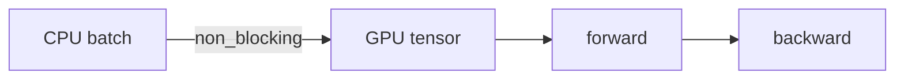

# GPU 训练与混合精度 AMP

> **文件编码**：UTF-8。  
> **前置**：[01 科学计算环境](01-Python科学计算环境与Jupyter.md)、[05 训练循环](05-nn.Module与训练循环.md)、[LLMInfra 03 CUDA](../LLMInfra/03-GPU架构与CUDA编程入门.md)。  
> **定位**：在 GPU 上高效训练——**CUDA 使用、bf16/fp16、autocast、GradScaler** 混合精度标准写法。

---

## 0. 读前导读

### 0.1 用一句话弄懂本章

**混合精度 AMP** = 前向用低精度（fp16/bf16）算得快、省显存，关键累加用 fp32 保数值稳定。

### 0.2 你需要提前知道什么

| 背景 | 建议 |
|------|------|
| 05 章训练循环 | 必须 |
| GPU 可用 | [01 章](01-Python科学计算环境与Jupyter.md) 自检 |
| 浮点格式 | [LLMInfra 01](../LLMInfra/01-线性代数与数值计算基础.md) FP16/BF16 表 |

### 0.3 本章知识地图（☐→☑）

- [ ] 正确 `.to(cuda)` 与 `non_blocking` 传输
- [ ] 使用 `torch.autocast` 包裹 forward
- [ ] fp16 时配合 `GradScaler`
- [ ] 选择 bf16 vs fp16
- [ ] 完成 §14 闭卷自测 ≥8/10

### 0.4 建议学习时长

- **2～4 天**（无 GPU 可先读理论，有 GPU 必练）

### 0.5 学完你能做什么

把 05 章循环改为 AMP 版；解释 LLM 训练为何默认 bf16；对接 [LLMInfra 09 量化](../LLMInfra/09-模型量化INT8-INT4-FP8与校准.md) 精度概念。

---

## 1. CUDA 训练要点

```python
import torch

device = torch.device("cuda" if torch.cuda.is_available() else "cpu")
print(device, torch.cuda.get_device_name(0) if torch.cuda.is_available() else "CPU")
```

模型与数据同 device：

```python
model = model.to(device)
for batch_x, batch_y in loader:
    batch_x = batch_x.to(device, non_blocking=True)
    batch_y = batch_y.to(device, non_blocking=True)
```

`pin_memory=True`（06 章）+ `non_blocking=True` 重叠 H2D 与计算。



---

## 2. 为何需要混合精度

| 精度 | 显存 | Tensor Core | 风险 |
|------|------|-------------|------|
| FP32 | 基准 | 部分利用 | 最稳 |
| FP16 | ~半 | 快 | 易 overflow |
| BF16 | ~半 | 快 | 范围大，训练友好 |

LLM 训练：**Ampere+ 优先 bf16**；老卡 fp16 + GradScaler。

---

## 3. autocast 基础

```python
model = torch.nn.Linear(128, 10).cuda()
x = torch.randn(32, 128, device="cuda")
target = torch.randint(0, 10, (32,), device="cuda")
criterion = torch.nn.CrossEntropyLoss()
optimizer = torch.optim.AdamW(model.parameters(), lr=1e-3)

with torch.autocast(device_type="cuda", dtype=torch.float16):
    logits = model(x)
    loss = criterion(logits, target)

print("loss dtype in autocast:", loss.dtype)
loss.backward()
optimizer.step()
optimizer.zero_grad()
```

**预期**：forward 中多数 op 为 fp16/bf16，loss 可能 fp32。

---

## 4. GradScaler（fp16 推荐）

fp16 梯度易 underflow；Scaler **放大 loss 再 backward，更新前 unscale**。

```python
scaler = torch.cuda.amp.GradScaler()

for step in range(3):
    optimizer.zero_grad()
    with torch.autocast(device_type="cuda", dtype=torch.float16):
        logits = model(x)
        loss = criterion(logits, target)

    scaler.scale(loss).backward()
    scaler.step(optimizer)
    scaler.update()

    print(f"step {step} scale={scaler.get_scale()}")
```

**bf16** 在 Ampere+ 上常 **不需 GradScaler**（指数位与 fp32 同宽）：

```python
with torch.autocast(device_type="cuda", dtype=torch.bfloat16):
    logits = model(x)
    loss = criterion(logits, target)
loss.backward()
optimizer.step()
```

---

## 5. 完整 AMP 训练循环模板

```python
device = torch.device("cuda")
model = MyModel().to(device)
optimizer = torch.optim.AdamW(model.parameters(), lr=1e-3)
scaler = torch.cuda.amp.GradScaler(enabled=True)
use_bf16 = torch.cuda.is_bf16_supported()
amp_dtype = torch.bfloat16 if use_bf16 else torch.float16

for epoch in range(num_epochs):
    model.train()
    for batch_x, batch_y in train_loader:
        batch_x = batch_x.to(device, non_blocking=True)
        batch_y = batch_y.to(device, non_blocking=True)
        optimizer.zero_grad(set_to_none=True)

        with torch.autocast(device_type="cuda", dtype=amp_dtype):
            logits = model(batch_x)
            loss = criterion(logits, batch_y)

        if amp_dtype == torch.float16:
            scaler.scale(loss).backward()
            scaler.unscale_(optimizer)
            torch.nn.utils.clip_grad_norm_(model.parameters(), 1.0)
            scaler.step(optimizer)
            scaler.update()
        else:
            loss.backward()
            torch.nn.utils.clip_grad_norm_(model.parameters(), 1.0)
            optimizer.step()
```

`set_to_none=True` 略省显存与时间。

---

## 6. 检测 bf16 支持

```python
print("bf16 supported:", torch.cuda.is_bf16_supported())
print("cuda capability:", torch.cuda.get_device_capability())
```

Compute Capability ≥ 8.0（A100、RTX 30xx+）通常支持 bf16 Tensor Core。

---

## 7. 推理与 eval 的 AMP

```python
model.eval()
with torch.inference_mode(), torch.autocast(device_type="cuda", dtype=torch.bfloat16):
    out = model(batch_x)
```

推理不需 Scaler；INT8 量化见 LLMInfra 09。

---

## 8. 显存与性能观测

```python
if torch.cuda.is_available():
    torch.cuda.reset_peak_memory_stats()
    # ... training step ...
    print("peak MB:", torch.cuda.max_memory_allocated() / 1024**2)
    torch.cuda.synchronize()
```

深入剖析：[LLMInfra 17 Nsight](../LLMInfra/17-GPU性能剖析Nsight与perf.md)。

---

## 9. 常见 AMP 问题

| 问题 | 处理 |
|------|------|
| loss nan | 降 lr；检查 fp16 用 Scaler |
| 部分 op 不支持 half | autocast 自动 fp32；或 `@custom_fwd` |
| 速度没提升 | batch 太小；未用 Tensor Core 对齐 dim |
| CPU 训练 autocast | `device_type="cpu"` 支持 bfloat16（AVX512） |

---

## 10. 与分布式关系（预告）

多卡 DDP：`model = DDP(model, device_ids=[local_rank])`，AMP 写法不变，每进程一份 Scaler。详见 17 章与 [LLMInfra 10](../LLMInfra/10-分布式训练并行策略与NCCL入门.md)。

---

## 11. 练习

1. 把 05 章循环改为 bf16 autocast，对比 step 时间（需 GPU）。
2. fp16 训练故意设极大 lr，观察 nan 与 Scaler scale 变化。
3. 记录 FP32 vs AMP 的 `max_memory_allocated`。
4. 写 `@torch.inference_mode()` 的 eval 函数对比 FP32/AMP 输出 max diff。
5. 查文档：`autocast` 中哪些 op 保持 fp32？

---

## 12. 学完标准

- [ ] 闭卷写出 AMP 训练循环差异点（相对 FP32）
- [ ] 解释 bf16 为何常不需 GradScaler
- [ ] 使用 non_blocking + pin_memory
- [ ] 知道 clip_grad 在 unscale 之后（fp16）
- [ ] 说出 AMP 与 INT8 推理量化区别

---

## 13. FAQ

**Q1：MPS（Mac）能用 autocast 吗？**  
部分支持；以当前 PyTorch 文档为准，CUDA 为主线。

**Q2：模型参数要 .half() 吗？**  
一般 **不要** 手动转；autocast 动态 cast，master weights 仍 fp32。

**Q3：Loss scaling 原理？**  
小梯度放大防 underflow；step 前 unscale，溢出则 skip step 并降 scale。

**Q4：为什么 loss 是 fp32？**  
减少舍入误差；autocast 对 loss 累加常升 fp32。

**Q5：BatchNorm 在 AMP 下？**  
仍建议 fp32 统计；`torch.cuda.amp.autocast` 对 BN 有特殊处理。

**Q6：GradScaler.enabled=False？**  
调试或与 bf16 同写一套代码开关。

**Q7：TF32 呢？**  
Ampere+ 默认 matmul TF32 加速；与 AMP 可并存 `torch.backends.cuda.matmul.allow_tf32=True`。

**Q8：OOM 除了 AMP？**  
gradient checkpointing、小 batch、LoRA（15 章）。

**Q9：autocast 包 backward 吗？**  
只包 forward；backward 由 autocast 记录的类型自动 cast。

**Q10：与 FlashAttention 关系？**  
FlashAttention 内核常要求 fp16/bf16；见 [LLMInfra 15](../LLMInfra/15-FlashAttention与算子融合.md)。

---

## 14. 闭卷自测

1. autocast 主要加速哪一阶段？
2. fp16 为何要 GradScaler？
3. bf16 相对 fp16 范围优势来源？
4. `non_blocking=True` 前提？
5. AMP 下 master weight 通常何精度？
6. inference 需要 Scaler 吗？
7. `set_to_none=True` 好处？
8. 如何查 peak 显存？
9. TF32 影响什么运算？
10. AMP 与模型 INT8 量化目的不同？

<details>
<summary>参考答案</summary>

1. forward（Tensor Core 低精度算子）。
2. 梯度易 underflow；放大 loss 再 unscale。
3. bf16 指数位 8 与 fp32 相同，动态范围大。
4. pin_memory 的 CPU tensor + CUDA 目标。
5. FP32（optimizer 状态亦常为 fp32）。
6. 不需要。
7. zero_grad 不填零而置 None，略快省内存。
8. `torch.cuda.max_memory_allocated()` 等。
9. 主要是 FP32 matmul 在 Ampere 上用 TF32 累加。
10. AMP 训练提速；INT8 推理压缩部署，训练后校准/量化。

</details>

---

## 15. 下一章预告

09 章 **视觉 CNN 入门**：Conv2d、ResNet 迁移学习——把 GPU/AMP 用到图像分类实战。

---

*上一章：[07 优化器](07-优化器与学习率调度.md)*  
*下一章：[09 视觉 CNN 入门](09-视觉CNN入门.md)*
