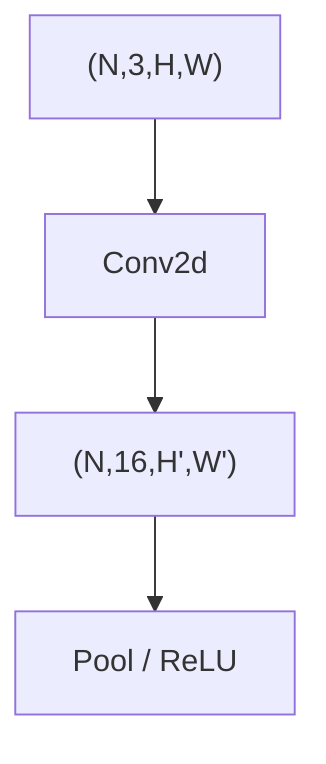

# 视觉 CNN 入门

> **文件编码**：UTF-8。  
> **前置**：[05 训练循环](05-nn.Module与训练循环.md)、[08 GPU/AMP](08-GPU训练与混合精度AMP.md)、[06 DataLoader](06-DataLoader与数据管道.md)。  
> **定位**：理解 **Conv2d、池化、CNN 结构** 与 **ResNet 迁移学习**——多模态与 ViT 之前的视觉基础（可选加速章节）。

---

## 0. 读前导读

### 0.1 用一句话弄懂本章

**CNN** = 用局部卷积核提取空间特征；**迁移学习** = 复用 ImageNet 预训练 backbone，只训分类头。

### 0.2 你需要提前知道什么

| 背景 | 建议 |
|------|------|
| 05～08 章 | 训练循环 + 可选 AMP |
| 张量 shape | 03 章 `(N,C,H,W)` |
| 纯 LLM 路线 | 本章可 skim，11 章 Transformer 更优先 |

### 0.3 本章知识地图（☐→☑）

- [ ] 解释 Conv2d 的 kernel、stride、padding、输出尺寸
- [ ] 搭建小型 CNN 并完成训练
- [ ] 使用 `torchvision.models.resnet18` 迁移学习
- [ ] 配合 `transforms` 做增广与 ImageNet 归一化
- [ ] 完成 §14 闭卷自测 ≥8/10

### 0.4 建议学习时长

- **4～5 天**

### 0.5 学完你能做什么

做 MNIST/CIFAR 级分类；冻结 backbone 微调；理解 ViT 如何把 patch 当 token（11/27 章）。

---

## 1. 图像张量布局 NCHW

```python
import torch

# batch=8, RGB=3, 32x32
x = torch.randn(8, 3, 32, 32)
print(x.shape)  # torch.Size([8, 3, 32, 32])
```

PyTorch **channels first**；与 OpenCV HWC 相反，Dataset 里常 `permute` 或 transforms 处理。

---

## 2. Conv2d 基础

```python
import torch.nn as nn

conv = nn.Conv2d(in_channels=3, out_channels=16, kernel_size=3, stride=1, padding=1)
y = conv(x)
print(y.shape)  # torch.Size([8, 16, 32, 32])
```

输出高宽公式（单维）：

\[
H_{out} = \left\lfloor \frac{H_{in} + 2p - k}{s} \right\rfloor + 1
\]

```python
conv2 = nn.Conv2d(3, 16, kernel_size=3, stride=2, padding=1)
print(conv2(x).shape)  # torch.Size([8, 16, 16, 16])
```



---

## 3. 池化与激活

```python
pool = nn.MaxPool2d(kernel_size=2, stride=2)
relu = nn.ReLU(inplace=True)

z = pool(relu(conv(x)))
print(z.shape)  # torch.Size([8, 16, 16, 16])
```

`AdaptiveAvgPool2d((1,1))` 将任意 H×W 压成 1×1，分类 head 常用。

---

## 4. 小型 CNN 完整示例

```python
class SmallCNN(nn.Module):
    def __init__(self, num_classes=10):
        super().__init__()
        self.features = nn.Sequential(
            nn.Conv2d(3, 32, 3, padding=1),
            nn.ReLU(),
            nn.MaxPool2d(2),
            nn.Conv2d(32, 64, 3, padding=1),
            nn.ReLU(),
            nn.MaxPool2d(2),
        )
        self.classifier = nn.Sequential(
            nn.Flatten(),
            nn.Linear(64 * 8 * 8, 128),
            nn.ReLU(),
            nn.Linear(128, num_classes),
        )

    def forward(self, x):
        return self.classifier(self.features(x))

model = SmallCNN()
out = model(torch.randn(4, 3, 32, 32))
print(out.shape)  # torch.Size([4, 10])
```

**注意**：上面假设输入 32×32，两次 pool → 8×8；换输入尺寸需重算 Linear in_features 或用 AdaptiveAvgPool。

---

## 5. torchvision 与 transforms

```python
from torchvision import datasets, transforms

transform = transforms.Compose([
    transforms.ToTensor(),
    transforms.Normalize((0.4914, 0.4822, 0.4465), (0.2023, 0.1994, 0.2010)),
])

# 需下载 CIFAR10 时：download=True
# train_set = datasets.CIFAR10(root="./data", train=True, download=True, transform=transform)
```

训练增广：

```python
train_tf = transforms.Compose([
    transforms.RandomHorizontalFlip(),
    transforms.RandomCrop(32, padding=4),
    transforms.ToTensor(),
    transforms.Normalize((0.5,)*3, (0.5,)*3),
])
```

---

## 6. ResNet 迁移学习

```python
from torchvision.models import resnet18, ResNet18_Weights

weights = ResNet18_Weights.DEFAULT
backbone = resnet18(weights=weights)

# 冻结 backbone
for p in backbone.parameters():
    p.requires_grad = False

num_classes = 10
in_features = backbone.fc.in_features
backbone.fc = nn.Linear(in_features, num_classes)

model = backbone
trainable = sum(p.numel() for p in model.parameters() if p.requires_grad)
total = sum(p.numel() for p in model.parameters())
print(f"trainable {trainable}/{total}")
```

**预期**：trainable 仅最后一层 ~5K 参数，总量 ~11M。

### 6.1 差异化学习率

```python
optimizer = torch.optim.AdamW([
    {"params": model.fc.parameters(), "lr": 1e-3},
], weight_decay=0.01)
# 若解冻部分 layer4：再加 param group lr=1e-4
```

---

## 7. 训练片段（CIFAR 风格）

```python
from torch.utils.data import DataLoader

# 假设 train_set 已定义
loader = DataLoader(train_set, batch_size=128, shuffle=True, num_workers=2, pin_memory=True)
device = torch.device("cuda" if torch.cuda.is_available() else "cpu")
model = model.to(device)
criterion = nn.CrossEntropyLoss()
optimizer = torch.optim.AdamW(filter(lambda p: p.requires_grad, model.parameters()), lr=1e-3)

model.train()
for images, labels in loader:
    images, labels = images.to(device), labels.to(device)
    optimizer.zero_grad()
    logits = model(images)
    loss = criterion(logits, labels)
    loss.backward()
    optimizer.step()
    break

print("one batch ok, logits", logits.shape)
```

配合 08 章可在 forward 外包 `autocast`。

---

## 8. BatchNorm 与 eval

```python
model.train()   # BN 用 batch 统计
model.eval()    # BN 用 running mean/var
with torch.no_grad():
    pred = model(images).argmax(1)
```

小 batch 时 BN 噪声大；ResNet 已含 BN，迁移学习初期 frozen BN 行为仍随 eval/train 切换。

---

## 9. CNN 与 ViT / 多模态

| 架构 |  inductive bias | LLM 路线 |
|------|-----------------|----------|
| CNN | 局部性、平移等变 | CLIP 图像塔、早期 ViT 对比 |
| ViT | patch → token + Transformer | 11 章、27 多模态 |

[LLMPython 00](00-学习路线图与说明.md) 将 09 标为可选；做 VLM 仍建议了解 Conv 与 ResNet 特征图。

---

## 10. 练习

1. 手算 `Conv2d(3,16,k=3,s=1,p=1)` 对 32×32 输出的 H、W。
2. 训练 `SmallCNN` 在随机噪声标签上过拟合 1 batch（验证循环正确）。
3. 用 `resnet18` 预训练，只训 fc，在 CIFAR10 上跑 1 epoch（或子集）。
4. 解冻 `layer4` 并设两组 lr，对比只训 fc。
5. 画 features 输出 shape 随层变化的表格。

---

## 11. 学完标准

- [ ] 闭卷写出 Conv 输出尺寸公式
- [ ] 解释 NCHW
- [ ] 完成迁移学习冻结/替换 fc
- [ ] 知道 RandomCrop/Normalize 作用
- [ ] 说明 CNN 与 Self-Attention 在 inductive bias 上差异

---

## 12. FAQ

**Q1：inplace=True 安全吗？**  
训练时 ReLU inplace 一般 OK；勿对需 backward 的 leaf 随意 inplace。

**Q2：1×1 卷积作用？**  
通道混合、降维，等价于 per-pixel 全连接。

**Q3：depthwise separable？**  
MobileNet 结构；效率更高，本入门不展开。

**Q4：为何 ImageNet normalize 用固定 mean/std？**  
与预训练权重分布一致；迁移必须对齐。

**Q5：输入尺寸非 224？**  
ResNet 可改，但预训练位置编码无（CNN 全卷积可变尺寸）；fc 前 AdaptiveAvgPool 更稳。

**Q6：灰度图？**  
`Conv2d(1, ...)` 或重复 3 通道。

**Q7：数据太少？**  
强增广 + 迁移学习 + 小 lr；勿从头训大模型。

**Q8：torchvision 还学什么？**  
`efficientnet_v2_s`、`convnext` 接口类似。

**Q9：ONNX 导出？**  
21 章 torch.onnx；CNN 最简单入门。

**Q10：和 LLM 训练代码差别？**  
CNN batch 是图像；LLM 是 token ids + mask。循环框架相同（05 章）。

---

## 13. 闭卷自测

1. NCHW 各字母含义？
2. padding=1, k=3, s=1 时 H 是否不变？
3. MaxPool2d(2,2) 对 H 的影响？
4. 迁移学习为何替换 fc？
5. 冻结 backbone 时 trainable 参数在哪？
6. Normalize 的目的？
7. `model.eval()` 对 Dropout 影响？
8. AdaptiveAvgPool2d(1) 输出 shape？
9. 小 batch 对 BN 问题？
10. ViT 相对 CNN 少哪类先验？

<details>
<summary>参考答案</summary>

1. Batch, Channel, Height, Width。
2. 是（same padding）。
3. H 约减半（整除 2）。
4. 原 fc 为 1000 类；新任务类别数不同。
5. 主要在 fc（及未冻结层）。
6. 零均值单位方差，加速收敛；匹配预训练。
7. 关闭 Dropout。
8. (N, C, 1, 1)。
9. 统计噪声大；可考虑 SyncBN 或 frozen BN。
10. 局部性与平移等变（靠 patch+attention 全局建模）。

</details>

---

## 14. 下一章预告

10 章 **序列模型与 Embedding**：token 查表、位置编码、RNN/LSTM 直觉——衔接 11 章 Transformer 与 LLM。

---

*上一章：[08 GPU/AMP](08-GPU训练与混合精度AMP.md)*  
*下一章：[10 序列模型与 Embedding 入门](10-序列模型与Embedding入门.md)*
