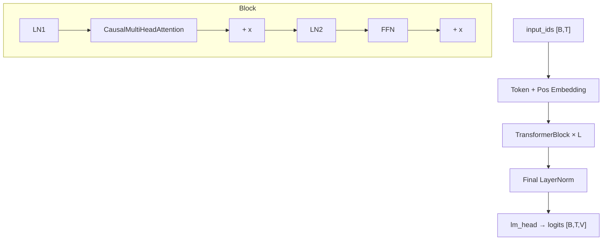

# Transformer 从零实现（PyTorch）

> **文件编码**：UTF-8。  
> **前置**：[03 PyTorch 入门](03-PyTorch入门与张量操作.md)、[05 nn.Module](05-nn.Module与训练循环.md)、[LLMInfra 02 Transformer 原理](../LLMInfra/02-Transformer与注意力机制原理.md)。  
> **定位**：用 PyTorch **手写 Mini-Transformer**，理解 HuggingFace 封装背后的模块划分；数学手推见 LLMInfra 02，本章侧重 **可运行代码**。

---

## 0. 读前导读

### 0.1 用一句话弄懂本章

**从零实现 Transformer** = 用 `nn.Module` 拼出 Embedding → Causal MHA → FFN → LM Head，跑通字符级语言建模训练循环。

### 0.2 你需要提前知道什么

- PyTorch 张量 shape、`view`/`transpose`、`nn.Linear`
- 完成 LLMInfra 02 的 Attention 公式推导（Q/K/V、缩放、因果 mask）
- 可选：读过 [10 序列模型与 Embedding](10-序列模型与Embedding入门.md)

### 0.3 本章知识地图（☐→☑）

- [ ] 实现 `CausalSelfAttention` 与 `MultiHeadAttention` 包装
- [ ] 实现 `TransformerBlock`（Pre-LN + 残差）
- [ ] 拼出完整 `MiniGPT` 并打印参数量
- [ ] 在 Tiny Shakespeare 上训练到 loss 下降
- [ ] 能对照 HF `modeling_gpt2.py` 说出对应类名
- [ ] 完成 §14 闭卷自测 ≥8/10

### 0.4 建议学习时长

- **5～7 天**（含调试 shape 与过拟合小数据集）

---

## 1. 这份文档学什么

- Scaled Dot-Product Attention 的 PyTorch 实现
- Multi-Head：reshape 为 `[B, H, T, D]` 的技巧
- Causal Mask：`torch.triu` 与 `scaled_dot_product_attention`
- Pre-LN Transformer Block 与 FFN
- 位置编码：可学习 vs 正弦（RoPE 见 LLMInfra 02 §6）
- 完整 Mini-GPT 与字符级训练脚本骨架
- 与 [LLMInfra 15 FlashAttention](../LLMInfra/15-FlashAttention与算子融合.md) 的性能差距（概念）

---

## 2. 模块拆分总览



| 模块 | 典型 shape | 说明 |
|------|------------|------|
| input | `[B, T]` | batch、序列长 |
| hidden | `[B, T, C]` | C = n_embd |
| Q/K/V | `[B, H, T, D]` | H 头数，D = C/H |
| logits | `[B, T, vocab]` | 每位置预测下一 token |

---

## 3. Scaled Dot-Product Attention

```python
import math
import torch
import torch.nn as nn
import torch.nn.functional as F


def scaled_dot_product_attention(
    q: torch.Tensor,  # [B, H, T, D]
    k: torch.Tensor,
    v: torch.Tensor,
    causal: bool = True,
) -> torch.Tensor:
    scale = 1.0 / math.sqrt(q.size(-1))
    scores = (q @ k.transpose(-2, -1)) * scale  # [B, H, T, T]
    if causal:
        T = q.size(-2)
        mask = torch.triu(torch.ones(T, T, device=q.device, dtype=torch.bool), diagonal=1)
        scores = scores.masked_fill(mask, float("-inf"))
    weights = F.softmax(scores, dim=-1)
    return weights @ v  # [B, H, T, D]
```

**要点**：

- `scale = 1/√d_k` 防止点积过大导致 softmax 饱和
- Causal：`j > i` 位置置 `-inf`，保证自回归
- PyTorch 2.x 可用 `F.scaled_dot_product_attention`（内部可能走 FlashAttention，见 [LLMInfra 15](../LLMInfra/15-FlashAttention与算子融合.md)）

---

## 4. Causal Multi-Head Attention

```python
class CausalSelfAttention(nn.Module):
    def __init__(self, n_embd: int, n_head: int, dropout: float = 0.1):
        super().__init__()
        assert n_embd % n_head == 0
        self.n_head = n_head
        self.head_dim = n_embd // n_head
        self.qkv = nn.Linear(n_embd, 3 * n_embd, bias=False)
        self.proj = nn.Linear(n_embd, n_embd, bias=False)
        self.dropout = nn.Dropout(dropout)

    def forward(self, x: torch.Tensor) -> torch.Tensor:
        B, T, C = x.shape
        qkv = self.qkv(x).reshape(B, T, 3, self.n_head, self.head_dim)
        q, k, v = qkv.permute(2, 0, 3, 1, 4)  # 3 × [B, H, T, D]
        out = scaled_dot_product_attention(q, k, v, causal=True)
        out = out.transpose(1, 2).contiguous().reshape(B, T, C)
        return self.dropout(self.proj(out))
```

**Infra 对照**：真实引擎将 QKV 融合 GEMM、GQA 减少 K/V head——见 [LLMInfra 08 KV Cache](../LLMInfra/08-KVCache与PagedAttention原理.md)。

---

## 5. FFN 与 TransformerBlock

```python
class MLP(nn.Module):
    def __init__(self, n_embd: int, dropout: float = 0.1):
        super().__init__()
        hidden = 4 * n_embd
        self.net = nn.Sequential(
            nn.Linear(n_embd, hidden),
            nn.GELU(),
            nn.Linear(hidden, n_embd),
            nn.Dropout(dropout),
        )

    def forward(self, x):
        return self.net(x)


class TransformerBlock(nn.Module):
    def __init__(self, n_embd: int, n_head: int, dropout: float = 0.1):
        super().__init__()
        self.ln1 = nn.LayerNorm(n_embd)
        self.attn = CausalSelfAttention(n_embd, n_head, dropout)
        self.ln2 = nn.LayerNorm(n_embd)
        self.mlp = MLP(n_embd, dropout)

    def forward(self, x):
        x = x + self.attn(self.ln1(x))   # Pre-LN
        x = x + self.mlp(self.ln2(x))
        return x
```

Llama 系用 SwiGLU 替代 GELU-MLP——结构类似，多一个 gate 线性层（LLMInfra 02 §5）。

---

## 6. Mini-GPT 完整模型

```python
class MiniGPT(nn.Module):
    def __init__(
        self,
        vocab_size: int,
        n_embd: int = 256,
        n_head: int = 4,
        n_layer: int = 4,
        block_size: int = 256,
        dropout: float = 0.1,
    ):
        super().__init__()
        self.block_size = block_size
        self.tok_emb = nn.Embedding(vocab_size, n_embd)
        self.pos_emb = nn.Embedding(block_size, n_embd)
        self.drop = nn.Dropout(dropout)
        self.blocks = nn.ModuleList(
            [TransformerBlock(n_embd, n_head, dropout) for _ in range(n_layer)]
        )
        self.ln_f = nn.LayerNorm(n_embd)
        self.lm_head = nn.Linear(n_embd, vocab_size, bias=False)
        self.lm_head.weight = self.tok_emb.weight  # weight tying

    def forward(self, idx: torch.Tensor, targets: torch.Tensor | None = None):
        B, T = idx.shape
        assert T <= self.block_size
        pos = torch.arange(0, T, device=idx.device)
        x = self.drop(self.tok_emb(idx) + self.pos_emb(pos))
        for block in self.blocks:
            x = block(x)
        x = self.ln_f(x)
        logits = self.lm_head(x)
        loss = None
        if targets is not None:
            loss = F.cross_entropy(logits.view(-1, logits.size(-1)), targets.view(-1))
        return logits, loss

    @torch.no_grad()
    def generate(self, idx, max_new_tokens: int, temperature: float = 1.0):
        for _ in range(max_new_tokens):
            idx_cond = idx[:, -self.block_size:]
            logits, _ = self(idx_cond)
            logits = logits[:, -1, :] / max(temperature, 1e-8)
            probs = F.softmax(logits, dim=-1)
            next_id = torch.multinomial(probs, num_samples=1)
            idx = torch.cat([idx, next_id], dim=1)
        return idx
```

---

## 7. 训练循环骨架

```python
def train_one_epoch(model, loader, optimizer, device):
    model.train()
    total_loss = 0.0
    for x, y in loader:
        x, y = x.to(device), y.to(device)
        _, loss = model(x, y)
        optimizer.zero_grad(set_to_none=True)
        loss.backward()
        torch.nn.utils.clip_grad_norm_(model.parameters(), 1.0)
        optimizer.step()
        total_loss += loss.item()
    return total_loss / len(loader)
```

**数据**：字符级——`input` 为 `text[i:i+T]`，`target` 为 `text[i+1:i+T+1]`（见 14 章 CLM）。  
**超参起点**：`n_layer=4, n_embd=256, lr=3e-4, AdamW, batch=64`，CPU 可几分钟过拟合 1KB 文本。

---

## 8. Shape 调试清单

| 步骤 | 检查 |
|------|------|
| Embedding 后 | `[B, T, C]` |
| QKV reshape | `[B, H, T, D]`，确认 `H*D == C` |
| Attention 输出 | 还原 `[B, T, C]` |
| CE loss | logits `[B*T, V]` vs targets `[B*T]` |
| generate | 每次只取 `idx[:, -block_size:]` |

常见错误：`transpose` 后忘记 `contiguous()`；mask 维度和 `[B,H,T,T]` 广播失败。

---

## 9. 与 HuggingFace / Infra 对照

| 本实现 | HuggingFace | LLMInfra |
|--------|-------------|----------|
| `CausalSelfAttention` | `GPT2Attention` | CUDA fused MHA |
| `MiniGPT` | `GPT2LMHeadModel` | 推理引擎 layer |
| 绝对 pos emb | GPT-2 风格 | RoPE in Llama |
| Python loop generate | `model.generate` | Continuous batching（16 章） |

读完本章再开 [12 HuggingFace](12-HuggingFace-Transformers入门.md)，会认出 `config.json` 里的 `n_layer/n_head/n_embd`。

---

## 10. 练习建议

1. **Shape 实验**：固定 `B=2, T=8, C=64, H=4`，用 `print` 跟踪每层 shape
2. **去掉 causal mask**：观察 loss 是否异常低（「偷看未来」）
3. **参数量**：手算 + `sum(p.numel() for p in model.parameters())`
4. **对比**：同样数据训练 `MiniGPT` vs `GPT2LMHeadModel.from_pretrained('distilgpt2')` 的 loss 曲线
5. **阅读**：nanoGPT `model.py` 与本章 diff
6. **扩展**：把 `GELU MLP` 改成 `SwiGLU`（三线性层）

---

## 11. 学完标准

- [ ] 白板画出 `[B,T,C] → [B,H,T,D] → attention → [B,T,C]` 数据流
- [ ] 独立写出 causal mask 两行核心代码
- [ ] 解释 Pre-LN 与 Post-LN 区别（本实现用 Pre-LN）
- [ ] 跑通 Tiny Shakespeare 或自建 10KB 语料过拟合
- [ ] 说明 weight tying 的作用
- [ ] 指出本实现相对 vLLM 推理的 3 个缺失（KV Cache、融合算子、batch 调度）

---

## 12. FAQ

**Q1：为什么要自己写，不直接用 HuggingFace？**  
面试手撕、改结构（MoE、新 attention）、读源码时不再「黑盒」。

**Q2：`nn.MultiheadAttention` 和手写有何不同？**  
官方 API 默认 `batch_first` 行为随版本变化；手写清晰控制 causal 与 head 维。

**Q3：Pre-LN 为什么更稳？**  
LayerNorm 在子层输入前，梯度路径更短；Llama/GPT-3 等大模型普遍 Pre-LN。

**Q4：绝对位置编码的最大长度？**  
受 `block_size` 限制；更长需 RoPE + 外推（LLMInfra 02 §6）。

**Q5：训练时 attention 算全矩阵，推理为何要用 KV Cache？**  
训练并行算全序列；自回归生成每步只新增 1 token，Cache 避免重复算历史 K/V——见 [LLMInfra 08](../LLMInfra/08-KVCache与PagedAttention原理.md)。

**Q6：`F.scaled_dot_product_attention` 和手写等价吗？**  
数学等价；启用 SDPA 后端时可能调用 FlashAttention，更快更省显存。

**Q7：head 数必须整除 hidden 吗？**  
是，否则 `head_dim` 非整数无法 reshape。

**Q8：Dropout 在推理时要关吗？**  
要；`model.eval()` 自动关闭 Dropout，与 `torch.no_grad()` 配合 generate。

**Q9：字符级 vs BPE 子词？**  
字符级 vocab 小、序列长；真实 LLM 用 BPE（13 章）。

**Q10：本模型能 scale 到 7B 吗？**  
架构可扩展，但需分布式、FlashAttention、数据与 weeks 算力——见 14～17 章。

---

## 13. 闭卷自测

1. Scaled attention 中 scale 因子是什么？
2. Causal mask 加在 scores 的哪个阶段？
3. Multi-Head 中 `concat` 后经过哪个层？
4. Pre-LN 第一个 LayerNorm 在哪个子层之前？
5. Weight tying 共享哪两个矩阵？
6. `generate` 每步为何截断 `idx[:, -block_size:]`？
7. Cross-entropy 的 targets 相对 inputs 偏移几位？
8. FFN 中间维度通常是 hidden 的几倍？
9. `[B,H,T,D]` 中 H 和 D 满足什么关系？
10. 训练 attention 复杂度对序列长 T 是几阶？

<details>
<summary>参考答案</summary>

1. `1/√d_k`（或 `1/√head_dim`）。
2. softmax 之前，对 scores 矩阵上三角（未来位置）填 `-inf`。
3. `proj`（output projection，`nn.Linear`）。
4. Multi-Head Attention 子层之前（本实现 Pre-LN）。
5. `tok_emb.weight` 与 `lm_head.weight`。
6. 模型只支持最长 `block_size` 的上下文。
7. 偏移 1（预测下一 token，CLM）。
8. 通常 4 倍（GPT-2 风格）。
9. `n_embd = H × D`。
10. O(T²) 每层（未用稀疏/Flash 时）。

</details>

---

## 14. 下一章预告

11 章你已有 **可训练的 Mini-GPT**——下一章用 **HuggingFace Transformers** 加载 DistilGPT2/Qwen，用 `Trainer` 与 `pipeline` 替代手写循环。

---

*下一章：[12 HuggingFace Transformers 入门](12-HuggingFace-Transformers入门.md)*  
*数学对照：[LLMInfra 02 Transformer 原理](../LLMInfra/02-Transformer与注意力机制原理.md)*
