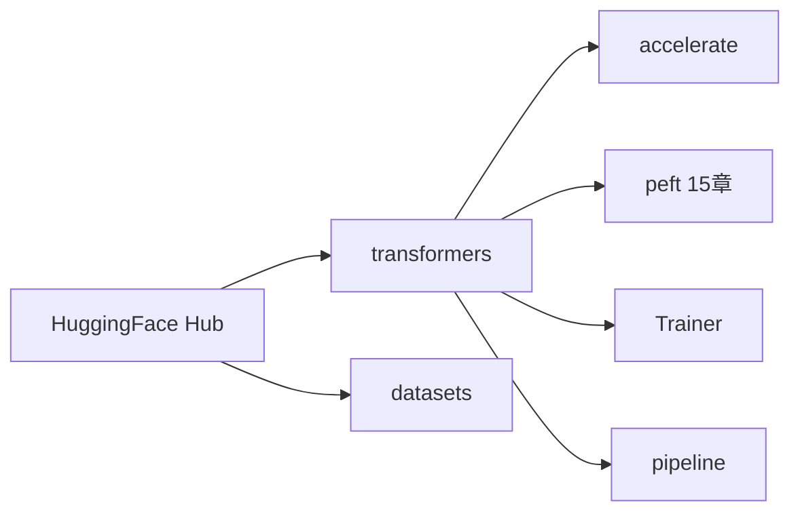

# HuggingFace Transformers 入门

> **文件编码**：UTF-8。  
> **前置**：[11 Transformer 从零实现](11-Transformer从零实现PyTorch.md)、[06 DataLoader](06-DataLoader与数据管道.md)。  
> **定位**：掌握 **AutoModel / Trainer / pipeline** 三件套，把 11 章手写模型换成工业级 HF 生态。

---

## 0. 读前导读

### 0.1 用一句话弄懂本章

**Transformers 库** = 统一接口加载 thousands 模型（config + weights + tokenizer），用 `Trainer` 或 `pipeline` 完成推理与微调。

### 0.2 你需要提前知道什么

- PyTorch 训练循环（05 章）
- 11 章 Transformer 模块名与 shape
- 会用 `pip install transformers datasets accelerate`

### 0.3 本章知识地图（☐→☑）

- [ ] 用 `AutoModelForCausalLM` 加载并 `generate`
- [ ] 用 `pipeline("text-generation")` 一行推理
- [ ] 配置 `TrainingArguments` + `Trainer` 微调小模型
- [ ] 理解 `config.json` 与 `model.safetensors` 分工
- [ ] 会用 `device_map` / `torch_dtype` 省显存
- [ ] 完成 §14 闭卷自测 ≥8/10

### 0.4 建议学习时长

- **4～6 天**

---

## 1. 这份文档学什么

- Hub 模型目录结构：`config.json`、`tokenizer.json`、`*.safetensors`
- `AutoConfig` / `AutoModel` / `AutoTokenizer` 自动类
- Causal LM vs Seq2Seq vs Encoder 模型类选择
- `model.generate` 参数：`max_new_tokens`、`temperature`、`do_sample`
- `Trainer` + `TrainingArguments` 标准微调模板
- `datasets` 加载与 `DataCollatorForLanguageModeling`
- `accelerate` 与混合精度（衔接 08、17 章）
- 与 [LLMInfra 12 Checkpoint 加载](../LLMInfra/12-Checkpoint加载与mmap权重IO.md) 的权重 IO 对照

---

## 2. 生态总览



| 组件 | 作用 |
|------|------|
| `transformers` | 模型、tokenizer、Trainer |
| `datasets` | 流式/内存映射数据集 |
| `accelerate` | 多 GPU、混合精度抽象 |
| `tokenizers` | Rust 快速 BPE（13 章） |

---

## 3. 最小加载与生成

```python
import torch
from transformers import AutoModelForCausalLM, AutoTokenizer

model_id = "distilgpt2"
tokenizer = AutoTokenizer.from_pretrained(model_id)
tokenizer.pad_token = tokenizer.eos_token  # GPT 类常无 pad

model = AutoModelForCausalLM.from_pretrained(
    model_id,
    torch_dtype=torch.float16,
    device_map="auto",  # 需要 accelerate
)

inputs = tokenizer("Hello, my name is", return_tensors="pt").to(model.device)
outputs = model.generate(
    **inputs,
    max_new_tokens=50,
    do_sample=True,
    temperature=0.8,
    top_p=0.95,
)
print(tokenizer.decode(outputs[0], skip_special_tokens=True))
```

**大模型加载**：

```python
model = AutoModelForCausalLM.from_pretrained(
    "Qwen/Qwen2.5-0.5B-Instruct",
    torch_dtype=torch.bfloat16,
    device_map="auto",
    attn_implementation="sdpa",  # 或 flash_attention_2
)
```

FlashAttention 需 GPU 与包支持——算子层见 [LLMInfra 15](../LLMInfra/15-FlashAttention与算子融合.md)。

---

## 4. pipeline 快速推理

```python
from transformers import pipeline

gen = pipeline(
    "text-generation",
    model="distilgpt2",
    device=0,  # GPU 0；-1 为 CPU
)
print(gen("The meaning of life is", max_new_tokens=30, num_return_sequences=1))
```

| task | pipeline 字符串 |
|------|-----------------|
| 文本生成 | `text-generation` |
| 填空 | `fill-mask`（BERT） |
| 分类 | `text-classification` |
| 问答 | `question-answering` |

生产环境高吞吐不用 pipeline——用 vLLM（20 章）或 [LLMInfra 16 batch 调度](../LLMInfra/16-推理Batch调度与ContinuousBatching.md)。

---

## 5. Auto 类选择指南

```python
from transformers import (
    AutoConfig,
    AutoModelForCausalLM,
    AutoModelForSeq2SeqLM,
    AutoModel,
)

config = AutoConfig.from_pretrained("meta-llama/Llama-3.2-1B")
print(config.model_type, config.hidden_size, config.num_hidden_layers)
```

| 任务 | 推荐类 |
|------|--------|
| GPT 式生成 | `AutoModelForCausalLM` |
| T5/BART 翻译摘要 | `AutoModelForSeq2SeqLM` |
| 取 hidden states | `AutoModel` + `output_hidden_states=True` |
| 分类头 | `AutoModelForSequenceClassification` |

读 `config.architectures` 可确认类名，如 `LlamaForCausalLM`。

---

## 6. Trainer 微调模板

```python
from datasets import load_dataset
from transformers import (
    AutoModelForCausalLM,
    AutoTokenizer,
    TrainingArguments,
    Trainer,
    DataCollatorForLanguageModeling,
)

model_id = "distilgpt2"
tokenizer = AutoTokenizer.from_pretrained(model_id)
tokenizer.pad_token = tokenizer.eos_token
model = AutoModelForCausalLM.from_pretrained(model_id)

ds = load_dataset("wikitext", "wikitext-2-raw-v1", split="train[:5%]")

def tokenize_fn(examples):
    return tokenizer(examples["text"], truncation=True, max_length=256)

tokenized = ds.map(tokenize_fn, batched=True, remove_columns=ds.column_names)

collator = DataCollatorForLanguageModeling(tokenizer=tokenizer, mlm=False)

args = TrainingArguments(
    output_dir="./out-distilgpt2",
    per_device_train_batch_size=4,
    num_train_epochs=1,
    learning_rate=5e-5,
    logging_steps=50,
    save_steps=500,
    bf16=torch.cuda.is_available(),
    report_to="none",
)

trainer = Trainer(
    model=model,
    args=args,
    train_dataset=tokenized,
    data_collator=collator,
)

trainer.train()
trainer.save_model("./out-distilgpt2/final")
```

`mlm=False` 表示 **CLM**（因果语言建模），与 14 章一致。

---

## 7. generate 核心参数

| 参数 | 含义 |
|------|------|
| `max_new_tokens` | 新生成 token 数（不含 prompt） |
| `do_sample=False` | 贪心解码 |
| `temperature` | 采样随机性，越高越散 |
| `top_p` | nucleus sampling |
| `repetition_penalty` | 抑制重复 |
| `use_cache=True` | KV Cache（推理必备，Infra 08 章） |

```python
model.generate(**inputs, max_new_tokens=100, eos_token_id=tokenizer.eos_token_id)
```

---

## 8. 保存、推送与本地路径

```python
model.save_pretrained("./my-model")
tokenizer.save_pretrained("./my-model")
# model.push_to_hub("username/my-model")  # 需 huggingface-cli login
```

权重推荐 **safetensors** 格式（安全、可 mmap）——加载细节 [LLMInfra 12](../LLMInfra/12-Checkpoint加载与mmap权重IO.md)。

---

## 9. 调试与常见报错

| 报错 | 处理 |
|------|------|
| `CUDA OOM` | 减 batch、`gradient_checkpointing_enable()`、LoRA（15 章） |
| `pad_token_id` 未设 | GPT 类设 `pad_token=eos_token` |
| `flash_attn` 不可用 | 改 `attn_implementation="sdpa"` 或 `"eager"` |
| shape 不匹配 | 检查 `max_length` 与 model `max_position_embeddings` |

```python
model.gradient_checkpointing_enable()  # 换显存为重算
print(model.config)
```

---

## 10. 与 11 章手写模型对照

| 11 章 MiniGPT | HuggingFace |
|---------------|-------------|
| `MiniGPT` | `GPT2LMHeadModel` |
| `n_layer` | `num_hidden_layers` |
| `n_head` | `num_attention_heads` |
| `n_embd` | `hidden_size` |
| 手写 `generate` | `GenerationMixin.generate` |

建议打开 `transformers/models/gpt2/modeling_gpt2.py` 对照 `GPT2Block`。

---

## 11. 练习建议

1. 用 `Trainer` 在 wikitext-2 上微调 DistilGPT2，记录 train loss
2. 对比 `pipeline` 与 `model.generate` 输出差异
3. 加载 Qwen2.5-0.5B，打印 `config` 全部字段
4. 用 `output_attentions=True` 看 attention tensor shape（小心 OOM）
5. 将 checkpoint 用 `from_pretrained(local_dir)` 重新加载验证
6. 阅读 `TrainingArguments` 文档，试 `warmup_ratio=0.1`

---

## 12. 学完标准

- [ ] 不看文档写出 Auto 加载 + generate 最小脚本
- [ ] 独立配置 Trainer 完成 1 epoch CLM 微调
- [ ] 解释 `AutoModelForCausalLM` 与 `AutoModel` 区别
- [ ] 说出 safetensors 相对 pickle 的优势
- [ ] 知道何时用 pipeline、何时用 vLLM

---

## 13. FAQ

**Q1：`from_pretrained` 第一次很慢？**  
下载权重到 `~/.cache/huggingface`；可设 `HF_ENDPOINT` 镜像或提前 `huggingface-cli download`。

**Q2：`device_map="auto"` 是什么？**  
`accelerate` 按层自动切 GPU/CPU/disk，适合单卡放不下的大模型。

**Q3：Trainer 和 PyTorch 手写循环选哪个？**  
实验与标准微调用 Trainer；研究自定义 loss（DPO 16 章）常手写或继承 `Trainer`。

**Q4：`trust_remote_code=True` 何时需要？**  
Hub 上部分模型含自定义 Python 建模代码，需显式信任。

**Q5：bf16 和 fp16 在 Trainer 里怎么开？**  
`TrainingArguments(bf16=True)` 或 `fp16=True`；Amp 细节见 08 章与 [LLMInfra 09 量化](../LLMInfra/09-模型量化INT8-INT4-FP8与校准.md)。

**Q6：`model.eval()` 和 `generate` 关系？**  
`generate` 内部会设 eval 模式；训练完推理前仍建议显式 `model.eval()`。

**Q7：如何只训练部分层？**  
冻结参数 `param.requires_grad=False`；更好用 PEFT（15 章）。

**Q8：tokenizer 和 model 必须同 repo 吗？**  
应配对；混用不同 vocab 会导致乱码（13 章）。

**Q9：Hub 私有模型怎么拉？**  
`huggingface-cli login` 后 `from_pretrained` 带 token。

**Q10：HF `generate` 和 vLLM 吞吐差多少？**  
同硬件上 vLLM 常高一个数量级——PagedAttention 与 continuous batching（20 章、Infra 14～16）。

---

## 14. 闭卷自测

1. CLM 微调应用哪个 `DataCollator`？mlm 设什么？
2. GPT 类为何常把 pad_token 设为 eos？
3. `max_new_tokens` 与 `max_length` 区别？
4. `AutoModelForCausalLM` 输出 logits shape？
5. Trainer 保存的目录里至少有哪些文件？
6. `device_map="auto"` 依赖哪个库？
7. `attn_implementation="flash_attention_2"` 失败时 fallback？
8. pipeline 适合生产高 QPS 吗？
9. weight 文件 safetensors 扩展名？
10. 读 config 中哪字段可知最大上下文长度？

<details>
<summary>参考答案</summary>

1. `DataCollatorForLanguageModeling`，`mlm=False`。
2. GPT 无专用 pad；batch padding 需 pad_token_id，常用 eos 代替。
3. `max_new_tokens` 只计新生成；`max_length` 含 prompt 总长度。
4. `[batch, seq_len, vocab_size]`。
5. `config.json`、`model.safetensors`（或 bin）、tokenizer 文件、`training_args.bin`（若 Trainer 保存）。
6. `accelerate`。
7. 改为 `sdpa` 或 `eager`。
8. 不适合；应用专用推理引擎。
9. `.safetensors`。
10. `max_position_embeddings`（或 model 文档中的 context length）。

</details>

---

## 15. 下一章预告

12 章会加载模型，但 **文本如何变成 token** 由 Tokenizer 决定——13 章深入 BPE、SentencePiece 与 chat_template。

---

*下一章：[13 Tokenizer 与 BPE/SentencePiece](13-Tokenizer与BPE-SentencePiece.md)*  
*权重 IO：[LLMInfra 12 Checkpoint](../LLMInfra/12-Checkpoint加载与mmap权重IO.md)*
