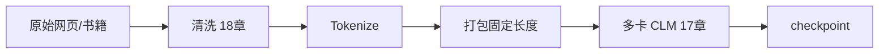

# 预训练与语言模型原理

> **文件编码**：UTF-8。  
> **前置**：[11 Transformer 实现](11-Transformer从零实现PyTorch.md)、[13 Tokenizer](13-Tokenizer与BPE-SentencePiece.md)。  
> **定位**：理解 **CLM、因果掩码、perplexity** 与预训练数据流；不做完整预训练，但读懂 LitGPT/nanoGPT 与论文术语。

---

## 0. 读前导读

### 0.1 用一句话弄懂本章

**因果语言建模（CLM）** = 给定前文预测下一 token；**预训练** = 在互联网规模文本上最小化交叉熵，得到通用表示后再 SFT/对齐。

### 0.2 你需要提前知道什么

- Cross-entropy 与 softmax（05 章）
- Causal mask（11 章、LLMInfra 02）
- Tokenizer 与 `input_ids` shape

### 0.3 本章知识地图（☐→☑）

- [ ] 写出 CLM 损失公式与 shift 关系
- [ ] 手算小词表上的 perplexity
- [ ] 解释 teacher forcing 与 exposure bias（概念）
- [ ] 描述预训练数据 pipeline 三阶段
- [ ] 对照 Chinchilla scaling law 知道 data/compute 权衡
- [ ] 完成 §14 闭卷自测 ≥8/10

### 0.4 建议学习时长

- **4～6 天**

---

## 1. 这份文档学什么

- CLM 目标函数与 label shift
- 因果（Causal）与双向（MLM）对比
- Perplexity（PPL）定义与评估
- 预训练语料：去重、质量、混合比例（详 18 章）
- 训练技巧：Warmup、cosine decay、weight decay
- Scaling laws 与 compute-optimal 直觉
- Checkpoint 与继续预训练（CPT）
- 与 [LLMInfra 02](../LLMInfra/02-Transformer与注意力机制原理.md) 数学一致，本章偏 **训练目标与实验**

---

## 2. 语言建模任务定义

给定 token 序列 \(x_1,\ldots,x_T\)，自回归因子分解：

\[
P(x_1,\ldots,x_T) = \prod_{t=1}^{T} P(x_t \mid x_{<t})
\]

**CLM 损失**（平均负对数似然）：

\[
\mathcal{L} = -\frac{1}{T}\sum_{t=1}^{T} \log P_\theta(x_t \mid x_{<t})
\]

PyTorch 实现：logits 位置 t 预测 **target** 位置 t 的下一 token（或 target 为 input 右移 1）。

```python
# input_ids: [B, T]
logits, loss = model(input_ids, labels=input_ids)  # HF 内部 shift
# 或手动：
# logits = model(input_ids[:, :-1])
# labels = input_ids[:, 1:]
```

---

## 3. 因果 Mask 再述

训练时虽一次 forward 全序列，但 attention **不允许看未来**——与 11 章 `triu` mask 相同。

| 类型 | 代表模型 | 训练目标 |
|------|----------|----------|
| CLM | GPT, Llama, Qwen | 下一 token |
| MLM | BERT | 掩码位置还原 |
| Span Corruption | T5 | 噪声片段 |

生成式 LLM 主流为 **Decoder-only + CLM**。

---

## 4. Perplexity

\[
\text{PPL} = \exp(\mathcal{L}) = \exp\left(-\frac{1}{N}\sum \log P(x_i)\right)
\]

- 越低越好；**intrinsic** 指标，不完全等于下游任务质量
- 比较模型须 **同一 tokenizer、同一 eval 集**
- WikiText-2 上 small GPT-2 量级 PPL ~20～40（视 checkpoint）

```python
import math
import torch
import torch.nn.functional as F

def perplexity(logits, labels, ignore_index=-100):
    loss = F.cross_entropy(
        logits.view(-1, logits.size(-1)),
        labels.view(-1),
        ignore_index=ignore_index,
    )
    return math.exp(loss.item())
```

---

## 5. Teacher Forcing

训练：始终用 **真实** 前文 token 作为输入预测下一步。  
推理：用 **模型自己生成** 的 token 作为后续输入。

**Exposure bias**：训练分布与推理分布不一致；缓解用 scheduled sampling、RL 微调等（16 章）。

---

## 6. 预训练流程（工程视角）



**打包（packing）**：多条短样本拼成固定 `seq_len`，提高 GPU 利用率；注意 **不跨样本** attention（需 segment id 或 EOS 边界）。

```python
# 概念：Document mask — 同一段内 causal，不同文档互不可见
```

---

## 7. 优化与稳定性

| 超参 | 典型范围 | 说明 |
|------|----------|------|
| AdamW lr | 1e-4 ~ 3e-4（小模型） | 大模型更小 |
| batch tokens | 0.5M～4M | 全局 batch |
| warmup | 1%～2% steps | 稳定初期 |
| weight decay | 0.1 | 仅 decay 权重非 bias/LN |
| grad clip | 1.0 | 防爆炸 |
| precision | bf16 | 见 08 章 |

**Loss spike**：检查 lr、数据脏 token、bf16 下异常；可回滚 checkpoint。

---

## 8. Scaling Laws（直觉）

Chinchilla 等结论：**给定算力，模型大小与数据量应平衡**——参数量加倍，训练 token 也应约加倍。

| 误区 | 正解 |
|------|------|
| 越大模型越好 | 数据不够会 undertrain |
| PPL 单点决定一切 | 还需指令跟随、安全（15～16 章） |
| 预训练 = 读一遍网 | 多 epoch + 高质量子集常更优 |

个人学习：**不跑 7B 预训练**；用 `TinyStories`、wikitext 体验 CLM 即可。

---

## 9. 继续预训练（CPT）

在领域语料上 **接着 base 权重** 训练 CLM：

- 学习率通常 **更小**（1e-5 量级）
- 防 **灾难性遗忘**：混合通用数据 5%～20%
- 与 SFT 区别：CPT 仍 CLM 全 token loss；SFT 常 mask 仅 assistant

---

## 10. 参考实现阅读

| 项目 | 学什么 |
|------|--------|
| [nanoGPT](https://github.com/karpathy/nanoGPT) | 最小 CLM 循环 |
| LitGPT | 现代 Llama 结构 + 预训练脚本 |
| HF `run_clm.py` | Trainer + CLM |

对照 11 章 `MiniGPT`，重点看 **data loader 如何 shift labels**。

---

## 11. 与 Infra 的交叉

- 预训练 **算力**：多机 DeepSpeed（17 章）、[LLMInfra 10 分布式](../LLMInfra/10-分布式训练并行策略与NCCL入门.md)
- 长序列：FlashAttention（[Infra 15](../LLMInfra/15-FlashAttention与算子融合.md)）
- 存 checkpoint：[Infra 12 mmap 加载](../LLMInfra/12-Checkpoint加载与mmap权重IO.md)

---

## 12. 练习建议

1. 在 11 章 MiniGPT 上算 train/val PPL 并画曲线
2. 实现手动 label shift，验证与 HF `labels=input_ids` 一致
3. 读 WikiText，统计 token 数与 PPL 关系（更长 context 是否更低 PPL）
4. 用 `run_clm.py` 跑 1000 step DistilGPT2 继续预训练
5. 解释 MLM 与 CLM 能否共用同一 Decoder-only 权重
6. 估算：7B 模型 bf16 权重约 14GB（参数 × 2 bytes）

---

## 13. 学完标准

- [ ] 写出 CLM 的 NLL 与 PPL 公式
- [ ] 解释 causal mask 在训练 forward 中的作用
- [ ] 说明 teacher forcing 与推理差异
- [ ] 知道 Chinchilla 对 data/model 比例的核心结论
- [ ] 区分 CPT 与 SFT 的目标与数据格式

---

## 14. FAQ

**Q1：labels 为什么要 shift？**  
位置 t 的 logits 预测 \(x_{t+1}\)，故 target 是 input 右移一位。

**Q2：PPL=100 好还是坏？**  
取决于词表与数据集；只宜 **横向比较** 同设定模型。

**Q3：能用在中文上吗？**  
可以；应用中文语料预训练或 CPT，tokenizer 需覆盖汉字（13 章）。

**Q4：MLM 能训练 Llama 吗？**  
架构上可以改目标，但 Llama 系官方均为 CLM；改目标需从头或大量实验。

**Q5：context length 训练与推理不一致？**  
超过训练长度的 position，RoPE 外推或插值；质量可能下降（Infra 02 §6）。

**Q6：loss 用 mean 还是 sum？**  
常用 mean over tokens；注意与 PPL 的 exp(mean NLL) 一致。

**Q7：为什么要 packing？**  
减 padding 浪费，提高每 step 有效 token 数。

**Q8：预训练要不要 instruction 数据？**  
传统预训练纯文本；现代有些 **多阶段** 混入少量结构化文本。

**Q9：如何知道预训练收敛？**  
验证集 PPL 平台期；大项目还看 downstream benchmark（19 章）。

**Q10：个人能预训练 1B 吗？**  
理论可以小数据过拟合学习流程；严肃 1B 需多卡与 TB 级 token（17～18 章）。

---

## 15. 闭卷自测

1. CLM 每个位置预测的是什么？
2. PPL 与 average NLL 的关系？
3. Causal mask 防止模型看到什么？
4. Teacher forcing 在训练时输入从哪来？
5. BERT 用的是 CLM 还是 MLM？
6. packing 时为何要 document boundary？
7. CPT 学习率相对预训练通常更大还是更小？
8. 7B bf16 权重大约多少 GB？
9. Chinchilla 强调 model 与什么要匹配？
10. 比较 PPL 时必须固定什么？

<details>
<summary>参考答案</summary>

1. 下一个 token \(x_t\)（给定 \(x_{<t}\)）。
2. PPL = exp(平均 NLL)。
3. 未来 token（j > i 的位置）。
4. 数据集真实的前文 token。
5. MLM（掩码语言模型）。
6. 防止跨文档 attention 泄露上下文。
7. 更小。
8. 约 14GB（7×10^9 × 2 bytes）。
9. 训练 token 数量（compute-optimal 平衡）。
10. 同一 eval 集与 tokenizer。

</details>

---

## 16. 下一章预告

预训练得到 base 模型后，**监督微调 SFT** 与 **LoRA** 让模型听指令——15 章。

---

*下一章：[15 微调 SFT 与 LoRA/PEFT](15-微调SFT与LoRA-PEFT.md)*  
*分布式预训练：[17 分布式训练](17-分布式训练DDP-FSDP与DeepSpeed.md)*
