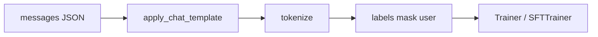

# 微调 SFT 与 LoRA / PEFT

> **文件编码**：UTF-8。  
> **前置**：[12 HuggingFace](12-HuggingFace-Transformers入门.md)、[13 Tokenizer](13-Tokenizer与BPE-SentencePiece.md)、[14 预训练原理](14-预训练与语言模型原理.md)。  
> **定位**：掌握 **SFT 数据格式、LoRA/QLoRA、peft 库**，在单卡 16～24GB 上微调 7B 级模型。

---

## 0. 读前导读

### 0.1 用一句话弄懂本章

**SFT** = 用指令-回答对继续训练 CLM；**LoRA** = 只训练低秩适配器，冻结原权重，大幅省显存与存储。

### 0.2 你需要提前知道什么

- Trainer 或手写训练循环（12 章）
- `apply_chat_template` 与 label mask（13 章）
- bf16 / AMP（08 章）

### 0.3 本章知识地图（☐→☑）

- [ ] 构造 Alpaca 格式 JSON 并转 HF Dataset
- [ ] 用 `peft` 注入 LoRA 到 q_proj/v_proj
- [ ] 跑通 QLoRA（4bit + LoRA）训练
- [ ] 合并或加载 adapter 推理
- [ ] 解释 rank、alpha、target_modules
- [ ] 完成 §14 闭卷自测 ≥8/10

### 0.4 建议学习时长

- **5～7 天**（含 24 章项目预演）

---

## 1. 这份文档学什么

- SFT vs 预训练 vs CPT 目标差异
- 指令数据格式：Alpaca、ShareGPT、OpenAI messages
- 只对 assistant token 算 loss
- LoRA 原理：\(W' = W + BA\)，\(B \in \mathbb{R}^{d \times r}\)
- PEFT 库：`LoraConfig`、`get_peft_model`
- QLoRA：NF4 量化 + LoRA + paged optimizer
- 全参 SFT 何时必要
- 与 [LLMInfra 09 量化](../LLMInfra/09-模型量化INT8-INT4-FP8与校准.md) 的推理侧关系

---

## 2. SFT 数据流



**单条样本示例**：

```json
{
  "messages": [
    {"role": "user", "content": "用一句话解释 LoRA。"},
    {"role": "assistant", "content": "LoRA 通过低秩矩阵适配冻结权重，只训练少量参数。"}
  ]
}
```

```python
def build_labels(tokenizer, messages, max_length=2048):
    text = tokenizer.apply_chat_template(messages, tokenize=False)
    full = tokenizer(text, truncation=True, max_length=max_length, return_tensors="pt")
    input_ids = full["input_ids"][0]
    labels = input_ids.clone()
    # 简化：找 assistant 段起始 token 位置，之前置 -100
    # 生产用 TRL SFTTrainer 或开源脚本精确 mask
    return input_ids, labels
```

`labels == -100` 的位置 CrossEntropy **ignore**。

---

## 3. LoRA 原理

对线性层 \(y = Wx\)，LoRA 加：

\[
y = Wx + \frac{\alpha}{r} BAx
\]

- \(r\)：rank（常见 8～64）
- \(\alpha\)：缩放（常设 \(\alpha = 2r\) 或 \(r\)）
- **只训练 A、B**；W 冻结

| 优点 | 缺点 |
|------|------|
| 可训练参数 ~0.1%～1% | 极端任务可能不如全参 |
| 多 adapter 可切换 | rank 太小欠拟合 |
| checkpoint 仅 MB 级 | 推理需 merge 或额外计算 |

常用 target：`q_proj, k_proj, v_proj, o_proj` 及 FFN 的 `gate_proj, up_proj, down_proj`（Llama 命名）。

---

## 4. peft 最小示例

```python
import torch
from datasets import Dataset
from transformers import AutoModelForCausalLM, AutoTokenizer, TrainingArguments, Trainer
from peft import LoraConfig, get_peft_model, TaskType

model_id = "Qwen/Qwen2.5-0.5B-Instruct"
tokenizer = AutoTokenizer.from_pretrained(model_id)
model = AutoModelForCausalLM.from_pretrained(
    model_id,
    torch_dtype=torch.bfloat16,
    device_map="auto",
)

lora_config = LoraConfig(
    task_type=TaskType.CAUSAL_LM,
    r=16,
    lora_alpha=32,
    lora_dropout=0.05,
    target_modules=["q_proj", "v_proj"],
    bias="none",
)
model = get_peft_model(model, lora_config)
model.print_trainable_parameters()
# trainable % 应远小于 1

# 构造极小 Dataset 后 Trainer.train() ...
```

---

## 5. QLoRA

```python
from transformers import BitsAndBytesConfig

bnb_config = BitsAndBytesConfig(
    load_in_4bit=True,
    bnb_4bit_quant_type="nf4",
    bnb_4bit_compute_dtype=torch.bfloat16,
    bnb_4bit_use_double_quant=True,
)

model = AutoModelForCausalLM.from_pretrained(
    model_id,
    quantization_config=bnb_config,
    device_map="auto",
)
model = get_peft_model(model, lora_config)
```

- **4bit 存权重**，matmul 时 dequant 到 bf16
- 配合 `paged_adamw_8bit` 优化器进一步省显存
- 7B QLoRA 可在 **16GB** 跑小 batch

推理：

```python
from peft import PeftModel
base = AutoModelForCausalLM.from_pretrained(model_id, ...)
model = PeftModel.from_pretrained(base, "./lora-checkpoint")
# model.merge_and_unload()  # 合并为单权重，便于 vLLM 部署
```

合并后可用 [LLMInfra 09](../LLMInfra/09-模型量化INT8-INT4-FP8与校准.md) 流程做 INT4 推理量化。

---

## 6. TRL SFTTrainer（推荐）

```python
from trl import SFTTrainer, SFTConfig

trainer = SFTTrainer(
    model=model,
    tokenizer=tokenizer,
    train_dataset=ds,
    args=SFTConfig(
        output_dir="./sft-out",
        per_device_train_batch_size=2,
        gradient_accumulation_steps=8,
        learning_rate=2e-4,
        max_seq_length=2048,
        bf16=True,
        packing=False,
    ),
    dataset_text_field="text",  # 或 formatting_func
)
trainer.train()
```

`formatting_func` 内统一 `apply_chat_template`——避免 label mask 手写错误。

---

## 7. 超参建议

| 场景 | lr | rank | epoch | 备注 |
|------|-----|------|-------|------|
| 7B LoRA SFT | 1e-4 ~ 2e-4 | 16～64 | 1～3 | 防过拟合 |
| 0.5B 全参 | 5e-5 | — | 2～5 | 小模型可全参 |
| QLoRA 7B | 2e-4 | 64 | 1～2 | batch 小 + accum |

**过拟合信号**：train loss 很低、eval 变差、复读训练集。

---

## 8. 全参 SFT vs LoRA

| | 全参 | LoRA |
|---|------|------|
| 显存 | 高（需 optimizer state） | 低 |
| 效果上限 | 高 | 多数指令任务足够 |
| 部署 | 直接 save | merge 或带 adapter |
| 多任务 | 多份 full 权重 | 多 adapter 切换 |

MoE、多模态、复杂推理链有时需更大 rank 或全参。

---

## 9. 练习建议

1. 自建 50 条中文 QA JSON，LoRA 微调 Qwen2.5-0.5B
2. 对比 `r=8` 与 `r=64` 的 trainable 参数与 loss
3. 保存 adapter，加载后 `generate` 与 merge 后对比输出
4. 画 train loss；加 eval 集早停
5. 用 wandb 记录 lr、loss（22 章）
6. 读 `peft/tuners/lora/layer.py` 中 forward 一次

---

## 10. 学完标准

- [ ] 写出 LoRA 公式并解释 r、alpha
- [ ] 配置 QLoRA 4bit 加载
- [ ] 正确 mask user 段 labels
- [ ] merge adapter 并导出给 vLLM（20 章）
- [ ] 估算 7B LoRA checkpoint 大小（~几十 MB）

---

## 11. FAQ

**Q1：LoRA 训哪些层最好？**  
Attention 四柱 + FFN 三路；论文与社区默认 `all-linear` 或列出的 proj 名。

**Q2：SFT 还要 causal mask 吗？**  
要；仍是 CLM，只是部分 token 不算 loss。

**Q3：QLoRA 推理慢吗？**  
4bit 推理有 dequant 开销；生产常 merge + GPTQ/AWQ（Infra 09）。

**Q4：能否叠多个 LoRA？**  
PEFT 支持 multi-adapter；注意兼容性。

**Q5：lr 为什么比预训练大？**  
可训练参数少，适配器需更快更新；仍要防过拟合。

**Q6：SFT 数据多少条够？**  
几百条可见效果；质量 > 数量；1k～10k 常见 POC。

**Q7：system prompt 要进 loss 吗？**  
通常 **不算**；与 user 一起 mask。

**Q8：DPO 和 SFT 顺序？**  
先 SFT 再 DPO/RLHF（16 章）。

**Q9：peft 和 Trainer 冲突吗？**  
不冲突；`get_peft_model` 后照常 Trainer。

**Q10：单卡 OOM 怎么办？**  
减 seq、accum、QLoRA、gradient checkpointing、FlashAttention。

---

## 12. 闭卷自测

1. LoRA 修改的是哪个对象的权重形式？
2. QLoRA 中 NF4 存的是什么？
3. labels 为 -100 表示什么？
4. `lora_alpha` 常见如何与 r 搭配？
5. merge_and_unload 的作用？
6. SFT 与 CPT 损失范围有何不同？
7. target_modules 为何常含 q_proj？
8. PEFT TaskType.CAUSAL_LM 用于什么？
9. 7B LoRA 训练时 base 权重是否更新？
10. 部署 vLLM 前通常如何处理 LoRA？

<details>
<summary>参考答案</summary>

1. 线性层输出加低秩项 \(BAx\)，W 冻结。
2. 冻结的 4bit 量化基座权重。
3. 该位置不参与 loss 计算。
4. 常设 alpha=2r 或 alpha=r，作 scaling。
5. 将 LoRA 合并进 base 权重，得到单一模型。
6. SFT 常只 assistant token；CPT 全 token CLM。
7. Query 投影对任务适配敏感，且参数量适中。
8. 因果语言建模类 LoRA 注入。
9. 不更新（冻结）；仅 A、B 训练。
10. merge 成完整权重或确认 vLLM 支持 LoRA 动态加载。

</details>

---

## 13. 下一章预告

SFT 让模型会「按格式回答」，**偏好对齐** 让输出更符合人类喜好——16 章 RLHF、DPO、GRPO。

---

*下一章：[16 RLHF、DPO 与 GRPO 入门](16-RLHF-DPO与GRPO入门.md)*  
*量化推理：[LLMInfra 09 模型量化](../LLMInfra/09-模型量化INT8-INT4-FP8与校准.md)*
