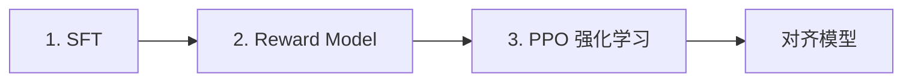

# RLHF、DPO 与 GRPO 入门

> **文件编码**：UTF-8。  
> **前置**：[15 SFT 与 LoRA](15-微调SFT与LoRA-PEFT.md)、[14 预训练原理](14-预训练与语言模型原理.md)。  
> **定位**：理解 **偏好学习、DPO 损失、GRPO 思路**，能读 TRL 文档跑小规模 DPO demo。

---

## 0. 读前导读

### 0.1 用一句话弄懂本章

**对齐** = 让模型输出更符合人类偏好；**DPO** 直接用偏好对 \((y_w, y_l)\) 优化策略，跳过独立奖励模型 + PPO 的复杂链路。

### 0.2 你需要提前知道什么

- SFT 后的 instruct 模型（15 章）
- 交叉熵、log softmax、KL 散度（概念）
- 知道 RL 中 policy、reward 术语即可

### 0.3 本章知识地图（☐→☑）

- [ ] 说出 RLHF 三阶段 pipeline
- [ ] 解释 DPO 中 \(\pi_\theta\) 与 \(\pi_{\text{ref}}\) 角色
- [ ] 构造 preference dataset 字段
- [ ] 用 TRL `DPOTrainer` 跑 toy 实验
- [ ] 对比 PPO 与 DPO 工程复杂度
- [ ] 了解 GRPO 在 group relative reward 上的动机
- [ ] 完成 §14 闭卷自测 ≥8/10

### 0.4 建议学习时长

- **4～6 天**

---

## 1. 这份文档学什么

- RLHF：SFT → Reward Model → PPO
- 偏好数据：chosen / rejected 成对回复
- DPO 目标与 \(\beta\) 温度
- Implicit reward 与 Bradley-Terry 模型
- ORPO、SimPO 等变体（了解）
- GRPO：组内相对优势、适合 reasoning 模型
- 安全与幻觉：对齐不能替代事实性
- 算力：DPO 接近 SFT；PPO 需 rollout 更贵

---

## 2. RLHF 经典三阶段



| 阶段 | 数据 | 输出 |
|------|------|------|
| SFT | 指令-优质回答 | 会跟随指令 |
| RM | 同一 prompt 多回复 + 人类排序 | 标量 reward 模型 |
| PPO | 在线采样 + RM 打分 | 优化策略 \(\pi_\theta\) |

**痛点**：PPO 不稳定、需 value head、KL 到 reference、GPU 占用高（生成 rollout）。

---

## 3. 偏好数据格式

```json
{
  "prompt": "解释量子纠缠。",
  "chosen": "量子纠缠指两粒子状态关联，测量其一 instant 影响另一...",
  "rejected": "纠缠就是鬼扯，别学物理。"
}
```

或 ShareGPT 式 messages + 两条 assistant 分支。

**质量要求**：

- chosen/rejected **仅回答差** 明显，非随机
- 覆盖安全、风格、事实、格式
- 与 SFT 分布勿严重冲突

---

## 4. DPO 核心思想

Direct Preference Optimization：将 RL 目标重参数化，**闭式损失** 在偏好对上训练。

记 \(y_w\) 为 chosen，\(y_l\) 为 rejected，参考策略 \(\pi_{\text{ref}}\)（通常 SFT 快照），当前 \(\pi_\theta\)：

\[
\mathcal{L}_{\text{DPO}} = -\mathbb{E}\left[\log \sigma\left(\beta \left(\log\frac{\pi_\theta(y_w|x)}{\pi_{\text{ref}}(y_w|x)} - \log\frac{\pi_\theta(y_l|x)}{\pi_{\text{ref}}(y_l|x)}\right)\right)\right]
\]

- \(\beta\)：控制偏离 reference 的惩罚强度（常见 0.1～0.5）
- \(\sigma\)：sigmoid
- 隐式学习 reward，无需单独 RM

**直觉**：提高 chosen 相对概率、降低 rejected，相对 reference 用 log-ratio 约束防崩溃。

---

## 5. TRL DPO 最小示例

```python
from datasets import Dataset
from transformers import AutoModelForCausalLM, AutoTokenizer
from trl import DPOConfig, DPOTrainer

model_id = "Qwen/Qwen2.5-0.5B-Instruct"
tokenizer = AutoTokenizer.from_pretrained(model_id)
model = AutoModelForCausalLM.from_pretrained(model_id, torch_dtype="bfloat16")
ref_model = AutoModelForCausalLM.from_pretrained(model_id, torch_dtype="bfloat16")

data = Dataset.from_dict({
    "prompt": ["什么是 DPO？", "写一句诗。"],
    "chosen": ["DPO 直接用偏好对优化语言模型。", "月落乌啼霜满天。"],
    "rejected": ["不知道。", "啊啊啊啊啊。"],
})

training_args = DPOConfig(
    output_dir="./dpo-out",
    per_device_train_batch_size=1,
    learning_rate=5e-7,
    beta=0.1,
    max_length=512,
    bf16=True,
)

trainer = DPOTrainer(
    model=model,
    ref_model=ref_model,
    args=training_args,
    train_dataset=data,
    tokenizer=tokenizer,
)
trainer.train()
```

小模型可 `ref_model` 与 model 共享权重并用 `precompute_ref_log_probs` 等优化；7B 常 **单独加载 ref** 或冻结副本。

---

## 6. PPO vs DPO（工程）

| | PPO | DPO |
|---|-----|-----|
| 奖励模型 | 需要 | 不需要 |
| 在线采样 | 需要 | 不需要（离线偏好） |
| 稳定性 | 调参难 | 相对稳 |
| 显存 | 高 | 中（双模型 log prob） |
| 适用 | 复杂 RL、工具反馈 | 对话偏好、风格 |

---

## 7. GRPO 入门

**Group Relative Policy Optimization**（DeepSeek 等 reasoning 训练采用之一）：

- 对同一 prompt 采样 **一组** 输出 \(\{y_1,\ldots,y_G\}\)
- 用 **组内相对 reward**（或 rule-based 正确性）算 advantage，减方差
- 常与 **可验证奖励**（数学答案、代码测试）结合

```text
prompt → 采样 G 条 completion
       → 打分（RM 或 rule）
       → 组内 normalize advantage
       → policy gradient 更新
```

与 DPO 互补：DPO 离线偏好；GRPO 适合 **可自动判对错** 的任务（数学、代码）。

---

## 8. 其它对齐方法（了解）

| 方法 | 特点 |
|------|------|
| ORPO | SFT + 偏好合一阶段 |
| SimPO | 简化 DPO，无 ref 显式 ratio |
| KTO | 只需 good/bad 单标签 |
| RLHF + RLAIF | AI 标注替代人类 |

选型看数据形态与 infra；产品对话常用 **SFT + DPO**。

---

## 9. 实践建议

1. **先强 SFT**：弱 SFT 上 DPO 收益有限
2. **小 beta 试起**：过大易模式崩溃或复读
3. **监控 KL**：`log π_θ - log π_ref` 均值漂移
4. **保留 ref 快照**：便于回滚与 DPO 公式
5. **安全数据**：拒绝样本 teach 拒答，防 jailbreak

---

## 10. 与 Infra / 评估交叉

- PPO rollout 吞吐依赖 **推理引擎**（[LLMInfra 16](../LLMInfra/16-推理Batch调度与ContinuousBatching.md)）
- 对齐后评估用 **benchmark + 人工**（19 章）
- 部署 merged 权重走 vLLM（20 章）

---

## 11. 练习建议

1. 构造 20 对 chosen/rejected，DPO 微调 0.5B，对比 SFT -only 输出
2. 扫 `beta=[0.05, 0.1, 0.5]` 观察 loss 与生成
3. 读 DPO 论文 Algorithm 1，对应 TRL 源码 loss 项
4. 解释为何需要 reference model
5. 列出 PPO 相比 DPO 多出的 3 个工程组件
6. 了解 DeepSeek-R1 报告中 GRPO + rule reward 一句话

---

## 12. 学完标准

- [ ] 画出 RLHF 三阶段框图
- [ ] 口述 DPO loss 两项 log-ratio 含义
- [ ] 配置 TRL DPOTrainer 最小可跑脚本
- [ ] 说明 beta 过大症状
- [ ] 区分 DPO 与 GRPO 数据需求

---

## 13. FAQ

**Q1：DPO 还要 SFT 吗？**  
几乎总是；DPO 在 SFT 模型上微调，ref 也常用 SFT 权重。

**Q2：ref_model 能否等于 model？**  
训练时 \(\pi_\theta\) 在变，ref 必须 **冻结** 的早期副本。

**Q3：偏好数据多少够？**  
数千～数万对可见效果；质量关键。

**Q4：DPO 能修事实错误吗？**  
有限；事实靠 RAG 或 CPT，对齐主要调 **风格与偏好**。

**Q5：loss 下降就更好吗？**  
需人工 eval 与 benchmark；过拟合偏好集可能损通用能力。

**Q6：PPO 完全过时了吗？**  
否；工具调用、在线反馈、游戏环境仍常用 RL。

**Q7：GRPO 和 DPO 能一起用吗？**  
 pipeline 可分段；同一阶段一般选一种主目标。

**Q8：能否 LoRA + DPO？**  
可以；ref 用同 base + 初始 LoRA 或 full ref。

**Q9：chosen 更长总是更好吗？**  
不一定；长度偏差会被模型学到，需平衡。

**Q10：对齐后 perplexity 升正常吗？**  
可能；人类偏好不等于 LM PPL 最优。

---

## 14. 闭卷自测

1. RLHF 三阶段名称？
2. DPO 中 \(\beta\) 作用？
3. chosen 和 rejected 在 loss 中如何对待？
4. 为何 DPO 不需要 reward model？
5. reference model 是否更新？
6. PPO 相比 DPO 多需要什么在线步骤？
7. GRPO 中 group 指什么？
8. 偏好数据每条至少几个回答？
9. DPO 通常接在哪个阶段之后？
10. sigmoid 在 DPO loss 里包装的是什么？

<details>
<summary>参考答案</summary>

1. SFT → Reward Model 训练 → PPO（策略优化）。
2. 控制对 reference 偏离的惩罚强度。
3. 提高 chosen 的相对 log-prob，降低 rejected。
4. 偏好通过 log-ratio 隐式进入目标，无需单独 RM。
5. 不更新，保持 SFT 快照。
6. 用当前策略采样 rollout 并用 RM 打分。
7. 同一 prompt 下多条采样 completion 为一组。
8. 两个（winner + loser）。
9. SFT 之后。
10. scaled log-ratio 差 \(\beta(\log r_w - \log r_l)\)。

</details>

---

## 15. 下一章预告

对齐与 SFT 都需要 **多卡训练** 时，17 章讲 DDP、FSDP 与 DeepSpeed ZeRO。

---

*下一章：[17 分布式训练 DDP、FSDP 与 DeepSpeed](17-分布式训练DDP-FSDP与DeepSpeed.md)*  
*推理 rollout：[LLMInfra 16 Batch 调度](../LLMInfra/16-推理Batch调度与ContinuousBatching.md)*
