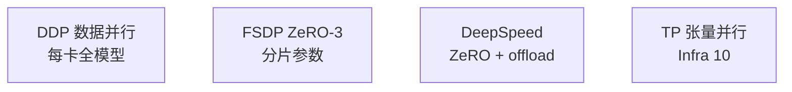

# 分布式训练：DDP、FSDP 与 DeepSpeed

> **文件编码**：UTF-8。  
> **前置**：[08 GPU 与 AMP](08-GPU训练与混合精度AMP.md)、[15 LoRA 微调](15-微调SFT与LoRA-PEFT.md)。  
> **定位**：用 **torchrun、DDP、FSDP、DeepSpeed ZeRO** 在多 GPU 上扩展训练；通信原理对照 [LLMInfra 10](../LLMInfra/10-分布式训练并行策略与NCCL入门.md)。

---

## 0. 读前导读

### 0.1 用一句话弄懂本章

**分布式训练** = 多进程各占一 GPU，同步梯度或分片参数，使 **更大 batch / 更大模型** 可训练。

### 0.2 你需要提前知道什么

- 单机多卡、`CUDA_VISIBLE_DEVICES`
- `loss.backward()` 与 `optimizer.step()`（05 章）
- NCCL 概念（Infra 10 章）

### 0.3 本章知识地图（☐→☑）

- [ ] 用 `torchrun` 启动 2 卡 DDP 脚本
- [ ] 解释 All-Reduce 在 DDP 中的时机
- [ ] 配置 FSDP `FULL_SHARD`
- [ ] 写 DeepSpeed ZeRO-2 json 并用 Trainer 集成
- [ ] 区分 DP、TP、PP（概念）
- [ ] 完成 §14 闭卷自测 ≥8/10

### 0.4 建议学习时长

- **5～7 天**（需 2+ GPU 或云实例）

---

## 1. 这份文档学什么

- `DataParallel` 为何不推荐
- DDP：每 GPU 一进程、梯度 All-Reduce
- 全局 batch = per_gpu_batch × world_size × grad_accum
- FSDP：参数/梯度/优化器分片
- DeepSpeed ZeRO-1/2/3 与 offload
- `torchrun` / `accelerate launch`
- 与 Megatron TP/PP 的分工（Infra 10）
- 故障：NCCL timeout、hang、端口

---

## 2. 并行策略一览



| 策略 | 切什么 | 典型用途 |
|------|--------|----------|
| DDP | batch | 7B 全参 SFT 多卡 |
| FSDP | 参数分片 | 大模型单程序多卡 |
| ZeRO-3 | 参数+梯度+优化器 | 70B+ 预训练 |
| TP/PP | 层/矩阵 | 超大模型与 Infra 推理 |

---

## 3. DDP 最小脚本

```python
# train_ddp.py
import os
import torch
import torch.distributed as dist
from torch.nn.parallel import DistributedDataParallel as DDP
from torch.utils.data.distributed import DistributedSampler

def setup():
    dist.init_process_group("nccl")
    local_rank = int(os.environ["LOCAL_RANK"])
    torch.cuda.set_device(local_rank)
    return local_rank

def main():
    local_rank = setup()
    device = torch.device("cuda", local_rank)
    model = ...  # your model
    model.to(device)
    model = DDP(model, device_ids=[local_rank])

    dataset = ...
    sampler = DistributedSampler(dataset, shuffle=True)
    loader = torch.utils.data.DataLoader(dataset, sampler=sampler, batch_size=4)

    for epoch in range(num_epochs):
        sampler.set_epoch(epoch)
        for batch in loader:
            loss = ...
            loss.backward()
            optimizer.step()
            optimizer.zero_grad(set_to_none=True)

    dist.destroy_process_group()

if __name__ == "__main__":
    main()
```

**启动**：

```bash
torchrun --nproc_per_node=2 train_ddp.py
```

每个进程只处理 **1/world_size** 数据；backward 后 DDP **自动 All-Reduce 梯度**。

---

## 4. DDP 要点

| 概念 | 说明 |
|------|------|
| world_size | GPU 总数 |
| rank | 全局进程 id |
| local_rank | 本机 GPU id |
| DistributedSampler | 保证 epoch 内样本不重复 |
| `set_epoch` | 每 epoch 洗牌种子不同 |

**不要**用 `DataParallel`（单进程多线程，GIL 与负载不均）。

**有效 batch**：

\[
B_{\text{eff}} = B_{\text{gpu}} \times N_{\text{gpu}} \times \text{accum\_steps}
\]

---

## 5. FSDP

Fully Sharded Data Parallel（PyTorch 原生 ZeRO-3 类）：

```python
from torch.distributed.fsdp import FullyShardedDataParallel as FSDP
from torch.distributed.fsdp.wrap import transformer_auto_wrap_policy
import functools

auto_wrap_policy = functools.partial(
    transformer_auto_wrap_policy,
    transformer_layer_cls={TransformerBlock},  # 你的层类
)
model = FSDP(model, auto_wrap_policy=auto_wrap_policy, device_id=local_rank)
```

- **FULL_SHARD**：参数、梯度、优化器状态分片
- forward 时 **all-gather** 临时拼层参数
- 适合 **单卡放不下 optimizer** 的全参微调

---

## 6. DeepSpeed

**ds_config.json**（ZeRO-2 示例）：

```json
{
  "train_batch_size": "auto",
  "train_micro_batch_size_per_gpu": "auto",
  "gradient_accumulation_steps": "auto",
  "bf16": {"enabled": true},
  "zero_optimization": {
    "stage": 2,
    "overlap_comm": true,
    "contiguous_gradients": true
  }
}
```

**Trainer 集成**：

```python
TrainingArguments(
    deepspeed="ds_config.json",
    ...
)
```

| ZeRO stage | 分片内容 |
|------------|----------|
| 1 | 优化器状态 |
| 2 | + 梯度 |
| 3 | + 模型参数 |

**CPU/NVMe offload**：ZeRO-3 + offload 可训更大模型，速度换显存。

---

## 7. accelerate 统一启动

```bash
accelerate config   # 交互配置
accelerate launch --num_processes 4 train.py
```

脚本内：

```python
from accelerate import Accelerator
accelerator = Accelerator()
model, optimizer, loader = accelerator.prepare(model, optimizer, loader)
for batch in loader:
    loss = ...
    accelerator.backward(loss)
    optimizer.step()
```

与 Trainer 二选一；研究代码常用 accelerate。

---

## 8. 通信与 NCCL

- 后端 **nccl**（GPU）；CPU 分布式用 gloo
- All-Reduce：各 rank 梯度求平均
- 多机需设 `MASTER_ADDR`、`MASTER_PORT`

常见问题：

| 现象 | 排查 |
|------|------|
| NCCL timeout | 防火墙、网卡 `NCCL_SOCKET_IFNAME` |
| hang 在 barrier | 某 rank 异常退出 |
| OOM 仍出现 | ZeRO 未生效、activation 仍全量 |

详见 [LLMInfra 10 NCCL](../LLMInfra/10-分布式训练并行策略与NCCL入门.md)。

---

## 9. 与 HuggingFace Trainer

```python
TrainingArguments(
    per_device_train_batch_size=2,
    gradient_accumulation_steps=8,
    ddp_find_unused_parameters=False,
    fsdp="full_shard auto_wrap",
    # 或 deepspeed="ds_config.json"
)
```

多卡：

```bash
torchrun --nproc_per_node=4 -m transformers.examples.pytorch.language-modeling.run_clm ...
```

LoRA + DDP：一般 `find_unused_parameters=False` 可行（仅 LoRA 可训练）。

---

## 10. 练习建议

1. 双卡 DDP 训练 11 章 MiniGPT，对比单卡 wall time
2. 测 global batch 翻倍时 lr 是否线性缩放（linear scaling rule）
3. 用 FSDP 微调 1B 模型（或 mock 小模型验证 API）
4. 配置 DeepSpeed ZeRO-2，观察显存下降
5. `nvidia-smi dmon` 看多卡利用率
6. 阅读 Infra 10 章 TP 与 DDP 组合 diagram

---

## 11. 学完标准

- [ ] 写出 torchrun 启动命令
- [ ] 解释 DDP 梯度同步时机
- [ ] 对比 ZeRO-2 与 ZeRO-3 显存差异
- [ ] 配置 DistributedSampler 与 set_epoch
- [ ] 知道 TP 与 DDP 解决的不同瓶颈

---

## 12. FAQ

**Q1：单卡能否学本章？**  
可读代码；实践需 2 卡或 Colab 多 GPU。

**Q2：DDP 与 FSDP 选谁？**  
7B LoRA 常单卡或 DDP；全参 13B+ 考虑 FSDP/ZeRO-3。

**Q3：gradient_accum 与 DDP 关系？**  
 accum 在每 GPU 上累积再 step；有效 batch 再 × world_size。

**Q4：为何 loss 要除以 accum？**  
 保证梯度幅度与无 accum 时一致。

**Q5：DeepSpeed 与 FSDP 冲突吗？**  
Trainer 里二选一；不要叠用两套 sharding。

**Q6：多机怎么设？**  
`torchrun --nnodes=2 --node_rank=0 --master_addr=...` 等。

**Q7：BF16 分布式要 GradScaler 吗？**  
一般不需要；FP16 需要。

**Q8：checkpoint 谁保存？**  
通常 rank 0 写盘；FSDP 需 `FULL_STATE_DICT` 聚合。

**Q9：推理能用 DDP 吗？**  
多卡推理用 TP/PP 或独立实例 + 负载均衡（20 章），不是训练 DDP。

**Q10：与 Infra 10 如何配合？**  
Infra 讲 NCCL 原语与 TP/PP；本章讲 PyTorch 怎么用。

---

## 13. 闭卷自测

1. DDP 每 GPU 几个进程？
2. All-Reduce 发生在 backward 的哪个阶段之后？
3. DistributedSampler 的作用？
4. ZeRO-2 分片哪些状态？
5. FSDP forward 时如何获得完整层参数？
6. torchrun 与 python -m torch.distributed.launch 关系？
7. 有效 global batch 公式三项？
8. DataParallel 为何慢？
9. NCCL 用于 CPU 还是 GPU？
10. Trainer 里 `fsdp="full_shard"` 近似 ZeRO 几？

<details>
<summary>参考答案</summary>

1. 一个进程（推荐模式）。
2. backward 完成本地梯度后，step 前同步。
3. 划分样本子集，避免多卡重复数据。
4. 优化器状态 + 梯度（参数仍每卡完整，stage2）。
5. all-gather 临时聚合分片参数。
6. torchrun 是推荐启动器，替代旧 launch。
7. per_gpu_batch × num_gpus × grad_accum_steps。
8. 单进程多线程、GIL、主卡聚合瓶颈。
9. GPU 集合通信（GPU tensor）。
10. 类似 ZeRO-3（全分片）。

</details>

---

## 14. 下一章预告

多卡训练需要 **干净的大规模数据**——18 章讲 jsonl、去重与质量过滤。

---

*下一章：[18 大模型数据工程与预处理](18-大模型数据工程与预处理.md)*  
*NCCL 原理：[LLMInfra 10 分布式训练](../LLMInfra/10-分布式训练并行策略与NCCL入门.md)*
