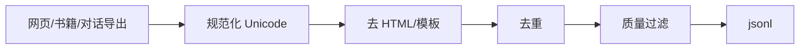

# 大模型数据工程与预处理

> **文件编码**：UTF-8。  
> **前置**：[13 Tokenizer](13-Tokenizer与BPE-SentencePiece.md)、[14 预训练原理](14-预训练与语言模型原理.md)。  
> **定位**：从原始文本到 **jsonl 训练集**：清洗、去重、质量过滤、混合与合规。

---

## 0. 读前导读

### 0.1 用一句话弄懂本章

**数据工程** = 决定模型上限的「隐形架构」——Garbage in, garbage out；SFT 1000 条高质量常胜过 10 万条噪声。

### 0.2 你需要提前知道什么

- JSON / JSONL 读写
- `datasets` 库基本用法（12 章）
- 了解 hash、正则表达式

### 0.3 本章知识地图（☐→☑）

- [ ] 设计 Alpaca / messages 统一 schema
- [ ] 实现 MinHash 或 exact dedup 流水线
- [ ] 用启发式规则过滤低质网页文本
- [ ] 统计 token 分布与长度分位
- [ ] 划分 train/val 并写 reproducible 脚本
- [ ] 完成 §14 闭卷自测 ≥8/10

### 0.4 建议学习时长

- **4～6 天**

---

## 1. 这份文档学什么

- 预训练 vs SFT 数据形态
- jsonl / parquet 存储与流式读取
- 清洗：HTML、乱码、PII（概念）
- 精确去重 vs 模糊去重（MinHash + LSH）
- 质量打分：perplexity filter、语言 id、长度
- 数据混合比例与 curriculum
- 版权与隐私合规底线
- 与 17 章分布式 **数据分片** 衔接

---

## 2. 数据格式规范

**SFT messages（推荐）**：

```jsonl
{"messages": [{"role": "user", "content": "..."}, {"role": "assistant", "content": "..."}]}
{"messages": [...]}
```

**Alpaca 三字段**：

```jsonl
{"instruction": "...", "input": "", "output": "..."}
```

**预训练纯文本**：

```jsonl
{"text": "整段文档..."}
```

| 原则 | 说明 |
|------|------|
| 一行一条 | 便于流式与断点续跑 |
| UTF-8 | 统一编码 |
| schema 固定 | 下游 map 函数简单 |
| 版本号 | `dataset_version` 字段或 git tag |

---

## 3. 采集与清洗 pipeline



**清洗示例**：

```python
import re
import html

def clean_web_text(raw: str) -> str:
    text = html.unescape(raw)
    text = re.sub(r"<[^>]+>", " ", text)
    text = re.sub(r"\s+", " ", text).strip()
    return text
```

**语言检测**：`langdetect` / `fasttext` 保留 zh/en 等目标语。

**PII**：邮箱、手机号正则 redact（生产必做）。

---

## 4. 去重

### 4.1 精确去重

```python
import hashlib

def doc_hash(text: str) -> str:
    return hashlib.sha256(text.encode("utf-8")).hexdigest()

seen = set()
for line in open("corpus.jsonl", encoding="utf-8"):
    obj = json.loads(line)
    h = doc_hash(obj["text"])
    if h in seen:
        continue
    seen.add(h)
    # write
```

### 4.2 模糊去重（MinHash 概念）

- 文档 → shingles（n-gram 集合）
- MinHash 签名 → LSH 桶
- 桶内 Jaccard 相似度高的删重复

大规模用 **datasketch** 或 Spark；预训练 Common Crawl 管线核心步骤之一。

**SFT**：同一 instruction 不同 answer 保留；**完全重复** pairs 删除。

---

## 5. 质量过滤

| 方法 | 做法 |
|------|------|
| 长度 | 过短（<10 token）或过长丢弃 |
| 符号比 | `#`、乱码占比过高 |
| 重复子串 | 同一短语循环出现 |
| LM 打分 | 用小 LM 算 PPL，去掉极高/极低 |
| 规则 | 含违禁、广告模板 |

```python
def repetition_score(text: str, n=3) -> float:
    words = text.split()
    if len(words) < n:
        return 0.0
    ngrams = [tuple(words[i:i+n]) for i in range(len(words)-n+1)]
    unique = len(set(ngrams))
    return 1.0 - unique / len(ngrams)  # 越高越重复
```

---

## 6. Token 统计与划分

```python
from transformers import AutoTokenizer
from datasets import load_dataset

tokenizer = AutoTokenizer.from_pretrained("Qwen/Qwen2.5-0.5B-Instruct")

def token_len(example):
    n = len(tokenizer.apply_chat_template(example["messages"], tokenize=True))
    return {"n_tokens": n}

ds = load_dataset("json", data_files="train.jsonl", split="train")
ds = ds.map(token_len)
print(ds.select(range(min(1000, len(ds)))))  # 采样看分位
```

- **train/val**：95/5 或 98/2；**同一用户对话勿泄漏** 到 val
- 控制 **长度分位**：截断策略与 15 章 `max_seq_length` 一致

---

## 7. 混合与配比

预训练常混合：网页、书籍、代码、维基（比例影响能力形状）。

SFT 混合：通用指令 + 领域 + 安全拒答样本（**5～15%** 拒答防 jailbreak）。

**Curriculum**：先短后长、先易后难（可选）。

---

## 8. 工程化脚本结构

```text
data/
├── raw/
├── processed/
│   ├── v1_train.jsonl
│   └── v1_val.jsonl
├── scripts/
│   ├── 01_normalize.py
│   ├── 02_dedup.py
│   └── 03_filter.py
└── stats/
    └── v1_report.json
```

**可复现**：固定 random seed、记录 `tokenizer_name`、输入输出 md5。

---

## 9. 与训练衔接

```python
ds = load_dataset("json", data_files={"train": "v1_train.jsonl", "validation": "v1_val.jsonl"})
# → 15 章 SFTTrainer / 17 章 DistributedSampler
```

大数据用 **streaming**：

```python
ds = load_dataset("json", data_files=" huge.jsonl", split="train", streaming=True)
```

---

## 10. 合规与伦理（必知）

- 版权：商用模型避免未授权书籍全文
- 隐私：脱敏个人数据
- 有害内容：预训练过滤 + SFT 安全样本
- 偏见：评估集覆盖群体（19 章）

---

## 11. 练习建议

1. 爬取/下载 1000 条公开指令数据，统一成 messages jsonl
2. 实现 exact dedup，报告删除率
3. 画 token 长度直方图，选 `max_seq_length`
4. 写 filter 去掉 repetition_score > 0.3 的样本
5. 人工抽检 50 条，建立 **gold 质检表**
6. 对比清洗前后微调 loss（15 章）

---

## 12. 学完标准

- [ ] 设计固定 jsonl schema 并写校验脚本
- [ ] 实现 exact dedup 与长度过滤
- [ ] 解释 MinHash 去重适用场景
- [ ] 统计 train/val token 分布
- [ ] 列出 3 条数据合规注意事项

---

## 13. FAQ

**Q1：SFT 多少条起步？**  
几百条可 POC；生产常 1万～100万，重质。

**Q2：要不要人工标注？**  
领域 SFT 建议专家审；通用可用模型蒸馏 + 人工抽审。

**Q3：json 与 parquet？**  
jsonl 人类友好；parquet 列存适合 TB 级与 Spark。

**Q4：去重会误删吗？**  
模糊去重可能删相似合法文档；调 LSH 阈值。

**Q5：中文需要特殊清洗吗？**  
全角半角统一、繁简策略一致、去 CJK 乱码。

**Q6：code 数据怎么混？**  
单独比例（如 10～20%）；格式用 markdown fence 统一。

**Q7：如何防 benchmark 泄漏？**  
划分前去重与 benchmark 题目 exact match。

**Q8：streaming 训练注意什么？**  
epoch 边界、shuffle buffer、无全局 dedup 需预处理完成。

**Q9：数据版本如何管理？**  
DVC、HuggingFace Dataset repo、或 S3 + manifest hash。

**Q10：和 RAG 知识库区别？**  
本章为 **训练** 数据；RAG 为推理检索库（AIAgent 06）。

---

## 14. 闭卷自测

1. jsonl 相对 json 数组的优势？
2. exact dedup 常用什么 hash？
3. MinHash 用于什么问题？
4. SFT 为何要对 val 做 leakage 控制？
5. repetition_score 高说明什么？
6. apply_chat_template 在统计 token 时为何要用？
7. 预训练与 SFT 存储字段典型差异？
8. 流式 dataset 适合什么规模？
9. PII 处理至少要做哪一步？
10. 数据混合比例影响什么？

<details>
<summary>参考答案</summary>

1. 一行一条，流式读写、断点续传、内存友好。
2. SHA256（或 MD5，SHA256 更稳妥）。
3. 近似重复文档检测（高 Jaccard 相似）。
4. 防同一对话/题目进入 train 又进 eval 导致虚高指标。
5. 文本内部 n-gram 大量重复，低质量或模板 spam。
6. 与训练时 tokenization 一致，长度估计准确。
7. 预训练 `{text}`；SFT `{messages}` 或 instruction/output。
8. TB 级无法全内存加载的数据集。
9. 检测并 redact/删除个人敏感信息。
10. 模型能力形状（代码、推理、安全、语言等）。

</details>

---

## 15. 下一章预告

干净数据训出模型后，用 **benchmark 与 eval harness** 量化能力——19 章。

---

*下一章：[19 模型评估与 Benchmark](19-模型评估与Benchmark.md)*  
*分布式消费数据：[17 分布式训练](17-分布式训练DDP-FSDP与DeepSpeed.md)*
