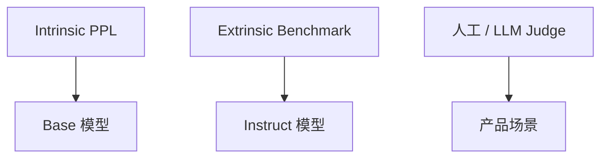

# 模型评估与 Benchmark

> **文件编码**：UTF-8。  
> **前置**：[14 预训练原理](14-预训练与语言模型原理.md)、[15 SFT 与 LoRA](15-微调SFT与LoRA-PEFT.md)、[18 数据工程](18-大模型数据工程与预处理.md)。  
> **定位**：用 **perplexity、lm-eval-harness、MMLU** 等系统化评估；区分 intrinsic 与 extrinsic 指标。

---

## 0. 读前导读

### 0.1 用一句话弄懂本章

**评估** = 在固定协议下测模型能力，避免「感觉变好」；benchmark 是可比标尺，但不是业务最终标准。

### 0.2 你需要提前知道什么

- PPL 定义（14 章）
- `generate` 与 chat_template（12～13 章）
- 基本概率与准确率概念

### 0.3 本章知识地图（☐→☑）

- [ ] 在 WikiText 上算 PPL
- [ ] 安装并运行 `lm_eval` 一项任务
- [ ] 解释 MMLU 5-shot 协议
- [ ] 设计领域 eval 集与人工 rubric
- [ ] 对比 greedy vs sampling 对 eval 的影响
- [ ] 完成 §14 闭卷自测 ≥8/10

### 0.4 建议学习时长

- **4～5 天**

---

## 1. 这份文档学什么

- Intrinsic：PPL、bits per byte
- Extrinsic：MMLU、GSM8K、HumanEval、BBH
- lm-evaluation-harness 用法
- OpenCompass（了解）与 HF `evaluate`
- 生成式 eval：exact match、LLM-as-judge
- 统计显著性与置信区间（概念）
- 数据污染（contamination）检测
- 与 [AIAgent 15 可观测性](../AIAgent/15-LLM可观测性与评估体系.md) 产品侧互补

---

## 2. 评估维度总览



| 类型 | 例子 | 适用 |
|------|------|------|
| PPL | WikiText | 预训练 / CPT |
| 多选 | MMLU、C-Eval | 知识 |
| 数学 | GSM8K | 推理 |
| 代码 | HumanEval | 编程 |
| 对话 | MT-Bench | 助手质量 |

---

## 3. Perplexity 评估

```python
import math
import torch
from datasets import load_dataset
from transformers import AutoModelForCausalLM, AutoTokenizer

model_id = "distilgpt2"
tokenizer = AutoTokenizer.from_pretrained(model_id)
model = AutoModelForCausalLM.from_pretrained(model_id).eval().cuda()

ds = load_dataset("wikitext", "wikitext-2-raw-v1", split="test")

total_nll = 0.0
total_tokens = 0
max_length = 1024

for text in ds["text"]:
    if not text.strip():
        continue
    enc = tokenizer(text, return_tensors="pt", truncation=True, max_length=max_length)
    input_ids = enc["input_ids"].cuda()
    with torch.no_grad():
        out = model(input_ids, labels=input_ids)
    n_tokens = input_ids.numel()
    total_nll += out.loss.item() * n_tokens
    total_tokens += n_tokens

ppl = math.exp(total_nll / total_tokens)
print(f"PPL: {ppl:.2f}")
```

**注意**：与 14 章一致，比较时固定 tokenizer、split、max_length。

---

## 4. lm-evaluation-harness

**安装**：

```bash
pip install lm-eval
```

**运行 MMLU 子集**（示例）：

```bash
lm_eval --model hf \
  --model_args pretrained=Qwen/Qwen2.5-0.5B-Instruct,dtype=bfloat16 \
  --tasks mmlu_abstract_algebra \
  --device cuda:0 \
  --batch_size 4
```

**输出**：`acc`、`acc_norm`、stderr；多 task 用 `--tasks mmlu` 或 task group。

**核心概念**：

| 参数 | 含义 |
|------|------|
| `--num_fewshot` | 5-shot 等 in-context 示例 |
| `--limit` | 快速调试子集 |
| `loglikelihood` | 选 ABCD 用条件 logprob |

---

## 5. MMLU 简介

**Massive Multitask Language Understanding**：57 科目多项选择题，测 **世界知识 + 推理**。

**5-shot 协议**：

1. 每题前拼 5 个同科目 solved 示例
2. 模型对 A/B/C/D 选项算 **条件 log likelihood**
3. 选最高 logprob 的字母为预测

```text
Question: ...
A. ...
B. ...
Answer: B

Question: [target]
A. ...
...
Answer:
```

Instruct 模型需 **prompt 模板一致**；chat 模型有时用 special 格式，task 配置已内置。

**中文**：C-Eval、CMMLU 类似协议。

---

## 6. 生成式任务评估

**GSM8K**（数学）：提取 `\boxed{}` 或最后一行数字，exact match。

**HumanEval**（代码）：执行 unit test，`pass@k` 多次采样。

```python
# 概念：pass@1 = 单次生成通过测试的比例
```

**陷阱**：

- temperature=0 与 sampling 结果不可比
- 要固定 `seed`、`max_new_tokens`
- 代码 eval 需 **沙箱** 隔离

---

## 7. LLM-as-Judge

用强模型（GPT-4 等）按 rubric 打分：

```json
{"criteria": "准确性", "score": 1-5, "reason": "..."}
```

| 优点 | 缺点 |
|------|------|
| 可 scale |  judge 偏见 |
| 覆盖开放问答 | 成本高 |

**最佳实践**：人工 gold 集校准 judge；与 **pairwise** 比较并用 Elo。

---

## 8. 污染与泄漏

- benchmark 题目出现在 **预训练语料** → 分数虚高
- 缓解：n-gram 去污染、held-out 改写题、动态 benchmark
- 18 章 train/val 划分避免与 eval 重叠

---

## 9. 领域评估清单

除公开 benchmark 外，业务必建 **私有 eval**：

| 项 | 内容 |
|----|------|
| 覆盖率 | 核心场景 query 类型 |
| 黄金答案 | 专家写 reference |
| 指标 | EM、F1、ROUGE、成功率 |
| 回归 | 每次微调对比 base |

```python
# 简单 EM
pred = normalize(model_answer)
gold = normalize(reference)
em = int(pred == gold)
```

---

## 10. 报告与对比

写 eval report 应含：

- 模型名、checkpoint step、tokenizer、chat_template 版本
- 任务列表与 `--num_fewshot`
- 硬件与 batch_size
- 与 baseline 差值及 **是否多次运行**

避免 **cherry-pick** 只报涨分 task。

---

## 11. 与 Infra 的关系

- 高吞吐 eval 可用 vLLM batch（20 章）——[Infra 16](../LLMInfra/16-推理Batch调度与ContinuousBatching.md)
- 长 context benchmark 测 KV 与引擎——[Infra 08](../LLMInfra/08-KVCache与PagedAttention原理.md)
- 量化模型需单独 eval——[Infra 09](../LLMInfra/09-模型量化INT8-INT4-FP8与校准.md)

---

## 12. 练习建议

1. 算 DistilGPT2 与微调后在 WikiText 的 PPL 差
2. `lm_eval --tasks hellaswag,piqa --limit 100` 快速跑通
3. 自建 30 题领域 QA，算 EM
4. 同一模型改 `temperature`，看 GSM8K 子集波动
5. 读 MMLU 一条样本的 5-shot 拼接长什么样
6. 对比 SFT 前后 MMLU 子集 acc（可能略降，属 catastrophic forgetting 现象）

---

## 13. 学完标准

- [ ] 独立算 WikiText PPL
- [ ] 用 lm_eval 跑至少 2 个 task
- [ ] 解释 MMLU 5-shot 与 acc 计算
- [ ] 设计私有 eval jsonl schema
- [ ] 说明 contamination 如何影响结论

---

## 14. FAQ

**Q1：PPL 低一定好吗？**  
不一定；可能对 val 过拟合或 tokenizer 不同不可比。

**Q2：Instruct 模型 PPL 高正常吗？**  
对齐后 LM 目标非最优，PPL 升常见；看 task benchmark。

**Q3：lm_eval 和 OpenCompass？**  
前者 CLI 轻量；OpenCompass 配置化、国产 task 多。

**Q4：few-shot 示例从哪来？**  
 harness 内置 train split 采样，协议固定保证可比。

**Q5：能否用 generate 做 MMLU？**  
标准协议用 loglikelihood；generate 答题格式不稳定。

**Q6：pass@k 怎么算？**  
k 次采样至少 1 次通过的概率估计（HumanEval 标准）。

**Q7：小模型 MMLU 很低？**  
0.5B 级正常；看相对提升与同类规模对比。

**Q8：eval 要多少 GPU？**  
7B bf16 单卡可 lm_eval；70B 需多卡或量化。

**Q9：BLEU 还用于 LLM 吗？**  
翻译仍用；开放对话更用 judge 或 task-specific。

**Q10：何时停止微调？**  
val loss 平台 + benchmark 不涨 + 人工 eval 饱和。

---

## 15. 闭卷自测

1. PPL 与 average NLL 关系？
2. MMLU 属于 intrinsic 还是 extrinsic？
3. lm_eval 默认如何选多选题答案？
4. 5-shot 指什么？
5. pass@1 含义？
6. contamination 是什么？
7. WikiText PPL 比较要固定哪三项？
8. LLM-as-judge 主要风险？
9. greedy decode 对 eval 有何影响？
10. SFT 后 MMLU 降说明什么？

<details>
<summary>参考答案</summary>

1. PPL = exp(平均 NLL)。
2. Extrinsic（下游任务 benchmark）。
3. 比较各选项条件 log likelihood，取最大。
4. 每题前加 5 个同任务示范问答。
5. 单次生成样本通过单元测试的比例。
6. 测试题泄露到训练数据导致分数虚高。
7. tokenizer、eval split、max_length/截断策略。
8. judge 模型偏见、与 human 不一致。
9. 确定性高，与 sampling 协议不可混比。
10. 可能遗忘部分预训练知识或需调整混合数据；需结合人工 eval。

</details>

---

## 16. 下一章预告

评估完成后，模型需 **高吞吐部署**——20 章 vLLM、TGI、LMDeploy 与 OpenAI 兼容 API。

---

*下一章：[20 vLLM、TGI 与 LMDeploy（Python 侧）](20-vLLM-TGI与LMDeploy-Python侧.md)*  
*引擎原理：[LLMInfra 14 架构导读](../LLMInfra/14-vLLM-TensorRT-LLM-llama.cpp架构导读.md)*
