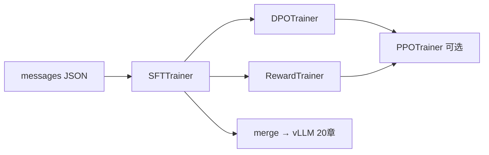
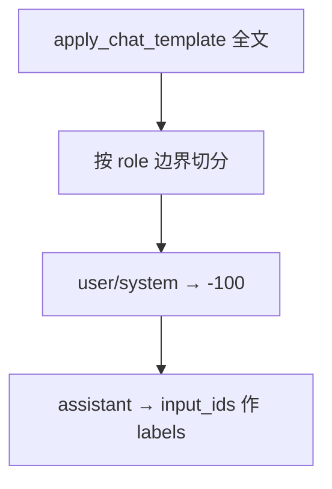

# HuggingFace TRL 与 SFTTrainer 实战

> **文件编码**：UTF-8。  
> **前置**：[15 SFT 与 LoRA](15-微调SFT与LoRA-PEFT.md)、[16 RLHF 与 DPO](16-RLHF-DPO与GRPO入门.md)、[12 HuggingFace](12-HuggingFace-Transformers入门.md)。  
> **定位**：用 **TRL 库** 跑通 SFT / DPO / Reward Model 训练，掌握 **chat template mask** 与 `SFTConfig` 工程细节。

---

## 0. 读前导读

### 0.1 用一句话弄懂本章

**TRL（Transformer Reinforcement Learning）** = HuggingFace 官方对齐训练工具箱；`SFTTrainer` 自动处理 tokenize 与 label mask，`DPOTrainer` / `RewardTrainer` 覆盖偏好学习与奖励建模。

### 0.2 你需要提前知道什么

- `peft` + LoRA 注入（15 章）
- DPO 偏好对概念（16 章）
- `apply_chat_template` 与 `labels=-100`（13 章）

### 0.3 本章知识地图（☐→☑）

- [ ] 安装 `trl` 并理解与 `transformers.Trainer` 关系
- [ ] 用 `SFTTrainer` + `formatting_func` 训练 instruct 模型
- [ ] 正确 mask user / system 段，只对 assistant 算 loss
- [ ] 配置 `DPOTrainer` 跑 preference 数据
- [ ] 用 `RewardTrainer` 训练 Bradley-Terry 奖励模型
- [ ] 理解 `packing`、NEFTune、completion-only loss
- [ ] 完成 §14 闭卷自测 ≥8/10

### 0.4 建议学习时长

- **4～6 天**（含 1 次 DPO toy 实验）

---

## 1. 这份文档学什么

- TRL 模块地图：`SFTTrainer`、`DPOTrainer`、`RewardTrainer`、`PPOTrainer`
- `SFTConfig` 与 `TrainingArguments` 合并后的关键字段
- `formatting_func` vs `dataset_text_field`
- Chat template 与 **completion-only** label mask 原理
- DPO：`beta`、`ref_model`、隐式 reward
- Reward Model：value head、成对 ranking loss
- 与 [30 章工具链](30-Unsloth-Axolotl与LLaMA-Factory工具链.md) 的分工
- 分布式：TRL 继承 Accelerate / DeepSpeed（17 章）

---

## 2. TRL 在微调流水线中的位置



| Trainer | 数据 | 典型输出 |
|---------|------|----------|
| SFTTrainer | 指令-回答 messages | Instruct 模型 / LoRA |
| DPOTrainer | prompt + chosen/rejected | 偏好对齐策略 |
| RewardTrainer | 同一 prompt 两条回复 + 标签 | 标量 RM |
| PPOTrainer | prompt + RM 在线 rollout | RLHF 第三阶段 |

安装：

```bash
pip install "trl>=0.9" transformers datasets peft accelerate
```

---

## 3. SFTTrainer 最小可跑示例

```python
import torch
from datasets import Dataset
from transformers import AutoModelForCausalLM, AutoTokenizer
from peft import LoraConfig, get_peft_model
from trl import SFTTrainer, SFTConfig

model_id = "Qwen/Qwen2.5-0.5B-Instruct"
tokenizer = AutoTokenizer.from_pretrained(model_id)
tokenizer.pad_token = tokenizer.eos_token

model = AutoModelForCausalLM.from_pretrained(
    model_id,
    torch_dtype=torch.bfloat16,
    device_map="auto",
)

lora = LoraConfig(r=16, lora_alpha=32, target_modules=["q_proj", "v_proj"])
model = get_peft_model(model, lora)

samples = [
    {"messages": [
        {"role": "user", "content": "什么是 TRL？"},
        {"role": "assistant", "content": "TRL 是 HuggingFace 的对齐训练库。"},
    ]},
]

def formatting_func(example):
    return tokenizer.apply_chat_template(
        example["messages"],
        tokenize=False,
        add_generation_prompt=False,
    )

trainer = SFTTrainer(
    model=model,
    processing_class=tokenizer,
    train_dataset=Dataset.from_list(samples),
    formatting_func=formatting_func,
    args=SFTConfig(
        output_dir="./trl-sft-out",
        per_device_train_batch_size=2,
        gradient_accumulation_steps=4,
        learning_rate=2e-4,
        max_seq_length=2048,
        num_train_epochs=1,
        bf16=True,
        logging_steps=10,
        save_steps=100,
    ),
)
trainer.train()
```

> TRL 0.8+ 推荐 `processing_class=tokenizer`；旧版参数名 `tokenizer` 仍常见。

---

## 4. Chat template 与 label mask

**核心规则**：CrossEntropy 只在 **assistant 回复 token** 上计算；user、system、特殊模板 token 对应 `labels=-100`。



SFTTrainer 内部调用 `DataCollatorForCompletionOnlyLM`（或等价逻辑）：

```python
# 概念示意：生产勿手写，交给 SFTTrainer
response_template = "<|im_start|>assistant\n"  # 模型相关，查 tokenizer.chat_template
# collator 找到 template 后第一个 token，其后才算 loss
```

**常见踩坑**：

| 问题 | 原因 | 修复 |
|------|------|------|
| loss 为 0 或 NaN | 全文被 mask | 检查 template 与 `add_generation_prompt` |
| 模型复读 user | user 段进了 loss | 开启 completion-only |
| 不同模型 template 混用 | 硬编码 Llama 模板 | 始终 `apply_chat_template` |

与 [13 Tokenizer](13-Tokenizer与BPE-SentencePiece.md) 联动：改 chat_template 后必须重跑 mask 验证。

---

## 5. SFTConfig 关键字段

| 字段 | 含义 | 建议 |
|------|------|------|
| `max_seq_length` | 截断上限 | 2048～8192，看显存 |
| `packing` | 多条样本拼一条序列 | 预训练常用；SFT 慎用，需防跨样本 attention |
| `dataset_text_field` | 已有 `text` 列时直接用 | 与 formatting_func 二选一 |
| `neftune_noise_alpha` | 嵌入层加噪正则 | 0～10，小数据可试 5 |
| `gradient_checkpointing` | 换算力省显存 | 7B+ 常开 |

```python
SFTConfig(
    max_seq_length=4096,
    packing=False,
    neftune_noise_alpha=5,
    gradient_checkpointing=True,
    optim="paged_adamw_8bit",  # QLoRA 场景
)
```

---

## 6. DPOTrainer 实战

```python
from trl import DPOTrainer, DPOConfig

pref_data = [
    {
        "prompt": "用一句话解释梯度下降。",
        "chosen": "梯度下降沿损失函数负梯度方向更新参数以减小损失。",
        "rejected": "梯度下降就是猜数字。",
    },
]

dpo_trainer = DPOTrainer(
    model=model,  # SFT 后的策略 π_θ
    ref_model=None,  # None 时 TRL 自动 clone 并冻结 reference
    processing_class=tokenizer,
    train_dataset=Dataset.from_list(pref_data),
    args=DPOConfig(
        output_dir="./dpo-out",
        beta=0.1,
        learning_rate=5e-7,
        max_length=1024,
        max_prompt_length=512,
        bf16=True,
    ),
)
dpo_trainer.train()
```

- **`beta`**：隐式 reward 温度；越大越贴近 reference，越小越激进
- **`ref_model`**：必须与 SFT checkpoint 一致；LoRA 时 base 冻结作 ref
- 显存 ≈ **2× 策略 forward**（policy + ref）；可 `precompute_ref_log_probs`

详见 [16 章 DPO 原理](16-RLHF-DPO与GRPO入门.md)。

---

## 7. RewardTrainer（奖励模型）

```python
from trl import RewardTrainer, RewardConfig
from transformers import AutoModelForSequenceClassification

rm = AutoModelForSequenceClassification.from_pretrained(model_id, num_labels=1)
RewardTrainer(
    model=rm, processing_class=tokenizer,
    train_dataset=Dataset.from_list([{"chosen": "...", "rejected": "..."}]),
    args=RewardConfig(output_dir="./rm-out", learning_rate=1e-5),
).train()
```

损失：Bradley-Terry，最大化 `sigmoid(r(chosen) - r(rejected))`。许多团队 **SFT → DPO** 跳过 RM。

---

## 8. 与 peft / DeepSpeed 集成

多卡：`deepspeed="ds_zero2.json"` 或 `fsdp="full_shard auto_wrap"`（17 章）。

---

## 9. 练习建议

1. 50 条中文 messages JSON → SFTTrainer LoRA 微调 0.5B
2. 同一数据对比手写 Trainer vs SFTTrainer 的 loss
3. 构造 20 对 preference → DPOTrainer，`beta=0.1/0.5` 对比
4. 读 TRL 源码 `trl/trainer/sft_trainer.py` 中 collator 调用
5. wandb 记录（[22 章](22-MLOps与实验跟踪wandb-mlflow.md)）

---

## 10. 学完标准

- [ ] 独立配置 SFTTrainer + LoRA + formatting_func
- [ ] 解释 completion-only mask 原理
- [ ] 跑通 DPOTrainer 并说明 ref_model 作用
- [ ] 列出 RewardTrainer 与 DPO 的数据差异
- [ ] 知道何时用 30 章 LLaMA-Factory 替代手写脚本

---

## 11. FAQ

**Q1：SFTTrainer 和 Trainer 区别？**  
内置 formatting、截断、completion mask；本质是 Trainer 子类。

**Q2：DPO 一定要 ref_model 吗？**  
需要 reference；`ref_model=None` 时 TRL 自动 clone 并冻结。

**Q3：packing 适合 SFT 吗？**  
短对话可试；长指令易截断 assistant，默认 `False`。

**Q4：多卡怎么启动？**  
`accelerate launch` 或 `torchrun`（17 章）。

**Q5：RewardTrainer 输出几维？**  
`num_labels=1` 标量 reward。

---

## 12. 闭卷自测

1. TRL 全称与主要解决的工程问题是什么？
2. `formatting_func` 应返回什么类型？
3. labels 为 -100 的 token 是否参与 loss？
4. DPO 中 `beta` 增大有何效果？
5. `ref_model` 在 DPO 中的作用？
6. completion-only collator 如何定位 assistant 起始？
7. `packing=True` 的主要风险是什么？
8. RewardTrainer 的损失函数基于什么模型？
9. SFTConfig 中 `neftune_noise_alpha` 用途？
10. 7B DPO 显存为何约为 SFT 的 2 倍？

<details>
<summary>参考答案</summary>

1. Transformer Reinforcement Learning；封装 SFT/DPO/RM/PPO 等对齐训练流程。
2. 字符串（已 apply_chat_template 的全文），或由 SFTTrainer tokenize。
3. 不参与。
4. 更保守，策略更贴近 reference，偏好信号减弱。
5. 冻结的 reference 策略 π_ref，用于 KL 约束与隐式 reward 基准。
6. 匹配 response template（如 assistant 段起始 special tokens）之后才算 loss。
7. 多样本拼一条序列可能导致跨样本 attention 或 assistant 被截断。
8. Bradley-Terry 成对排序模型。
9. 训练时在 embedding 加均匀噪声作正则，缓解过拟合。
10. 需同时 forward policy 与 reference 计算 log prob。

</details>

---

## 13. 下一章预告

手写 TRL 脚本灵活但重复劳动多——**Unsloth、Axolotl、LLaMA-Factory** 提供 YAML 一键微调与框架级优化。

---

*下一章：[30 Unsloth、Axolotl 与 LLaMA-Factory 工具链](30-Unsloth-Axolotl与LLaMA-Factory工具链.md)*  
*SFT 基础：[15 微调 SFT 与 LoRA/PEFT](15-微调SFT与LoRA-PEFT.md)*  
*分布式：[17 DDP/FSDP/DeepSpeed](17-分布式训练DDP-FSDP与DeepSpeed.md)*
