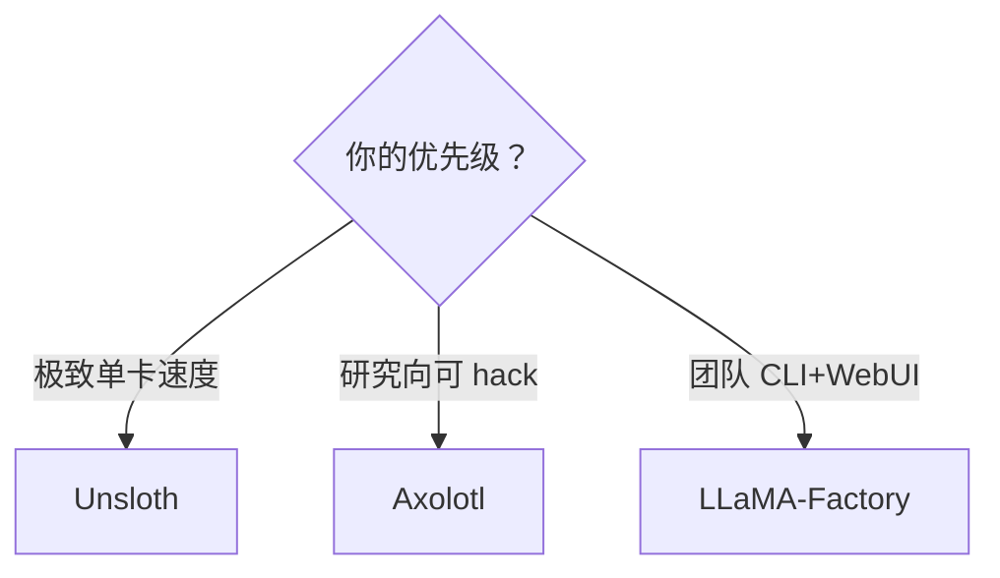
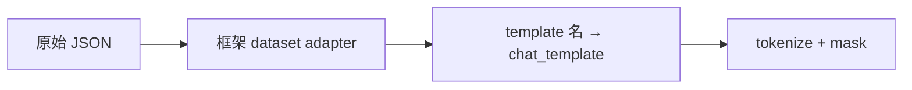

# Unsloth、Axolotl 与 LLaMA-Factory 工具链

> **文件编码**：UTF-8。  
> **前置**：[15 SFT 与 LoRA](15-微调SFT与LoRA-PEFT.md)、[29 TRL 实战](29-HuggingFace-TRL与SFTTrainer实战.md)、[18 数据工程](18-大模型数据工程与预处理.md)。  
> **定位**：对比 **三大微调框架**，用 **YAML 配置** 实现一键 SFT / DPO / QLoRA，减少重复脚本。

---

## 0. 读前导读

### 0.1 用一句话弄懂本章

**微调工具链** = 在 TRL/peft 之上封装 **配置驱动 + 内核优化 + CLI/WebUI**，让你改 YAML 而非改几百行 Python 即可开训。

### 0.2 你需要提前知道什么

- LoRA / QLoRA 原理（15 章）
- JSON / ShareGPT 数据格式（18 章）
- 单卡 `CUDA_VISIBLE_DEVICES` 与多卡 `torchrun`（17 章）

### 0.3 本章知识地图（☐→☑）

- [ ] 对比 Unsloth、Axolotl、LLaMA-Factory 定位与选型
- [ ] 写 Axolotl `config.yml` 跑 QLoRA SFT
- [ ] 用 LLaMA-Factory CLI / WebUI 加载数据集
- [ ] 用 Unsloth 加速 2～5× 训练并导出 GGUF
- [ ] 理解三框架对 chat template 的处理差异
- [ ] 完成 §14 闭卷自测 ≥8/10

### 0.4 建议学习时长

- **3～5 天**（各框架至少跑通 1 次 0.5B demo）

---

## 1. 这份文档学什么

- 三大框架：**速度 / 可定制 / 易用性** 三角
- YAML 配置项：model、dataset、lora、quant、deepspeed
- LLaMA-Factory 的 `dataset_info.json` 与模板
- Axolotl 的 `micro_batch` / `gradient_accumulation_steps`
- Unsloth 的 FastLanguageModel 与 4bit 加载
- 何时回归手写 TRL（29 章）
- 导出与部署衔接 [20 章 vLLM](20-vLLM-TGI与LMDeploy-Python侧.md)

---

## 2. 框架选型一览



| 维度 | Unsloth | Axolotl | LLaMA-Factory |
|------|---------|---------|-----------------|
| 核心优势 | Triton 内核加速、省显存 | 配置最全、社区 recipe 多 | 中文友好、WebUI、多模态 |
| 配置方式 | Python API 为主 | YAML | YAML + CLI 参数 |
| DPO/RM | 有限 | 完整 | 完整 |
| 多模态 | 部分 | 有 | **LLaVA 等内置** |
| 适合人群 | 快速实验 | 进阶调参 | 工程化交付 |

**建议**：POC 用 LLaMA-Factory；追速度用 Unsloth；Axolotl 适合读 config 学最佳实践。

---

## 3. LLaMA-Factory 一键微调

安装：

```bash
pip install llamafactory
# 或 git clone + pip install -e .
```

### 3.1 数据注册

`data/dataset_info.json`：

```json
{
  "my_alpaca_zh": {
    "file_name": "alpaca_zh.json",
    "formatting": "alpaca",
    "columns": {
      "prompt": "instruction",
      "query": "input",
      "response": "output"
    }
  }
}
```

ShareGPT 格式用 `"formatting": "sharegpt"`，`columns.messages` 指向字段名。

### 3.2 训练 YAML

`train_lora.yaml`：

```yaml
### model
model_name_or_path: Qwen/Qwen2.5-0.5B-Instruct
quantization_bit: 4
finetuning_type: lora
lora_rank: 16
lora_alpha: 32
lora_target: all

### dataset
dataset: my_alpaca_zh
template: qwen
cutoff_len: 2048
max_samples: 1000
overwrite_cache: true

### train
stage: sft
learning_rate: 2.0e-4
num_train_epochs: 2
per_device_train_batch_size: 2
gradient_accumulation_steps: 8
bf16: true
output_dir: saves/qwen-lora-sft

### eval
val_size: 0.05
eval_strategy: steps
eval_steps: 100
```

启动：

```bash
llamafactory-cli train train_lora.yaml
# WebUI: llamafactory-cli webui
```

DPO：改 `stage: dpo`，数据集含 `chosen` / `rejected` 列。

---

## 4. Axolotl YAML 深度配置

```yaml
# axolotl_config.yml
base_model: meta-llama/Llama-3.2-1B-Instruct
model_type: LlamaForCausalLM
tokenizer_type: AutoTokenizer

load_in_4bit: true
bnb_4bit_quant_type: nf4
bnb_4bit_compute_dtype: bfloat16

adapter: lora
lora_r: 32
lora_alpha: 64
lora_target_modules:
  - q_proj
  - v_proj
  - k_proj
  - o_proj

datasets:
  - path: data/sharegpt.json
    type: sharegpt
    conversation: chatml

sequence_len: 4096
sample_packing: false
micro_batch_size: 2
gradient_accumulation_steps: 8
num_epochs: 2
learning_rate: 0.0002
optimizer: adamw_bnb_8bit
lr_scheduler: cosine
warmup_steps: 100

bf16: auto
gradient_checkpointing: true
flash_attention: true

output_dir: ./axolotl-out
```

启动：

```bash
accelerate launch -m axolotl.cli.train axolotl_config.yml
```

| Axolotl 字段 | 说明 |
|--------------|------|
| `sample_packing` | 类似 TRL packing，短样本拼接 |
| `flash_attention` | 需 GPU 支持 FA2 |
| `conversation` | 指定 ShareGPT 变体格式 |
| `plugins` | 可挂 multipack、eval 插件 |

---

## 5. Unsloth 快速通道

```python
from unsloth import FastLanguageModel
from trl import SFTTrainer, SFTConfig
from datasets import Dataset

model, tokenizer = FastLanguageModel.from_pretrained(
    model_name="unsloth/Qwen2.5-0.5B-Instruct-bnb-4bit",
    max_seq_length=2048,
    load_in_4bit=True,
)

model = FastLanguageModel.get_peft_model(
    model,
    r=16,
    lora_alpha=32,
    target_modules=["q_proj", "k_proj", "v_proj", "o_proj",
                    "gate_proj", "up_proj", "down_proj"],
    lora_dropout=0,
)

# ... Dataset + SFTTrainer 同 29 章 ...

# 导出 GGUF（对接 llama.cpp / Ollama）
model.save_pretrained_gguf("out", tokenizer, quantization_method="q4_k_m")
```

**特点**：

- 自定义 backward / LoRA 层，常见 **2～5×** 提速
- 预量化模型 hub 可直接拉
- 与 TRL `SFTTrainer` **兼容**，非封闭黑盒

---

## 6. 三框架 chat template 处理



| 框架 | 指定方式 | 注意 |
|------|----------|------|
| LLaMA-Factory | `template: qwen/llama3` | 内置模板表 |
| Axolotl | `conversation: chatml` | 与 tokenizer 对齐 |
| Unsloth | 手动 `apply_chat_template` | 最灵活 |

**统一建议**：训练前用同一 tokenizer 打印一条样本，确认 assistant 边界（29 章 mask 节）。

---

## 7. 多卡与 DeepSpeed

LLaMA-Factory：

```yaml
deepspeed: examples/deepspeed/ds_z2_config.json
```

Axolotl 内置 `deepspeed:` 段；Unsloth 多卡通常配合 `accelerate launch`。

全局 batch：\(B_{\text{global}} = \text{micro\_batch} \times \text{world\_size} \times \text{grad\_accum}\)（17 章）。

---

## 8. 练习建议

1. 同一 500 条数据集，三框架各训 1 epoch，比 loss 与 **tokens/s**
2. 改 `lora_rank` 8→64，观察 checkpoint 大小
3. LLaMA-Factory `stage: dpo` 跑 50 对 preference
4. Unsloth 导出 GGUF，用 Ollama 本地 chat
5. 读 Axolotl 某官方 recipe yaml 逐项注释

---

## 9. 学完标准

- [ ] 写出三框架选型理由（给定场景）
- [ ] 独立编写 LLaMA-Factory train yaml
- [ ] 解释 Axolotl `micro_batch_size` 与 HF `per_device_train_batch_size` 对应关系
- [ ] 用 Unsloth 加载 4bit 并挂 LoRA
- [ ] 知道 32 章 VLM 在 LLaMA-Factory 的 `stage` 选项

---

## 10. FAQ

**Q1：还要学 TRL 吗？** 要；排错需 29 章功底。  
**Q2：DPO 最省事？** LLaMA-Factory 改 `stage: dpo`。  
**Q3：YAML vs Python？** 实验用 YAML；自定义 loss 用 TRL。  
**Q4：混用 checkpoint？** LoRA adapter 一般 HF 兼容，对齐 base id。  
**Q5：与 31 章 Ray？** 大规模集群用 Ray；单机三框架足够。

---

## 11. 闭卷自测

1. 三框架各自最突出的一个优势？
2. LLaMA-Factory 中 `stage: sft` 与 `stage: dpo` 数据列有何不同？
3. Axolotl 里 `load_in_4bit` 对应 15 章什么技术？
4. Unsloth 为何能加速训练？
5. `template: qwen` 在 LLaMA-Factory 中的作用？
6. `gradient_accumulation_steps` 增大等效于什么？
7. `sample_packing` 与 TRL `packing` 类似点？
8. 注册自定义数据集要改哪个文件？
9. 导出 GGUF 主要对接哪类推理栈？
10. 何时不建议用一键框架？

<details>
<summary>参考答案</summary>

1. Unsloth 速度；Axolotl 可定制与 recipe；LLaMA-Factory 易用与 WebUI。
2. SFT 要 instruction/response 或 messages；DPO 要 prompt + chosen + rejected。
3. QLoRA 4bit 量化加载基座。
4. 融合 Triton/自定义 kernel、优化 LoRA backward、减少冗余计算。
5. 选择 Qwen 系列 chat_template，正确格式化与 mask。
6. 增大有效 batch size，不线性增显存。
7. 都将多条短序列拼入同一 max_seq_length 提高利用率。
8. LLaMA-Factory 的 `data/dataset_info.json`。
9. llama.cpp、Ollama 等 CPU/GGUF 生态。
10. 自定义损失、新架构、研究需改 forward 或框架未支持的任务。

</details>

---

## 12. 下一章预告

单机多卡 DeepSpeed 之外，**Ray Train** 提供跨机调度、容错与弹性扩缩——31 章。

---

*下一章：[31 Ray Train 与弹性分布式训练](31-Ray-Train与弹性分布式训练.md)*  
*TRL 底层：[29 HuggingFace TRL 与 SFTTrainer 实战](29-HuggingFace-TRL与SFTTrainer实战.md)*  
*数据准备：[18 大模型数据工程与预处理](18-大模型数据工程与预处理.md)*
