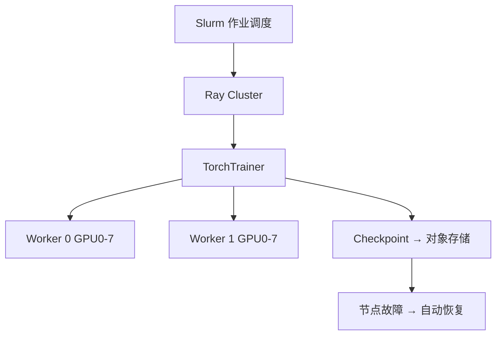
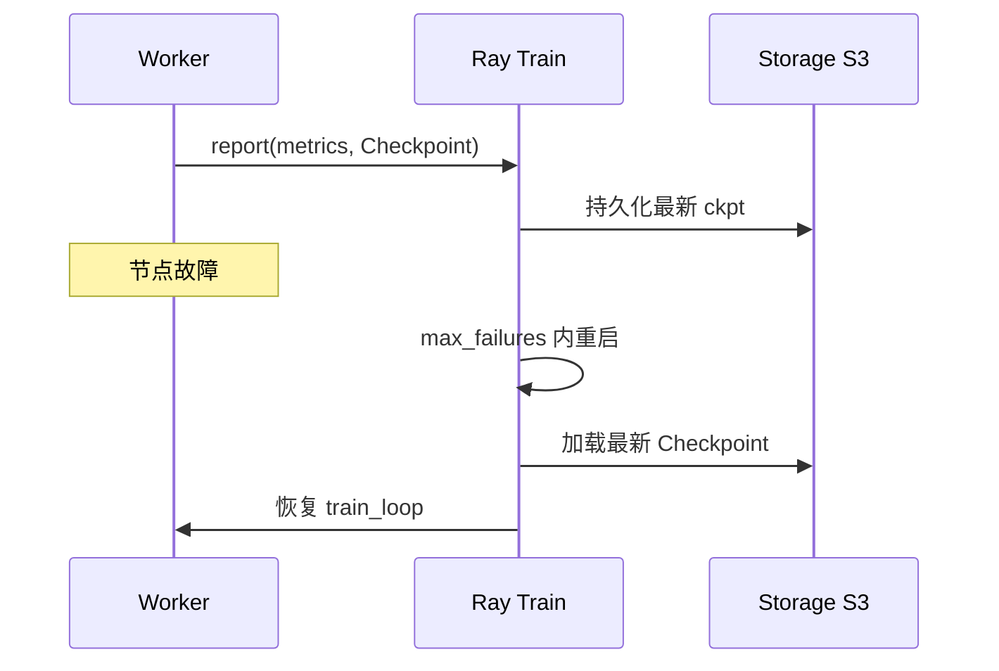

# Ray Train 与弹性分布式训练

> **文件编码**：UTF-8。  
> **前置**：[17 DDP/FSDP/DeepSpeed](17-分布式训练DDP-FSDP与DeepSpeed.md)、[29 TRL 实战](29-HuggingFace-TRL与SFTTrainer实战.md)、[08 GPU 与 AMP](08-GPU训练与混合精度AMP.md)。  
> **定位**：用 **Ray Train** 编排多机多卡 LLM 微调，掌握 **TorchTrainer、容错、弹性扩缩** 与 K8s 集群衔接。

---

## 0. 读前导读

### 0.1 用一句话弄懂本章

**Ray Train** = 在 Ray 集群上统一启动分布式 PyTorch 作业，自动处理 **进程组、checkpoint、故障恢复**，比裸 `torchrun` 更适合 **多机长训**。

### 0.2 你需要提前知道什么

- DDP / FSDP 概念（17 章）
- `torchrun --nproc_per_node` 启动方式
- NCCL 与 `MASTER_ADDR`（[LLMInfra 10](../LLMInfra/10-分布式训练并行策略与NCCL入门.md)）

### 0.3 本章知识地图（☐→☑）

- [ ] 安装 Ray 并理解 Head / Worker 节点
- [ ] 用 `TorchTrainer` 包装 HF Trainer 训练函数
- [ ] 配置 `ScalingConfig` 多 GPU / 多节点
- [ ] 使用 `Checkpoint` 与 `RunConfig` 容错恢复
- [ ] 对比 Ray Train vs Accelerate vs Slurm
- [ ] 完成 §14 闭卷自测 ≥8/10

### 0.4 建议学习时长

- **4～6 天**（需 2+ 节点或云多机实例；单机 2 卡可模拟 API）

---

## 1. 这份文档学什么

- Ray 架构：Driver、Worker、Object Store
- `TorchTrainer` + `train_loop_per_worker`
- `ScalingConfig(num_workers, use_gpu, resources_per_worker)`
- `DataParallelTrainer` 与 FSDP 插件
- Checkpoint 到云存储（S3 / GCS）与自动恢复
- 弹性训练：节点增减与 `max_failures`
- 与 K8s KubeRay、[LLMInfra 18 容器化](../LLMInfra/18-容器化与Kubernetes-GPU推理部署.md) 的关系
- 何时 **不必** 上 Ray（单机 8 卡 DeepSpeed 足够）

---

## 2. 为什么 LLM 训练需要 Ray Train



| 痛点（裸 torchrun） | Ray Train 应对 |
|---------------------|----------------|
| 多机 IP / 端口手动配 | Ray 自动注入环境变量 |
| 节点宕机整 job 失败 | `failure_config` 重试 |
| checkpoint 各 rank 不一致 | 统一 `Checkpoint` API |
| 异构集群资源碎片 | Placement Group / GPU 装箱 |

**适用**：跨机 7B+ 全参 / 长时预训练；**不适用**：笔记本单卡 LoRA（用 29/30 章即可）。

---

## 3. Ray 集群最小启动

```bash
# Head 节点
ray start --head --port=6379 --num-gpus=8

# Worker 节点（重复多台）
ray start --address='HEAD_IP:6379' --num-gpus=8

# 验证
ray status
```

Python 本地模拟（无真实多机）：

```python
import ray
ray.init(num_cpus=8, num_gpus=2)  # 单机 2 GPU 练 API
```

---

## 4. TorchTrainer 包装 HF 训练

```python
import os, torch, ray
from ray.train import ScalingConfig, Checkpoint, RunConfig, FailureConfig
from ray.train.torch import TorchTrainer

def train_loop_per_worker(config):
    from transformers import AutoModelForCausalLM, Trainer, TrainingArguments
    local_rank = int(os.environ["LOCAL_RANK"])
    torch.cuda.set_device(local_rank)
    model = AutoModelForCausalLM.from_pretrained(
        config["model_id"], torch_dtype=torch.bfloat16,
    )
    model = torch.nn.parallel.DistributedDataParallel(model, device_ids=[local_rank])
    trainer = Trainer(
        model=model,
        args=TrainingArguments(output_dir="/tmp/out", per_device_train_batch_size=2,
                               num_train_epochs=1, bf16=True, report_to=[]),
        train_dataset=config["dataset"],
    )
    trainer.train()
    if ray.train.get_context().get_world_rank() == 0:
        ray.train.report({"loss": 0.0}, checkpoint=Checkpoint.from_directory("/tmp/out"))

trainer = TorchTrainer(
    train_loop_per_worker,
    train_loop_config={"model_id": "Qwen/Qwen2.5-0.5B-Instruct", "dataset": ds},
    scaling_config=ScalingConfig(num_workers=2, use_gpu=True, resources_per_worker={"GPU": 1}),
    run_config=RunConfig(failure_config=FailureConfig(max_failures=3)),
)
trainer.fit()
```

> 生产可嵌入 **Accelerate FSDP** 或 **Lightning**（26 章）；上例展示 Ray 与 HF 胶水层。

---

## 5. ScalingConfig 与资源

| 参数 | 含义 | 示例 |
|------|------|------|
| `num_workers` | 训练 worker 数 | 8 机 × 8 卡 = 64 |
| `resources_per_worker` | 每 worker GPU/CPU | `{"GPU": 1, "CPU": 8}` |
| `use_gpu` | 是否申请 GPU | True |
| `placement_strategy` | 装箱策略 | STRICT_SPREAD |

全局 batch（同 17 章）：

\[
B = \text{per\_device\_batch} \times \text{num\_workers} \times \text{grad\_accum}
\]

多机时 `num_workers` = **总 GPU 数**（每 worker 一 GPU 的常见布局）。

---

## 6. Checkpoint 与容错



```python
from ray.train import CheckpointConfig

RunConfig(
    checkpoint_config=CheckpointConfig(
        num_to_keep=3,
        checkpoint_score_attribute="loss",
        checkpoint_score_order="min",
    ),
    failure_config=FailureConfig(max_failures=5),
)
```

**恢复训练**：`trainer.fit()` 传入 `resume_from_checkpoint=result.checkpoint`。

与 [22 章 MLOps](22-MLOps与实验跟踪wandb-mlflow.md) 结合：`report_to="wandb"` 仍在 HF 层配置。

---

## 7. FSDP / DeepSpeed 与 Ray

Ray 2.x 提供 `TorchConfig` 集成 FSDP：

```python
from ray.train.torch import TorchConfig

trainer = TorchTrainer(
    ...,
    torch_config=TorchConfig(backend="nccl"),
    # 部分版本支持 fsdp_config 字典传入 train_loop
)
```

**实践**：Accelerate FSDP 或 Lightning（26 章）嵌入 `train_loop_per_worker`；DeepSpeed 在 loop 内 `deepspeed.initialize`。

| 场景 | 建议 |
|------|------|
| 固定多机集群 | Ray Train + FSDP |
| 云 Spot 实例 | 频繁 ckpt + `max_failures` |
| 单机 8 卡 LoRA | 17 章 DeepSpeed，不必 Ray |

KubeRay 在 K8s 上部署 RayCluster，见 [LLMInfra 18](../LLMInfra/18-容器化与Kubernetes-GPU推理部署.md)。

---

## 8. 练习建议

1. 单机 2 GPU：`num_workers=2` 跑通上例，对比 torchrun wall time
2. 故意 kill 一 worker，观察 `max_failures` 恢复
3. checkpoint 存本地目录，用 `resume_from_checkpoint` 续训
4. 读 KubeRay 文档画 Pod ↔ Ray Worker 映射
5. 将 29 章 SFTTrainer 函数迁入 `train_loop_per_worker`

---

## 9. 学完标准

- [ ] 解释 Ray Head / Worker 职责
- [ ] 写出 `TorchTrainer` 三要素：loop、scaling、run config
- [ ] 配置 checkpoint 保留与故障重试
- [ ] 说明何时用 Ray 而非裸 DeepSpeed
- [ ] 对接 Infra 10 的 All-Reduce 时机

---

## 10. FAQ

**Q1：Ray 替代 NCCL 吗？** 不替代；底层仍 DDP/FSDP + NCCL。  
**Q2：worker 多 GPU？** 可以，LLM 常 1 GPU/worker。  
**Q3：没多机怎么学？** `ray.init(num_gpus=2)` 模拟 API。  
**Q4：Spot 被回收？** 缩短 ckpt 间隔 + S3 + 调大 `max_failures`。  
**Q5：单机 8 卡 LoRA 必须 Ray？** 不必，17/29/30 章足够。

---

## 11. 闭卷自测

1. Ray Train 解决的主要工程问题是什么？
2. `train_loop_per_worker` 在每个 worker 上执行几次？
3. `ScalingConfig.num_workers=8` 在 1 GPU/worker 布局下总 GPU 数？
4. `FailureConfig.max_failures` 含义？
5. `Checkpoint.from_directory` 用途？
6. Ray 与 NCCL 的分工？
7. 为何 rank0 负责 `report` checkpoint？
8. KubeRay 部署在什么平台？
9. 单机 8 卡 LoRA 是否必须 Ray？
10. 恢复训练 API 关键字？

<details>
<summary>参考答案</summary>

1. 分布式训练编排、容错、checkpoint 与资源调度。
2. 每个 worker 进程执行一次（该进程绑定其 GPU）。
3. 8。
4. 允许训练失败自动重启的最大次数。
5. 将本地目录打包为 Ray Checkpoint 对象供持久化与恢复。
6. Ray 管进程与生命周期；NCCL 管 GPU 间梯度通信。
7. 避免多 rank 同时写冲突；metric 聚合由 Ray 协调。
8. Kubernetes。
9. 不必；17/29/30 章工具即可。
10. `resume_from_checkpoint` 传入 `trainer.fit()`。

</details>

---

## 12. 下一章预告

文本 LLM 之外，**视觉-语言模型（VLM）** 把 CLIP 式编码器接到 LLM——32 章 LLaVA 与 HF 多模态微调。

---

*下一章：[32 多模态 LLaVA 与视觉语言模型](32-多模态LLaVA与视觉语言模型.md)*  
*分布式基础：[17 DDP/FSDP/DeepSpeed](17-分布式训练DDP-FSDP与DeepSpeed.md)*  
*NCCL：[LLMInfra 10 分布式训练并行策略](../LLMInfra/10-分布式训练并行策略与NCCL入门.md)*
