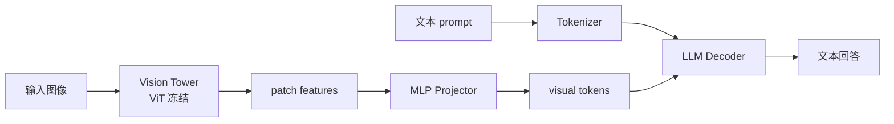
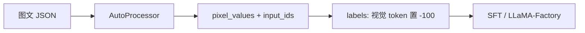

# 多模态 LLaVA 与视觉语言模型

> **文件编码**：UTF-8。  
> **前置**：[27 CLIP 入门](27-多模态CLIP入门.md)、[15 SFT 与 LoRA](15-微调SFT与LoRA-PEFT.md)、[12 HuggingFace](12-HuggingFace-Transformers入门.md)。  
> **定位**：理解 **LLaVA 架构**，用 HuggingFace **multimodal** API 加载与 **微调 VLM**，衔接图文对话与部署。

---

## 0. 读前导读

### 0.1 用一句话弄懂本章

**LLaVA** = **冻结视觉编码器 + 投影层 + 可训练 LLM**，把图像 patch 特征当成特殊 token 拼进文本序列，实现「看图说话」。

### 0.2 你需要提前知道什么

- CLIP / ViT 双塔概念（27 章）
- SFT 与 chat template（15、29 章）
- 单卡显存与 LoRA（15 章）

### 0.3 本章知识地图（☐→☑）

- [ ] 画出 LLaVA 三部分：Vision Tower、Projector、LLM
- [ ] 用 `LlavaForConditionalGeneration` 推理单图 QA
- [ ] 理解 `<image>` token 与 pixel_values 对齐
- [ ] 构造图文 SFT 数据集并 mask 仅文本 loss
- [ ] 用 LLaMA-Factory / peft 微调 VLM LoRA
- [ ] 了解 LLaVA-NeXT、Qwen2-VL 等演进
- [ ] 完成 §14 闭卷自测 ≥8/10

### 0.4 建议学习时长

- **5～7 天**（含 1 次 7B 级 VLM LoRA demo，需 ≥24GB 或量化）

---

## 1. 这份文档学什么

- VLM 范式：Encoder-Decoder vs LLM 拼接（LLaVA 属后者）
- Vision Tower：CLIP ViT、SigLIP、InternViT
- Multimodal Projector：MLP 对齐视觉维度 → LLM hidden
- 训练阶段：预训练 projector → 视觉指令 SFT
- HF 类：`LlavaForConditionalGeneration`、`Qwen2VLForConditionalGeneration`
- Processor：`AutoProcessor` 同时处理 image + text
- 微调策略：冻视觉、LoRA LLM、可选训 projector
- 与 [30 章 LLaMA-Factory](30-Unsloth-Axolotl与LLaMA-Factory工具链.md) 多模态 stage
- 推理部署注意显存（[LLMInfra 08 KV Cache](../LLMInfra/08-KVCache与PagedAttention原理.md)）

---

## 2. LLaVA 架构



| 组件 | 典型选择 | 是否训练 |
|------|----------|----------|
| Vision Tower | CLIP ViT-L/14 | 预训练阶段常冻结 |
| Projector | 2 层 MLP | 阶段 1 主训 |
| LLM | Vicuna / Llama / Qwen | 阶段 2 LoRA/SFT |

**直觉**：图像被切成与文本 token 等长的「视觉 token 序列」，插入 `<image>` 占位位置。

---

## 3. HuggingFace 推理最小示例

```python
import torch
from transformers import AutoProcessor, LlavaForConditionalGeneration
from PIL import Image
import requests

model_id = "llava-hf/llava-1.5-7b-hf"
processor = AutoProcessor.from_pretrained(model_id)
model = LlavaForConditionalGeneration.from_pretrained(
    model_id,
    torch_dtype=torch.float16,
    device_map="auto",
)

url = "https://huggingface.co/datasets/huggingface/documentation-images/resolve/main/transformers/tasks/ai2d-demo.jpg"
image = Image.open(requests.get(url, stream=True).raw)

conversation = [
    {
        "role": "user",
        "content": [
            {"type": "image"},
            {"type": "text", "text": "描述这张图片中的主要对象。"},
        ],
    },
]

prompt = processor.apply_chat_template(conversation, add_generation_prompt=True)
inputs = processor(images=image, text=prompt, return_tensors="pt").to(model.device)

with torch.no_grad():
    out = model.generate(**inputs, max_new_tokens=256, do_sample=False)

print(processor.decode(out[0], skip_special_tokens=True))
```

**要点**：

- `processor` = image processor + tokenizer
- `pixel_values` shape `[B, C, H, W]` 与 `input_ids` 一起 forward
- 7B VLM fp16 约需 **16～20GB** 推理显存

---

## 4. 数据格式与 SFT

单条图文指令 JSON（LLaVA 风格）：

```json
{
  "id": "001",
  "image": "images/cat.jpg",
  "conversations": [
    {"from": "human", "value": "<image>\n图里有几只猫？"},
    {"from": "gpt", "value": "图中有一只橘猫。"}
  ]
}
```

HF messages 格式（Qwen2-VL 等）：

```json
{
  "messages": [
    {
      "role": "user",
      "content": [
        {"type": "image", "image": "file://./cat.jpg"},
        {"type": "text", "text": "图里有几只猫？"}
      ]
    },
    {"role": "assistant", "content": "图中有一只橘猫。"}
  ]
}
```



**Loss mask 规则**：

- 视觉 token 位置：**不算 loss**（无文本标签）
- user 文本：通常 mask（同 15 章）
- assistant 文本：算 loss

---

## 5. 微调策略与显存

| 策略 | 可训练参数 | 显存 | 效果 |
|------|------------|------|------|
| 仅 Projector | ~几十 M | 低 | 对齐视觉语义 |
| LoRA LLM | ~0.5%～1% | 中 | 指令跟随主路径 |
| LoRA + Projector | 中 | 中+ | 领域图文常见 |
| 全参 LLM | 100% | 很高 | 大数据才值得 |

```python
from peft import LoraConfig, get_peft_model

lora_config = LoraConfig(
    r=16,
    lora_alpha=32,
    target_modules=["q_proj", "v_proj", "k_proj", "o_proj"],
    modules_to_save=["multi_modal_projector"],  # 同时训 projector
)
model = get_peft_model(model, lora_config)
model.print_trainable_parameters()
```

QLoRA 4bit 加载 LLM 部分（视觉塔常 fp16/bf16）：

```python
from transformers import BitsAndBytesConfig

bnb = BitsAndBytesConfig(load_in_4bit=True, bnb_4bit_compute_dtype=torch.bfloat16)
model = LlavaForConditionalGeneration.from_pretrained(
    model_id,
    quantization_config=bnb,
    device_map="auto",
)
```

---

## 6. LLaMA-Factory 微调 VLM

```yaml
### model
model_name_or_path: llava-hf/llava-1.5-7b-hf
finetuning_type: lora
lora_rank: 16

### dataset
dataset: llava_instruct_150k  # 需在 dataset_info 注册
template: llava
cutoff_len: 2048

### multimodal
image_max_pixels: 589824  # 控制分辨率防 OOM

### train
stage: sft
per_device_train_batch_size: 1
gradient_accumulation_steps: 16
bf16: true
output_dir: saves/llava-lora
```

详见 [30 章](30-Unsloth-Axolotl与LLaMA-Factory工具链.md)；数据清洗见 [18 章](18-大模型数据工程与预处理.md)。

---

## 7. 自定义 collate 要点

`processor` 同时输出 `pixel_values` 与 `input_ids`；`labels` 中视觉 token、pad、user 段置 `-100`（同 15、29 章 mask 规则）。`image_max_pixels` 越大序列越长，注意 OOM。

---

## 8. 模型族对比

| 模型 | 视觉编码 | LLM | 特点 |
|------|----------|-----|------|
| LLaVA-1.5 | CLIP ViT | Vicuna/Llama2 | 经典基线 |
| LLaVA-NeXT | CLIP + AnyRes | Llama3 | 高分辨率 |
| Qwen2-VL | 内置 ViT | Qwen2 | 原生 HF 多模态 API |
| InternVL | InternViT | InternLM | 中文场景强 |

与 [27 章 CLIP](27-多模态CLIP入门.md) 关系：LLaVA 复用 CLIP 权重作 Vision Tower，再接 LLM 而非对比损失。

---

## 9. 评估与局限

- **Benchmark**：MME、MMBench、ScienceQA、TextVQA
- **幻觉**：图像不存在物体仍描述 → 需 RLHF/DPO 或拒答训练
- **OCR**：小字需高分辨率或专用 OCR 管线
- **延迟**：ViT forward + 长序列 LLM；批处理见 [LLMInfra 16](../LLMInfra/16-推理Batch调度与ContinuousBatching.md)

---

## 10. 练习建议

1. 跑通 `llava-1.5-7b-hf` 单图 caption
2. 自建 20 张图 + 问答 JSON，LoRA 微调 projector
3. 对比 `image_max_pixels` 减半时的显存与效果
4. 用 Qwen2-VL 同一 prompt 对比输出风格
5. 画 LLaVA 与纯 CLIP zero-shot 流程差异表

---

## 11. 学完标准

- [ ] 口述 LLaVA 三组件与两阶段训练
- [ ] 用 Processor 完成图文 generate
- [ ] 解释视觉 token 为何 labels=-100
- [ ] 配置 LLaMA-Factory VLM yaml
- [ ] 估算 7B VLM LoRA 最低显存需求

---

## 11. FAQ

**Q1：和 GPT-4V 一样吗？** 同属视觉编码+LLM，细节不同。  
**Q2：只训 LLM？** 新领域建议至少训 projector。  
**Q3：多图？** LLaVA-NeXT / Qwen2-VL 支持。  
**Q4：部署？** vLLM 已支持部分 VLM（20 章）。  
**Q5：bf16 还是 fp16？** Ampere+ 优先 bf16。

---

## 12. 闭卷自测

1. LLaVA 三个核心模块是什么？
2. Vision Tower 为何常冻结？
3. Projector 的作用？
4. `<image>` token 在序列中代表什么？
5. VLM SFT 中哪些位置通常不算 loss？
6. `AutoProcessor` 与单独 tokenizer 区别？
7. LoRA 微调 VLM 时 `modules_to_save` 典型用途？
8. `image_max_pixels` 影响什么？
9. LLaVA 与 CLIP zero-shot 分类路径差异？
10. Qwen2-VL 相对 LLaVA-1.5 一项架构优势？

<details>
<summary>参考答案</summary>

1. Vision Tower（ViT）、Multimodal Projector（MLP）、LLM Decoder。
2. 保留预训练视觉特征；省显存与稳定训练。
3. 将视觉特征维度映射到 LLM embedding 空间。
4. 标记视觉 token 插入位置；对应 pixel_features 拼入序列。
5. 视觉 token、pad、通常还有 user 文本段。
6. Processor 同时处理 image（pixel_values）与 text（input_ids）。
7. 保存并训练 projector 等非 LoRA 模块（如 multi_modal_projector）。
8. 输入分辨率上限，影响 patch 数、序列长度与显存。
9. CLIP 比图文向量；LLaVA 生成式回答，走 LLM 解码。
10. 原生多模态 chat template、动态分辨率 / 多图等（答出其一即可）。

</details>

---

## 13. 下一章预告

本系列 00～32 章覆盖 **文本 LLM 训练微调 + 工具链 + 分布式 + 多模态**；后续可回到 [24 项目实战](24-项目实战微调小型语言模型.md) 做图文综合项目，或 [25 面试专题](25-面试专题与知识点总表.md) 复盘。

---

*回顾 CLIP：[27 多模态 CLIP 入门](27-多模态CLIP入门.md)*  
*工具链：[30 Unsloth、Axolotl 与 LLaMA-Factory](30-Unsloth-Axolotl与LLaMA-Factory工具链.md)*  
*路线图：[00 学习路线图与说明](00-学习路线图与说明.md)*
