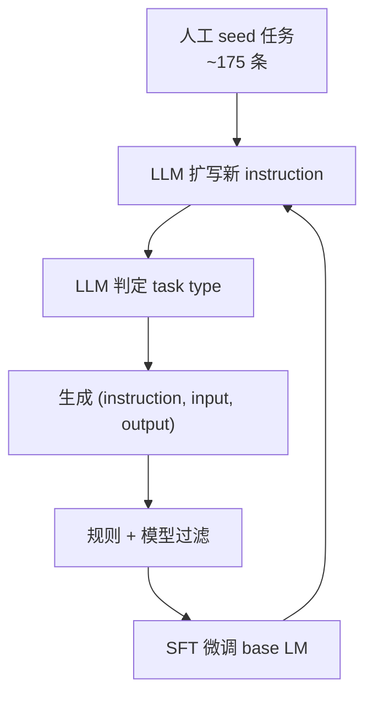
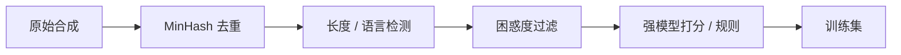
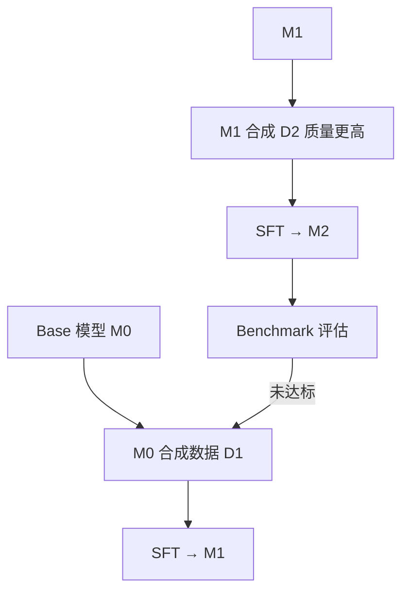

# 合成数据 Self-Instruct 与知识蒸馏

> **文件编码**：UTF-8。  
> **前置**：[15 SFT/LoRA](15-微调SFT与LoRA-PEFT.md)、[18 数据工程](18-大模型数据工程与预处理.md)。  
> **定位**：掌握 **Self-Instruct、Alpaca 数据管线、DistilLLM 蒸馏、数据飞轮**，在标注预算有限时扩充高质量 SFT 数据。

---

## 0. 读前导读

### 0.1 用一句话弄懂本章

**合成数据** = 用强模型或规则批量生成指令-回答对；**知识蒸馏** = 让小模型模仿大模型的输出分布或 logits，二者常组成 **数据飞轮** 闭环。

### 0.2 你需要提前知道什么

- SFT messages 格式与 label mask（15 章）
- jsonl 清洗、去重、质量过滤（18 章）
- 基本 `generate` 与 batch 推理（12 章）

### 0.3 本章知识地图（☐→☑）

- [ ] 解释 Self-Instruct 四步流水线
- [ ] 构造 Alpaca 三字段并转 messages
- [ ] 用 teacher 模型批量生成 response
- [ ] 理解 DistilLLM / logits 蒸馏 vs 输出蒸馏
- [ ] 设计一轮数据飞轮：生成 → 过滤 → SFT → 评估
- [ ] 完成 §12 闭卷自测 ≥8/10

### 0.4 建议学习时长

- **4～6 天**（含跑通 500 条合成 + 小规模 SFT）

---

## 1. 这份文档学什么

- Self-Instruct 论文思路：seed → 扩指令 → 分类 → 生成实例
- Alpaca / Stanford 数据格式与社区复现
- Teacher-student 蒸馏：序列级、token 级、logits 级
- DistilLLM、MiniLLM 等代表工作（概念）
- 数据飞轮：模型变强 → 生成更好数据 → 再训
- 合成数据风险：幻觉、偏见、重复、评测泄漏
- 与 15 章 LoRA SFT、19 章评估衔接

---

## 2. Self-Instruct 流水线



**核心思想**：少量人工示例定义「任务空间」，强 LM 自举扩写，使 base 模型获得 **零样本指令跟随** 能力。

| 阶段 | 输入 | 输出 |
|------|------|------|
| 指令生成 | seed instructions | 新 instruction |
| 分类 | instruction | task_type |
| 实例生成 | instruction + optional input | output |
| 过滤 | 全量样本 | 去重、长度、ROUGE-L 与 seed 过近剔除 |

---

## 3. Alpaca 数据格式

**三字段（Stanford Alpaca）**：

```json
{
  "instruction": "将下列句子翻译成英文。",
  "input": "今天天气很好。",
  "output": "The weather is nice today."
}
```

**无 input 时** `input` 为空字符串；下游统一转 messages：

```python
def alpaca_to_messages(row: dict) -> list[dict]:
    user = row["instruction"]
    if row.get("input", "").strip():
        user = f"{user}\n\n{row['input']}"
    return [
        {"role": "user", "content": user},
        {"role": "assistant", "content": row["output"]},
    ]
```

**Alpaca-52k** 即 Self-Instruct 在 text-davinci-003 时代生成的经典集；现代复现常用 **GPT-4 / Claude / Qwen-72B** 作 teacher。

---

## 4. 批量合成脚本骨架

```python
import json
from transformers import AutoModelForCausalLM, AutoTokenizer
import torch

TEACHER = "Qwen/Qwen2.5-7B-Instruct"
tokenizer = AutoTokenizer.from_pretrained(TEACHER)
model = AutoModelForCausalLM.from_pretrained(
    TEACHER, torch_dtype=torch.bfloat16, device_map="auto"
)

PROMPT = """根据主题生成一条中文指令问答。
主题：{topic}
只输出 JSON：{{"instruction":"...","input":"...","output":"..."}}"""

def generate_one(topic: str) -> dict:
    messages = [{"role": "user", "content": PROMPT.format(topic=topic)}]
    text = tokenizer.apply_chat_template(messages, tokenize=False, add_generation_prompt=True)
    inputs = tokenizer(text, return_tensors="pt").to(model.device)
    out = model.generate(**inputs, max_new_tokens=512, temperature=0.7, do_sample=True)
    raw = tokenizer.decode(out[0][inputs["input_ids"].shape[1]:], skip_special_tokens=True)
    return json.loads(raw)  # 生产需 try/except + 重试

topics = ["Python 调试", "SQL 优化", "礼貌拒绝"]
for t in topics:
    row = generate_one(t)
    print(json.dumps(row, ensure_ascii=False))
```

**工程要点**：

| 要点 | 说明 |
|------|------|
| 温度 | 0.6～0.9 增多样性；评估集用 0 |
| JSON 约束 | `response_format` 或后处理 regex |
| 并发 | vLLM / 多进程 worker（20 章） |
| 成本 | 先 1k 条 POC，再扩到 10k+ |

---

## 5. 质量过滤与去偏



```python
def heuristic_filter(row: dict) -> bool:
    if len(row["output"]) < 10 or len(row["output"]) > 4096:
        return False
    if row["output"].count(row["output"][:20]) > 3:  # 复读
        return False
    return True
```

- **拒绝采样**：同一 instruction 生成 N 条，用 reward model 或 GPT-4 选最优
- **多样性**：按 topic 桶均衡，避免 80% 都是「写邮件」
- **安全**：过滤 PII、违法、歧视内容（36 章 Guardrails）

---

## 6. 知识蒸馏概览

**目标**：小模型（student）逼近大模型（teacher）的行为。

| 类型 | 监督信号 | 典型损失 |
|------|----------|----------|
| 输出蒸馏 | teacher 生成的 text | CE on hard labels |
| 序列蒸馏 | teacher 完整回答 | SFT loss |
| Logits 蒸馏 | teacher 每 token 分布 | KL(student \|\| teacher) |
| 特征蒸馏 | 中间层 hidden | MSE / cosine |

**DistilLLM**（代表思路）：在指令数据上对 student 做 **token 级 KL**，有时加 **reverse KL** 或 **on-policy** 采样，使 7B 接近 13B+ teacher 的指令能力。

\[
\mathcal{L} = \alpha \mathcal{L}_{\text{SFT}} + (1-\alpha) \sum_t \text{KL}\big(p_{\text{teacher}}(\cdot|x_{<t}) \,\|\, p_{\text{student}}(\cdot|x_{<t})\big)
\]

- **优点**：同样数据量下 student 更强
- **缺点**：需跑 teacher forward（显存/算力）；logits 对齐对 temperature 敏感

---

## 7. 输出蒸馏最小示例

```python
# 离线：teacher 写 jsonl
# {"messages": [...]}  # assistant 内容为 teacher 输出

from datasets import load_dataset
from trl import SFTTrainer, SFTConfig

ds = load_dataset("json", data_files="distill.jsonl", split="train")
# student 用 15 章 LoRA + SFTTrainer，labels 仅 assistant
# 等价于「用 teacher 回答当标准答案」——最简单蒸馏
```

**与 Self-Instruct 关系**：Self-Instruct 生成 **instruction**；蒸馏强调 **teacher 知识迁移**——常合并：Self-Instruct 扩任务 + teacher 写 output + student SFT。

---

## 8. 数据飞轮



| 飞轮环节 | 实践建议 |
|----------|----------|
| 冷启动 | 人工 200～500 条 gold + Alpaca 子集 |
| 迭代 | 每轮 +20% 新 topic，旧数据 replay 防遗忘 |
| 停止条件 | eval 集 plateau 或合成边际收益 < 成本 |
| 风险 | 模型 collapse 到自身风格——混入人工 gold |

**Constitutional AI / RLAIF** 可视为飞轮上的 **偏好** 环节（16 章），本章聚焦 **SFT 数据** 侧。

---

## 9. 合成 vs 人工数据

| 维度 | 人工标注 | 合成 |
|------|----------|------|
| 成本 | 高 | 低（API/GPU） |
| 质量上限 | 高（专家） | 受 teacher 与过滤限制 |
| 多样性 | 依赖标注规范 | 易扩，易重复 |
| 评测泄漏 | 低 | 需隔离 benchmark 题 |
| 适用 | 核心域、安全 | 通用指令、冷启动 |

**经验**：核心产品域 **30% 人工 + 70% 合成 + 严格过滤** 是常见 POC 比例。

---

## 10. 练习建议

1. 写 20 条 seed instruction，用 7B 模型扩写到 200 条 jsonl
2. 实现 `alpaca_to_messages` + 18 章 MinHash 去重
3. 同一批 instruction：对比 `temperature=0.3` vs `0.9` 的多样性
4. 用 teacher 生成 500 条，LoRA SFT 0.5B student，对比未蒸馏 baseline
5. 画飞轮图：标注你项目的一轮迭代与 eval 指标
6. 读 Self-Instruct 论文摘要与 Alpaca 数据 card 各一遍

---

## 11. 学完标准

- [ ] 画出 Self-Instruct 四步并举例
- [ ] Alpaca 转 messages 无格式 bug
- [ ] 区分输出蒸馏与 logits 蒸馏
- [ ] 列出 3 条合成数据风险及缓解
- [ ] 描述一轮数据飞轮的起止条件

---

## 12. FAQ

**Q1：合成数据会教模型胡说吗？**  
会；teacher 幻觉会继承。需过滤、人工 spot check、RAG  grounding（35 章）。

**Q2：能否只用合成不做人工？**  
POC 可以；生产关键路径建议保留 gold 集与红队集（36 章）。

**Q3：DistilLLM 和 QLoRA 冲突吗？**  
不冲突；蒸馏是 **目标/损失**，QLoRA 是 **训练方式**。

**Q4：Alpaca 还值得用吗？**  
格式仍通用；数据本身偏旧，宜作 **格式参考** + 自建 domain 合成。

**Q5：如何避免与 MMLU 等 benchmark 重叠？**  
held-out 题不入库；n-gram 与 benchmark 去重；专用 eval 永不进 train。

**Q6：小模型能当 teacher 吗？**  
可以但天花板低；常用 **更强模型或集成** 作 teacher。

**Q7：飞轮几轮合适？**  
2～4 轮常见；再迭代需监控 eval 下降（过拟合合成风格）。

**Q8：合成中文要注意什么？**  
语言一致、简繁统一、文化敏感过滤；teacher 最好中文强。

**Q9：和 18 章数据工程分工？**  
18 章管 **管道与清洗**；本章管 **生成策略与蒸馏目标**。

**Q10：合成数据版权？**  
teacher 输出通常受 ToS 约束；商用需读 API 条款与合规（18 章）。

---

## 13. 闭卷自测

1. Self-Instruct 的 seed 任务起什么作用？
2. Alpaca 三字段分别是什么？
3. 输出蒸馏的监督信号是什么？
4. Logits 蒸馏常用什么损失？
5. 数据飞轮冷启动通常缺什么？
6. 合成数据为何要做 ROUGE-L 与 seed 相似度过滤？
7. DistilLLM 相对纯 SFT 多优化了什么？
8. `temperature` 调高对合成多样性有何影响？
9. 为何 eval 题不能进入合成训练集？
10. 飞轮中「replay 人工 gold」防什么问题？

<details>
<summary>参考答案</summary>

1. 定义任务类型与风格边界，供 LLM 扩写新 instruction。
2. instruction、input（可为空）、output。
3. Teacher 生成的文本（hard label），student 做 CE/SFT。
4. Token 级 KL 散度（student 分布逼近 teacher）。
5. 缺足够 seed / gold 与质量过滤，易扩出低质或单一任务。
6. 防止新 instruction 与 seed 几乎重复，缺乏多样性。
7. 在 SFT 之外增加 token 级 KL，迁移 teacher 概率知识。
8. 采样更随机，instruction/output 更多样；过低易模板化。
9. 会造成 benchmark 泄漏，分数虚高，无法反映泛化。
10. 灾难性遗忘与风格 collapse，模型越训越像自身合成腔。

</details>

---

## 14. 下一章预告

合成数据得到多个 **checkpoint** 后，如何用 **mergekit** 做权重融合、并理解 **MoE** 稀疏专家路由——见 34 章。

---

*下一章：[34 模型合并 mergekit 与 MoE 入门](34-模型合并mergekit与MoE入门.md)*  
*数据管道：[18 大模型数据工程](18-大模型数据工程与预处理.md)*
