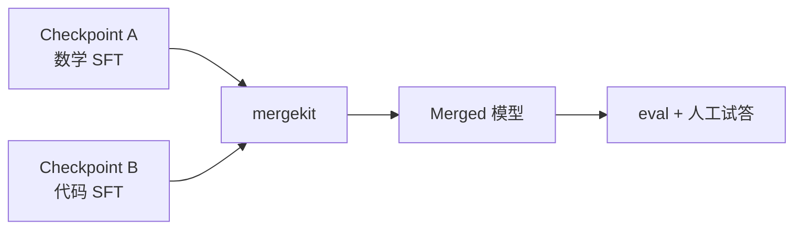
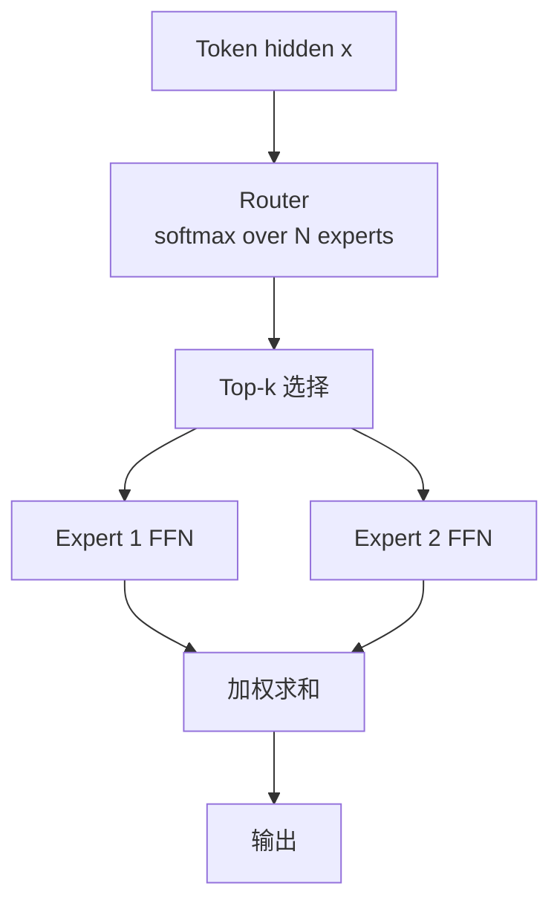
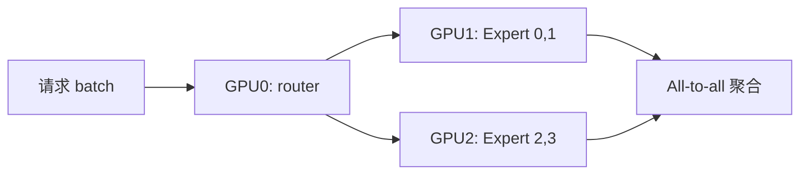

# 模型合并 mergekit 与 MoE 入门

> **文件编码**：UTF-8。  
> **前置**：[15 SFT/LoRA](15-微调SFT与LoRA-PEFT.md)、[14 预训练原理](14-预训练与语言模型原理.md)。  
> **定位**：掌握 **mergekit 配置、SLERP/TIES 合并、MoE 路由与 Mixtral 架构概念**，在不重新训练的情况下组合多个微调权重。

---

## 0. 读前导读

### 0.1 用一句话弄懂本章

**模型合并** = 在权重空间插值或融合多个 fine-tune；**MoE** = 多专家 FFN + 路由器，每 token 只激活少数专家，用更大容量换可控算力。

### 0.2 你需要提前知道什么

- 保存/加载 HF `safetensors` checkpoint（12 章）
- LoRA merge 与全量权重区别（15 章）
- Transformer FFN 结构（11、14 章）

### 0.3 本章知识地图（☐→☑）

- [ ] 写 mergekit YAML 合并两个同架构 LoRA/full 模型
- [ ] 解释 SLERP vs 线性平均
- [ ] 描述 MoE 中 router、top-k、load balancing
- [ ] 说出 Mixtral 8x7B 的「8x7B」含义
- [ ] 判断何时合并 vs 继续 SFT
- [ ] 完成 §12 闭卷自测 ≥8/10

### 0.4 建议学习时长

- **3～5 天**（含本地 merge 一次 + 读 Mixtral 配置）

---

## 1. 这份文档学什么

- mergekit 工具链：YAML 配置、方法插件
- 线性平均、SLERP、TIES、DARE 等（概念与选用）
- 合并前约束：同架构、同 tokenizer、同 shape
- MoE 基础：稀疏激活、专家并行、容量因子
- Mixtral / Qwen-MoE / DeepSeek-MoE 架构导读
- 合并与 MoE 的工程限制（vLLM、量化）
- 与 15 章 adapter、20 章部署衔接

---

## 2. 为何做模型合并

| 动机 | 说明 |
|------|------|
| 多任务融合 | 数学 LoRA + 代码 LoRA → 一个权重 |
| 免重训 | 网格搜索 interpolation 系数 |
| 社区实践 | 「模型汤」、WARP、Frankenmerging |
| 探索 Pareto | 能力-安全 trade-off 折中 |

**限制**：合并 **不能** 创造训练集没见过的能力；异常 merge 可致 perplexity 爆炸。



---

## 3. mergekit 快速上手

安装：

```bash
pip install mergekit
```

**线性合并 YAML**（两模型各 50%）：

```yaml
# merge_linear.yaml
models:
  - model: ./checkpoints/math-lora-merged
    parameters:
      weight: 0.5
  - model: ./checkpoints/code-lora-merged
    parameters:
      weight: 0.5
merge_method: linear
dtype: bfloat16
```

```bash
mergekit-yaml merge_linear.yaml ./merged-out --cuda --low-cpu-memory
```

**注意**：mergekit 通常要求 **已 merge 的完整权重**（15 章 `merge_and_unload()`），非单独 LoRA adapter 文件。

| 字段 | 含义 |
|------|------|
| `models[].model` | HF 目录或 hub id |
| `parameters.weight` | 线性组合系数 |
| `merge_method` | linear / slerp / ties / … |
| `dtype` | 输出精度，常用 bf16 |

---

## 4. SLERP 与线性平均

**线性**（逐参数）：

\[
\theta_{\text{merge}} = w \theta_A + (1-w)\theta_B
\]

**SLERP**（Spherical Linear Interpolation）：把权重向量视为高维球面点，沿大圆插值，**往往比线性更稳**（尤其 full fine-tune）。

```yaml
merge_method: slerp
slerp:
  t:
    - filter: self_attn
      value: 0.3
    - filter: mlp
      value: 0.6
parameters:
  t: 0.5
models:
  - model: ./model_a
  - model: ./model_b
```

| 方法 | 特点 | 适用 |
|------|------|------|
| linear | 简单、可解释 | 同域近 checkpoint |
| slerp | 方向插值，少「模长塌陷」 | 差异稍大的 SFT |
| ties | 稀疏化冲突参数再合并 | 多模型（3+） |
| dare | 随机 drop + rescale | 与 ties 组合 |

**实践**：对同一 base 的两个 LoRA merge 后，在 **0.3～0.7** 扫 `t`，用 19 章 eval 集选最优。

---

## 5. 合并检查清单

```python
from transformers import AutoConfig, AutoTokenizer

def assert_mergeable(path_a, path_b):
    ca, cb = AutoConfig.from_pretrained(path_a), AutoConfig.from_pretrained(path_b)
    assert ca.architectures == cb.architectures
    assert ca.hidden_size == cb.hidden_size
    assert ca.num_hidden_layers == cb.num_hidden_layers
    ta = AutoTokenizer.from_pretrained(path_a)
    tb = AutoTokenizer.from_pretrained(path_b)
    assert ta.vocab_size == tb.vocab_size
```

- 架构、层数、hidden、head 数一致
- **Tokenizer 必须同源**；否则 merge 后乱码
- 合并后跑 **5 条固定 prompt** + perplexity on holdout
- 部署前确认 20 章引擎支持 merged 架构

---

## 6. MoE 架构直觉

**Dense FFN**：每个 token 过同一 MLP。  
**MoE FFN**：N 个专家 \(\{E_i\}\)，router 输出权重，激活 top-k 个专家。



\[
y = \sum_{i \in \text{TopK}} g_i(x) \cdot E_i(x)
\]

| 概念 | 说明 |
|------|------|
| 专家数 N | 如 Mixtral 8 |
| Top-k | 常 k=2，每 token 激活 2 个专家 |
| Load balancing | aux loss 防「死专家」 |
| 参数量 vs 算力 | 8x7B 参数量大，激活约 2x7B FFN 量级 |

---

## 7. Mixtral 8x7B 概念

**命名**：8 个 **7B 级** 专家 FFN，共享 **同一 Attention** 与 embedding；每次 forward 每 token 选 **2** 个专家。

| 组件 | Mixtral 典型 |
|------|----------------|
| Attention | 共享，Dense |
| FFN | 8 专家，Top-2 |
| 激活参数 | ~13B 量级（非 56B 全激活） |
| 总参数 | ~47B（含全部专家权重） |

```python
# config 层概念（非完整源码）
# router_logits: [batch, seq, num_experts]
# topk = torch.topk(router_logits, k=2, dim=-1)
# output = w1*Expert[i1](x) + w2*Expert[i2](x)
```

**与 Dense 7B 对比**：

| | Dense 7B | Mixtral 8x7B |
|---|----------|--------------|
| 推理 FFN 算力 | 1x | ~2x 专家（k=2） |
| 容量 | 固定 | 更大专家池 |
| 部署 | 简单 | 需 MoE kernel / EP |
| 合并 | mergekit 成熟 | **勿随意 merge 专家** |

---

## 8. MoE 训练与推理要点

**训练**：

- **Expert parallelism**：不同 GPU 放不同专家
- **Auxiliary load balancing loss**：鼓励均匀路由
- **Capacity factor**：每专家每 batch 最大 token 数，超限则 drop/token 溢出

**推理**：

- vLLM、TensorRT-LLM 等对 MoE 有 **专门路由与 EP**
- 量化 MoE 需 **per-expert** 或 grouped 方案（LLMInfra 09）
- 延迟 = Attention + 2×Expert FFN + routing 开销



---

## 9. 合并 vs MoE vs 继续 SFT

| 策略 | 何时选 |
|------|--------|
| mergekit 合并 | 两个同 base 专项 SFT，要快试组合 |
| 继续 SFT 混合数据 | 有标注预算，要稳定泛化 |
| MoE 预训练/继续训 | 超大容量、有分布式与 infra |
| 多 LoRA 切换 | 任务明确分离、不需单权重 |

**勿混淆**：mergekit 合并 **Dense 权重** ≠ MoE 专家合并；后者需架构一致且专家一一对应，社区工具少、风险高。

---

## 10. 练习建议

1. 同一 Qwen2.5-0.5B 训两个 LoRA（翻译 / 摘要），merge 线性 `t=0.5` 与 SLERP 对比
2. 扫 `t ∈ {0.2,0.5,0.8}`，记录 eval 分数表
3. 读 `mistralai/Mixtral-8x7B-v0.1` 的 `config.json` 中 `num_local_experts`
4. 画 MoE forward 数据流（router → top-k → experts）
5. 说明为何 merge 前必须 `merge_and_unload` LoRA

---

## 11. 学完标准

- [ ] 写出 mergekit 最小 YAML 并跑通
- [ ] 比较 linear 与 SLERP 一句差异
- [ ] 解释 Mixtral「8x7B」参数量与激活量
- [ ] 列出 MoE load balancing 的目的
- [ ] 说明 merge 两个 MoE checkpoint 为何困难

---

## 12. FAQ

**Q1：能合并不同 base 吗？**  
不能；hidden shape 与层名必须对齐。

**Q2：合并后比单模型强吗？**  
不一定；常在某任务升、另一任务降，需 eval。

**Q3：SLERP 的 t 是什么？**  
插值位置，0≈全 A，1≈全 B（以 mergekit 配置为准）。

**Q4：MoE 每 token 一定 2 专家吗？**  
Mixtral k=2；其他模型 k 可配置。

**Q5：8x7B 等于 56B Dense 吗？**  
不等；总存储接近 8 套 FFN，但 **激活算力** 约 2 专家量级。

**Q6：mergekit 支持 GPTQ 吗？**  
合并通常在 bf16/fp16 全精度做，再量化。

**Q7：路由器会训练吗？**  
会；与专家一起 end-to-end 训练。

**Q8：死专家是什么？**  
几乎不被 router 选中，浪费容量；靠 aux loss 缓解。

**Q9：PEFT LoRA 能否直接 mergekit？** 需先 merge 进 base。  
**Q10：与 16 章 RLHF 关系？** 可对 merge 后模型再做 DPO（谨慎 eval）。

---

## 13. 闭卷自测

1. mergekit 合并前 LoRA 通常如何处理？
2. 线性 merge 公式中 weight=0.5 表示什么？
3. SLERP 相对线性插值的主要动机？
4. MoE 中 router 输出用于什么？
5. Mixtral 8x7B 中「8」和「7B」指什么？
6. Top-k 中 k=2 对算力意味着什么？
7. Load balancing aux loss 解决什么问题？
8. 合并两个 checkpoint 为何要同 tokenizer？
9. Expert parallelism 是什么？
10. mergekit 适合 Dense 还是随意 MoE 专家？

<details>
<summary>参考答案</summary>

1. 用 `merge_and_unload()` 合并为完整 safetensors 再参与 merge。
2. 两模型权重各贡献 50% 线性加权。
3. 在高维权重空间沿球面插值，减轻模长/方向失真。
4. 对专家打分，选 Top-k 专家并加权组合 FFN 输出。
5. 8 个专家；每个专家 FFN 约 7B 规模（共享 Attention）。
6. 每个 token 的 FFN 路径约走 2 套专家计算（外加 router）。
7. 防止路由塌缩到少数专家（死专家、负载不均）。
8. 词表与 embedding 不一致会导致 merge 后输出乱码或无意义。
9. 将不同专家放在不同设备上并行计算的训练/推理并行策略。
10. 主要面向 Dense 等同架构权重；MoE 专家随意 merge 风险高、工具支持有限。

</details>

---

## 14. 下一章预告

合并后的模型若要 **落地知识库问答**，需要 **RAG 向量检索**——35 章深入 FAISS IVF 与 Milvus Hybrid Search。

---

*下一章：[35 RAG 向量检索 FAISS 与 Milvus 深度实战](35-RAG向量检索FAISS与Milvus深度实战.md)*  
*微调基础：[15 SFT 与 LoRA](15-微调SFT与LoRA-PEFT.md)*
