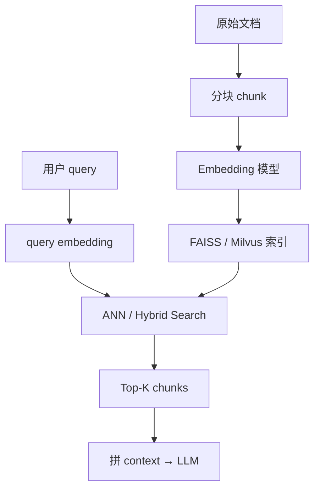
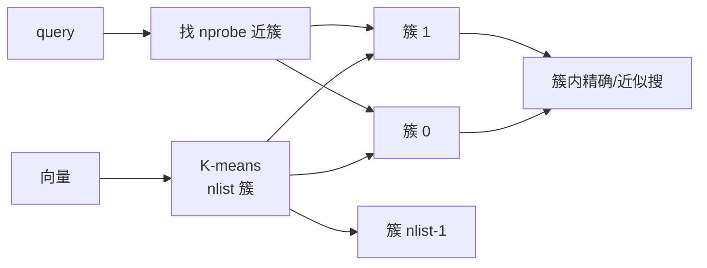
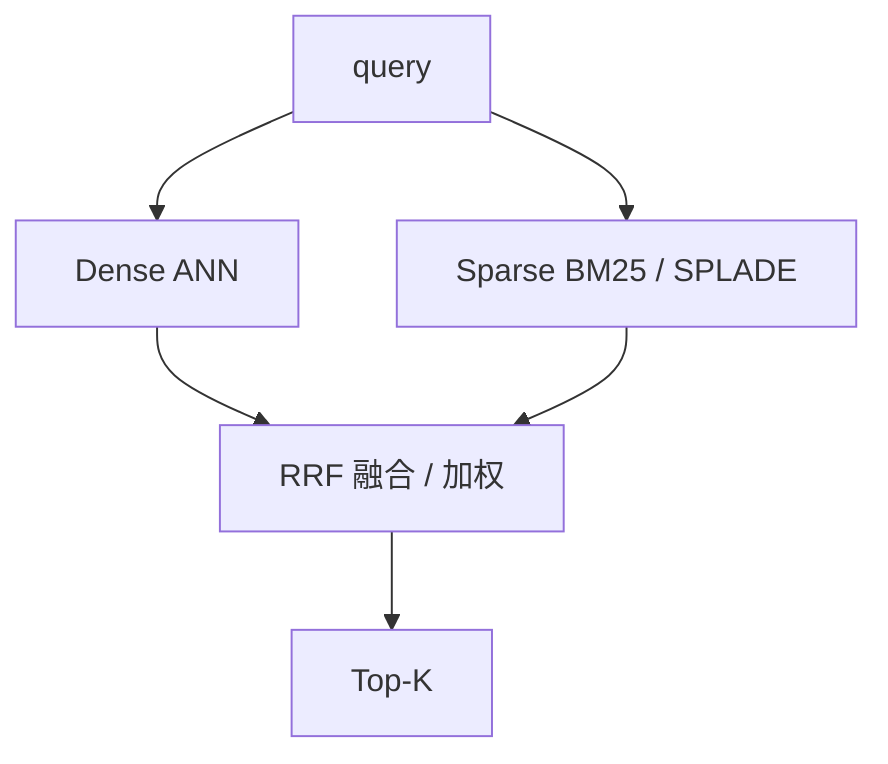

# RAG 向量检索 FAISS 与 Milvus 深度实战

> **文件编码**：UTF-8。  
> **前置**：[21 LangChain/LlamaIndex](21-LangChain与LlamaIndex应用层.md)、[10 Embedding](10-序列模型与Embedding入门.md)；概念可先读 [AIAgent 05 RAG 基础](../AIAgent/05-RAG基础-分块检索与引用.md)。  
> **定位**：掌握 **Embedding 选型、FAISS IVF 索引、Milvus 集合与 Hybrid Search**，构建可扩展的生产级向量检索层。

---

## 0. 读前导读

### 0.1 用一句话弄懂本章

**RAG 检索层** = 把文档切成 chunk → **Embedding** 成向量 → 写入 **FAISS/Milvus** → 查询时用 ANN +（可选）**BM25 混合** 召回上下文给 LLM。

### 0.2 你需要提前知道什么

- 余弦相似度 / 内积（10 章）
- LangChain / LlamaIndex 基本 ingest（21 章）
- Docker 或本地服务概念（Milvus standalone）

### 0.3 本章知识地图（☐→☑）

- [ ] 选 embedding 模型并 L2 归一化
- [ ] 建 FAISS IndexFlatIP / IndexIVFFlat 并 `nprobe` 调参
- [ ] 在 Milvus 创建 collection、插入、检索
- [ ] 配置 Hybrid Search（dense + sparse）
- [ ] 对比延迟、召回率、内存占用
- [ ] 完成 §13 闭卷自测 ≥8/10

### 0.4 建议学习时长

- **5～7 天**（含 Milvus Docker + 1 万 chunk 基准）

---

## 1. 这份文档学什么

- RAG 两阶段：离线索引 vs 在线检索
- Embedding 模型：bge、E5、OpenAI、多语言选型
- FAISS 索引族：Flat、IVF、HNSW、PQ（概念）
- IVF 训练、`nlist`、`nprobe` 与召回-延迟权衡
- Milvus 2.x：schema、partition、filter、hybrid
- Hybrid search：向量 + BM25 / sparse vector
- rerank、chunk 策略与 21 章框架对接
- 与 [LLMInfra 推理](../LLMInfra/14-vLLM-TensorRT-LLM-llama.cpp架构导读.md) 分工：本章 **检索**，Infra **生成**

---

## 2. RAG 检索流水线



| 阶段 | 关键决策 |
|------|----------|
| 分块 | 512～1024 token，overlap 10%～20% |
| Embedding | 与 query 同模型；中文选 multilingual |
| 索引 | 小规模 FAISS；大规模 Milvus + 分布式 |
| 召回 | K=5～20；生产常 **召回多、rerank 少** |

---

## 3. Embedding 实战

**原则**：索引与查询 **同一模型**；向量 **归一化** 后内积等价余弦。

```python
from sentence_transformers import SentenceTransformer
import numpy as np

model = SentenceTransformer("BAAI/bge-small-zh-v1.5")

def embed(texts: list[str], batch_size=32) -> np.ndarray:
    vecs = model.encode(
        texts,
        batch_size=batch_size,
        normalize_embeddings=True,
        show_progress_bar=False,
    )
    return np.asarray(vecs, dtype=np.float32)

q = embed(["什么是 IVF 索引？"])
d = embed(["IVF 通过聚类加速近似最近邻。", "Milvus 支持混合检索。"])
scores = (q @ d.T)[0]  # 归一化后 = cosine similarity
```

| 模型 | 维度 | 场景 |
|------|------|------|
| bge-small-zh-v1.5 | 512 | 中文 POC、低延迟 |
| bge-m3 | 1024 | 多语言 + sparse（Milvus hybrid） |
| text-embedding-3-small | 1536 | API、免运维 |
| E5-large-v2 | 1024 | 英文强 |

**E5 前缀**：query 加 `"query: "`，passage 加 `"passage: "`（按模型 card）。

---

## 4. FAISS 基础：IndexFlatIP

```python
import faiss
import numpy as np

dim = 512
vectors = np.random.randn(1000, dim).astype(np.float32)
faiss.normalize_L2(vectors)

index = faiss.IndexFlatIP(dim)  # 内积 = 归一化后 cosine
index.add(vectors)

q = np.random.randn(1, dim).astype(np.float32)
faiss.normalize_L2(q)
D, I = index.search(q, k=5)  # distances, indices
```

| 索引 | 复杂度 | 适用 |
|------|--------|------|
| IndexFlatIP | O(n) 精确 | n < 10万 |
| IndexIVFFlat | O(n/nlist * nprobe) | 10万～千万 |
| IndexHNSW | 图搜索 | 低延迟、内存足 |
| IndexIVFPQ | IVF + 量化 | 超大规模、可损召回 |

---

## 5. FAISS IVF 深度

**IVF**（Inverted File）：K-means 将向量分到 `nlist` 个簇；查询只搜最近的 `nprobe` 个簇。



```python
nlist = int(np.sqrt(len(vectors)))  # 启发式：sqrt(N)～4*sqrt(N)
quantizer = faiss.IndexFlatIP(dim)
index = faiss.IndexIVFFlat(quantizer, dim, nlist, faiss.METRIC_INNER_PRODUCT)

index.train(vectors)  # 必须 train
index.add(vectors)
index.nprobe = 16     # 越大越准越慢，常见 8～64

faiss.write_index(index, "ivf.index")
```

| 参数 | 含义 | 调参 |
|------|------|------|
| `nlist` | 簇数 | ↑ 单簇更小、train 慢 |
| `nprobe` | 查询探簇数 | ↑ 召回↑、延迟↑ |
| `train` 样本 | ≥ nlist | 不足则聚类差 |

**评估**：固定 query 集，扫 `nprobe`，画 **Recall@K vs QPS** 曲线（19 章指标思维）。

---

## 6. 元数据与 id 映射

FAISS 只存向量；**文本、doc_id** 用 `meta.jsonl` 或 SQLite 按 search 返回的 `I` 索引回填。Milvus 可将标量字段与向量 **同库同查**，避免双写不一致。

---

## 7. Milvus 入门

**启动**（standalone Docker，示意）：

```bash
docker compose -f milvus-standalone-docker-compose.yml up -d
```

**Python SDK**：

```python
from pymilvus import connections, FieldSchema, CollectionSchema, DataType, Collection

connections.connect(host="127.0.0.1", port="19530")
fields = [
    FieldSchema(name="id", dtype=DataType.INT64, is_primary=True, auto_id=True),
    FieldSchema(name="text", dtype=DataType.VARCHAR, max_length=65535),
    FieldSchema(name="embedding", dtype=DataType.FLOAT_VECTOR, dim=512),
]
col = Collection("rag_demo", CollectionSchema(fields))
col.create_index("embedding", {"metric_type": "IP", "index_type": "IVF_FLAT", "params": {"nlist": 1024}})
col.load()
results = col.search([query_vec], "embedding", {"metric_type": "IP", "params": {"nprobe": 16}}, limit=10, output_fields=["text"])
```

| Milvus vs FAISS | Milvus | FAISS |
|-----------------|--------|-------|
| 部署 | 服务化、分布式 | 库、嵌入进程 |
| 过滤 | 标量 expr 强 | 需后过滤 |
| Hybrid | 原生 2.4+ | 需自拼 BM25 |
| POC | 略重 | 极轻 |

---

## 8. Hybrid Search

**动机**：向量检索漏 **精确关键词**（SKU、法条号）；BM25 擅字面匹配。



**Milvus 2.4+ hybrid 概念**（伪代码）：

```python
# dense_req = AnnSearchRequest(..., field="embedding", ...)
# sparse_req = AnnSearchRequest(..., field="sparse_vector", ...)  # bge-m3 等
# res = col.hybrid_search([dense_req, sparse_req], rerank=RRFRanker(), limit=10)
```

| 融合 | 说明 |
|------|------|
| RRF | 按排名倒数融合，无分数标定 |
| 加权 | `0.7 * dense + 0.3 * sparse` 需调参 |
| Rerank | cross-encoder 对 Top-50 精排至 Top-5 |

RRF 按排名倒数累加：`score(d)+=1/(k+rank)`，无需分数同量纲。

---

## 9. 与 LangChain / LlamaIndex 对接

**LangChain + FAISS**：

```python
from langchain_community.vectorstores import FAISS
from langchain_community.embeddings import HuggingFaceEmbeddings

emb = HuggingFaceEmbeddings(model_name="BAAI/bge-small-zh-v1.5")
vs = FAISS.from_texts(chunks, emb)
vs.save_local("./faiss_store")
# 加载：FAISS.load_local(..., allow_dangerous_deserialization=True)
docs = vs.similarity_search("IVF 参数", k=5)
```

**LlamaIndex + Milvus**（概念）：`MilvusVectorStore` 作 `StorageContext`，`VectorStoreIndex` 管理 insert/query（21 章）。

**原则**：框架负责胶水；**nlist/nprobe** 与 embedding 版本仍需本章调优。生产关注：维度一致、Recall@K 监控、检索结果进 prompt 前消毒（36 章）。

---

## 10. 练习建议

1. 1 万 chunk：对比 Flat vs IVF，`nprobe` 扫 4 档测 Recall@5
2. Milvus 建库 + 标量过滤；同一 query 对比单向量 vs RRF
3. 将 FAISS 索引接入 21 章 LangChain RAG Chain

---

## 11. 学完标准

- [ ] 解释 IVF 中 nlist、nprobe
- [ ] 写出 IndexFlatIP + normalize 最小代码
- [ ] Milvus 创建 IVF_FLAT 索引字段
- [ ] 说明 Hybrid 解决什么问题
- [ ] 估算 100 万 × 512 维 float32 向量裸存大小（~2GB）

---

## 12. FAQ

**Q1：IP 还是 L2？** 归一化后用 IP。  
**Q2：IVF train 要多少向量？** 至少数倍于 nlist。  
**Q3：Hybrid 一定更好吗？** 关键词强场景更好；纯语义 FAQ 单向量够。  
**Q4：chunk 多大？** 512 token 通用；法条/代码按结构切。  
**Q5：空检索怎么办？** 扩 K、HyDE、query 改写。  
**Q6：索引更新？** Milvus upsert；FAISS 大规模常 nightly rebuild。

---

## 13. 闭卷自测

1. RAG 离线索引阶段产出什么？
2. 归一化后 Inner Product 等价于什么相似度？
3. FAISS IVF 中 `train()` 做什么？
4. `nprobe` 增大对召回和延迟有何影响？
5. IndexFlatIP 适合多大向量规模（数量级）？
6. Milvus collection 中 `anns_field` 是什么？
7. Hybrid search 常融合哪两类信号？
8. RRF 融合需要分数同量纲吗？
9. FAISS 为何不存原文？
10. bge 中文 query 是否要加 instruction 前缀？

<details>
<summary>参考答案</summary>

1. 带 embedding 的 chunk 索引（+ 元数据映射）。
2. 余弦相似度。
3. 对向量做 K-means 聚类，建立 nlist 个倒排簇中心。
4. 召回通常上升，查询延迟上升（搜索更多簇）。
5. 十万级以下常可精确 Flat；更大用 IVF/HNSW。
6. 建 ANN 索引的向量字段名（如 embedding）。
7. Dense 向量相似度 + Sparse（BM25/SPLADE 等）字面匹配。
8. 不需要；按各检索列表中的排名融合。
9. 仅存向量与整数 id；文本/元数据需外部存储或 Milvus 标量字段。
10. bge 系列 query 侧常加模型 card 指定的 query instruction（如 bge v1.5 中文检索模板）。

</details>

---

## 14. 下一章预告

RAG 把 **外部知识** 接入模型；**安全** 则要防 prompt 注入与有害输出——36 章 Guardrails 与红队。

---

*下一章：[36 LLM 安全 Guardrails 与 Red-Team](36-LLM安全Guardrails与Red-Team.md)*  
*应用框架：[21 LangChain 与 LlamaIndex](21-LangChain与LlamaIndex应用层.md)*
